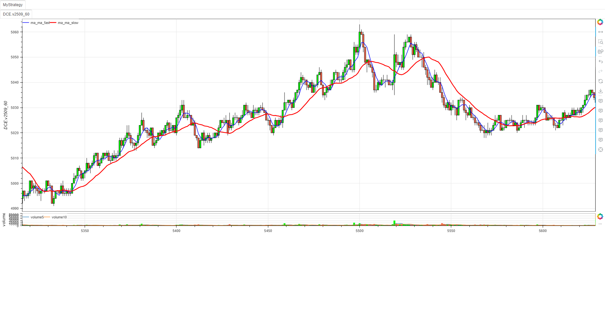
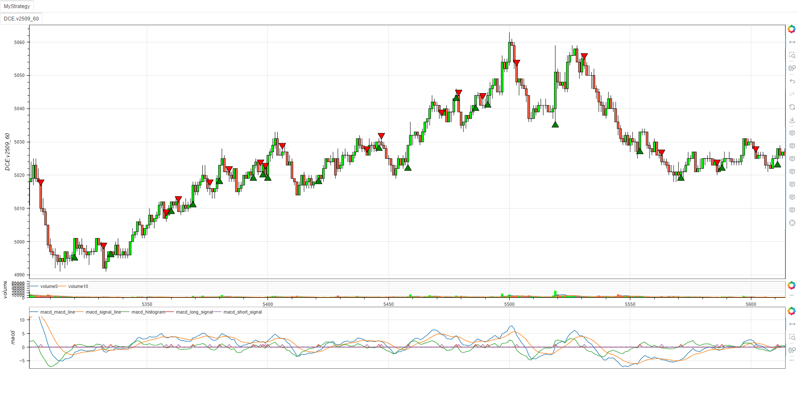
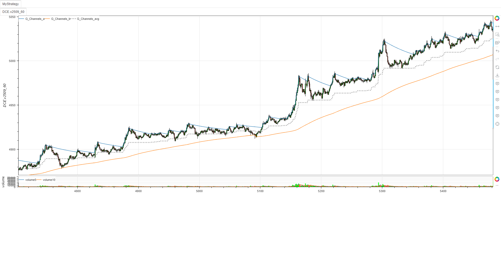
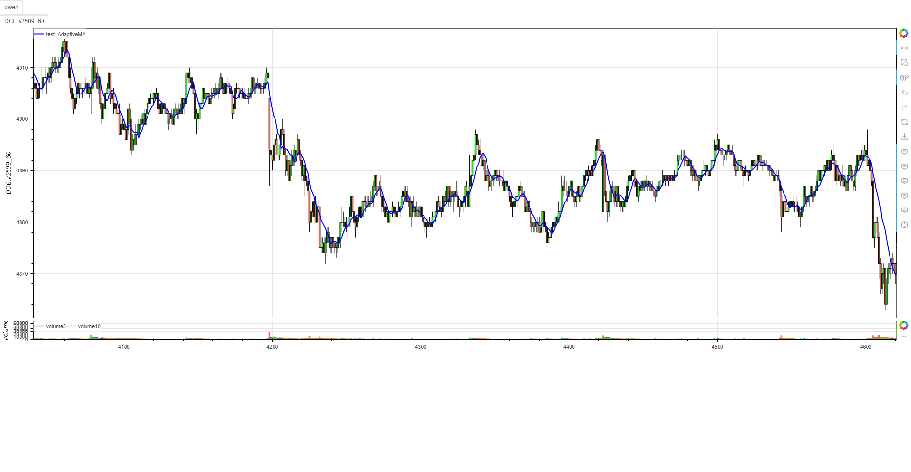

# **minibt量化交易：指标构造器 BtIndicator 类完整指南**

## 概述

`BtIndicator` 类是 minibt 量化框架中的自定义指标创建基类，继承自 `CustomBase` 与 `KLine`。它提供了标准化接口快速构建自定义技术指标，自动集成框架数据结构与绘图系统，支持将用户定义的计算逻辑转换为框架兼容的指标数据（IndSeries/IndFrame），大大简化了自定义指标开发流程。

## 核心特性

### 1. 简化指标开发流程

- **专注计算逻辑**：只需重写 `next` 方法定义指标计算，无需关注数据格式转换与框架集成细节
- **自动列名解析**：支持手动指定输出列名或从 `next` 方法返回值自动提取列名
- **参数化设计**：通过 `params` 属性定义指标参数，实现同一指标的多参数版本

### 2. 完整的指标配置能力

- **继承完整配置**：继承 `CustomBase` 的绘图配置属性（重叠显示、绘图开关、指标分类等）
- **丰富样式支持**：支持自定义线型、信号样式、区间填充等可视化参数
- **灵活输出格式**：支持单列（IndSeries）或多列（IndFrame）指标输出

### 3. 框架无缝集成

- **自动数据结构转换**：生成的指标自动兼容 `KLine`/`IndFrame`/`IndSeries` 数据结构
- **元数据自动处理**：通过 `@tobtind` 装饰器自动处理指标元数据，无需手动维护
- **批量方法注册**：支持批量注册自定义方法到 `KLine` 类，扩展基础数据结构

### 4. 参数化与灵活性

- **动态参数支持**：支持通过初始化参数动态覆盖类属性参数
- **多时间框架适配**：天然支持多时间框架指标计算

## 类结构详解

### 继承关系
```
BtIndicator → CustomBase + KLine
```

### 核心属性
```python
# 参数配置
params: dict = {}  # 指标参数字典

# 输出配置
lines: Union[list[str], Lines[str]] = Lines()  # 输出列名列表
overlap: bool = False  # 是否与主图重叠显示
isplot: bool = True  # 是否绘图
ismain: bool = False  # 是否为主图指标
category: str | None = None  # 指标分类

# 样式配置
linestyle: Addict[str, LineStyle] | dict[str, LineStyle] = Addict()  # 线型样式
signalstyle: Addict[str, SignalStyle] | dict[str, SignalStyle] = Addict()  # 信号样式
spanstyle: SpanList[SpanStyle] | list[SpanStyle] = SpanList()  # 区间填充样式
```

## 初始化参数详解

### 必需参数
```python
# 基本初始化
indicator = BtIndicator(data=kline)  # data: 输入数据（KLine 、IndFrame 、IndSeries）

# 带参数初始化
indicator = BtIndicator(
    data=kline,
    lines=["ma5", "ma10"],  # 输出列名列表
    overlap=True,           # 主图重叠显示
    isplot=True,            # 启用绘图
    category="overlap",     # 指标分类
    length=20,              # 自定义参数
    color=Colors.blue       # 样式参数
)
```

### 完整参数列表
```python
BtIndicator(
    data,                   # 输入数据（必需）
    lines=[],               # 输出列名列表
    overlap=False,          # 是否主图重叠
    isplot=True,            # 是否绘图
    ismain=False,           # 是否为主图指标
    category=None,          # 指标分类
    linestyle={},           # 线型样式配置
    signalstyle={},         # 信号样式配置
    spanstyle=[],           # 区间填充样式
    **kwargs                # 其他参数（合并到params）
)
```

## 关键方法说明

### next 方法
```python
def next(self: KLine) -> Union[IndSeries, IndFrame, pd.Series, pd.DataFrame, np.ndarray, tuple]:
    """核心计算方法，需用户重写"""
    # 通过 self 访问输入数据（如 self.close, self.high, self.low 等）
    # 通过 self.params 访问参数
    # 返回计算结果（单值、序列、元组等）
```

## 使用示例

### 基础移动平均线指标
```python
from minibt import *


class SimpleMA(BtIndicator):
    """简单移动平均线指标"""
    # 定义输出列名
    lines = ["ma_fast", "ma_slow"]
    # 定义默认参数
    params = {"fast_length": 10, "slow_length": 30}
    overlap = True

    def next(self):
        # 计算快速均线
        ma_fast = self.close.rolling(self.params.fast_length).mean()
        # 计算慢速均线
        ma_slow = self.close.rolling(self.params.slow_length).mean()
        return ma_fast, ma_slow  # 返回多列数据


class MyStrategy(Strategy):
    def __init__(self):
        self.data = LocalDatas.v2601_300.kline
        self.data.height = 600
        self.ma = SimpleMA(self.data, fast_length=5, slow_length=20)  # 可覆盖默认参数
        # 访问结果
        fast_ma = self.ma.ma_fast  # 快速均线（Line类型）
        slow_ma = self.ma.ma_slow  # 慢速均线（Line类型）
        fast_ma.line_style = LineStyle(LineDash.solid, 1.5, Colors.blue)
        slow_ma.line_style = LineStyle(LineDash.solid, 2.5, Colors.red)


if __name__ == "__main__":
    Bt().run()
```



### 带信号生成的指标
```python
from minibt import *


class MACDWithSignal(BtIndicator):
    """MACD指标带信号生成"""
    overlap = False
    params = {
        "fast_length": 12,
        "slow_length": 26,
        "signal_length": 9
    }

    def next(self):
        # 计算MACD
        macd_line = self.close.pta.ema(self.params.fast_length) - \
            self.close.pta.ema(self.params.slow_length)

        signal_line = macd_line.pta.ema(self.params.signal_length)
        histogram = macd_line - signal_line

        # 生成交易信号
        long_signal = (macd_line > signal_line) & (
            macd_line.shift(1) <= signal_line.shift(1))
        short_signal = (macd_line < signal_line) & (
            macd_line.shift(1) >= signal_line.shift(1))

        return macd_line, signal_line, histogram, long_signal, short_signal


class MyStrategy(Strategy):
    def __init__(self):
        self.data = LocalDatas.v2601_300.kline
        self.data.height = 600
        self.macd = MACDWithSignal(
            self.data, fast_length=5, slow_length=20)  # 可覆盖默认参数
        self.macd.long_signal.signal_style = SignalStyle(
            key="low",          # 在最低价位置标记
            marker=Markers.triangle,
            color=Colors.green,
            size=16
        )
        self.macd.short_signal.signal_style = SignalStyle(
            key="high",         # 在最高价位置标记
            marker=Markers.inverted_triangle,
            color=Colors.red,
            size=16
        )


if __name__ == "__main__":
    Bt().run()
```



### 复杂指标示例（G-Channels）
```python
from minibt import *

class G_Channels(BtIndicator):
    """G-Channels指标 - 高效计算上下极值通道
    ✈ https://www.tradingview.com/script/fIvlS64B-G-Channels-Efficient-Calculation-Of-Upper-Lower-Extremities/"""
    params = dict(length=144., cycle=1, thresh=0.)
    overlap = True # 主图叠加显示

    def next(self):
        length = self.params.length
        cycle = max(int(self.params.cycle), 1)
        size = self.close.size
        a = self.full() # 上通道
        b = self.full() # 下通道
        close = self.close.values
        pre_a = 0.
        pre_b = 0.
        # 计算通道
        for i in range(size):
            if i and i % cycle == 0:
                a[i] = max(close[i], pre_a)-(pre_a-pre_b) / length
                b[i] = min(close[i], pre_b)+(pre_a-pre_b) / length
                pre_a = a[i]
                pre_b = b[i]
        # 周期大于1时进行插值
        if cycle > 1:
            a = a.interpolate()
            b = b.interpolate()
        # 计算中轨
        avg = (a+b)/2.
        self.lines.a = a
        self.lines.b = b
        self.lines.avg = avg
        if 0. < self.params.thresh < 1.:
            self.lines.zig = self.btind.zigzag_full(self.params.thresh)


class MyStrategy(Strategy):
    def __init__(self):
        self.data = self.get_kline(LocalDatas.v2509_60)
        self.data.height = 600
        self.G_Channels = G_Channels(self.data)
        self.G_Channels.a.line_style = LineStyle(
            LineDash.solid, 2, Colors.blue),     # 上轨样式
        self.G_Channels.b.line_style = LineStyle(
            LineDash.solid, 2, Colors.red),      # 下轨样式
        self.G_Channels.avg.line_style = LineStyle(
            LineDash.dotted, 3, Colors.gray)     # 中轨样式


if __name__ == "__main__":
    Bt().run()
```



### 动态参数指标
```python
from minibt import *


class AdaptiveMA(BtIndicator):
    """自适应移动平均线（根据波动率调整参数）"""

    params = {
        "min_length": 5,
        "max_length": 50,
        "volatility_period": 20
    }
    overlap = True

    def next(self):
        # 计算波动率
        volatility = self.close.rolling(self.params.volatility_period).std()

        # 处理可能的NaN值
        volatility = volatility.fillna(
            volatility.mean() if volatility.mean() > 0 else 1)

        # 归一化波动率
        vol_min = volatility.min()
        vol_max = volatility.max()

        # 避免除零错误
        if vol_max - vol_min == 0:
            normalized_vol = pd.Series(0.5, index=volatility.index)
        else:
            normalized_vol = (volatility - vol_min) / (vol_max - vol_min)

        # 根据波动率调整均线长度
        adaptive_length = (
            self.params.min_length +
            (self.params.max_length - self.params.min_length) * normalized_vol
        ).apply(lambda x: int(max(self.params.min_length, min(self.params.max_length, x))))

        adaptive_ma = self.close.rolling_apply(
            lambda x: x.mean(), adaptive_length)

        return adaptive_ma


class owen(Strategy):
    def __init__(self):
        self.data = self.get_kline(LocalDatas.v2509_60_1)
        self.data.height = 600
        self.test = AdaptiveMA(self.data)
        self.test.line_width = 2
        self.test.line_color = Colors.blue


if __name__ == "__main__":
    Bt().run()
```



## 总结

minibt 的 `BtIndicator` 类是一个功能强大的自定义指标构造器，它：

1. **极大简化开发流程**：只需关注计算逻辑，无需处理数据转换和框架集成
2. **提供完整配置能力**：支持丰富的可视化配置和参数化设计
3. **实现无缝框架集成**：自动处理数据结构转换和元数据管理
4. **促进代码复用**：通过参数化设计实现同一指标的多参数版本

通过 `BtIndicator` 类，开发者可以快速构建高质量的自定义技术指标，大大提高了量化策略开发和回测的效率。无论是简单的移动平均线还是复杂的多时间框架指标，`BtIndicator` 都能提供强大的支持。

> 风险提示：本文涉及的交易策略、代码示例均为技术演示、教学探讨，仅用于展示逻辑思路，绝不构成任何投资建议、操作指引或决策依据 。金融市场复杂多变，存在价格波动、政策调整、流动性等多重风险，历史表现不预示未来结果。任何交易决策均需您自主判断、独立承担责任 —— 若依据本文内容操作，盈亏后果概由自身承担。请务必充分评估风险承受能力，理性对待市场，谨慎做出投资选择。