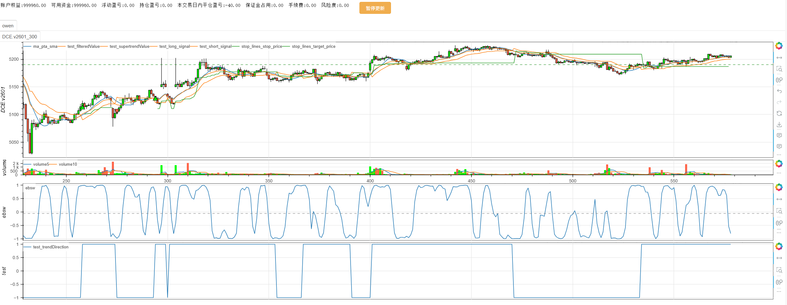
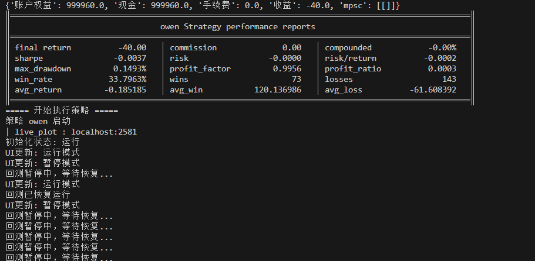
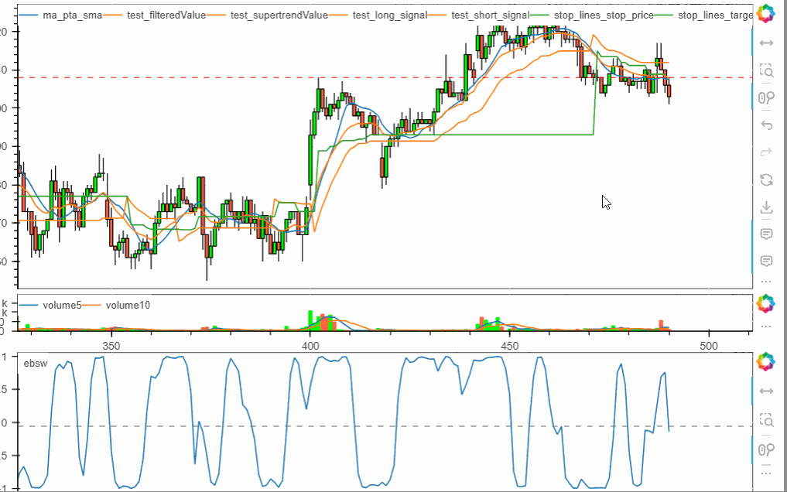
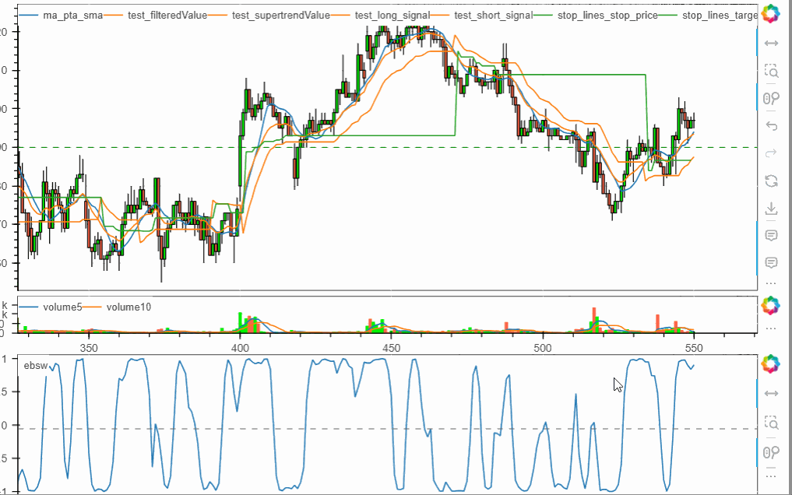

# **minibt量化交易：K线回放**

Minibt框架提供了强大的K线回放功能，让您可以先进行完整的策略回测，然后以可视化方式回放K线走势和交易信号。

## 基本使用流程

### 1. 先回测后回放

```python
from minibt import *

class owen(Strategy):
    def __init__(self):
        # 获取数据
        self.data = self.get_kline(LocalDatas.v2601_300, height=300)
        # 计算技术指标
        self.ma = self.data.close.sma(10)
        self.ebsw = self.data.close.ebsw()
        self.test = self.data.tradingview.Adaptive_Trend_Filter()

    def next(self):
        # 交易逻辑
        if not self.data.position:
            if self.test.long_signal.new:
                self.data.buy(stop=BtStop.SegmentationTracking)
            elif self.test.short_signal.new:
                self.data.sell(stop=BtStop.SegmentationTracking)

if __name__ == "__main__":
    # 创建Bt实例并启用回放模式
    bt = Bt(replay=True)
    
    # 运行策略
    bt.run(
        isplot=True,                    # 启用Bokeh图表
        period_milliseconds=1000,       # 设置回放速度：1000毫秒/次
    )
```

## 核心功能介绍

### 回放控制功能

```python
bt.run(
    replay=True,                    # 启用回放模式
    period_milliseconds=500,        # 数据更新频率：500毫秒/次
    # 其他参数...
)
```





**period_milliseconds参数说明：**
- `1000`：慢速回放（约1秒更新一次）
- `500`：中速回放
- `200`：快速回放
- `0`：实时更新（最快速度）

### Bokeh可视化功能

```python
bt.run(
    isplot=True,                    # 必须设置为True以启用Bokeh图表
    trade_signal=True,              # 在图表上标记交易信号点
    black_style=True,               # 使用黑色主题，更适合交易图表
    plot_width=1400,                # 自定义图表宽度
    plot_height=800,                # 自定义图表高度
    plot_name="策略回放分析",        # 自定义图表标题
    save_plot=True,                 # 保存HTML文件
    plot_cwd="./results/",          # 指定保存目录
    open_browser=True               # 完成后自动打开浏览器
)
```

### 暂停和交互功能

在回放过程中，Bokeh图表提供以下交互功能：

1. **自动暂停**：在交易信号点自动暂停，方便分析
2. **手动控制**：使用图表工具栏进行缩放、平移等操作
3. **数据查看**：鼠标悬停查看具体K线数据
4. **信号标记**：不同颜色标记买入/卖出信号点

## 使用技巧和最佳实践

1. **调试策略**：使用较慢的回放速度（1000-2000毫秒）来仔细观察每个交易决策
2. **参数优化**：快速回放（200-500毫秒）来测试不同参数组合
3. **演示展示**：使用中等速度（500-800毫秒）进行策略演示
4. **多时间框架**：可以在不同时间框架数据上回放，验证策略稳健性
5. **信号验证**：结合`trade_signal=True`仔细验证每个交易信号的合理性

通过Minibt的K线回放功能，您可以直观地观察策略在历史数据上的表现，深入理解交易逻辑的执行过程，为策略优化提供宝贵 insights。

