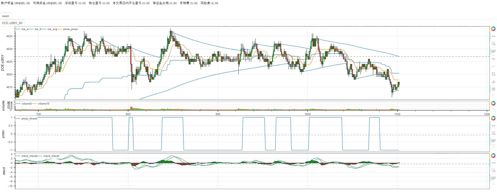
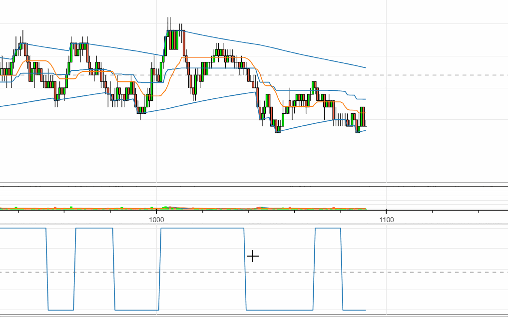

# **minibt量化交易：天勤实时图表功能**
Minibt框架提供了天勤实时图表功能，可视化K线走势、指标和交易信号。
## 代码示例
```python
from minibt import *
from tqsdk import TqApi, TqAuth, TqKq


class owen(Strategy):

    def __init__(self) -> None:
        self.data = self.get_kline("DCE.v2601", 60, 1000)
        self.data.height = 300
        self.ma = self.data.close.t3()
        self.pmax = self.data.close.btind.pmax3()
        self.macd = self.data.close.macd()


if __name__ == "__main__":
    # 初始化天勤API
    api = TqApi(TqKq(), auth=TqAuth(
        "天勤账号", "账号密码"))

    # 创建实盘交易实例
    bt = Bt(live=True)
    
    # 运行实盘策略并启用实时图表
    bt.run(
        isplot=True,                    # 启用实时图表
        period_milliseconds=1000,       # 数据更新频率（毫秒）
    )
```


## 实时图表功能介绍

### 1. 实时数据获取
```python
self.data = self.get_kline("DCE.v2601", 60, 1000)  # 60分钟线，1000根K线
```

- 自动连接天勤API获取实时行情
- 支持多种时间周期（1分钟、5分钟、60分钟等）
- 实时更新K线数据和技术指标

### 2. 实时图表特性
```python
bt.run(
    isplot=True,                    # 核心参数：启用实时图表
    period_milliseconds=1000,       # 控制数据更新频率
    trade_signal=True,              # 实时标记交易信号
    black_style=True,               # 专业交易界面
    # ... 其他参数
)
```

**实时图表功能包括：**

- 🎯 实时K线更新
- 📈 技术指标动态计算
- 🎨 交易信号可视化标记
- 💰 账户资金实时显示
- ⏱️ 时间同步更新


这个实时系统提供了完整的交易监控体验，让您能够实时观察策略表现并及时调整交易决策。