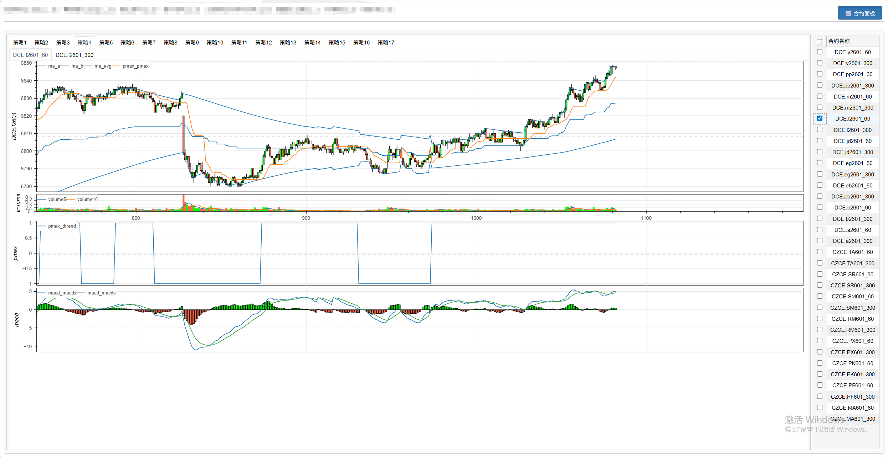

# **minibt量化交易：实盘多策略合约系统介绍**

## 系统概述
这是一个基于MiniBT框架的实盘多策略交易系统，通过多策略并行运行的方式，同时对多个期货合约进行自动化交易。

## 核心特性

### 1. 多策略并行架构
- 系统支持同时运行多个独立策略实例
- 每个策略实例监控不同的合约品种
- 策略间完全隔离，互不影响

### 2. 支持的交易所和品种
系统覆盖两大期货交易所的多个品种：

**大连商品交易所(DCE):**

- 聚氯乙烯(v)
- 聚丙烯(pp) 
- 豆粕(m)
- 塑料(l)
- 鸡蛋(jd)
- 乙二醇(eg)
- 苯乙烯(eb)
- 豆二(b)
- 豆一(a)

**郑州商品交易所(CZCE):**

- PTA(TA)
- 白糖(SR)
- 锰硅(SM)
- 菜籽粕(RM)
- 对二甲苯(PX)
- 花生(PK)
- 涤纶短纤(PF)
- 甲醇(MA)

### 3. 策略技术特征
每个策略实例包含以下技术指标：

- **移动平均通道**(G_Channels)
- **PMax3趋势指标**
- **MACD动量指标**
- **Heikin-Ashi蜡烛图**(5分钟周期)
- **成交量分析**(volume5, volume10)

### 4. 实盘交易功能

- 实时行情数据接入
- 多合约行情跟踪
- 实时监控账户权益、可用资金、风险度等关键指标

## 界面布局
系统界面分为两个主要区域：

**左侧图表区：**

- 显示各合约的技术分析图表
- 包含主图(K线+技术指标)和副图(成交量)
- 多时间框架分析(60秒/300秒)

**右侧合约面板：**

- 策略状态监控(策略1-策略17)
- 账户信息实时更新
- 快速合约切换功能

## 技术优势
1. **高扩展性** - 轻松添加新策略和合约
2. **稳定性** - 基于成熟的MiniBT框架
3. **实时性** - 直接对接天勤实盘接口
4. **风险可控** - 完善的资金管理和风险监控

该系统为专业期货交易者提供了一个高效、稳定的多策略自动化交易解决方案。

## 代码示例
```python
from __future__ import annotations
from minibt import *
from tqsdk import TqApi, TqAuth, TqKq


def get_contract(exchange_id: str, contracts: list[str], has_night=None):
    """筛选主力合约"""
    global api
    target_prefixes: list[str] = [
        f"{exchange_id}.{cont}" for cont in contracts]
    all_contracts: list[str] = api.query_cont_quotes(exchange_id, has_night=has_night)

    return [
        contract for contract in all_contracts
        for prefix in target_prefixes
        if contract.startswith(prefix) and contract[len(prefix):].isdigit()
    ]


class owen(Strategy):
    params = dict(symbol="DCE.v2601")

    def __init__(self) -> None:
        self.data = self.get_kline(self.params.symbol, 60, 1000, height = 300)
        self.gc = self.data.tradingview.G_Channels()
        self.pmax = self.data.close.btind.pmax3()
        self.macd = self.data.close.macd()
        self.data1 = self.get_kline(self.params.symbol, 60*5, 1000, height=400)
        self.ha = self.data1.ha()


if __name__ == "__main__":
    api = TqApi(TqKq(), auth=TqAuth(
        "账户", "密码"))
    bt = Bt(auto=False, live=True)
    bt.addTqapi(api=api)

    contracts_dict = {
        "DCE": ["v", "pp", "m", "l", "jd", "eg", "eb", "b", "a"],
        "CZCE": ["TA", "SR", "SM", "RM", "PX", "PK", "PF", "MA"]
    }
    name = "策略"
    i = 0
    for k, v in contracts_dict.items():
        contracts = get_contract(k, v)
        for contract in contracts:
            i += 1
            bt.addstrategy(
                owen.copy(name=f"{name}{i}", params=dict(symbol=contract)))

    bt.run()


```
