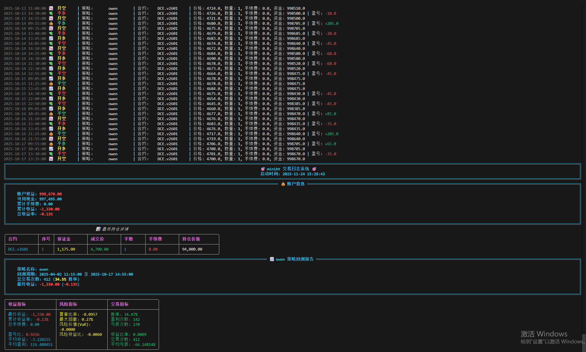

# **minibt量化交易：交易日志系统使用简介**

## 概述

Minibt 交易日志系统是一个基于 Rich 库构建的专业级交易日志解决方案，专为量化交易和策略回测设计。它摒弃了传统的 ERROR、INFO、WARNING 日志级别，专注于交易操作的清晰展示和性能监控。

## 核心特性

### 🎯 专业的交易操作日志
- **直观的操作标识**：开多、平多、开空、平空、创建等专业交易术语
- **智能颜色编码**：
  - 🟡 黄色：开仓/创建操作
  - 🟢 绿色：盈利平仓
  - 🔴 红色：亏损平仓
- **表情符号辅助**：每个操作都有对应的表情，提升可读性

### 💰 完整的账户信息展示
```python
# 美观化账户信息
logger.print_account(account)

# 简洁版账户信息
logger.print_account_simple(account)
```

**输出内容**：
- 账户权益、可用现金、累计手续费
- 累计收益、总收益率（自动计算）
- 持仓详情表格（保证金、成交价、手数、手续费等）

### 📈 专业的策略回测报告
```python
# 完整的策略回测报告
logger.print_strategy(strategy)
```

**报告包含**：
- **收益指标**：最终收益、累计收益率、盈亏比等
- **风险指标**：夏普比率、最大回撤、风险价值(VaR)
- **交易指标**：胜率、盈利次数、亏损次数、交易频率
- **性能评估**：基于行业标准的自动评级

### 🔧 灵活的日志级别控制
```python
from minibt import Logger, LogLevel

# 设置不同日志级别
logger.set_log_level(LogLevel.DEBUG)    # 详细调试信息
logger.set_log_level(LogLevel.INFO)     # 普通信息
logger.set_log_level(LogLevel.WARNING)  # 警告信息
```

## 快速开始

### 基本使用
```python
from minibt import Logger

# 初始化日志系统
logger = Logger("my_trading_system")

# 记录交易操作
logger.open_long("策略A", "IF2406", "2024-01-15 10:30:00", 3500.0, 1, 0.0, 1000000.0)
logger.close_short("策略A", "IF2406", "2024-01-15 11:30:00", 3480.0, 1, 0.0, 2000.0, 1002000.0)

# 打印账户信息
logger.print_account(account)

# 打印策略报告
logger.print_strategy(strategy)
```

### 错误和警告处理
```python
# 资金不足错误
logger.log_insufficient_cash("2024-01-15 10:30:00", "当前资金: 1000, 所需资金: 1500")

# 交易失败
logger.log_trade_failed("2024-01-15 10:31:00", "网络超时")

# 市场警告
logger.log_market_warning("2024-01-15 10:32:00", "市场波动剧烈")
```

### 性能监控
```python
# 使用装饰器监控函数性能
@logger.time_it
def process_market_data(data):
    # 处理市场数据
    return processed_data

# 显示性能统计
logger.show_performance()
```

## 高级功能

### 交易统计与分析
```python
# 显示交易统计
logger.show_stats()

# 显示最近交易记录
logger.show_recent_trades(20)
```

### 文件日志记录
```python
# 启用文件日志记录
logger = Logger(
    name="trading_system",
    log_to_file=True,
    log_dir="trading_logs"
)
```

### 自定义配置
```python
logger = Logger(
    name="custom_system",
    log_level=LogLevel.DEBUG,
    enable_traceback=True  # 启用详细错误追踪
)
```

## 输出示例

### 交易操作日志
```
2024-01-15 10:30:00 📈 开多    | 策略：策略A | 合约：IF2406 | 价格: 3500.0, 数量: 1, 手续费: 0.0, 资金: 1000000.0
2024-01-15 11:30:00 💰 平空    | 策略：策略A | 合约：IF2406 | 价格: 3480.0, 数量: 1, 手续费: 0.0, 资金: 1002000.0 | 盈亏: +2000.0
```

### 账户信息面板
```
╔════════════════════════════════════════════════════════════════════════╗
║                          💰 账户信息                                   ║
╚════════════════════════════════════════════════════════════════════════╝
账户权益: 1,002,000.00
可用现金: 997,000.00
累计手续费: 0.00
累计收益: +2,000.00
总收益率: +0.20%
```

### 策略回测报告
```
╔════════════════════════════════════════════════════════════════════════╗
║                   📈 策略A 策略回测报告                                ║
╚════════════════════════════════════════════════════════════════════════╝
策略名称: 策略A
回测周期: 2024-01-01 09:00:00 至 2024-01-15 15:00:00
总交易次数: 412 (54.5% 胜率)
最终收益: +15,330.00 (+1.53%)
```
## 使用示例
```python
from minibt import *


class owen(Strategy):
    config = Config(islog=True)
    params = dict(symbol="v2601_300",
                  level1=0.5, level2=-0.5)

    def __init__(self):
        self.min_start_length = 300
        self.data = self.get_kline(
            LocalDatas.get(self.params.symbol), height=400)
        self.test = self.data.close.tqfunc.ma()
        self.ma = self.data.close.tqta.MACD()
        self.ebsw = self.data.close.ebsw()
        self.long_signal = self.ebsw.cross_up(self.params.level1)
        self.short_signal = self.ebsw.cross_down(self.params.level2)

    def next(self):
        if not self.data.position:
            if self.long_signal.new:
                self.data.buy(stop=BtStop.SegmentationTracking)
            elif self.short_signal.new:
                self.data.sell(stop=BtStop.SegmentationTracking)


if __name__ == "__main__":
    Bt().run()
```



## 最佳实践

1. **初始化时机**：在交易系统启动时初始化 Logger
2. **命名规范**：为不同的策略或交易系统使用有意义的名称
3. **日志级别**：生产环境使用 INFO，调试时使用 DEBUG
4. **文件存储**：重要交易启用文件日志便于后续分析
5. **性能监控**：对关键函数使用 `@logger.time_it` 装饰器

## 总结

Minibt 交易日志系统为量化交易提供了专业、美观、功能完备的日志解决方案。通过丰富的可视化元素和专业的交易指标，帮助交易者更好地监控交易执行、分析策略性能和优化交易系统。

无论是简单的交易记录还是复杂的策略回测分析，Minibt 日志系统都能提供清晰、直观的信息展示，是量化交易不可或缺的辅助工具。