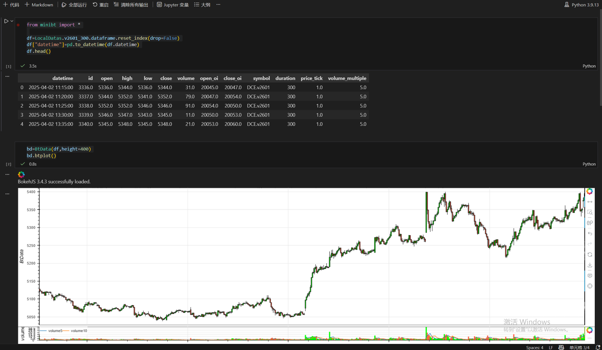
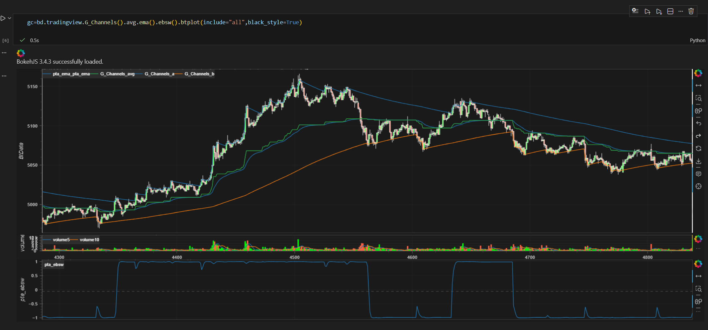
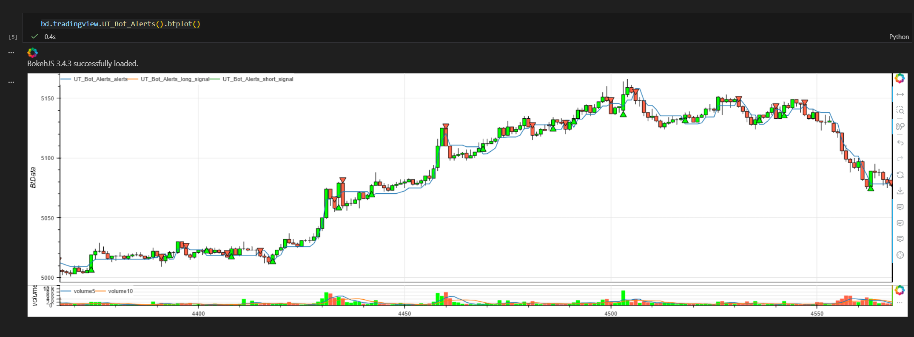

# **minibt量化交易：btplot 函数功能说明**

## 概述
`btplot` 是 minibt 库中内置的指标可视化函数，基于 Bokeh 库提供交互式图表绘制功能。该函数能够智能识别数据类型并自动生成相应的技术分析图表。

## 主要特性

### 1. 智能数据识别

- **自动检测 OHLCV 格式**：当数据包含 `open`, `high`, `low`, `close`, `volume` 字段时，自动绘制K线图
- **时间序列支持**：自动处理 `datetime` 字段，提供时间轴显示
- **指标叠加**：支持在基础数据上叠加多个技术指标

### 2. 交互式功能

- **缩放和平移**：支持鼠标滚轮缩放和拖拽平移
- **悬停提示**：鼠标悬停显示详细数据信息
- **十字准星**：提供精确的坐标定位
- **图例控制**：可点击图例隐藏/显示相应指标

### 3. 多环境适配

- **Jupyter Notebook**：在 Notebook 中直接内嵌显示
- **独立浏览器**：非 Jupyter 环境自动在浏览器中打开
- **自动保存**：可选保存为 HTML 文件

## 使用示例

### 基础数据可视化
```python
from minibt import *

# 加载数据
df = LocalDatas.v2601_300.dataframe.reset_index(drop=False)
df["datetime"] = pd.to_datetime(df.datetime)

# 创建 KLine 对象并设置图表高度
bd = KLine(df, height=400)

# 绘制基础K线图（包含成交量）
bd.btplot()
```



### 指标链式调用与可视化

```python
# 复杂指标计算与绘图
gc = bd.tradingview.G_Channels().avg.ema().ebsw().btplot(include="all",black_style=True)
```



### 交易信号可视化

```python
# 绘制交易提醒指标
bd.tradingview.UT_Bot_Alerts().btplot()
```



## 参数说明

### 主要参数

- `include`: 指标显示模式

    - `"all"`: 显示所有相关指标（默认）
    - `"last"`: 仅显示最后一个指标
  
- `black_style`: 黑色主题风格

    - `True`: 启用暗黑模式
    - `False`: 亮色模式（默认）
  
- `open_browser`: 浏览器打开控制
- `plot_cwd`: 图表保存目录
- `plot_name`: 图表文件名
- `save_plot`: 是否保存图表文件

### 图表配置

- **自适应布局**：自动调整图表大小适应容器
- **专业配色**：涨跌使用红绿配色，指标使用分类色彩
- **工具集成**：包含缩放、平移、重置等交互工具

## 技术特点

### 数据处理

- 自动处理缺失值和异常值
- 支持前向填充数据缺口
- 智能识别数据周期和频率

### 可视化优化

- 多图层叠加显示
- 自动调整Y轴范围
- 成交量与价格联动显示
- 技术指标信号标记

### 性能表现

- 大数据集优化渲染
- 内存高效管理
- 快速响应交互操作

## 应用场景

1. **技术分析**：K线图结合多种技术指标
2. **策略回测**：可视化交易信号和策略表现  
3. **数据探索**：快速查看金融时间序列数据特征
4. **研究报告**：生成专业的分析图表用于报告展示

该函数为 minibt 库的核心可视化组件，提供了从基础数据展示到复杂技术分析的全套图表解决方案。