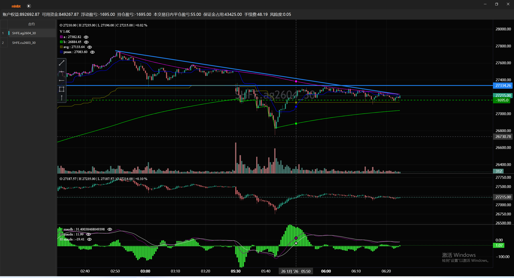

# minibt量化交易：实时图表系统Lightweight Charts介绍

## 项目概述

Minibt实时图表系统是一个基于Python的量化交易可视化框架，使用**Lightweight Charts**作为图表渲染引擎，结合**PyQt5**和**FluentUI**构建了现代化的交易界面。该系统专为实时交易策略分析和监控设计，支持多合约切换、实时数据更新、技术指标显示和交易信号标记。

## 主要特性

### 1. **高性能图表渲染**
- 使用TradingView的Lightweight Charts库，提供专业级的K线图展示
- 支持实时数据流更新，毫秒级刷新
- 内置多种图表类型：蜡烛图、折线图、柱状图

### 2. **多合约多策略支持**
- 同时监控多个交易合约
- 支持不同时间周期的图表
- 双击合约列表快速切换

### 3. **完整的技术指标体系**
- 支持叠加指标（在主图显示）
- 支持副图指标（独立窗口显示）
- 自定义指标样式（颜色、线型、宽度）
- 实时指标计算和更新

### 4. **交易信号可视化**
- 买卖点标记（箭头、形状、文字标签）
- 持仓线显示
- 浮动盈亏实时计算

### 5. **现代化UI设计**
- Fluent Design风格界面
- 支持明暗主题切换
- 自适应布局
- 分隔线视觉优化

### 6. **账户信息集成**
- 实时显示账户净值
- 浮动盈亏监控
- 持仓状态跟踪

## 系统架构

### 核心组件

1. **MainWindow** - 主窗口容器
2. **LightChartWindow** - 图表管理窗口
3. **Chart** - Lightweight Charts封装
4. **InfoWindow** - 账户信息显示
5. **ContractTable** - 合约列表表格

### 数据流
```
策略引擎 → 数据更新 → 图表渲染 → UI显示
    ↓          ↓           ↓
指标计算 → 信号标记 → 账户更新
```

## 使用示例

```python
from __future__ import annotations
from minibt import *
from tqsdk import TqApi, TqAuth, TqKq


def get_contract(exchange_id: str, contracts: list[str], has_night=None):
    global api
    target_prefixes: list[str] = [
        f"{exchange_id}.{cont}" for cont in contracts]
    all_contracts: list[str] = api.query_cont_quotes(
        exchange_id, has_night=has_night)

    return [
        contract for contract in all_contracts
        for prefix in target_prefixes
        if contract.startswith(prefix) and contract[len(prefix):].isdigit()
    ]


class owen(Strategy):
    params = dict(symbol="DCE.v2601")

    def __init__(self) -> None:
        self.data = self.get_kline(self.params.symbol, 60, 1000)
        self.data.watermark = True
        self.toolbox = True
        self.gc = self.data.tradingview.G_Channels()
        self.ha = self.data.ha()
        self.pmax = self.data.close.btind.pmax3().pmax
        self.macd = self.data.close.macd()
        self.macd.macdh.line_color = Colors.limegreen
        self.macd.macdh.price_label = True
        self.macd.macdh.price_line = True


if __name__ == "__main__":
    api = TqApi(TqKq(), auth=TqAuth(
        "天勤账户", "天勤密码"))
    bt = Bt(auto=False, live=True)
    bt.addTqapi(api=api)

    contracts_dict = {
        "SHFE": ["cu", "ag"],
        # "DCE": ["v", "pp",  "m", "l", "eg", "eb", "b"],
        # "CZCE": ["TA", "SR", "SM", "RM", "PX", "PF", "MA"]
    }
    name = "策略"
    i = 0
    for k, v in contracts_dict.items():
        contracts = get_contract(k, v)
        for contract in contracts:
            i += 1
            bt.addstrategy(
                owen.copy(name=f"{name}{i}", params=dict(symbol=contract)))

    bt.run(period_milliseconds=100)

```
