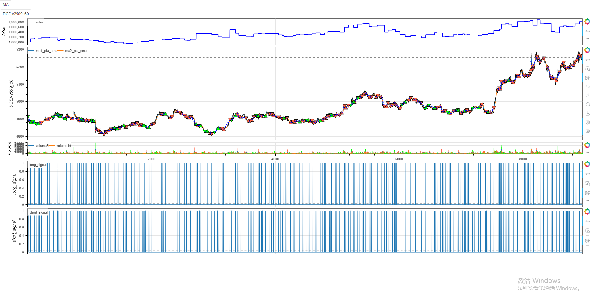

# **minibt 入门实战：5 分钟跑通双均线策略**

&emsp;&emsp;欢迎来到 **minibt 量化入门课**！只需 5 分钟，你将亲手搭建一个基于 **双均线交叉** 的量化策略，从指标计算到可视化回测一键贯通 —— 全程无需复杂配置，专注策略逻辑本身。

## 一、完整代码（直接复制运行）
```python
from minibt import *  # 导入minibt核心功能（策略、指标、回测引擎等）

class MA(Strategy):  # 定义策略类，必须继承Strategy基类
   params = dict(
       length1=10,  # 短期均线周期（可通过参数优化调整）
       length2=20   # 长期均线周期（可通过参数优化调整）
   )
   def __init__(self):
       # 1. 加载数据：使用minibt内置测试数据（无需手动准备）
       self.data = self.get_kline(LocalDatas.test) 
      
       # 2. 计算均线指标：基于收盘价计算SMA
       self.ma1 = self.data.close.sma(self.params.length1)  # 短期均线
       self.ma2 = self.data.close.sma(self.params.length2)  # 长期均线
      

       # 3. 生成交易信号：金叉（多头）、死叉（空头）
       self.long_signal = self.ma1.cross_up(self.ma2)  # 短期均线上穿长期均线
       self.short_signal = self.ma2.cross_down(self.ma1)  # 长期均线下穿短期均线
       
   def next(self):
       # next 方法：逐根K线处理核心逻辑，策略的“大脑”
       # 情况1：无持仓时，根据信号开仓
       if not self.data.position:  # position=0 表示空仓
           if self.long_signal.new:  # 金叉信号最新值
               self.data.buy()       # 开多仓
           elif self.short_signal.new:  # 死叉信号最新值
               self.data.sell()      # 开空仓
      
       # 情况2：持有多头时，死叉信号平仓
       elif self.data.position > 0 and self.short_signal.new: 
           self.data.sell()  # 平多仓
      
       # 情况3：持有空头时，金叉信号平仓
       elif self.data.position < 0 and self.long_signal.new: 
           self.data.buy()   # 平空仓

if __name__ == "__main__":
   # 初始化回测引擎：auto=True 自动处理数据加载、回测、可视化
   bt = Bt(auto=True) 
   bt.run()  # 启动回测，完成后自动弹出可视化界面
```

## 二、代码核心逻辑解析
### 1. 策略框架：`Strategy` 类
*   所有策略必须继承 `Strategy`，通过重写 `__init__`**（指标计算）** 和 `next`**（交易逻辑）** 实现策略逻辑。
*   `params` 是参数容器，支持后续 **参数优化**（如调整均线周期 `length1`/`length2`）。

### 2. 数据与指标（`__init__` 方法）
```python
self.data = self.get_kline(LocalDatas.test) 
```
*   `LocalDatas.test` 是 **minibt 内置测试数据**（包含 OHLC、成交量等字段），新手无需手动准备数据。
```python
self.ma1 = self.data.close.sma(self.params.length1) 
self.ma2 = self.data.close.sma(self.params.length2) 
```
*   `self.data.close` 提取 **收盘价序列**，`sma(N)` 计算 **N 周期简单移动平均线**。
*   `cross_up`/`cross_down` 是智能信号工具：
    *   `ma1.cross_up(ma2)`：短期均线上穿长期均线 → **金叉（多头信号）**。
    *   `ma2.cross_down(ma1)`：长期均线下穿短期均线 → **死叉（空头信号）**。

### 3. 交易逻辑（`next` 方法）
```python
if not self.data.position:  # 空仓状态
   if self.long_signal.new:  # 金叉信号“最新值”
       self.data.buy()       # 开多仓
   elif self.short_signal.new:
       self.data.sell()      # 开空仓
```
*   `self.data.position`：当前仓位（`>0` 多头，`<0` 空头，`0` 空仓）。
*   `.new`：确保 **同一信号仅触发一次**（避免一根 K 线内重复下单）。

### 4. 回测启动（主程序）
```python
bt = Bt(auto=True) 
bt.run() 
```
*   `Bt(auto=True)`：**自动模式** 简化流程，自动处理数据加载、回测配置、结果可视化。
*   `bt.run()`：执行回测后，自动弹出 **交互式可视化界面**（如行情图、信号图）。

## 三、可视化结果解读（运行后自动生成）
运行代码后，会弹出类似下图的交互界面（核心模块说明）：

### minibt回测可视化界面



**（实际运行后显示真实 K 线、均线、成交量及信号柱，结构如下：）**

1.  **顶部区域**：

*   价格走势（主图） + 双均线（`ma1` 短期、`ma2` 长期）。
1.  **成交量区域**：展示逐根 K 线的交易量变化。
2.  **信号区域**：
*   `long_signal`：蓝色柱 → 金叉（多头信号）。
*   `short_signal`：深蓝色柱 → 死叉（空头信号）。

## 四、新手扩展建议（5 分钟→5 小时进阶）
### 1. 调整策略参数
修改 `params` 中的周期，观察策略表现变化：
```python
params = dict(
   length1=5,   # 短期均线改为5周期
   length2=30   # 长期均线改为30周期
)
```
### 2. 替换真实数据
通过 `LocalDatas` 加载自定义数据（如期货、股票行情）：
```python
# 假设本地有CSV文件 "data.csv"，格式为 OHLCV
self.get_kline("data.csv",save="my_data")  # 注册本地数据
self.data = self.get_kline(LocalDatas.my_data)   # 替换数据
```
### 3. 添加止损逻辑
在 `next` 中加入 **固定止损** 或 **移动止损**：
```python
def next(self):
    if self.data.position != 0:
        if self.long_signal.new:
            # 跟踪止损
            self.data.buy(stop=BtStop.TimeSegmentationTracking) 
```
### 4. 参数优化（自动找最优周期）
通过 `OptunaConfig` 对 `length1`/`length2` 进行优化：
```python
if __name__ == "__main__":
   bt = Bt(auto=True)
   # 定义参数优化范围
   bt.optstrategy(['profit', 'sharpe', 'max_drawdown'],
       (1., 1., 1.), opconfig=OptunaConfig((n_trials=100, logging=False),     
       op_method='optuna', show_bar=True,
       length1=(5, 10, 1), length2=(11, 20, 1),
   )
   bt.run()
```
## 五、总结：从 0 到 1 的核心逻辑
*   **极简体验**：`minibt` 通过内置数据、自动回测，让新手聚焦策略本身（无需纠结环境配置）。
*   **策略本质**：双均线交叉判断趋势，信号触发交易，仓位管理控制风险。
*   **下一步**：尝试替换数据、调整参数，或扩展指标（如 MACD、RSI）。
### 安装与调试提示
*   安装：`pip install minibt`（确保环境已装依赖：pandas、TA-Lib 等）。
*   报错处理：若提示缺少 TA-Lib，可通过 `conda install -c conda-forge ta-lib` 安装。
现在就运行代码，亲眼看看双均线策略如何 “自动交易” 吧！ 🚀

> 风险提示：本文涉及的交易策略、代码示例均为技术演示、教学探讨，仅用于展示逻辑思路，绝不构成任何投资建议、操作指引或决策依据 。金融市场复杂多变，存在价格波动、政策调整、流动性等多重风险，历史表现不预示未来结果。任何交易决策均需您自主判断、独立承担责任 —— 若依据本文内容操作，盈亏后果概由自身承担。请务必充分评估风险承受能力，理性对待市场，谨慎做出投资选择。