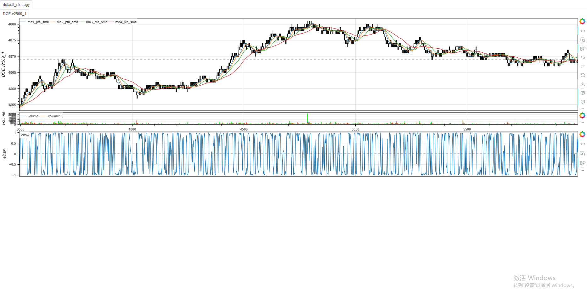
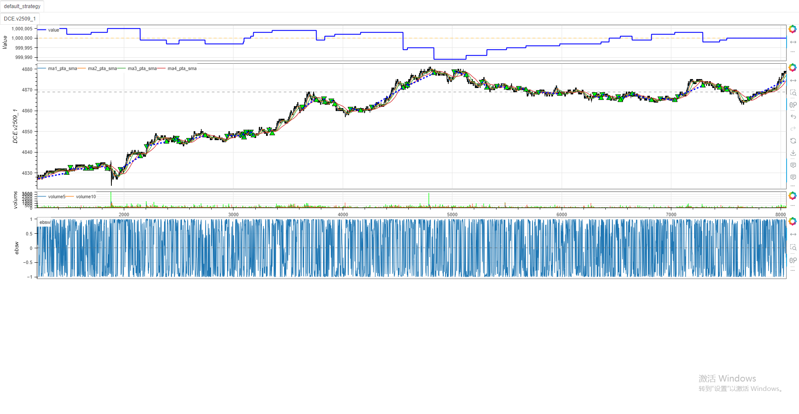

# **极简指标展示与极速启动策略案例**
&emsp;&emsp;以下是一个先进行极简指标展示，然后实现极速启动策略的完整案例。

## 极简指标代码
```python
from minibt import *
if __name__ == "__main__":
    KLine(LocalDatas.test.dataframe).run(
        ["ma1", Multiply(PandasTa.sma, dict(length=20))],
        ["ma2", Multiply(PandasTa.sma, dict(length=30))],
        ["ma3", Multiply(PandasTa.sma, dict(length=60))],
        ["ma4", Multiply(PandasTa.sma, dict(length=120))],
        ["ebsw", Multiply(PandasTa.ebsw)])
```
### 极简指标可视化界面



&emsp;&emsp;以下是一个基于 Minibt 框架的极速启动策略案例，实现了双均线交叉交易策略。

## 策略逻辑

该策略使用两条移动平均线（20日均线和120日均线）生成交易信号：
- 当短期均线（20日）从下向上穿过长期均线（120日）时，产生买入信号
- 当短期均线从上向下穿过长期均线时，产生卖出信号

## 完整代码

```python
from minibt import *

if __name__ == "__main__":
    def next(self: Strategy):
        # 无持仓时的交易逻辑
        if not self.kline.position:
            # 短期均线上穿长期均线，买入信号
            if self.ma1.prev < self.ma4.prev and self.ma1.new > self.ma4.new:
                self.kline.buy()  # 开多仓
        # 持有多仓时的交易逻辑
        elif self.kline.position > 0:
            # 短期均线下穿长期均线，卖出信号
            if self.ma1.prev > self.ma4.prev and self.ma1.new < self.ma4.new:
                self.kline.sell()  # 平多仓并开空仓
    
    # 配置回测参数
    config = Config(islog=False, profit_plot=True)
    
    # 运行回测
    KLine(LocalDatas.test.dataframe).run(
        # 计算20日简单移动平均线
        ["ma1", Multiply(PandasTa.sma, dict(length=20))],
        # 计算30日简单移动平均线（策略未使用，可用于扩展）
        ["ma2", Multiply(PandasTa.sma, dict(length=30))],
        # 计算60日简单移动平均线（策略未使用，可用于扩展）
        ["ma3", Multiply(PandasTa.sma, dict(length=60))],
        # 计算120日简单移动平均线
        ["ma4", Multiply(PandasTa.sma, dict(length=120))],
        # 计算Elder射线指标（策略未使用，可用于扩展）
        ["ebsw", Multiply(PandasTa.ebsw)],
        next=next,  # 策略逻辑函数
        config=config  # 回测配置
    )
```
### 极速启动策略可视化界面



## 策略说明

1. **指标计算**：
   - `ma1`: 20日简单移动平均线（短期均线）
   - `ma4`: 120日简单移动平均线（长期均线）
   - 其他指标（ma2, ma3, ebsw）已计算但未在策略中使用，可供后续扩展

2. **交易信号**：
   - 买入条件：短期均线上穿长期均线（金叉）
   - 卖出条件：短期均线下穿长期均线（死叉）

3. **仓位管理**：
   - 策略始终保持仓位，要么是多头要么是空头
   - 没有仓位时，只响应买入信号
   - 持有多头仓位时，只响应卖出信号

## 使用说明

1. 确保已安装 Minibt 框架
2. 将上述代码保存为 Python 文件（如 `dual_ma_strategy.py`）
3. 运行文件即可执行回测：
   ```bash
   python dual_ma_strategy.py
   ```

## 扩展建议

1. 可添加止损止盈机制管理风险
2. 可结合其他指标（如 RSI、MACD）过滤信号
3. 可调整均线参数优化策略表现
4. 可添加仓位大小管理策略

&emsp;&emsp;此策略提供了一个极简但完整的交易框架，适合快速验证均线交叉策略的有效性，并可作为更复杂策略的开发基础。

> 风险提示：本文涉及的交易策略、代码示例均为技术演示、教学探讨，仅用于展示逻辑思路，绝不构成任何投资建议、操作指引或决策依据 。金融市场复杂多变，存在价格波动、政策调整、流动性等多重风险，历史表现不预示未来结果。任何交易决策均需您自主判断、独立承担责任 —— 若依据本文内容操作，盈亏后果概由自身承担。请务必充分评估风险承受能力，理性对待市场，谨慎做出投资选择。