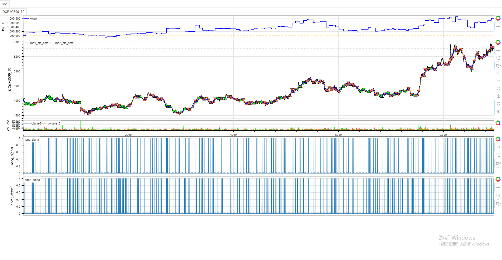
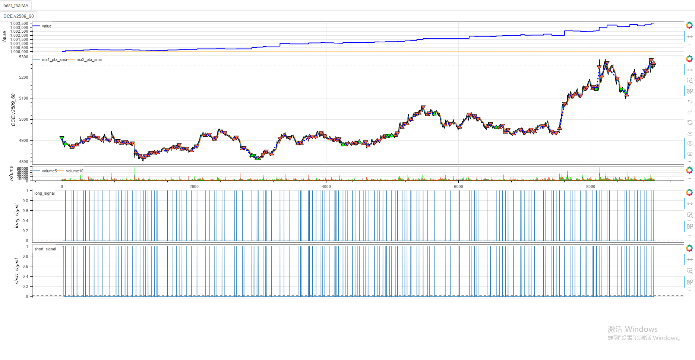

# **minibt量化交易：策略参数优化教程**

## 概述

&emsp;&emsp;本教程将介绍如何使用 minibt 量化回测库进行策略参数优化。我们将通过一个双均线交叉策略的实例，展示如何使用 Optuna 进行多目标参数优化。

## 策略代码解析

```python
from minibt import *

class MA(Strategy):
    # 定义可优化参数
    params = dict(length1=10, length2=20)

    def __init__(self):
        # 获取数据
        self.data = self.get_kline(LocalDatas.v2509_60_1)
        
        # 计算技术指标
        self.ma1 = self.data.close.sma(self.params.length1)
        self.ma2 = self.data.close.sma(self.params.length2)
        
        # 生成交易信号
        self.long_signal = self.ma1.cross_up(self.ma2)
        self.short_signal = self.ma2.cross_down(self.ma1)

    def next(self):
        # 策略逻辑
        if not self.data.position:
            if self.long_signal.new:
                self.data.buy()
            elif self.short_signal.new:
                self.data.sell()
        elif self.data.position > 0 and self.short_signal.new:
            self.sell()
        elif self.data.position < 0 and self.long_signal.new:
            self.buy()
```

### 优化前回测表现



### 优化后回测表现



## 参数优化配置

```python
if __name__ == "__main__":
    bt = Bt(auto=True)
    # 设置优化目标和参数范围
    bt.optstrategy(
        ["profit", "win_rate"],  # 优化目标：收益和胜率
        (1, 1),                  # 权重配置
        length1=(5, 15, 1),      # length1参数范围：5到15，步长为1
        length2=(20, 30, 1),     # length2参数范围：20到30，步长为1
        opconfig=OptunaConfig(n_trials=100)  # Optuna配置：100次试验
    )
    bt.run()
```

## 优化过程详解

### 1. 优化目标设置

minibt 支持多目标优化，本例中同时优化两个指标：
- `profit`：策略总收益
- `win_rate`：交易胜率

### 2. 参数空间定义

通过元组定义每个参数的取值范围：
- `length1=(5, 15, 1)`：从5到15，步长为1
- `length2=(20, 30, 1)`：从20到30，步长为1

### 3. Optuna 配置

使用 `OptunaConfig` 配置优化过程：
- `n_trials=100`：进行100次参数试验
- 默认使用 NSGAII 采样器和 HyperbandPruner
- 支持帕累托前沿分析

## 优化结果分析

从输出结果可以看到：

1. **最佳参数组合**：`length1=12`, `length2=30`
2. **性能指标**：
   - 收益：3515.0
   - 胜率：69.23%
3. **其他表现**：
   - 夏普比率：0.5382
   - 最大回撤：0.0204%
   - 盈亏比：3.9674

## 优化技巧与建议

1. **参数范围选择**：根据策略逻辑合理设置参数范围，避免过拟合
2. **多目标权衡**：通过权重配置平衡不同目标的重要性
3. **并行优化**：使用 `n_jobs` 参数启用并行计算加速优化过程
4. **早停机制**：利用 Pruner 提前终止表现不佳的参数试验

## 结论

&emsp;&emsp;minibt 提供了简单而强大的参数优化功能，结合 Optuna 框架可以实现高效的多目标参数优化。通过本教程的示例，您可以快速上手并应用于自己的策略开发中。

## 扩展阅读

- 了解更多关于 Optuna 的高级用法
- 探索 minibt 的其他技术指标和交易功能
- 学习如何分析优化结果并避免过拟合

&emsp;&emsp;通过参数优化，您可以显著提升策略性能，但切记要在样本外数据上验证优化结果，确保策略的稳健性。

> 风险提示：本文涉及的交易策略、代码示例均为技术演示、教学探讨，仅用于展示逻辑思路，绝不构成任何投资建议、操作指引或决策依据 。金融市场复杂多变，存在价格波动、政策调整、流动性等多重风险，历史表现不预示未来结果。任何交易决策均需您自主判断、独立承担责任 —— 若依据本文内容操作，盈亏后果概由自身承担。请务必充分评估风险承受能力，理性对待市场，谨慎做出投资选择。