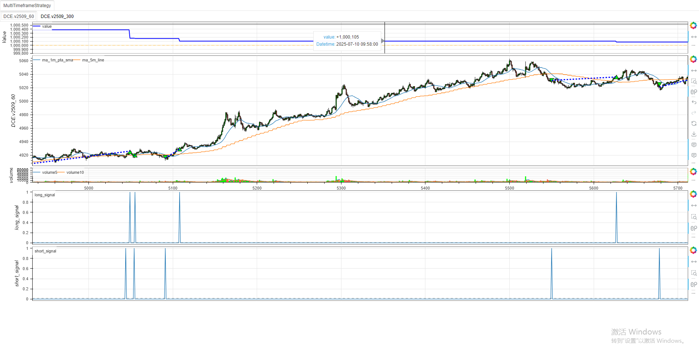
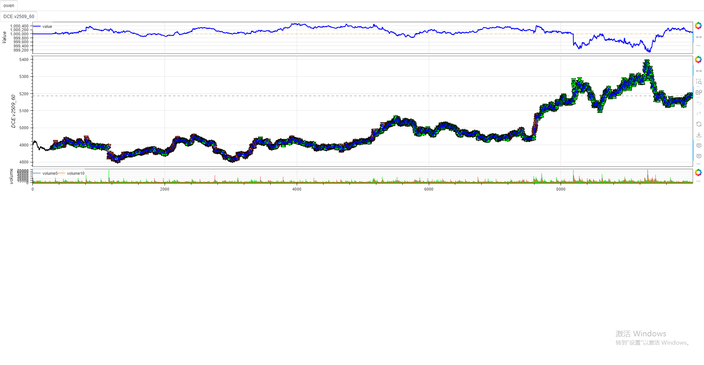

# **minibt量化交易：策略类 (Strategy) 完整指南**

## 概述

&emsp;&emsp;`minibt` 的 `Strategy` 类是量化交易策略的核心基类，它继承自 `StrategyBase` 基础类，统一封装了量化交易的回测、实盘、参数优化、强化学习（RL）等全流程能力。该类提供了标准化接口供用户自定义策略逻辑，实现了策略开发的全套基础设施。

## 核心设计理念

### 1. 多模式兼容架构
- **回测模式**：基于历史数据的策略验证
- **实盘模式**：连接天勤TQApi进行实时交易
- **参数优化模式**：自动批量测试参数组合
- **强化学习模式**：集成elegantrl框架进行RL训练与推理

### 2. 数据驱动设计
- 统一管理K线数据 (`_btklinedataset`) 和指标数据 (`_btindicatordataset`)
- 支持多数据源：TQSDK（期货）、PyTDX（股票）、CSV、DataFrame、SQLite
- 自动处理数据预处理（跳空消除、周期转换、数据截取）

### 3. 交易执行统一接口
- 提供 `buy()`, `sell()`, `set_target_size()` 等统一交易接口
- 自动区分回测（操作`_broker`）和实盘（操作`TargetPosTask`）逻辑
- 支持多种止损模式（后置止损、前置止损、跳过止损）

## 核心功能详解

### 1. 策略生命周期管理

#### 初始化 (`__init__`)
```python
def __init__(self: Strategy, *args, **kwargs):
```
- 将策略实例注册到全局集合 (`StrategyInstances`)
- 初始化策略配置 (`config`) 和参数 (`params`)
- 处理动态传入的自定义属性

#### 策略启动 (`_strategy_start`)
```python
def _strategy_start(self: Strategy, **kwargs):
```
完整启动流程：
1. `_pre_init()` - 启动前准备（创建数据/指标集合、初始化账户）
2. `_strategy_init()` - 子类自定义初始化（用户重写的`__init__`逻辑）
3. `_data_init()` - 数据初始化（检查数据、初始化历史记录）
4. `start()` - 策略启动钩子（用户可重写，用于指标预计算）
5. RL分支处理（若启用）
6. `_bt_run()` - 核心回测/实盘运行
7. `_get_plot_datas()` - 整理绘图数据

#### 策略调用 (`__call__`)
```python
def __call__(self: Strategy, *args, **kwds):
```
根据策略模式分发到对应逻辑：
- 优化模式：调用 `__optimize` 执行参数优化
- 实盘模式：调用 `_live_trading` 启动实盘
- 回测模式：调用 `_strategy_start` 启动回测

### 2. 数据管理

#### 多周期数据处理

##### 周期转换 (`resample`)
```python
def resample(self, cycle: int, data: KLine = None, rule: str = None, **kwargs) -> KLine:
```
将低周期K线数据转换为高周期数据（如300秒→900秒）

##### 数据回放 (`replay`)
```python
def replay(self, cycle: int, data: KLine = None, rule: str = None, **kwargs) -> KLine:
```
将高周期K线数据回放为低周期，模拟实时行情逐步推送

##### 多周期指标转换 (`_multi_indicator_resample`)
```python
def _multi_indicator_resample(self, data: Union[IndSeries, IndFrame]) -> np.ndarray:
```
将大周期指标数据转换为主周期长度，确保时间对齐与数据完整性

### 3. 指标系统

#### 自定义指标创建 (`btind_like`)
```python
def btind_like(self, ds: Union[IndSeries, IndFrame, tuple[int], int], **kwargs) -> Union[IndSeries, IndFrame]:
```
创建与参考数据结构一致的全NaN指标，供用户手动计算自定义指标

#### 指标自动收录
通过重写 `__setattr__` 方法，自动将指标和K线数据注册到对应的数据集中：
```python
def __setattr__(self, name, value: Union[Line, IndSeries, IndFrame, KLine, Any]):
```

### 4. 参数优化

#### 优化核心 (`__optimize`)
```python
def __optimize(self: Strategy, params: dict, ismax: bool, target: Iterable):
```
针对单个参数组执行回测并返回优化目标值

#### 优化状态重置 (`_reset_op`)
```python
def _reset_op(self):
```
重置策略状态，确保每组参数独立测试

### 5. 强化学习集成

#### RL配置 (`set_model_params`)
```python
def set_model_params(
        self,
        agent=None,
        train: bool = True,
        # ... 大量RL参数
        **params):
```
配置强化学习模型的各项参数，初始化训练配置

#### 特征处理 (`get_signal_features`, `set_process_quant_features`)
```python
def get_signal_features(self) -> Optional[np.ndarray]:
def set_process_quant_features(
    self,
    normalize_method: Literal['standard', 'robust', 'minmax', 'rolling'] = "robust",
    # ... 特征处理参数
):
```
提供量化特征处理功能，包括归一化、异常值处理、特征变换和降维

#### 数据增强 (`data_enhancement`)
```python
def data_enhancement(self, obs: np.ndarray, rate: float = 0.5) -> np.ndarray:
```
随机应用一种数据增强方法，防止RL模型过拟合

### 6. 实盘交易支持

#### 实盘数据更新 (`_update_datas`)
```python
def _update_datas(self, length=10) -> tuple:
```
从TQApi获取最新K线与指标数据，处理HA/K线转换，整理为绘图所需格式

#### 账户信息 (`_get_account_info`)
```python
def _get_account_info(self) -> str:
```
整合账户关键财务指标，生成易读的字符串（用于实盘日志/控制台输出）

## 使用示例

### 基本策略示例
```python
from minibt import *

class MA(Strategy):
    params = dict(length1=10, length2=20)
    
    def __init__(self):
        self.data = self.get_kline(LocalDatas.test)
        self.ma1 = self.data.close.sma(self.params.length1)
        self.ma2 = self.data.close.sma(self.params.length2)
        self.long_signal = self.ma1.cross_up(self.ma2)
        self.short_signal = self.ma2.cross_down(self.ma1)
    
    def next(self):
        if not self.data.position:
            if self.long_signal.new:
                self.data.buy()
            elif self.short_signal.new:
                self.data.sell()
        elif self.data.position > 0 and self.short_signal.new:
            self.sell()
        elif self.data.position < 0 and self.long_signal.new:
            self.buy()

if __name__ == "__main__":
    bt = Bt(auto=True)
    bt.run()
```


### 多周期策略示例
```python
from minibt import *


class MultiTimeframeStrategy(Strategy):
    def __init__(self):
        # 主数据（1分钟）
        self.data_1m = self.get_kline(LocalDatas.v2509_60)

        # 转换到5分钟数据
        self.data_5m = self.data_1m.resample(300)

        # 在不同周期上计算指标
        self.ma_1m = self.data_1m.close.sma(20)
        # 数据上采样
        self.ma_5m = self.data_5m.close.sma(20)()
        self.ma_5m.overlap = True
        
        # 交易信号
        self.long_signal = self.ma_1m.cross_up(self.ma_5m)
        self.short_signal = self.ma_1m.cross_down(self.ma_5m)

    def next(self):
        if not self.data_1m.position:
            # 多周期信号组合
            if self.long_signal.new:
                self.buy()
            elif self.short_signal.new:
                self.sell()
        elif self.data_1m.position > 0 and self.short_signal.new:
            self.sell()
        elif self.data_1m.position < 0 and self.long_signal.new:
            self.buy()


if __name__ == "__main__":
    bt = Bt()
    bt.run()
```



### 强化学习策略示例
```python
from minibt import *
from minibt.rl_utils import *


class owen(Strategy):
    rl = True

    def __init__(self) -> None:
        self.min_start_length = 300
        self.data = self.get_kline(LocalDatas.v2509_60)
        self.ma1 = self.data.close.sma(3)
        self.ma2 = self.data.close.sma(5)
        self.ma3 = self.data.close.sma(8)
        self.ma4 = self.data.close.sma(13)
        self.ma5 = self.data.close.sma(21)
        self.ma6 = self.data.close.sma(34)
        self.ma7 = self.data.close.sma(55)
        self.zscore10 = self.data.close.zscore(10)
        self.zscore20 = self.data.close.zscore(20)
        self.rsi = self.data.close.rsi()
        self.ebsw = self.data.close.ebsw()
        self.atr1 = self.data.atr(10)
        self.atr2 = self.data.atr(20)
        self.std1 = self.data.close.stdev(10)
        self.std2 = self.data.close.stdev(20)
        self.pvi1 = self.data.pvi(10)
        self.pvi2 = self.data.pvi(20)
        self.cci1 = self.data.close.cci(10)
        self.cci2 = self.data.close.cci(20)
        self.adx1 = self.data.close.adx(10).iloc[:, 0]
        self.adx2 = self.data.close.adx(20).iloc[:, 0]
        self.isplot = False
        self.long_prices = [self.data.pandas_object.close.diff(
        ).shift(-i).values for i in range(1, 4)]
        self.short_prices = [-price for price in self.long_prices]

        self.set_model_params(
            agent=Agents.AgentPPO,
            train=False,
            continue_train=True,
            break_step=1e5,
            random_policy_test=False,
            action_dim=1,
            if_remove=False,
            if_discrete=False,
            dropout_rate=0.2,)
        self.max_step -= 4
        self.hoding_day = 0
        self.data.price_tick = 1.
        self.data.volume_multiple = 5.
        self.data.fixed_commission = 0.

    def get_action(self, action: int):
        # 整数动作转换
        action -= 3
        if action >= 0:
            return action+1
        return action

    def _get_action(self, action: np.ndarray):
        # 离散动作转换
        x = action[0]
        # 原区间
        x_min, x_max = -1, 1
        # 目标区间
        y_min, y_max = 0, 5

        # 首先线性映射到[1, 6]区间
        y = y_min + (x - x_min) * (y_max - y_min) / (x_max - x_min)

        # 处理边界情况，确保不会超出范围
        if y < 0:
            a = 0
        elif y > 5:
            a = 5
        else:
            # 四舍五入取整数
            a = round(y)
        return self.get_action(a)

    def reset(self):
        self.current_step = self.min_start_length
        self.action = 0
        self.pos = 0
        self.hoding_day = 0
        return self._get_observation(), {}

    def _get_observation(self) -> np.ndarray:
        obs = self.signal_features[self.current_step+1 -
                                   self.window_size:self.current_step+1]
        if self.train:
            return self.data_enhancement(obs)
        return obs.flatten()

    def step(self, action):
        reward, done = 0., False
        action = self._get_action(action)
        if self.current_step >= self.max_step:
            done = True
        if self.train:
            if action > 0:  # action in [1, 2, 3]
                reward = self.long_prices[action-1][self.current_step]
            else:  # action in [-1, -2, -3]
                reward = self.short_prices[-action-1][self.current_step]

        else:
            if self.data.position == 0:
                if action > 0:
                    self.data.buy()
                    self.hoding_day = action
                else:
                    self.data.sell()
                    self.hoding_day = -action
                    self.last_action = -action
            elif self.data.position > 0:
                self.hoding_day -= 1
                if self.hoding_day <= 0:
                    self.data.sell()
            else:
                self.hoding_day -= 1
                if self.hoding_day <= 0:
                    self.data.buy()

        self.current_step += 1
        return self._get_observation(), reward, done, False, {}


if __name__ == "__main__":
    Bt().run()
```



## 核心属性与方法摘要

### 重要属性
- `params`: 策略参数字典（可优化）
- `config`: 策略配置对象（控制回测/实盘参数）
- `_btklinedataset`: K线数据集合
- `_btindicatordataset`: 指标数据集合
- `_account`: 账户对象（回测用BtAccount，实盘用TqAccount）
- `rl`: 是否启用强化学习模式

### 关键方法
- `get_kline()`: 获取K线数据的统一接口
- `buy()/sell()/set_target_size()`: 交易执行接口
- `resample()/replay()`: 周期转换与数据回放
- `btind_like()`: 创建自定义指标
- `set_model_params()`: 配置RL参数
- `train_agent()`: 启动RL训练
- `load_agent()`: 加载训练好的RL模型

## 与Backtrader的对比

`minibt` 的 `Strategy` 类在设计上参考了 `Backtrader`，但增加了许多现代化特性：

1. **强化学习集成**：原生支持RL训练与推理
2. **多周期处理**：更灵活的多周期数据转换与回放
3. **实盘交易**：深度集成天勤TQApi，实现回测/实盘无缝切换
4. **数据增强**：内置多种数据增强方法，提升模型鲁棒性
5. **特征工程**：提供专业的量化特征处理流程

## 总结

&emsp;&emsp;`minibt` 的 `Strategy` 类是一个功能全面、设计先进的量化策略基类，它提供了从数据获取、策略逻辑、交易执行到绩效分析的全套解决方案。无论是传统的技术指标策略还是基于强化学习的现代算法策略，都可以基于这个类快速开发和验证。

&emsp;&emsp;通过合理的架构设计和丰富的功能集成，`Strategy` 类极大地降低了量化策略开发的门槛，使开发者可以专注于策略逻辑本身，而不必纠结于底层实现细节。

> 风险提示：本文涉及的交易策略、代码示例均为技术演示、教学探讨，仅用于展示逻辑思路，绝不构成任何投资建议、操作指引或决策依据 。金融市场复杂多变，存在价格波动、政策调整、流动性等多重风险，历史表现不预示未来结果。任何交易决策均需您自主判断、独立承担责任 —— 若依据本文内容操作，盈亏后果概由自身承担。请务必充分评估风险承受能力，理性对待市场，谨慎做出投资选择。