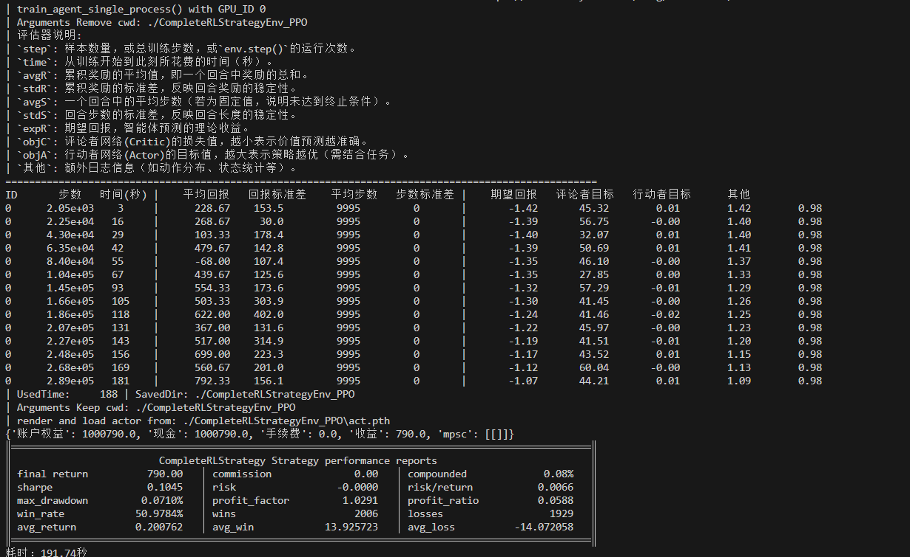
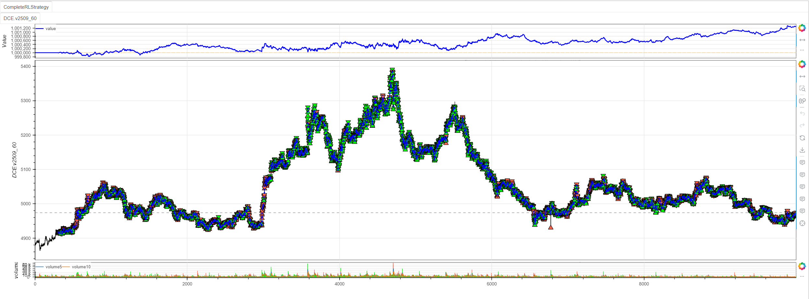
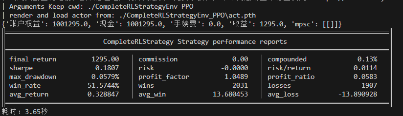

# minibt 框架强化学习使用指南

minibt 框架提供了完整的强化学习（Reinforcement Learning）解决方案，支持多种强化学习算法，可以方便地将量化交易策略转化为强化学习环境。本文将详细介绍 minibt 框架中强化学习功能的使用方法。

## 1. 基础概念

### 1.1 强化学习在量化交易中的应用

在量化交易中，强化学习将交易决策建模为马尔可夫决策过程（MDP）：
- **状态（State）**：市场特征、技术指标、持仓信息等
- **动作（Action）**：买入、卖出、持有等交易决策
- **奖励（Reward）**：基于交易盈亏计算的回报

### 1.2 minibt RL 核心组件

```python
from minibt import *
from minibt.rl_utils import *

class MyStrategy(Strategy):
    rl = True  # 启用强化学习模式
    
    def __init__(self):
        # 1. 数据准备和技术指标计算
        self.data = self.get_kline(LocalDatas.v2601_60)
        self.ma1 = self.data.close.sma(3)
        self.ma2 = self.data.close.sma(5)
        # ... 更多指标
        
        # 2. 配置强化学习参数
        self.set_model_params(
            Agents.AgentPPO,  # 使用PPO算法
            train=True,       # 训练模式
            break_step=1e5,   # 训练步数
            # ... 更多参数
        )
        
    def reset(self):
        """重置环境状态"""
        self.current_step = self.min_start_length
        self.pos = 0
        return self._get_observation(), {}
    
    def _get_observation(self):
        """获取观测状态"""
        obs = self.signal_features[self.current_step+1-self.window_size:self.current_step+1]
        if self.train:
            return self.data_enhancement(obs)  # 训练时使用数据增强
        return obs.flatten()
    
    def step(self, action):
        """执行动作并返回结果"""
        # 动作处理逻辑
        processed_action = self._process_action(action)
        
        # 计算奖励
        reward = self._calculate_reward(processed_action)
        
        # 更新状态
        self.current_step += 1
        done = self.current_step >= self.max_step
        
        return self._get_observation(), reward, done, False, {}
```

## 2. 特征工程与指标获取

### 2.1 技术指标计算

```python
class OwenStrategy(Strategy):
    rl = True
    
    def __init__(self):
        # 获取基础数据
        self.data = self.get_kline(LocalDatas.v2509_60_2)
        
        # 移动平均线系列
        self.ma1 = self.data.close.sma(3)    # 3周期均线
        self.ma2 = self.data.close.sma(5)    # 5周期均线
        self.ma3 = self.data.close.sma(8)    # 8周期均线
        self.ma4 = self.data.close.sma(13)   # 13周期均线
        self.ma5 = self.data.close.sma(21)   # 21周期均线
        self.ma6 = self.data.close.sma(34)   # 34周期均线
        self.ma7 = self.data.close.sma(55)   # 55周期均线
        
        # Z-score 标准化
        self.zscore10 = self.data.close.zscore(10)  # 10周期Z-score
        self.zscore20 = self.data.close.zscore(20)  # 20周期Z-score
        
        # RSI 相对强弱指标
        self.rsi = self.data.close.rsi()
        
        # EBSW 指标
        self.ebsw = self.data.close.ebsw()
        
        # ATR 平均真实波幅
        self.atr1 = self.data.atr(10)  # 10周期ATR
        self.atr2 = self.data.atr(20)  # 20周期ATR
        
        # 标准差
        self.std1 = self.data.close.stdev(10)  # 10周期标准差
        self.std2 = self.data.close.stdev(20)  # 20周期标准差
        
        # PVI 正成交量指标
        self.pvi1 = self.data.pvi(10)  # 10周期PVI
        self.pvi2 = self.data.pvi(20)  # 20周期PVI
        
        # CCI 商品通道指标
        self.cci1 = self.data.close.cci(10)  # 10周期CCI
        self.cci2 = self.data.close.cci(20)  # 20周期CCI
        
        # ADX 平均趋向指数
        self.adx1 = self.data.close.adx(10).iloc[:, 0]  # 10周期ADX
        self.adx2 = self.data.close.adx(20).iloc[:, 0]  # 20周期ADX
```

### 2.2 特征处理与归一化

```python
# 配置特征处理参数
strategy.set_process_quant_features(
    normalize_method='robust',      # 使用鲁棒归一化（抗异常值）
    rolling_window=60,              # 滚动窗口大小
    feature_range=(-1, 1),          # 特征缩放范围
    use_log_transform=True,         # 使用对数变换
    handle_outliers="clip",         # 异常值处理方式：截断
    pca_n_components=1.0,           # PCA降维（1.0表示保留全部特征）
    target_returns=None             # 目标收益率（可选，用于特征选择）
)

# 获取处理后的特征
features = strategy.get_signal_features()
```

**特征处理方法说明：**

- **归一化方法**：
  - `standard`：标准归一化（均值为0，标准差为1）
  - `robust`：鲁棒归一化（中位数为0，四分位距为1，抗异常值）
  - `minmax`：最小最大归一化（缩放到指定范围）
  - `rolling`：滚动窗口归一化（避免未来数据泄露）

- **异常值处理**：
  - `clip`：使用四分位法截断异常值
  - `mark`：新增异常值标记特征

- **特征变换**：
  - 对数变换：压缩长尾分布
  - PCA降维：减少特征维度，保留主要信息

### 2.3 数据增强

```python
def data_enhancement(self, obs: np.ndarray, rate: float = 0.5) -> np.ndarray:
    """
    数据增强方法，防止模型过拟合
    
    参数：
        obs: 输入特征数据
        rate: 应用增强的概率（默认0.5）
    
    返回：
        增强后或原始的特征数组
    """
    # 50%概率应用数据增强
    if np.random.rand() < rate:
        augment_func = np.random.choice(self._data_enhancement_funcs)
        return augment_func(obs)
    return obs.flatten()
```

## 3. 强化学习模型配置

### 3.1 基础模型配置

```python
class OwenStrategy(Strategy):
    def __init__(self):
        # ... 指标计算 ...
        
        # 配置强化学习模型参数
        self.set_model_params(
            agent=Agents.AgentPPO,           # 使用PPO算法
            train=True,                      # 训练模式
            continue_train=False,            # 不继续训练
            random_policy_test=False,        # 不进行随机策略测试
            window_size=10,                  # 状态观察窗口大小
            env_name="OwenTradingEnv",       # 环境名称
            num_envs=1,                      # 并行环境数量
            max_step=0,                      # 最大步数（0表示使用数据集长度）
            state_dim=0,                     # 状态维度（自动计算）
            action_dim=1,                    # 动作维度
            if_discrete=False,               # 连续动作空间
            break_step=1e5,                  # 训练中断步数
            batch_size=128,                  # 批次大小
            horizon_len=2048,                # 经验收集长度
            buffer_size=None,                # 缓冲区大小（None表示使用数据集长度）
            repeat_times=8.0,                # 策略更新重复次数
            if_use_per=False,                # 不使用优先经验回放
            gamma=0.985,                     # 折扣因子
            reward_scale=1.0,                # 奖励缩放因子
            net_dims=(64, 32),               # 神经网络隐藏层维度
            learning_rate=6e-5,              # 学习率
            weight_decay=1e-4,               # 权重衰减
            clip_grad_norm=0.5,              # 梯度裁剪阈值
            save_gap=8,                      # 模型保存间隔
            ratio_clip=0.25,                 # PPO裁剪比率
            lambda_gae_adv=0.95,             # GAE优势估计参数
            lambda_entropy=0.01,             # 熵奖励系数
            gpu_id=0,                        # GPU设备ID
            random_seed=42,                  # 随机种子
            cwd="./models/owen",             # 工作目录
            if_remove=True,                  # 移除旧模型文件
            eval_times=3,                    # 评估次数
            eval_per_step=2e4,               # 评估间隔步数
            Optim=Optim.OGSignMuon(),        # 自定义优化器
            dropout_rate=0.2,                # Dropout比率
        )
        
        # 调整最大步数（避免越界）
        self.max_step -= 4
        
        # 交易相关参数
        self.hoding_day = 0
        self.last_action = 0
        self.data.price_tick = 1.0
        self.data.volume_multiple = 5.0
        self.data.fixed_commission = 0.0
```

### 3.2 支持的强化学习算法

minibt 框架支持多种强化学习算法：

```python
from minibt.elegantrl.agents import Agents

# 支持的算法包括：
# - Agents.AgentPPO: 近端策略优化
# - Agents.AgentSAC: 软演员评论家
# - Agents.AgentTD3: 双延迟深度确定性策略梯度
# - Agents.AgentDDPG: 深度确定性策略梯度
# - Agents.AgentA2C: 优势演员评论家
# - Agents.AgentDQN: 深度Q网络
```

### 3.3 自定义网络组件

```python
self.set_model_params(
    # 自定义损失函数
    Loss=Loss.MSELoss(reduction="none"),
    
    # 自定义优化器
    Optim=Optim.OGSignMuon(eps=1e-5, weight_decay=1e-4),
    
    # 自定义激活函数
    Activation=Activation.Tanh10(),
    
    # 自定义归一化层
    Norm=Norm.LayerNorm,
    
    # 学习率调度器
    LrScheduler=LrScheduler.ExponentialLR,
    
    # 随机权重平均
    SWA=SWA.StochasticWeightAveraging,
)
```

## 4. 环境交互方法

### 4.1 状态观测获取

```python
def _get_observation(self) -> np.ndarray:
    """
    获取当前状态观测
    
    返回：
        处理后的特征数组，形状为(state_dim,)
    """
    # 获取窗口内的特征数据
    obs = self.signal_features[
        self.current_step + 1 - self.window_size: 
        self.current_step + 1
    ]
    
    # 训练时应用数据增强，推理时直接展平
    if self.train:
        return self.data_enhancement(obs, rate=0.5)
    return obs.flatten()
```

### 4.2 动作处理

```python
def _process_action(self, action):
    """处理动作"""
    # 将连续动作 [-1, 1] 映射到离散动作 [-3, -2, -1, 1, 2, 3]
    x = action[0]
    # 原区间
    x_min, x_max = -1, 1
    # 目标区间
    y_min, y_max = 0, 5

    # 首先线性映射到[1, 6]区间
    y = y_min + (x - x_min) * (y_max - y_min) / (x_max - x_min)

    # 处理边界情况，确保不会超出范围
    if y < 0:
        a = 0
    elif y > 5:
        a = 5
    else:
        # 四舍五入取整数
        a = round(y)  
    action -= 3
    if action >= 0:
        return action+1
    return action # 映射到[-3, -2, -1, 1, 2, 3]区间
```

### 4.3 奖励计算

```python
def step(self, action):
    """
    执行动作并返回环境反馈
    
    参数：
        action: 模型输出的动作
    
    返回：
        observation: 新的状态观测
        reward: 奖励值
        done: 是否结束
        truncated: 是否被截断
        info: 附加信息
    """
    reward, done = 0.0, False
    
    # 处理动作
    processed_action = self._get_action(action)
    
    # 训练模式下的奖励计算
    if self.train:
        if processed_action > 0:  # 做多动作 [1, 2, 3]
            # 使用未来价格变化作为奖励
            reward = self.long_prices[processed_action - 1][self.current_step]
        elif processed_action < 0:  # 做空动作 [-1, -2, -3]
            reward = self.short_prices[-processed_action - 1][self.current_step]
        # processed_action == 0 时 reward 保持 0
    
    # 回测模式下的实际交易逻辑
    else:
        if self.data.position == 0:  # 当前无持仓
            if processed_action > 0:  # 做多
                self.data.buy()
                self.hoding_day = processed_action
                self.last_action = processed_action
            elif processed_action < 0:  # 做空
                self.data.sell()
                self.hoding_day = -processed_action
                self.last_action = -processed_action
        
        elif self.data.position > 0:  # 当前持多仓
            if processed_action > 0:
                self.hoding_day = min(processed_action, self.hoding_day)
            self.hoding_day -= 1
            if self.hoding_day <= 0:  # 持仓期满，平仓
                self.data.sell()
        
        else:  # 当前持空仓
            if processed_action < 0:
                self.hoding_day = min(-processed_action, self.hoding_day)
            self.hoding_day -= 1
            if self.hoding_day <= 0:  # 持仓期满，平仓
                self.data.buy()
    
    # 更新步数
    self.current_step += 1
    
    # 检查是否结束
    if self.current_step >= self.max_step:
        done = True
    
    return self._get_observation(), reward, done, False, {}
```

## 5. 训练与推理

### 5.1 启动训练

```python
# 配置完成后启动训练
strategy.train_agent()

# 或者显式调用
from minibt.elegantrl.train.run import train_agent
train_agent(strategy._rl_config, True)
```

### 5.2 加载训练好的模型

```python
# 在策略初始化后加载训练好的模型
strategy.load_agent()

# 加载后的模型可以通过 strategy.actor 访问
# 在step方法中，模型会自动进行推理
```

### 5.3 随机策略测试

```python
# 测试随机策略，验证环境设置
strategy.random_policy_test()
```

## 6. 完整示例

```python
from minibt import *
from minibt.rl_utils import *


class CompleteRLStrategy(Strategy):
    rl = True

    def __init__(self):
        # 基础设置
        self.min_start_length = 300
        self.data = self.get_kline(LocalDatas.v2509_60_3)
        self.data.height = 500

        # 技术指标计算
        self._setup_technical_indicators()

        # 配置强化学习
        self._setup_rl_config()

        # 交易参数
        self._setup_trading_params()

    def _setup_technical_indicators(self):
        """设置技术指标"""
        # 移动平均线
        self.ma1 = self.data.close.sma(3)
        self.ma2 = self.data.close.sma(5)
        self.ma3 = self.data.close.sma(8)
        self.ma4 = self.data.close.sma(13)
        self.ma5 = self.data.close.sma(21)

        # 震荡指标
        self.rsi = self.data.close.rsi()
        self.cci = self.data.close.cci(14)
        self.adx = self.data.close.adx(14).iloc[:, 0]
        self.pvi = self.data.pvi(14)
        self.ebsw = self.data.close.ebsw()
        self.zscore = self.data.close.zscore(14)

        # 波动率指标
        self.atr = self.data.atr(14)
        self.std = self.data.close.stdev(14)

        self.btindicatordataset.isplot = False

        # 配置特征处理
        self.set_process_quant_features(
            normalize_method='robust',
            use_log_transform=True,
            handle_outliers="clip"
        )

        # 价格目标（用于奖励计算）
        # 多头未来1-3周期的收益
        self.long_prices = [
            self.data.pandas_object.close.diff().shift(-i).values
            for i in range(1, 4)
        ]
        # 空头未来1-3周期的收益
        self.short_prices = [-price for price in self.long_prices]

    def _setup_rl_config(self):
        """配置强化学习参数"""
        self.set_model_params(
            Agents.AgentPPO,
            train=True,
            break_step=3e5,
            if_remove=True,
            action_dim=1,
            if_discrete=False,
            Optim=Optim.OGSignMuon(),
        )
        # 调整步数限制,最后3根K线无未来收益，即倒数第四根K线训练结束
        self.max_step -= 4

    def _setup_trading_params(self):
        """设置交易参数"""
        self.hoding_day = 0  # 持仓周期
        self.last_action = 0  # 最后交易的动作
        self.data.price_tick = 1.0  # 最小波动单位1.
        self.data.volume_multiple = 5.0  # 最小乘数5.
        self.data.fixed_commission = 0.0  # 无手续费用

    def reset(self):
        """重置环境"""
        self.current_step = self.min_start_length
        self.pos = 0
        self.hoding_day = 0
        self.last_action = 0
        return self._get_observation(), {}

    def _get_observation(self):
        """获取观测状态"""
        obs = self.signal_features[
            self.current_step + 1 - self.window_size:
            self.current_step + 1
        ]
        if self.train:  # 有30%概率使用数据增强
            return self.data_enhancement(obs, rate=0.3)
        return obs.flatten()

    def _process_action(self, action):
        """处理动作"""
        # 将连续动作 [-1, 1] 映射到离散动作 [-3, -2, -1, 1, 2, 3]
        x = action[0]
        # 原区间
        x_min, x_max = -1, 1
        # 目标区间
        y_min, y_max = 0, 5

        # 首先线性映射到[1, 6]区间
        y = y_min + (x - x_min) * (y_max - y_min) / (x_max - x_min)

        # 处理边界情况，确保不会超出范围
        if y < 0:
            action = 0
        elif y > 5:
            action = 5
        else:
            # 四舍五入取整数
            action = round(y)
        action -= 3
        if action >= 0:
            return action+1
        return action  # 映射到[-3, -2, -1, 1, 2, 3]区间

    def step(self, action):
        """环境步进"""
        reward = 0.0
        processed_action = self._process_action(action)

        # 训练奖励计算
        if self.train:
            if processed_action > 0:
                reward = self.long_prices[processed_action -
                                          1][self.current_step]
            elif processed_action < 0:
                reward = self.short_prices[-processed_action -
                                           1][self.current_step]
        # 非训练时进行回测
        else:
            if self.data.position == 0:
                if processed_action > 0:
                    self.data.buy()
                    self.hoding_day = processed_action
                    self.last_action = processed_action
                else:
                    self.data.sell()
                    self.hoding_day = -processed_action
                    self.last_action = -processed_action
            elif self.data.position > 0:
                if processed_action > 0:
                    self.hoding_day = min(processed_action, self.hoding_day)
                self.hoding_day -= 1
                if self.hoding_day <= 0:
                    self.data.sell()
            else:
                if processed_action < 0:
                    self.hoding_day = min(-processed_action, self.hoding_day)
                self.hoding_day -= 1
                if self.hoding_day <= 0:
                    self.data.buy()

        # 更新状态
        self.current_step += 1
        done = self.current_step >= self.max_step

        return self._get_observation(), reward, done, False, {}


if __name__ == "__main__":
    # 创建并运行策略
    Bt().run()
```
```python
# 验证时将train设置为False运行即可
self.set_model_params(
    Agents.AgentPPO,
    train=False,
    break_step=3e5,
    if_remove=True,
    action_dim=1,
    if_discrete=False,
    Optim=Optim.OGSignMuon(),
)
```
# 强化学习策略训练与验证结果分析

## 📊 训练过程总结


### 训练表现指标分析
从训练日志可以看出，策略在训练过程中表现出以下特点：

**积极进展：**
- ✅ **平均回报持续提升**：从初始的228.67稳步增长到792.33，增长约247%
- ✅ **期望回报改善**：从-1.42提升至-1.07，表明策略学习效果良好
- ✅ **训练稳定性**：评论者目标（objV）和行动者目标（objA）保持相对稳定
- ✅ **训练效率**：在189秒内完成289,000步训练，训练过程高效

**训练参数：**
- **算法**：PPO（近端策略优化）
- **训练步数**：289,000步
- **训练时间**：189秒
- **模型保存**：成功保存至 `./CompletedLStrategyEnv_PPO`

## 🎯 验证结果评估

### 回测性能指标
在最新数据上的验证结果显示策略具备良好的实战能力：


**收益表现：**
- **最终收益**：1,295.00（初始资金1,000,000）
- **收益率**：0.13%
- **夏普比率**：0.1807（正数表明风险调整后收益良好）

**风险控制：**
- **最大回撤**：0.0579%（极低，风险控制优秀）
- **风险收益比**：0.0114
- **盈利因子**：1.0489（大于1表明盈利能力强）

**交易统计：**
- **胜率**：51.57%（略高于随机水平）
- **交易次数**：3,938次（2,031胜，1,907负）
- **平均盈利**：13.68 vs **平均亏损**：13.89
- **盈亏比接近1:1**，但胜率优势带来整体盈利

## 🚀 整体评价

### 优势亮点
1. **训练效果显著** - 回报指标持续改善，学习曲线良好
2. **风险控制出色** - 极低的最大回撤显示优秀的风险管理
3. **稳定性强** - 训练过程平稳，无剧烈波动
4. **实战有效** - 验证集上获得稳定正收益

### 改进空间
1. **收益率有待提升** - 虽然稳定但绝对收益相对保守
2. **胜率提升空间** - 51.57%的胜率仍有优化余地
3. **训练效率** - 可进一步优化超参数提升收敛速度

## 💡 建议与展望

**短期优化：**
- 调整奖励函数设计，鼓励更积极的交易行为
- 优化动作空间设计，提高决策精度
- 增加特征工程复杂度，挖掘更多有效信号

**长期发展：**
- 引入多时间框架特征
- 结合市场状态识别模块
- 开发动态仓位管理机制

该强化学习策略展现了良好的基础性能，为后续更复杂的交易策略开发奠定了坚实基础。🎯


## 7. 最佳实践

### 7.1 特征工程建议

1. **特征选择**：
   - 使用相关性分析选择与目标相关的特征
   - 避免使用未来数据
   - 考虑市场 regime 的变化

2. **归一化处理**：
   - 训练集和测试集使用相同的归一化参数
   - 考虑使用滚动窗口归一化避免未来信息泄露

3. **数据增强**：
   - 适当的数据增强可以提高模型泛化能力
   - 但避免过度增强导致信号失真

### 7.2 训练技巧

1. **奖励设计**：
   - 奖励函数应该与最终目标一致
   - 考虑风险调整后的收益
   - 避免稀疏奖励问题

2. **超参数调优**：
   - 使用网格搜索或贝叶斯优化
   - 重点关注学习率、折扣因子、批次大小

3. **模型验证**：
   - 使用样本外数据验证
   - 考虑多个市场环境的测试
   - 监控过拟合现象

### 7.3 风险管理

1. **仓位管理**：
   - 在动作设计中考虑仓位控制
   - 避免过度杠杆

2. **止损机制**：
   - 在环境中实现止损逻辑
   - 考虑波动率调整的止损

通过以上指南，您可以充分利用 minibt 框架的强化学习功能，构建高效的量化交易策略。记得在实际使用中根据具体需求调整参数和逻辑。

> 风险提示：本文涉及的交易策略、代码示例均为技术演示、教学探讨，仅用于展示逻辑思路，绝不构成任何投资建议、操作指引或决策依据 。金融市场复杂多变，存在价格波动、政策调整、流动性等多重风险，历史表现不预示未来结果。任何交易决策均需您自主判断、独立承担责任 —— 若依据本文内容操作，盈亏后果概由自身承担。请务必充分评估风险承受能力，理性对待市场，谨慎做出投资选择。