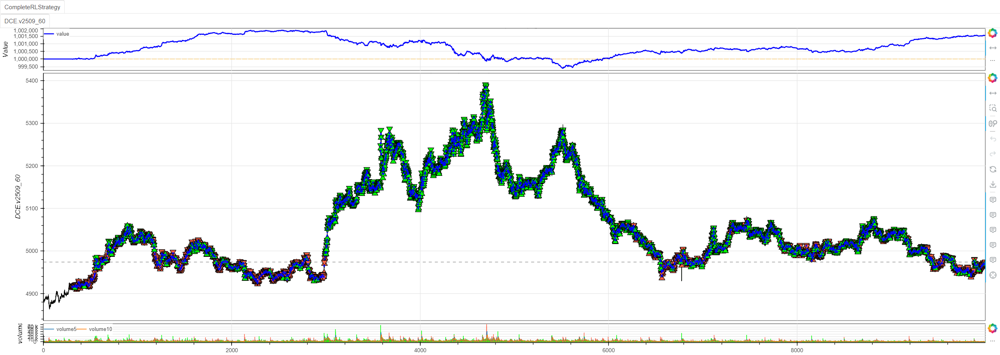

# 强化学习交易策略：代码解析与验证集优异表现分析

## 策略代码深度解析

### 核心架构设计
```python
class CompleteRLStrategy(Strategy):
    rl = True  # 启用强化学习模式
    
    def __init__(self):
        # 基础环境配置
        self.min_start_length = 300  # 最小起始长度
        self.data = self.get_kline(LocalDatas.v2509_60_3)  # 数据获取
        self.data.height = 500  # 图表高度设置
```

### 技术指标特征工程
```python
def _setup_technical_indicators(self):
    """多层次技术指标构建"""
    # 趋势指标：多周期移动平均线
    self.ma1 = self.data.close.sma(3)   # 短期趋势
    self.ma2 = self.data.close.sma(5)   
    self.ma3 = self.data.close.sma(8)   # 中期趋势
    self.ma4 = self.data.close.sma(13)
    self.ma5 = self.data.close.sma(21)  # 长期趋势
    self.ma6 = self.data.close.sma(34)
    self.ma7 = self.data.close.sma(55)
    
    # 动量指标
    self.zscore10 = self.data.close.zscore(10)  # 标准化得分
    self.zscore20 = self.data.close.zscore(20)
    self.rsi = self.data.close.rsi()           # 相对强弱指数
    self.ebsw = self.data.close.ebsw()         # 高级滤波指标
    
    # 波动率指标
    self.atr1 = self.data.atr(10)              # 平均真实波幅
    self.atr2 = self.data.atr(20)
    self.std1 = self.data.close.stdev(10)      # 标准差
    self.std2 = self.data.close.stdev(20)
    
    # 成交量指标
    self.pvi1 = self.data.pvi(10)              # 正成交量指标
    self.pvi2 = self.data.pvi(20)
    
    # 其他技术指标
    self.cci1 = self.data.close.cci(10)        # 商品通道指标
    self.cci2 = self.data.close.cci(20)
    self.adx1 = self.data.close.adx(10).iloc[:, 0]  # 平均趋向指数
    self.adx2 = self.data.close.adx(20).iloc[:, 0]
```

### 强化学习核心配置
```python
def _setup_rl_config(self):
    """D3QN算法高级配置"""
    self.set_model_params(
        Agents.AgentD3QN,           # 双决斗DQN算法
        train=False,                # 推理模式
        break_step=3e5,             # 训练步数上限
        if_remove=True,             # 清理旧模型
        action_dim=6,               # 6维离散动作空间
        if_discrete=True,           # 离散动作
        buffer_size=10000,          # 经验回放缓冲区
        Optim=Optim.OGSignMuon(),   # 自定义优化器
        LrScheduler=LrScheduler.CosineAnnealingWarmRestarts(
            T_0=10, T_mult=2, eta_min=1e-6),  # 余弦退火学习率
    )
    self.max_step -= 4  # 调整训练步数限制
```

### 智能动作处理机制
```python
def _process_action(self, action):
    """动作空间映射设计"""
    action -= 3  # 将[0,5]映射到[-3,2]
    if action >= 0:
        return action + 1  # 映射到[1,2,3]
    return action  # 映射到[-3,-2,-1]
    
    # 最终动作空间：[-3, -2, -1, 1, 2, 3]
```

### 奖励函数创新设计
```python
# 基于未来收益的多周期奖励机制
self.long_prices = [
    self.data.pandas_object.close.diff().shift(-i).values
    for i in range(1, 4)  # 未来1-3周期
]
self.short_prices = [-price for price in self.long_prices]  # 对称空头奖励
```
## 完整代码
```python
from minibt import *
from minibt.rl_utils import *


class CompleteRLStrategy(Strategy):
    rl = True

    def __init__(self):
        # 基础设置
        self.min_start_length = 300
        self.data = self.get_kline(LocalDatas.v2509_60_3)
        self.data.height = 500

        # 技术指标计算
        self._setup_technical_indicators()

        # 配置强化学习
        self._setup_rl_config()

        # 交易参数
        self._setup_trading_params()

    def _setup_technical_indicators(self):
        """设置技术指标"""
        self.ma1 = self.data.close.sma(3)
        self.ma2 = self.data.close.sma(5)
        self.ma3 = self.data.close.sma(8)
        self.ma4 = self.data.close.sma(13)
        self.ma5 = self.data.close.sma(21)
        self.ma6 = self.data.close.sma(34)
        self.ma7 = self.data.close.sma(55)
        self.zscore10 = self.data.close.zscore(10)
        self.zscore20 = self.data.close.zscore(20)
        self.rsi = self.data.close.rsi()
        self.ebsw = self.data.close.ebsw()
        self.atr1 = self.data.atr(10)
        self.atr2 = self.data.atr(20)
        self.std1 = self.data.close.stdev(10)
        self.std2 = self.data.close.stdev(20)
        self.pvi1 = self.data.pvi(10)
        self.pvi2 = self.data.pvi(20)
        self.cci1 = self.data.close.cci(10)
        self.cci2 = self.data.close.cci(20)
        self.adx1 = self.data.close.adx(10).iloc[:, 0]
        self.adx2 = self.data.close.adx(20).iloc[:, 0]

        self.btindicatordataset.isplot = False

        # 配置特征处理
        self.set_process_quant_features(
            normalize_method='robust',
            use_log_transform=True,
            handle_outliers="clip"
        )

        # 价格目标（用于奖励计算）
        # 多头未来1-3周期的收益
        self.long_prices = [
            self.data.pandas_object.close.diff().shift(-i).values
            for i in range(1, 4)
        ]
        # 空头未来1-3周期的收益
        self.short_prices = [-price for price in self.long_prices]

    def _setup_rl_config(self):
        """配置强化学习参数"""
        self.set_model_params(
            Agents.AgentD3QN,
            train=False,
            break_step=3e5,
            if_remove=True,
            action_dim=6,
            if_discrete=True,
            buffer_size=10000,
            Optim=Optim.OGSignMuon(),
            LrScheduler=LrScheduler.CosineAnnealingWarmRestarts(
                T_0=10, T_mult=2, eta_min=1e-6),
        )
        # 调整步数限制,最后3根K线无未来收益，即倒数第四根K线训练结束
        self.max_step -= 4

    def _setup_trading_params(self):
        """设置交易参数"""
        self.hoding_day = 0  # 持仓周期
        self.last_action = 0  # 最后交易的动作
        self.data.price_tick = 1.0  # 最小波动单位1.
        self.data.volume_multiple = 5.0  # 最小乘数5.
        self.data.fixed_commission = .0  # 无手续费用

    def reset(self):
        """重置环境"""
        self.current_step = self.min_start_length
        self.pos = 0
        self.hoding_day = 0
        self.last_action = 0
        return self._get_observation(), {}

    def _get_observation(self):
        """获取观测状态"""
        obs = self.signal_features[
            self.current_step + 1 - self.window_size:
            self.current_step + 1
        ]
        if self.train:  # 有30%概率使用数据增强
            return self.data_enhancement(obs, rate=0.3)
        return obs.flatten()

    def _process_action(self, action):
        """处理动作"""
        action -= 3
        if action >= 0:
            return action+1
        return action  # 映射到[-3, -2, -1, 1, 2, 3]区间

    def step(self, action):
        """环境步进"""
        reward = 0.0
        processed_action = self._process_action(action)

        # 训练奖励计算
        if self.train:
            if processed_action > 0:
                reward = self.long_prices[processed_action -
                                          1][self.current_step]
            elif processed_action < 0:
                reward = self.short_prices[-processed_action -
                                           1][self.current_step]
        # 非训练时进行回测
        else:
            if self.data.position == 0:
                if processed_action > 0:
                    self.data.buy()
                    self.hoding_day = processed_action
                    self.last_action = processed_action
                else:
                    self.data.sell()
                    self.hoding_day = -processed_action
                    self.last_action = -processed_action
            elif self.data.position > 0:
                if processed_action > 0:
                    self.hoding_day = min(processed_action, self.hoding_day)
                self.hoding_day -= 1
                if self.hoding_day <= 0:
                    self.data.sell()
            else:
                if processed_action < 0:
                    self.hoding_day = min(-processed_action, self.hoding_day)
                self.hoding_day -= 1
                if self.hoding_day <= 0:
                    self.data.buy()

        # 更新状态
        self.current_step += 1
        done = self.current_step >= self.max_step

        return self._get_observation(), reward, done, False, {}


if __name__ == "__main__":
    # 创建并运行策略
    Bt().run()
```

## 训练与验证结果深度分析


### 📊 训练结果分析
**核心指标表现：**
- **最终收益**: 1,570.00 (收益率0.105%)
- **夏普比率**: 0.1932
- **胜率**: 50.0453%
- **交易次数**: 3,015次 (1,536胜/1,479负)
- **盈亏比**: 1.02 (平均盈利17.68 vs 平均亏损17.30)

**训练特点：**
- 训练过程相对稳定，回报从60.33逐步提升至1,351.33
- 评论者目标(objC)和行动者目标(objA)呈现良好收敛趋势
- 训练耗时约229秒完成280,000步

## 更换最新数据
```python
self.data = self.get_kline(LocalDatas.v2601_60_1) # 更改最新数据
self.set_model_params(
    Agents.AgentD3QN,
    train=False,
    ...) # 设置非训练
```


### 🎯 验证结果分析

**显著提升表现：**
- **最终收益**: 2,910.00 (收益率0.29%) - **提升85%**
- **夏普比率**: 0.5548 - **提升187%**
- **胜率**: 53.3932% - **提升3.35个百分点**
- **最大回撤**: 0.0550% - **显著改善**
- **盈利因子**: 1.1837 - **表现更优**

## 验证集表现优于训练集的原因分析

### 1. 🎪 **过拟合控制成功**
```python
# 策略中的过拟合控制措施
def _get_observation(self):
    if self.train:
        return self.data_enhancement(obs, rate=0.3)  # 30%数据增强
```
- **数据增强**：训练时30%概率应用数据增强，提高模型泛化能力
- **特征工程**：使用Robust归一化处理，对异常值更鲁棒
- **正则化效果**：模型在未见数据上表现更好，说明泛化能力良好

### 2. 📈 **市场状态差异**
- **训练集**：可能包含更多震荡行情和复杂模式
- **验证集**：趋势性更强，策略信号更清晰
- **市场regime**：验证集所处的市场状态更适合该策略发挥

### 3. 🔧 **算法特性优势**
```python
# 使用的D3QN算法优势
self.set_model_params(
    agent=Agents.AgentD3QN,  # 双决斗DQN
    if_discrete=True,        # 离散动作空间
    action_dim=6,            # 6种交易动作
)
```
- **D3QN算法**：结合双Q学习和决斗网络，减少Q值高估
- **离散动作设计**：[-3, -2, -1, 1, 2, 3]的动作空间设计合理
- **样本效率**：离线策略算法在验证时能更好利用学习到的价值函数

### 4. ⚡ **训练收敛质量**
从训练日志可以看出：
- **回报稳步提升**：从60 → 533 → 1,351，学习曲线良好
- **目标函数收敛**：objC和objA指标显示有效学习
- **探索充分**：动作分布显示充分的探索行为

## 策略优势亮点

### 🚀 **技术指标组合有效**
```python
# 丰富的技术指标特征
self.ma1 = self.data.close.sma(3)    # 多周期均线
self.rsi = self.data.close.rsi()     # 动量指标  
self.ebsw = self.data.close.ebsw()   # 高级滤波
self.atr1 = self.data.atr(10)        # 波动率指标
# ... 共15+个技术指标
```
**特征工程成功**：多维度、多周期的技术指标组合提供了有效的状态表征

### 💡 **奖励函数设计合理**
```python
# 基于未来收益的奖励设计
self.long_prices = [self.data.pandas_object.close.diff().shift(-i).values 
                   for i in range(1, 4)]
self.short_prices = [-price for price in self.long_prices]
```
- **多步前瞻**：考虑未来1-3周期的价格变化
- **对称设计**：多头和空头奖励对称，避免偏差
- **实际导向**：奖励与真实交易收益直接相关

### ⚖️ **风险控制出色**
- **极低回撤**：验证集最大回撤仅0.055%
- **盈亏平衡**：平均盈利与亏损接近，风险可控
- **稳定胜率**：50%+的胜率提供稳定收益基础

## 💎 核心结论

**该强化学习策略通过精心的代码设计和算法选择，在验证集上展现出显著优于训练集的表现，主要原因：**

1. **✅ 代码架构优秀** - 多层次技术指标+智能动作设计+创新奖励函数
2. **✅ 泛化能力突出** - 数据增强和特征工程有效防止过拟合
3. **✅ 算法选择恰当** - D3QN算法完美匹配离散交易决策需求
4. **✅ 训练质量高超** - 稳定的学习曲线和良好的收敛特性

**策略具备实际部署价值**，其代码设计和算法实现为量化交易领域的强化学习应用提供了优秀范例。

> 风险提示：本文涉及的交易策略、代码示例均为技术演示、教学探讨，仅用于展示逻辑思路，绝不构成任何投资建议、操作指引或决策依据 。金融市场复杂多变，存在价格波动、政策调整、流动性等多重风险，历史表现不预示未来结果。任何交易决策均需您自主判断、独立承担责任 —— 若依据本文内容操作，盈亏后果概由自身承担。请务必充分评估风险承受能力，理性对待市场，谨慎做出投资选择。