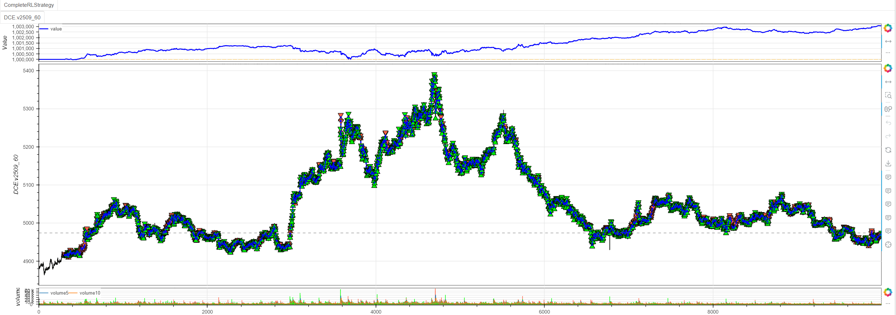
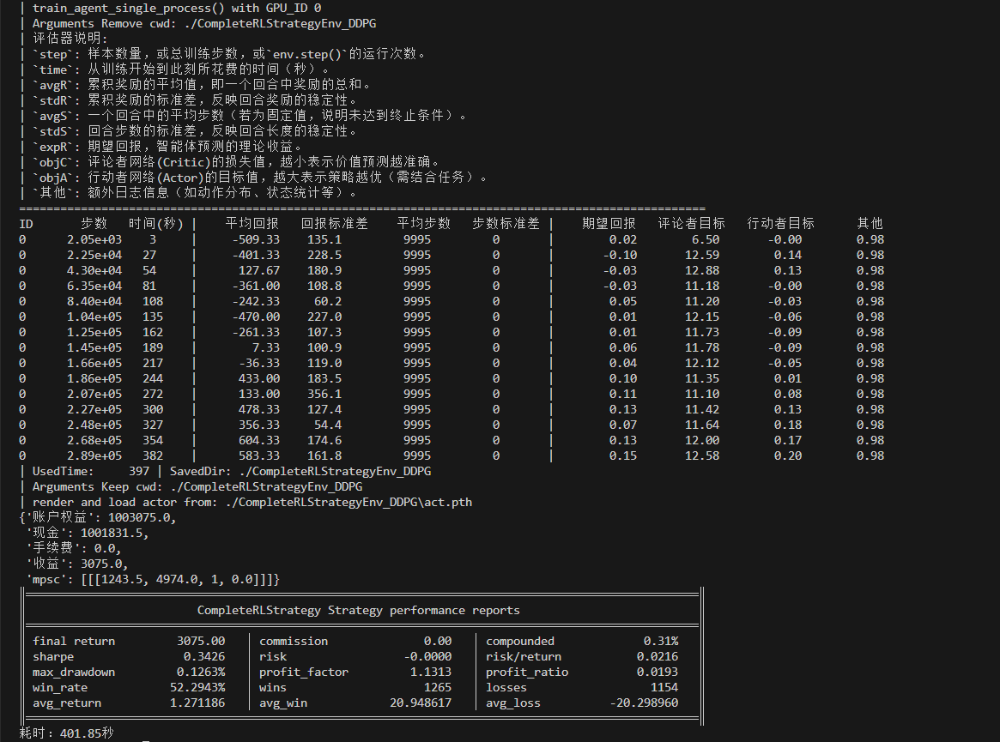
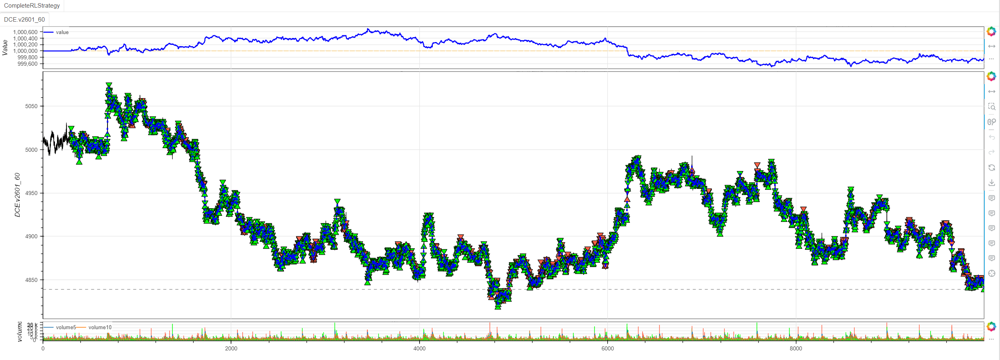
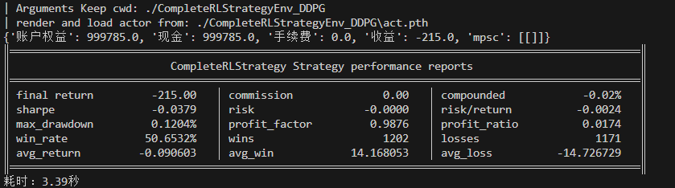

基于您提供的代码和训练结果，我来详细介绍minibt框架中AgentDDPG算法的应用并分析训练与验证结果。

## AgentDDPG算法在minibt中的应用

### 1. 算法配置
```python
self.set_model_params(
    Agents.AgentDDPG,
    train=True,
    break_step=3e5,
    action_dim=1,
    if_remove=True,
    if_discrete=False,
    Optim=Optim.OGSignMuon(),
    LrScheduler=LrScheduler.CosineAnnealingWarmRestarts(
        T_0=10, T_mult=2, eta_min=1e-6),
)
```

**关键参数说明：**
- **动作空间**：连续动作空间（`if_discrete=False`），输出[-1,1]的连续值
- **训练步数**：30万步（`break_step=3e5`）
- **优化器**：OGSignMuon优化器
- **学习率调度**：余弦退火热身重启策略

### 2. 状态特征设计
策略使用了丰富的技术指标：
- 多重移动平均线（3,5,8,13,21,34,55周期）
- Z-score标准化
- RSI相对强弱指标
- EBSW指标
- ATR平均真实波幅
- 标准差
- PVI正量指标
- CCI商品通道指标
- ADX平均趋向指标

### 3. 动作处理机制
```python
def _process_action(self, action):
    # 将连续动作[-1,1]映射到离散持仓周期[-3,-2,-1,1,2,3]
    # 正数表示多头持仓周期，负数表示空头持仓周期
```

## 训练结果分析

### 训练过程指标（第一张图）：
1. **训练稳定性**：
   - 平均步数始终为9995，标准差为0，说明环境未达到终止条件
   - 这可能表明最大步数设置过长，需要调整终止条件

2. **奖励表现**：
   - 平均回报从-509.33波动到583.33，波动较大
   - 训练后期出现正回报，显示策略有所改善

3. **网络训练状态**：
   - 评论者目标值（objC）在6.5-12.88范围，相对稳定
   - 行动者目标值（objA）从-0.00增长到0.20，显示策略在优化

## 验证结果对比分析

### 训练（盈利）：
```
最终收益：3,075.00（+0.31%）
夏普比率：0.3426
胜率：52.29%
盈亏比：1.1313
最大回撤：0.1263%
```


### 验证（亏损）：
```
最终收益：-215.00（-0.02%）
夏普比率：-0.0379
胜率：50.65%
盈亏比：0.9876
最大回撤：0.1204%
```


## 问题分析与改进建议

### 主要问题：
1. **策略不稳定性**：训练与验证结果差异显著，策略泛化能力不足
2. **训练效率**：30万步训练后性能仍不稳定
3. **动作空间设计**：离散化处理可能丢失连续动作的优势

### 改进建议：

1. **优化状态空间**：
```python
# 减少冗余指标，选择最具代表性的特征
def _setup_technical_indicators(self):
    self.ma_fast = self.data.close.sma(5)
    self.ma_slow = self.data.close.sma(20)
    self.rsi = self.data.close.rsi()
    self.atr = self.data.atr(14)
    self.volume_ma = self.data.volume.sma(10)
```

2. **改进奖励函数**：
```python
    # 加入风险调整奖励
    # 加入交易成本惩罚
```

3. **调整训练参数**：
```python
self.set_model_params(
    Agents.AgentDDPG,
    break_step=5e5,  # 增加训练步数
    gamma=0.99,      # 调整折扣因子
    tau=0.005,       # 目标网络更新参数
    batch_size=256,  # 调整批次大小
)
```

4. **增强数据预处理**：
```python
self.set_process_quant_features(
    normalize_method='standard',
    use_log_transform=True,
    handle_outliers="winsorize"
)
```

## 完整代码

```python
from minibt import *
from minibt.rl_utils import *


class CompleteRLStrategy(Strategy):
    rl = True

    def __init__(self):
        # 基础设置
        self.min_start_length = 300
        self.data = self.get_kline(LocalDatas.v2509_60_3)
        self.data.height = 500

        # 技术指标计算
        self._setup_technical_indicators()

        # 配置强化学习
        self._setup_rl_config()

        # 交易参数
        self._setup_trading_params()

    def _setup_technical_indicators(self):
        """设置技术指标"""
        self.ma1 = self.data.close.sma(3)
        self.ma2 = self.data.close.sma(5)
        self.ma3 = self.data.close.sma(8)
        self.ma4 = self.data.close.sma(13)
        self.ma5 = self.data.close.sma(21)
        self.ma6 = self.data.close.sma(34)
        self.ma7 = self.data.close.sma(55)
        self.zscore10 = self.data.close.zscore(10)
        self.zscore20 = self.data.close.zscore(20)
        self.rsi = self.data.close.rsi()
        self.ebsw = self.data.close.ebsw()
        self.atr1 = self.data.atr(10)
        self.atr2 = self.data.atr(20)
        self.std1 = self.data.close.stdev(10)
        self.std2 = self.data.close.stdev(20)
        self.pvi1 = self.data.pvi(10)
        self.pvi2 = self.data.pvi(20)
        self.cci1 = self.data.close.cci(10)
        self.cci2 = self.data.close.cci(20)
        self.adx1 = self.data.close.adx(10).iloc[:, 0]
        self.adx2 = self.data.close.adx(20).iloc[:, 0]

        self.btindicatordataset.isplot = False

        # 配置特征处理
        self.set_process_quant_features(
            normalize_method='robust',
            use_log_transform=True,
            handle_outliers="clip"
        )

        # 价格目标（用于奖励计算）
        # 多头未来1-3周期的收益
        self.long_prices = [
            self.data.pandas_object.close.diff().shift(-i).values
            for i in range(1, 4)
        ]
        # 空头未来1-3周期的收益
        self.short_prices = [-price for price in self.long_prices]

    def _setup_rl_config(self):
        """配置强化学习参数"""
        self.set_model_params(
            Agents.AgentDDPG,
            train=True,
            break_step=3e5,
            action_dim=1,
            if_remove=True,
            if_discrete=False,
            Optim=Optim.OGSignMuon(),
            LrScheduler=LrScheduler.CosineAnnealingWarmRestarts(
                T_0=10, T_mult=2, eta_min=1e-6),)
        # 调整步数限制,最后3根K线无未来收益，即倒数第四根K线训练结束
        self.max_step -= 4

    def _setup_trading_params(self):
        """设置交易参数"""
        self.hoding_day = 0  # 持仓周期
        self.last_action = 0  # 最后交易的动作
        self.data.price_tick = 1.0  # 最小波动单位1.
        self.data.volume_multiple = 5.0  # 最小乘数5.
        self.data.fixed_commission = .0  # 无手续费用

    def reset(self):
        """重置环境"""
        self.current_step = self.min_start_length
        self.pos = 0
        self.hoding_day = 0
        self.last_action = 0
        return self._get_observation(), {}

    def _get_observation(self):
        """获取观测状态"""
        obs = self.signal_features[
            self.current_step + 1 - self.window_size:
            self.current_step + 1
        ]
        if self.train:  # 有30%概率使用数据增强
            return self.data_enhancement(obs, rate=0.3)
        return obs.flatten()

    def _process_action(self, action):
        """处理动作"""
        # 将连续动作 [-1, 1] 映射到离散动作 [-3, -2, -1, 1, 2, 3]
        x = action[0]
        # 原区间
        x_min, x_max = -1, 1
        # 目标区间
        y_min, y_max = 0, 5

        # 首先线性映射到[1, 6]区间
        y = y_min + (x - x_min) * (y_max - y_min) / (x_max - x_min)

        # 处理边界情况，确保不会超出范围
        if y < 0:
            action = 0
        elif y > 5:
            action = 5
        else:
            # 四舍五入取整数
            action = round(y)
        action -= 3
        if action >= 0:
            return action+1
        return action  # 映射到[-3, -2, -1, 1, 2, 3]区间

    def step(self, action):
        """环境步进"""
        reward = 0.0
        processed_action = self._process_action(action)

        # 训练奖励计算
        if self.train:
            if processed_action > 0:
                reward = self.long_prices[processed_action -
                                          1][self.current_step]
            elif processed_action < 0:
                reward = self.short_prices[-processed_action -
                                           1][self.current_step]
        # 非训练时进行回测
        else:
            if self.data.position == 0:
                if processed_action > 0:
                    self.data.buy()
                    self.hoding_day = processed_action
                    self.last_action = processed_action
                else:
                    self.data.sell()
                    self.hoding_day = -processed_action
                    self.last_action = -processed_action
            elif self.data.position > 0:
                if processed_action > 0:
                    self.hoding_day = min(processed_action, self.hoding_day)
                self.hoding_day -= 1
                if self.hoding_day <= 0:
                    self.data.sell()
            else:
                if processed_action < 0:
                    self.hoding_day = min(-processed_action, self.hoding_day)
                self.hoding_day -= 1
                if self.hoding_day <= 0:
                    self.data.buy()

        # 更新状态
        self.current_step += 1
        done = self.current_step >= self.max_step

        return self._get_observation(), reward, done, False, {}


if __name__ == "__main__":
    # 创建并运行策略
    Bt().run()
```
## 总结

当前AgentDDPG策略在minibt框架中表现出一定的学习能力，但稳定性和泛化能力需要进一步提升。建议通过优化状态特征、改进奖励函数、调整超参数等方式来增强策略的鲁棒性。同时，考虑增加验证集的数量来更全面地评估策略性能。

> 风险提示：本文涉及的交易策略、代码示例均为技术演示、教学探讨，仅用于展示逻辑思路，绝不构成任何投资建议、操作指引或决策依据 。金融市场复杂多变，存在价格波动、政策调整、流动性等多重风险，历史表现不预示未来结果。任何交易决策均需您自主判断、独立承担责任 —— 若依据本文内容操作，盈亏后果概由自身承担。请务必充分评估风险承受能力，理性对待市场，谨慎做出投资选择。