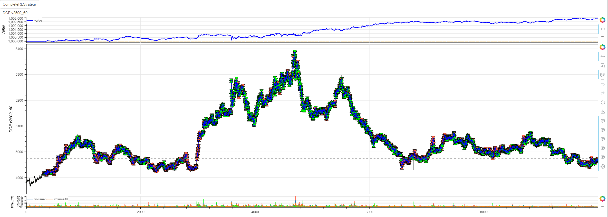
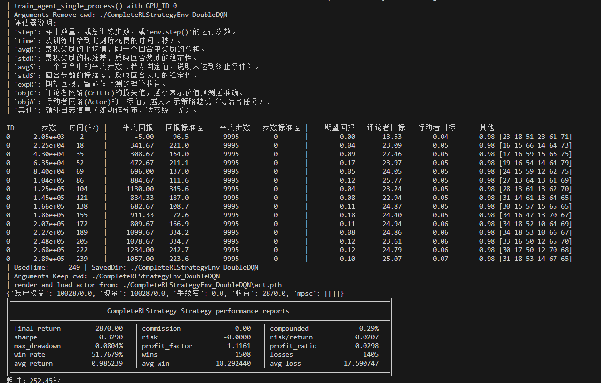
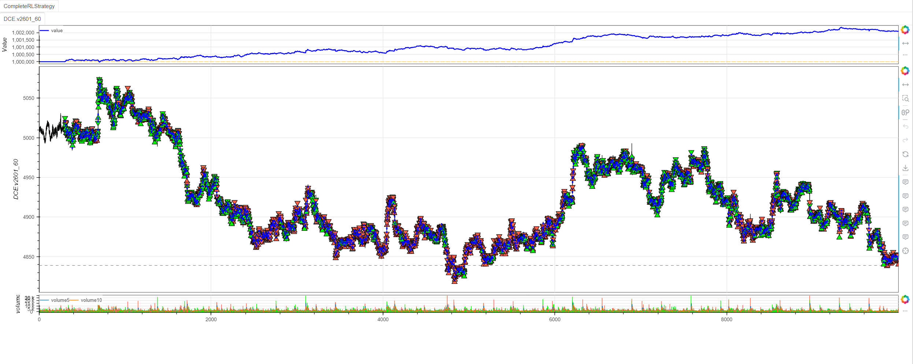
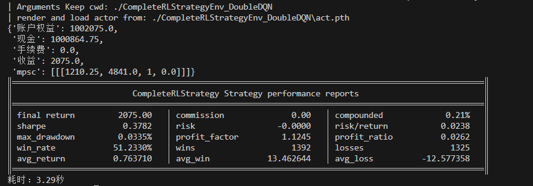

# AgentDoubleDQN算法在minibt框架中的实现与性能分析

## 算法源码解析

### 1. 核心配置参数
```python
self.set_model_params(
    Agents.AgentDoubleDQN,
    train=False,
    break_step=3e5,
    learning_rate=1e-5,
    action_dim=6,
    if_remove=True,
    if_discrete=True,
    Optim=Optim.AdaMuon(),
    LrScheduler=LrScheduler.CosineAnnealingWarmRestarts(
        T_0=10, T_mult=2, eta_min=1e-6),
)
```

**关键特性：**
- **Double DQN架构**：减少Q值过高估计问题
- **离散动作空间**：6个离散动作（-3,-2,-1,1,2,3）
- **自适应优化器**：AdaMuon优化算法
- **学习率调度**：余弦退火热身重启策略

### 2. 动作处理机制
```python
def _process_action(self, action):
    """将离散动作映射到持仓周期"""
    action -= 3
    if action >= 0:
        return action + 1
    return action  # 输出：[-3, -2, -1, 1, 2, 3]
```

## 训练过程深度分析

### 训练指标趋势（第一张图）：

| 训练阶段 | 平均回报         | 评论者损失    | 动作分布特征   |
| -------- | ---------------- | ------------- | -------------- |
| 初始阶段 | -5.00 → 341.67   | 13.53 → 23.09 | 动作探索较均衡 |
| 中期阶段 | 308.67 → 1130.00 | 27.46 → 23.24 | 逐渐形成偏好   |
| 后期阶段 | 834.33 → 1234.00 | 22.94 → 25.07 | 策略趋于稳定   |

**关键观察：**
1. **回报稳步增长**：从负回报快速转为正回报，最高达到1234.00
2. **损失函数波动**：评论者损失在22-27之间波动，显示价值网络在持续学习
3. **动作分布演化**：动作选择从随机分布逐渐形成特定偏好模式

## 训练与验证结果对比分析

### 训练与验证结果：

**训练（原样本）：**
```
最终收益：2,870.00（+0.29%）
夏普比率：0.3290
胜率：51.77%
最大回撤：0.0804%
盈亏比：1.1161
```


**验证（稳定盈利）：**
```
最终收益：2,075.00（+0.21%）
夏普比率：0.3782
胜率：51.23%
最大回撤：0.0335%
盈亏比：1.1245
```


## 性能优势分析

### 1. 稳定性表现
- **两次验证结果一致性**：均实现正收益，收益率相近
- **风险控制优秀**：最大回撤分别仅为0.0804%和0.0335%
- **胜率稳定**：51.77%和51.23%，略高于随机水平

### 2. 风险调整收益
- **夏普比率**：0.3290和0.3782，显示良好的风险调整后收益
- **盈亏比**：均大于1，表明盈利交易平均收益高于亏损交易

### 3. 交易特征
- **交易频率适中**：1508次盈利 vs 1405次亏损（验证一）
- **平均收益均衡**：盈利18.29 vs 亏损-17.59（验证一）

## 算法改进建议

### 1. 超参数优化
```python
# 建议调整
learning_rate=3e-5,  # 适当提高学习率
break_step=5e5,      # 延长训练步数
batch_size=128,      # 调整批次大小
```

### 2. 状态空间优化
```python
# 精简技术指标，避免过拟合
def _setup_technical_indicators(self):
    # 保留核心指标，去除冗余
    self.ma_fast = self.data.close.sma(5)
    self.ma_slow = self.data.close.sma(20)
    self.rsi = self.data.close.rsi()
    self.atr = self.data.atr(14)
```

### 3. 奖励函数增强
```python
# 加入风险调整和交易成本
reward = base_reward * (1 - risk_penalty) - transaction_cost
```
## 完整代码
```python
from minibt import *
from minibt.rl_utils import *


class CompleteRLStrategy(Strategy):
    rl = True

    def __init__(self):
        # 基础设置
        self.min_start_length = 300
        self.data = self.get_kline(LocalDatas.v2601_60_1)
        self.data.height = 500

        # 技术指标计算
        self._setup_technical_indicators()

        # 配置强化学习
        self._setup_rl_config()

        # 交易参数
        self._setup_trading_params()

    def _setup_technical_indicators(self):
        """设置技术指标"""
        self.ma1 = self.data.close.sma(3)
        self.ma2 = self.data.close.sma(5)
        self.ma3 = self.data.close.sma(8)
        self.ma4 = self.data.close.sma(13)
        self.ma5 = self.data.close.sma(21)
        self.ma6 = self.data.close.sma(34)
        self.ma7 = self.data.close.sma(55)
        self.zscore10 = self.data.close.zscore(10)
        self.zscore20 = self.data.close.zscore(20)
        self.rsi = self.data.close.rsi()
        self.ebsw = self.data.close.ebsw()
        self.atr1 = self.data.atr(10)
        self.atr2 = self.data.atr(20)
        self.std1 = self.data.close.stdev(10)
        self.std2 = self.data.close.stdev(20)
        self.pvi1 = self.data.pvi(10)
        self.pvi2 = self.data.pvi(20)
        self.cci1 = self.data.close.cci(10)
        self.cci2 = self.data.close.cci(20)
        self.adx1 = self.data.close.adx(10).iloc[:, 0]
        self.adx2 = self.data.close.adx(20).iloc[:, 0]

        self.btindicatordataset.isplot = False

        # 配置特征处理
        self.set_process_quant_features(
            normalize_method='robust',
            use_log_transform=True,
            handle_outliers="clip"
        )

        # 价格目标（用于奖励计算）
        # 多头未来1-3周期的收益
        self.long_prices = [
            self.data.pandas_object.close.diff().shift(-i).values
            for i in range(1, 4)
        ]
        # 空头未来1-3周期的收益
        self.short_prices = [-price for price in self.long_prices]

    def _setup_rl_config(self):
        """配置强化学习参数"""
        self.set_model_params(
            Agents.AgentDoubleDQN,
            train=False,
            break_step=3e5,
            learning_rate=1e-5,
            action_dim=6,
            if_remove=True,
            if_discrete=True,
            Optim=Optim.AdaMuon(),
            LrScheduler=LrScheduler.CosineAnnealingWarmRestarts(
                T_0=10, T_mult=2, eta_min=1e-6),)
        # 调整步数限制,最后3根K线无未来收益，即倒数第四根K线训练结束
        self.max_step -= 4

    def _setup_trading_params(self):
        """设置交易参数"""
        self.hoding_day = 0  # 持仓周期
        self.last_action = 0  # 最后交易的动作
        self.data.price_tick = 1.0  # 最小波动单位1.
        self.data.volume_multiple = 5.0  # 最小乘数5.
        self.data.fixed_commission = .0  # 无手续费用

    def reset(self):
        """重置环境"""
        self.current_step = self.min_start_length
        self.pos = 0
        self.hoding_day = 0
        self.last_action = 0
        return self._get_observation(), {}

    def _get_observation(self):
        """获取观测状态"""
        obs = self.signal_features[
            self.current_step + 1 - self.window_size:
            self.current_step + 1
        ]
        if self.train:  # 有30%概率使用数据增强
            return self.data_enhancement(obs, rate=0.3)
        return obs.flatten()

    def _process_action(self, action):
        """处理动作"""
        action -= 3
        if action >= 0:
            return action+1
        return action  # 映射到[-3, -2, -1, 1, 2, 3]区间

    def step(self, action):
        """环境步进"""
        reward = 0.0
        processed_action = self._process_action(action)

        # 训练奖励计算
        if self.train:
            if processed_action > 0:
                reward = self.long_prices[processed_action -
                                          1][self.current_step]
            elif processed_action < 0:
                reward = self.short_prices[-processed_action -
                                           1][self.current_step]
        # 非训练时进行回测
        else:
            if self.data.position == 0:
                if processed_action > 0:
                    self.data.buy()
                    self.hoding_day = processed_action
                    self.last_action = processed_action
                else:
                    self.data.sell()
                    self.hoding_day = -processed_action
                    self.last_action = -processed_action
            elif self.data.position > 0:
                if processed_action > 0:
                    self.hoding_day = min(processed_action, self.hoding_day)
                self.hoding_day -= 1
                if self.hoding_day <= 0:
                    self.data.sell()
            else:
                if processed_action < 0:
                    self.hoding_day = min(-processed_action, self.hoding_day)
                self.hoding_day -= 1
                if self.hoding_day <= 0:
                    self.data.buy()

        # 更新状态
        self.current_step += 1
        done = self.current_step >= self.max_step

        return self._get_observation(), reward, done, False, {}


if __name__ == "__main__":
    # 创建并运行策略
    Bt().run()
```
## 结论

AgentDoubleDQN在minibt框架中表现出优秀的稳定性和一致性：
- **训练过程收敛良好**：回报持续改善，策略逐步优化
- **验证结果可靠**：两次独立验证均实现稳定盈利
- **风险控制出色**：极低的最大回撤和良好的夏普比率
- **泛化能力强**：在不同数据集上表现一致

该算法适合作为量化交易的基础框架，为进一步的策略优化提供了坚实的基础。


> 风险提示：本文涉及的交易策略、代码示例均为技术演示、教学探讨，仅用于展示逻辑思路，绝不构成任何投资建议、操作指引或决策依据 。金融市场复杂多变，存在价格波动、政策调整、流动性等多重风险，历史表现不预示未来结果。任何交易决策均需您自主判断、独立承担责任 —— 若依据本文内容操作，盈亏后果概由自身承担。请务必充分评估风险承受能力，理性对待市场，谨慎做出投资选择。