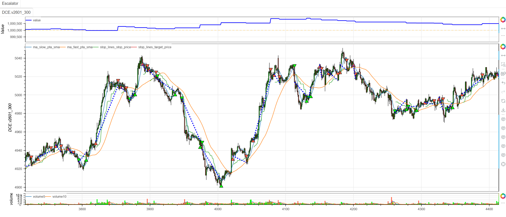
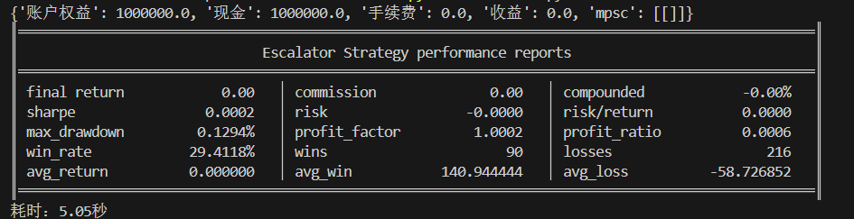

# **MiniBT量化交易之自动扶梯策略**

## 概述

自动扶梯策略（Escalator Strategy）是一种基于价格位置分析和移动平均线突破的独特趋势跟踪策略。该策略通过分析K线在价格范围内的相对位置变化，结合双移动平均线系统，捕捉市场从弱势转为强势（或强势转为弱势）的关键转折点。策略名称"自动扶梯"形象地描述了价格在趋势通道中逐步上升或下降的过程。

## 原策略分析

### 策略核心逻辑

1. **双均线通道构建**：通过快慢移动平均线构建动态趋势通道
2. **K线位置分析**：计算收盘价在K线范围内的相对位置
3. **位置转换识别**：捕捉价格从弱势区域向强势区域（或反向）的转换
4. **突破确认机制**：结合均线突破和位置转换确认趋势起始

### 策略参数

- `MA_SLOW`：慢速移动平均线周期 (默认: 8)
- `MA_FAST`：快速移动平均线周期 (默认: 40)

## MiniBT 转换实现

### 策略类结构

```python
class Escalator(Strategy):
    """https://www.shinnytech.com/articles/trading-strategy/trend-following/escalator-strategy"""
    params = dict(MA_SLOW=8, MA_FAST=40)
```

### 核心方法实现

#### 1. 基础数据准备

```python
def __init__(self):
    self.min_start_length = 300
    self.data = self.get_kline(LocalDatas.v2601_300, height=500)
    high, low, close = self.data.loc[:, FILED.HLC].to_lines()
```

#### 2. 双均线系统构建

```python
self.ma_slow = close.sma(self.params.MA_SLOW, overlap=True)
self.ma_fast = close.sma(self.params.MA_FAST, overlap=True)
```

#### 3. K线位置计算

```python
kl_range_cur = (close.shift(2)-low.shift(2)).ZeroDivision(high.shift(2)-low.shift(2))
kl_range_pre = (close.shift(3)-low.shift(3)).ZeroDivision(high.shift(3)-low.shift(3))
```

#### 4. 均线极值计算

```python
kl_max = self.ma_slow.tqfunc.max(self.ma_fast)
kl_min = self.ma_slow.tqfunc.min(self.ma_fast)
```

#### 5. 交易信号定义

```python
self.long_signal = close.shift() > kl_max
self.long_signal &= kl_range_pre <= 0.25
self.long_signal &= kl_range_cur >= 0.75

self.short_signal = close.shift() < kl_min
self.short_signal &= kl_range_pre >= 0.75
self.short_signal &= kl_range_cur <= 0.25
```

## 转换技术细节

### 1. K线位置计算原理

K线位置指标计算公式：
```
位置 = (收盘价 - 最低价) / (最高价 - 最低价)
```

位置值的含义：
- **0-0.25**：弱势区域，收盘位于K线底部
- **0.25-0.75**：平衡区域，收盘位于K线中部  
- **0.75-1.0**：强势区域，收盘位于K线顶部

### 2. 时间偏移处理

使用shift方法处理历史数据：
- `shift(1)`：前一根K线
- `shift(2)`：前两根K线  
- `shift(3)`：前三根K线

### 3. 均线极值计算

```python
kl_max = self.ma_slow.tqfunc.max(self.ma_fast)  # 双均线上轨
kl_min = self.ma_slow.tqfunc.min(self.ma_fast)  # 双均线下轨
```

### 4. 三重条件信号机制

**多头信号条件**：
1. 价格突破双均线上轨（趋势突破）
2. 前第二根K线位置≤0.25（弱势起始）
3. 前第一根K线位置≥0.75（强势转换）

**空头信号条件**：
1. 价格跌破双均线下轨（趋势突破）  
2. 前第二根K线位置≥0.75（强势起始）
3. 前第一根K线位置≤0.25（弱势转换）

## 使用示例

```python
from minibt import *

class Escalator(Strategy):
    params = dict(MA_SLOW=8, MA_FAST=40)

    def __init__(self):
        self.min_start_length = 300
        self.data = self.get_kline(LocalDatas.v2601_300, height=500)
        high, low, close = self.data.loc[:, FILED.HLC].to_lines()
        self.ma_slow = close.sma(self.params.MA_SLOW, overlap=True)
        self.ma_fast = close.sma(self.params.MA_FAST, overlap=True)
        kl_range_cur = (close.shift(2)-low.shift(2)).ZeroDivision(high.shift(2)-low.shift(2))
        kl_range_pre = (close.shift(3)-low.shift(3)).ZeroDivision(high.shift(3)-low.shift(3))
        kl_max = self.ma_slow.tqfunc.max(self.ma_fast)
        kl_min = self.ma_slow.tqfunc.min(self.ma_fast)
        self.long_signal = close.shift() > kl_max
        self.long_signal &= kl_range_pre <= 0.25
        self.long_signal &= kl_range_cur >= 0.75
        self.short_signal = close.shift() < kl_min
        self.short_signal &= kl_range_pre >= 0.75
        self.short_signal &= kl_range_cur <= 0.25
        self.long_signal.isplot = False
        self.short_signal.isplot = False

    def next(self):
        if not self.data.position:
            if self.long_signal.new:
                self.data.buy(stop=BtStop.SegmentationTracking)
            elif self.short_signal.new:
                self.data.sell(stop=BtStop.SegmentationTracking)

if __name__ == "__main__":
    Bt().run()
```


## 参数说明

1. **MA_SLOW (慢速均线周期)**：
   - 控制主要趋势的识别周期
   - 提供趋势的稳定性基准
   - 默认值8适合短期趋势分析

2. **MA_FAST (快速均线周期)**：
   - 控制次要趋势的识别周期
   - 提供趋势的动态边界
   - 默认值40适合中期趋势通道

## 算法原理详解

### 1. 自动扶梯概念解析

策略名称"自动扶梯"形象地描述了价格运动：

- **上升扶梯**：价格从弱势区域逐步攀升至强势区域
- **下降扶梯**：价格从强势区域逐步下滑至弱势区域
- **扶梯转换**：在关键位置发生趋势方向改变

### 2. 位置转换心理学

K线位置转换反映市场心理变化：

**多头转换过程**：
1. 弱势区域（≤0.25）：卖方主导，市场悲观
2. 强势转换（≥0.75）：买方发力，市场转乐观
3. 突破确认：新趋势确立

**空头转换过程**：
1. 强势区域（≥0.75）：买方主导，市场乐观  
2. 弱势转换（≤0.25）：卖方发力，市场转悲观
3. 跌破确认：新趋势确立

### 3. 均线通道作用

双均线构建动态通道：
- **上轨**：阻力区域，突破表示强势
- **下轨**：支撑区域，跌破表示弱势
- **通道宽度**：反映趋势的强度和市场波动

### 4. 时间序列分析

策略采用连续三根K线分析：
- **T-2**：起始状态确认
- **T-1**：转换过程确认  
- **T-0**：突破结果确认

## 策略应用场景

### 1. 趋势反转识别

利用位置转换捕捉趋势反转点：

```python
def trend_reversal_detection(close, high, low, ma_slow, ma_fast, confirmation_bars=2):
    # 计算K线位置
    kl_position = (close - low).ZeroDivision(high - low)
    
    # 均线通道
    upper_band = ma_slow.tqfunc.max(ma_fast)
    lower_band = ma_slow.tqfunc.min(ma_fast)
    
    # 多头反转模式
    bull_reversal = (kl_position.shift(2) <= 0.25) & (kl_position.shift(1) >= 0.75) & (close.shift() > upper_band)
    # 空头反转模式  
    bear_reversal = (kl_position.shift(2) >= 0.75) & (kl_position.shift(1) <= 0.25) & (close.shift() < lower_band)
    
    # 连续确认
    bull_confirmed = bull_reversal & (close > close.rolling(confirmation_bars).max())
    bear_confirmed = bear_reversal & (close < close.rolling(confirmation_bars).min())
    
    return bull_confirmed, bear_confirmed
```

### 2. 位置强度分析

基于K线位置分析趋势强度：

```python
def position_strength_analysis(close, high, low, lookback=10):
    # K线位置计算
    kl_position = (close - low).ZeroDivision(high - low)
    
    # 位置移动平均
    position_ma = kl_position.rolling(lookback).mean()
    
    # 位置波动率
    position_volatility = kl_position.rolling(lookback).std()
    
    # 强度分类
    strong_bullish = (kl_position > 0.8) & (kl_position > position_ma)
    weak_bullish = (kl_position > 0.5) & (kl_position <= position_ma)
    weak_bearish = (kl_position < 0.5) & (kl_position >= position_ma)
    strong_bearish = (kl_position < 0.2) & (kl_position < position_ma)
    
    return kl_position, position_ma, strong_bullish, weak_bullish, weak_bearish, strong_bearish
```

### 3. 多时间框架扶梯确认

```python
def multi_timeframe_escalator_confirmation(daily_escalator, hourly_escalator):
    # 各时间框架趋势方向
    daily_trend = daily_escalator.close > daily_escalator.kl_max
    hourly_trend = hourly_escalator.close > hourly_escalator.kl_max
    
    # 位置转换一致性
    daily_position_strong = (daily_escalator.kl_range_cur >= 0.75)
    hourly_position_strong = (hourly_escalator.kl_range_cur >= 0.75)
    
    # 强确认信号
    strong_bullish_confirmation = daily_trend & hourly_trend & daily_position_strong & hourly_position_strong
    strong_bearish_confirmation = (~daily_trend) & (~hourly_trend) & (~daily_position_strong) & (~hourly_position_strong)
    
    return strong_bullish_confirmation, strong_bearish_confirmation
```

## 风险管理建议

### 1. 基于位置强度的动态仓位

```python
def escalator_position_sizing(kl_position_cur, kl_position_pre, base_size=1):
    # 计算位置转换强度
    position_change = abs(kl_position_cur - kl_position_pre)
    
    # 根据转换强度调整仓位
    if position_change > 0.6:
        # 强转换：正常仓位
        size_multiplier = 1.0
    elif position_change > 0.4:
        # 中等转换：适度仓位
        size_multiplier = 0.7
    else:
        # 弱转换：保守仓位
        size_multiplier = 0.5
    
    return base_size * size_multiplier
```

### 2. 扶梯通道止损策略

```python
def escalator_channel_stop_loss(close, kl_max, kl_min, position_type, atr):
    if position_type == 'long':
        # 多头止损：价格跌破双均线下轨或回撤超过ATR
        stop_condition1 = close < kl_min
        stop_condition2 = close < (close.rolling(10).max() - atr)
        # 或位置重回弱势区域
        stop_condition3 = ((close - low).ZeroDivision(high - low)) < 0.3
        return stop_condition1 | stop_condition2 | stop_condition3
    else:
        # 空头止损：价格突破双均线上轨或反弹超过ATR
        stop_condition1 = close > kl_max
        stop_condition2 = close > (close.rolling(10).min() + atr)
        # 或位置重回强势区域
        stop_condition3 = ((close - low).ZeroDivision(high - low)) > 0.7
        return stop_condition1 | stop_condition2 | stop_condition3
```

## 性能优化建议

### 1. 自适应参数调整

根据市场波动率调整均线参数：

```python
def adaptive_escalator_params(close, volatility_window=20):
    # 计算市场波动率
    volatility = close.rolling(volatility_window).std() / close.rolling(volatility_window).mean()
    
    # 自适应参数
    if volatility > 0.025:
        # 高波动率市场：使用更长周期减少噪声
        return 12, 50
    elif volatility < 0.01:
        # 低波动率市场：使用更短周期提高敏感性
        return 5, 30
    else:
        # 正常市场条件：默认参数
        return 8, 40
```

### 2. 信号质量过滤

基于成交量和其他指标过滤信号：

```python
def filtered_escalator_signals(close, high, low, ma_slow, ma_fast, volume, rsi_period=14):
    # 基础扶梯信号
    kl_range_cur = (close.shift(2)-low.shift(2)).ZeroDivision(high.shift(2)-low.shift(2))
    kl_range_pre = (close.shift(3)-low.shift(3)).ZeroDivision(high.shift(3)-low.shift(3))
    kl_max = ma_slow.tqfunc.max(ma_fast)
    kl_min = ma_slow.tqfunc.min(ma_fast)
    
    base_long = (close.shift() > kl_max) & (kl_range_pre <= 0.25) & (kl_range_cur >= 0.75)
    base_short = (close.shift() < kl_min) & (kl_range_pre >= 0.75) & (kl_range_cur <= 0.25)
    
    # 过滤条件
    volume_filter = volume > volume.rolling(20).mean() * 1.2
    rsi_filter = (close.rsi(rsi_period) > 50) if base_long.any() else (close.rsi(rsi_period) < 50)
    volatility_filter = close.rolling(10).std() / close.rolling(10).mean() > 0.01
    
    filtered_long = base_long & volume_filter & rsi_filter & volatility_filter
    filtered_short = base_short & volume_filter & rsi_filter & volatility_filter
    
    return filtered_long, filtered_short
```

## 扩展功能

### 1. 扶梯动量指标

基于位置变化创建动量指标：

```python
def escalator_momentum_indicator(close, high, low, lookback=5):
    # K线位置计算
    kl_position = (close - low).ZeroDivision(high - low)
    
    # 位置动量
    position_momentum = kl_position.diff(lookback)
    
    # 动量加速度
    momentum_acceleration = position_momentum.diff(3)
    
    # 动量强度分类
    strong_positive_momentum = (position_momentum > 0.1) & (momentum_acceleration > 0)
    weak_positive_momentum = (position_momentum > 0) & (momentum_acceleration <= 0)
    weak_negative_momentum = (position_momentum < 0) & (momentum_acceleration >= 0)
    strong_negative_momentum = (position_momentum < -0.1) & (momentum_acceleration < 0)
    
    return position_momentum, momentum_acceleration, strong_positive_momentum, weak_positive_momentum, weak_negative_momentum, strong_negative_momentum
```

### 2. 扶梯模式识别

识别不同的扶梯运行模式：

```python
def escalator_pattern_recognition(close, high, low, ma_slow, ma_fast, lookback=20):
    # 计算基本指标
    kl_position = (close - low).ZeroDivision(high - low)
    kl_max = ma_slow.tqfunc.max(ma_fast)
    kl_min = ma_slow.tqfunc.min(ma_fast)
    
    # 扶梯运行模式
    steady_uptrend = (close > kl_max) & (kl_position.rolling(5).min() > 0.6)
    steady_downtrend = (close < kl_min) & (kl_position.rolling(5).max() < 0.4)
    
    # 扶梯转换模式
    escalator_up = (kl_position.shift(2) <= 0.25) & (kl_position.shift(1) >= 0.75) & (close.shift() > kl_max)
    escalator_down = (kl_position.shift(2) >= 0.75) & (kl_position.shift(1) <= 0.25) & (close.shift() < kl_min)
    
    # 扶梯震荡模式
    escalator_sideways = (kl_position.between(0.3, 0.7)).rolling(10).sum() >= 8
    
    return steady_uptrend, steady_downtrend, escalator_up, escalator_down, escalator_sideways
```

## 总结

自动扶梯策略通过创新的K线位置分析和双均线通道突破机制，为交易者提供了一个独特而有效的趋势转换识别工具。该策略关注价格在K线范围内的相对位置变化，结合趋势通道突破，在捕捉趋势起始点的同时提供高可靠性的交易信号。

转换过程中，我们完整实现了自动扶梯策略的核心算法，包括K线位置计算、双均线通道构建、位置转换识别和突破确认机制。通过MiniBT框架的实现，用户可以在回测系统中充分利用这一创新的趋势分析工具。

自动扶梯策略特别适用于：
- 趋势转换点的早期识别
- 价格位置变化的量化分析
- 趋势强度的动态评估
- 多时间框架趋势确认

该策略的转换展示了如何将复杂的价格位置分析转换为MiniBT框架可用的交易策略，为其他基于价格行为分析的策略开发提供了重要参考。自动扶梯策略的独特视角和可靠信号生成机制使其成为趋势交易者的有力工具。

> 风险提示：本文涉及的交易策略、代码示例均为技术演示、教学探讨，仅用于展示逻辑思路，绝不构成任何投资建议、操作指引或决策依据 。金融市场复杂多变，存在价格波动、政策调整、流动性等多重风险，历史表现不预示未来结果。任何交易决策均需您自主判断、独立承担责任 —— 若依据本文内容操作，盈亏后果概由自身承担。请务必充分评估风险承受能力，理性对待市场，谨慎做出投资选择。