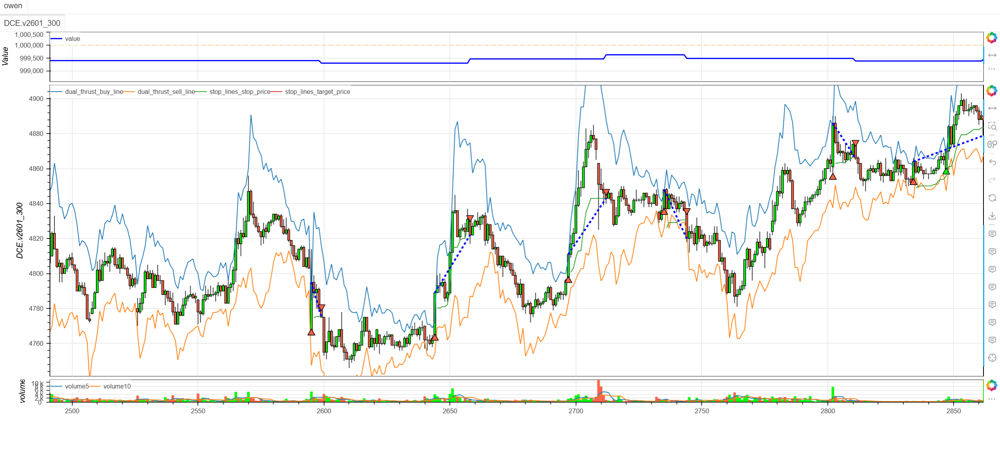
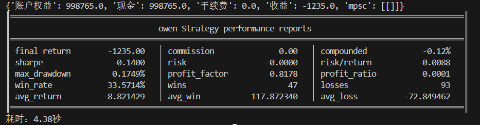

# **MiniBT量化交易之Dual Thrust策略**

## 概述

Dual Thrust（双推力）策略是由Michael Chalek开发的一种经典的突破交易系统，在期货和外汇市场中广泛应用。该策略通过动态计算前N日的价格波动范围，结合开盘价构建上下轨道，在价格突破轨道时产生交易信号。Dual Thrust以其简洁的规则和良好的适应性成为量化交易中的经典策略之一。

## 原策略分析

### 策略核心逻辑

1. **动态波动范围计算**：基于前N日价格极值计算市场波动幅度
2. **双轨道构建**：通过开盘价加减波动范围构建上下交易轨道
3. **突破信号生成**：价格突破上轨做多，突破下轨做空
4. **对称参数设计**：上下轨使用相同的波动系数，保持策略对称性

### 策略参数

- `NDAY`：波动范围计算周期 (默认: 14)
- `K1`：上轨波动系数 (默认: 0.6)
- `K2`：下轨波动系数 (默认: 0.6)

## MiniBT 转换实现

### 指标类结构

```python
class DualThrust(BtIndicator):
    """https://www.shinnytech.com/articles/trading-strategy/trend-following/dual-thrust"""
    params = dict(NDAY=14, K1=0.6, K2=0.6)
    isplot = dict(long_signal=False, short_signal=False)
    overlap = True
```

### 核心方法实现

#### 1. 历史极值计算

```python
def next(self):
    HH = self.high.tqfunc.hhv(self.params.NDAY).shift()
    HC = self.close.tqfunc.hhv(self.params.NDAY).shift()
    LC = self.close.tqfunc.llv(self.params.NDAY).shift()
    LL = self.low.tqfunc.llv(self.params.NDAY).shift()
```

#### 2. 波动范围计算

```python
range = (HH - LC).tqfunc.max(HC - LL)
```

#### 3. 交易轨道构建

```python
buy_line = self.open + range * self.params.K1  # 上轨
sell_line = self.open - range * self.params.K2  # 下轨
```

#### 4. 突破信号生成

```python
long_signal = self.close.cross_up(buy_line)
short_signal = self.close.cross_down(sell_line)
```

## 转换技术细节

### 1. 极值计算说明

使用历史数据计算极值：
- `HH`：前N日最高价的最高值
- `HC`：前N日收盘价的最高值  
- `LC`：前N日收盘价的最低值
- `LL`：前N日最低价的最低值

### 2. 波动范围创新计算

Dual Thrust的核心创新在于波动范围计算：
```
range = max(HH - LC, HC - LL)
```

这种设计能够：
- 捕捉更全面的市场波动特征
- 避免单一极值计算的局限性
- 提供更稳定的波动率估计

### 3. 动态轨道构建

基于开盘价构建交易轨道：
```
上轨 = 开盘价 + K1 × range
下轨 = 开盘价 - K2 × range
```

### 4. 突破信号机制

使用交叉检测方法：
- `cross_up`：价格上穿上轨，产生多头信号
- `cross_down`：价格下穿下轨，产生空头信号

## 使用示例

```python
from minibt import *

class DualThrust(BtIndicator):
    params = dict(NDAY=14, K1=0.6, K2=0.6)
    isplot = dict(long_signal=False, short_signal=False)
    overlap = True

    def next(self):
        HH = self.high.tqfunc.hhv(self.params.NDAY).shift()
        HC = self.close.tqfunc.hhv(self.params.NDAY).shift()
        LC = self.close.tqfunc.llv(self.params.NDAY).shift()
        LL = self.low.tqfunc.llv(self.params.NDAY).shift()
        range = (HH - LC).tqfunc.max(HC - LL)
        buy_line = self.open + range * self.params.K1
        sell_line = self.open - range * self.params.K2
        long_signal = self.close.cross_up(buy_line)
        short_signal = self.close.cross_down(sell_line)
        return buy_line, sell_line, long_signal, short_signal

class owen(Strategy):
    def __init__(self):
        self.min_start_length = 300
        self.data = self.get_kline(LocalDatas.v2601_300, height=500)
        self.dual_thrust = DualThrust(self.data)

    def next(self):
        if not self.data.position:
            if self.dual_thrust.long_signal.new:
                self.data.buy(stop=BtStop.SegmentationTracking)
            elif self.dual_thrust.short_signal.new:
                self.data.sell(stop=BtStop.SegmentationTracking)

if __name__ == "__main__":
    Bt().run()
```


## 参数说明

1. **NDAY (计算周期)**：
   - 控制波动范围的历史回顾窗口
   - 影响轨道宽度的稳定性
   - 默认值14提供适中的波动率视角

2. **K1 (上轨系数)**：
   - 控制上轨相对于波动范围的位置
   - 较小值产生更窄的上轨，信号更敏感
   - 默认值0.6平衡敏感性和可靠性

3. **K2 (下轨系数)**：
   - 控制下轨相对于波动范围的位置
   - 与K1配合保持策略的对称性
   - 默认值0.6提供对称的交易机会

## 算法原理详解

### 1. 波动范围计算哲学

Dual Thrust的波动范围计算体现了一种平衡思想：

- **HH - LC**：衡量从最低收盘到最高价的极端波动
- **HC - LL**：衡量从最低价到最高收盘的极端波动
- **取最大值**：确保捕捉最坏情况下的波动幅度

### 2. 开盘基准的重要性

以开盘价为基准构建轨道：
- 避免使用收盘价带来的未来函数问题
- 每个交易日从相同的起点开始
- 提供清晰的日内交易基准

### 3. 对称参数设计

K1和K2通常设置为相同值：
- 保持多头和空头机会的对称性
- 适应市场的多空平衡特性
- 简化参数优化过程

### 4. 动态适应机制

策略的自适应特性：
- 波动率上升时轨道自动变宽
- 波动率下降时轨道自动收窄
- 适应不同市场环境的变化

## 策略应用场景

### 1. 日内突破交易

利用Dual Thrust进行日内突破捕捉：

```python
def intraday_breakout_enhancement(buy_line, sell_line, close, volume, time_filter=True):
    # 基础突破信号
    base_long = close.cross_up(buy_line)
    base_short = close.cross_down(sell_line)
    
    # 成交量确认
    volume_confirmation = volume > volume.rolling(20).mean() * 1.2
    
    # 时间过滤（避免尾盘交易）
    if time_filter:
        time_condition = self.data.time < "14:30"
    else:
        time_condition = True
    
    # 增强信号
    enhanced_long = base_long & volume_confirmation & time_condition
    enhanced_short = base_short & volume_confirmation & time_condition
    
    return enhanced_long, enhanced_short
```

### 2. 波动率状态识别

基于range值分析市场波动状态：

```python
def volatility_regime_detection(range_value, close, lookback=50):
    # 波动率百分位
    volatility_percentile = range_value.rank(lookback) / lookback
    
    # 波动率状态分类
    high_volatility = volatility_percentile > 0.7
    normal_volatility = (volatility_percentile >= 0.3) & (volatility_percentile <= 0.7)
    low_volatility = volatility_percentile < 0.3
    
    # 波动率趋势
    volatility_trend = range_value.rolling(10).mean().diff(5) > 0
    
    return high_volatility, normal_volatility, low_volatility, volatility_trend
```

### 3. 自适应参数调整

根据波动率状态动态调整K值：

```python
def adaptive_k_params(range_value, close, lookback=50):
    # 计算波动率状态
    volatility_ratio = range_value / close
    avg_volatility = volatility_ratio.rolling(lookback).mean()
    
    # 自适应K值
    if volatility_ratio > avg_volatility * 1.5:
        # 高波动率：使用更保守的K值
        return 0.5, 0.5
    elif volatility_ratio < avg_volatility * 0.7:
        # 低波动率：使用更激进的K值
        return 0.7, 0.7
    else:
        # 正常波动率：默认K值
        return 0.6, 0.6
```

## 风险管理建议

### 1. 基于波动率的动态仓位

```python
def dual_thrust_position_sizing(range_value, close, base_size=1):
    # 标准化波动率
    normalized_volatility = range_value / close
    
    # 波动率百分位
    vol_percentile = normalized_volatility.rolling(50).rank() / 50
    
    # 根据波动率调整仓位
    if vol_percentile > 0.8:
        # 高波动率：减小仓位
        size_multiplier = 0.7
    elif vol_percentile < 0.2:
        # 低波动率：正常仓位
        size_multiplier = 1.0
    else:
        # 中等波动率：适度仓位
        size_multiplier = 0.85
    
    return base_size * size_multiplier
```

### 2. Dual Thrust止损策略

```python
def dual_thrust_stop_loss(buy_line, sell_line, position_type, close, atr):
    if position_type == 'long':
        # 多头止损：价格跌破下轨或回撤超过1倍ATR
        stop_condition1 = close < sell_line
        stop_condition2 = close < (close.rolling(5).max() - atr)
        # 或突破失败（价格重回轨道内）
        stop_condition3 = close < buy_line
        return stop_condition1 | stop_condition2 | stop_condition3
    else:
        # 空头止损：价格突破上轨或反弹超过1倍ATR
        stop_condition1 = close > buy_line
        stop_condition2 = close > (close.rolling(5).min() + atr)
        # 或突破失败（价格重回轨道内）
        stop_condition3 = close > sell_line
        return stop_condition1 | stop_condition2 | stop_condition3
```

## 性能优化建议

### 1. 动态参数优化

根据市场状态自动优化参数：

```python
def dynamic_parameter_optimization(close, high, low, volume, optimization_window=100):
    best_sharpe = -999
    best_params = (14, 0.6, 0.6)
    
    # 参数搜索空间
    n_days = [10, 14, 20]
    k_values = [0.4, 0.5, 0.6, 0.7]
    
    for n in n_days:
        for k1 in k_values:
            for k2 in k_values:
                # 计算该参数下的模拟收益
                returns = calculate_strategy_returns(close, high, low, n, k1, k2)
                if len(returns) > 0:
                    sharpe = returns.mean() / returns.std() if returns.std() > 0 else 0
                    if sharpe > best_sharpe:
                        best_sharpe = sharpe
                        best_params = (n, k1, k2)
    
    return best_params
```

### 2. 信号质量过滤

基于多维度指标过滤假突破：

```python
def filtered_dual_thrust_signals(buy_line, sell_line, close, volume, rsi_period=14, adx_period=14):
    # 基础突破信号
    base_long = close.cross_up(buy_line)
    base_short = close.cross_down(sell_line)
    
    # 过滤条件
    volume_filter = volume > volume.rolling(20).mean() * 1.1
    rsi_filter = (close.rsi(rsi_period) > 30) & (close.rsi(rsi_period) < 70)
    adx_filter = close.adx(adx_period) > 25  # 趋势强度过滤
    
    # 价格动量确认
    momentum_filter = close.diff(3) > 0 if base_long.any() else close.diff(3) < 0
    
    filtered_long = base_long & volume_filter & rsi_filter & adx_filter & momentum_filter
    filtered_short = base_short & volume_filter & rsi_filter & adx_filter & momentum_filter
    
    return filtered_long, filtered_short
```

## 扩展功能

### 1. 多时间框架Dual Thrust

```python
def multi_timeframe_dual_thrust(daily_dt, hourly_dt, four_hour_dt):
    # 各时间框架轨道位置
    daily_position = (daily_dt.close > daily_dt.buy_line) | (daily_dt.close < daily_dt.sell_line)
    hourly_position = (hourly_dt.close > hourly_dt.buy_line) | (hourly_dt.close < hourly_dt.sell_line)
    four_hour_position = (four_hour_dt.close > four_hour_dt.buy_line) | (four_hour_dt.close < four_hour_dt.sell_line)
    
    # 突破一致性
    breakout_alignment = daily_position.astype(int) + hourly_position.astype(int) + four_hour_position.astype(int)
    
    # 强突破确认
    strong_bullish_breakout = (breakout_alignment == 3) & (hourly_dt.close.cross_up(hourly_dt.buy_line))
    strong_bearish_breakout = (breakout_alignment == -3) & (hourly_dt.close.cross_down(hourly_dt.sell_line))
    
    return strong_bullish_breakout, strong_bearish_breakout
```

### 2. Dual Thrust通道系统

基于Dual Thrust构建更复杂的通道：

```python
def enhanced_dual_thrust_channels(high, low, close, open, n_day=14, k1=0.6, k2=0.6):
    # 标准Dual Thrust轨道
    HH = high.tqfunc.hhv(n_day).shift()
    HC = close.tqfunc.hhv(n_day).shift()
    LC = close.tqfunc.llv(n_day).shift()
    LL = low.tqfunc.llv(n_day).shift()
    range_val = (HH - LC).tqfunc.max(HC - LL)
    
    buy_line = open + range_val * k1
    sell_line = open - range_val * k2
    
    # 扩展轨道（更宽松的突破确认）
    buy_line_wide = open + range_val * (k1 + 0.2)
    sell_line_wide = open - range_val * (k2 + 0.2)
    
    # 收缩轨道（更严格的突破确认）
    buy_line_tight = open + range_val * (k1 - 0.2)
    sell_line_tight = open - range_val * (k2 - 0.2)
    
    # 轨道突破强度
    breakout_strength = (close - buy_line) / range_val if close > buy_line else (sell_line - close) / range_val
    
    return (buy_line, sell_line, buy_line_wide, sell_line_wide, 
            buy_line_tight, sell_line_tight, breakout_strength)
```

## 总结

Dual Thrust策略通过简洁而有效的波动范围计算和动态轨道构建，为交易者提供了一个经典且实用的突破交易系统。该策略结合了历史波动率分析和开盘基准定位，在保持规则简单性的同时提供可靠的突破信号。

转换过程中，我们完整实现了Dual Thrust策略的核心算法，包括历史极值计算、波动范围确定、轨道构建和突破检测。通过MiniBT框架的实现，用户可以在回测系统中充分利用这一经典突破策略。

Dual Thrust策略特别适用于：
- 趋势市场的突破交易
- 波动率环境的自适应交易
- 日内突破机会的捕捉
- 多时间框架突破确认

该策略的转换展示了如何将经典突破策略转换为MiniBT框架可用的交易系统，为其他突破类策略的开发提供了重要参考。Dual Thrust策略的简洁性和有效性使其成为突破交易者的经典工具。

> 风险提示：本文涉及的交易策略、代码示例均为技术演示、教学探讨，仅用于展示逻辑思路，绝不构成任何投资建议、操作指引或决策依据 。金融市场复杂多变，存在价格波动、政策调整、流动性等多重风险，历史表现不预示未来结果。任何交易决策均需您自主判断、独立承担责任 —— 若依据本文内容操作，盈亏后果概由自身承担。请务必充分评估风险承受能力，理性对待市场，谨慎做出投资选择。