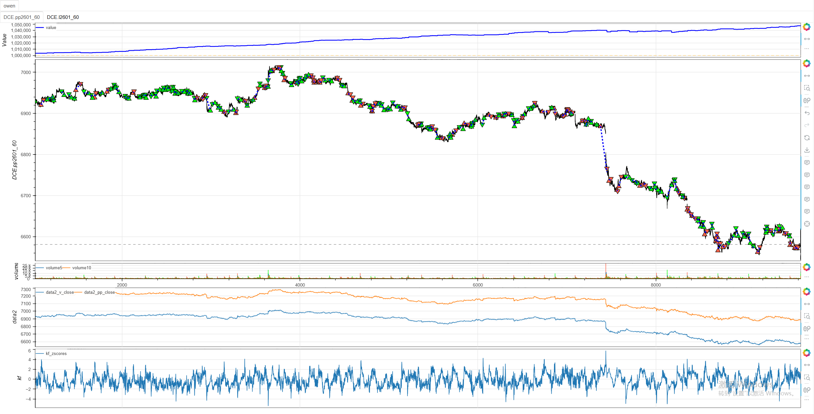
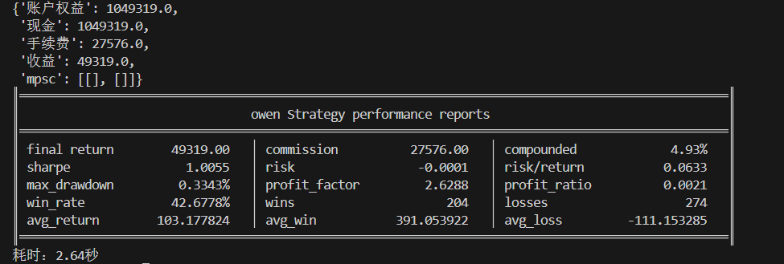

# **MiniBT量化交易之卡尔曼滤波配对交易策略**

## 概述

卡尔曼滤波配对交易策略是一种先进的统计套利策略，通过卡尔曼滤波器动态估计两个相关资产之间的对冲比率，并基于价差的统计特性进行交易。该策略结合了信号处理理论、统计套利和动态对冲技术，能够自适应市场关系的变化，在保持传统配对交易优势的同时提供更精确的对冲关系估计。

## 原策略分析

### 策略核心逻辑

1. **动态对冲比率估计**：使用卡尔曼滤波器实时估计资产间的最优对冲比率
2. **价差序列构建**：基于动态对冲比率构建价差时间序列
3. **统计套利信号**：通过价差的Z-score识别统计套利机会
4. **动态阈值交易**：设置多级阈值进行开仓和平仓操作

### 策略参数

- `STATE_VAR`：状态变量方差 (默认: 0.0001)
- `OBS_VAR`：观测变量方差 (默认: 0.01)
- `window`：Z-score计算窗口 (默认: 60)
- `OPEN_H/L`：开仓阈值 (默认: ±2.0)
- `CLOSE_H/L`：平仓阈值 (默认: ±0.5)
- `POS_PCT`：仓位比例 (默认: 5%)

## MiniBT 转换实现

### 指标类结构

```python
class KalmanFilter(BtIndicator):
    """https://www.shinnytech.com/articles/trading-strategy/mean-reversion/kalman-filter-strategy"""
    isplot = dict(state_mean=False)
    overlap = False
```

### 核心方法实现

#### 1. 卡尔曼滤波初始化

```python
def next(self):
    price_x = self.v_close.values
    price_y = self.pp_close.values
    STATE_VAR = 0.0001
    state_mean = self.ones
    state_var = self.ones
    OBS_VAR = 0.01
    window = 60
```

#### 2. 卡尔曼滤波核心算法

```python
# 卡尔曼滤波
size = price_x.size
spread = self.full(size)
for i in range(10, size):
    pred_var = state_var[i-1] + STATE_VAR
    k_gain = pred_var / (pred_var * price_x[i]**2 + OBS_VAR)
    state_mean[i] = state_mean[i-1] + k_gain * \
        (price_y[i] - state_mean[i-1] * price_x[i])
    state_var[i] = (1 - k_gain * price_x[i]) * pred_var
    spread[i] = price_y[i] - state_mean[i] * price_x[i]
```

#### 3. 价差标准化

```python
zscores = spread.zscore(window)
return zscores, state_mean
```

## 转换技术细节

### 1. 卡尔曼滤波原理

卡尔曼滤波是一种最优递归数据处理算法：
- **预测步骤**：基于前一状态预测当前状态
- **更新步骤**：结合观测值更新状态估计
- **卡尔曼增益**：平衡预测和观测的权重

### 2. 配对交易关系建模

假设两个资产存在线性关系：
```
价格Y = 对冲比率 × 价格X + 噪声
```

卡尔曼滤波动态估计最优对冲比率`state_mean`。

### 3. 价差计算

基于动态对冲比率计算价差：
```
价差 = 价格Y - state_mean × 价格X
```

### 4. 统计标准化

使用Z-score标准化价差：
```
Z-score = (当前价差 - 价差均值) / 价差标准差
```

## 使用示例

```python
from minibt import *

class KalmanFilter(BtIndicator):
    """https://www.shinnytech.com/articles/trading-strategy/mean-reversion/kalman-filter-strategy"""
    isplot = dict(state_mean=False)
    overlap = False

    def next(self):
        price_x = self.v_close.values
        price_y = self.pp_close.values
        STATE_VAR = 0.0001
        state_mean = self.ones
        state_var = self.ones
        OBS_VAR = 0.01
        window = 60
        size = price_x.size
        spread = self.full(size)
        for i in range(10, size):
            pred_var = state_var[i-1] + STATE_VAR
            k_gain = pred_var / (pred_var * price_x[i]**2 + OBS_VAR)
            state_mean[i] = state_mean[i-1] + k_gain * \
                (price_y[i] - state_mean[i-1] * price_x[i])
            state_var[i] = (1 - k_gain * price_x[i]) * pred_var
            spread[i] = price_y[i] - state_mean[i] * price_x[i]
        zscores = spread.zscore(window)
        return zscores, state_mean

class owen(Strategy):
    def __init__(self):
        self.min_start_length = 300
        self.data = self.get_kline(LocalDatas.pp2601_60, height=500)
        self.data1 = self.get_kline(LocalDatas.l2601_60, height=500)
        self.data2 = IndFrame(
            dict(v_close=self.data.close.values, pp_close=self.data1.close.values))
        self.kf = KalmanFilter(self.data2)
        self.data.fixed_commission = 1.
        self.data1.fixed_commission = 1.
        self.POS_PCT = 0.05
        self.OPEN_H = 2.0
        self.OPEN_L = -2.0
        self.CLOSE_H = 0.5
        self.CLOSE_L = -0.5

    def next(self):
        if not self.data.position:
            if self.kf.zscores.new < self.OPEN_L:
                lots = int(self.account.available *
                           self.POS_PCT / self.data1.margin)
                lots_x = int(lots * self.kf.state_mean.new * self.data1.close.new *
                             self.data1.volume_multiple / (self.data.close.new * self.data.volume_multiple))
                if lots > 0 and lots_x > 0:
                    self.data1.set_target_size(lots)
                    self.data.set_target_size(-lots_x)
            elif self.kf.zscores.new > self.OPEN_H:
                lots = int(self.account.available *
                           self.POS_PCT / self.data1.margin)
                lots_x = int(lots * self.kf.state_mean.new * self.data1.close.new *
                             self.data1.volume_multiple / (self.data.close.new * self.data.volume_multiple))
                if lots > 0 and lots_x > 0:
                    self.data1.set_target_size(-lots)
                    self.data.set_target_size(lots_x)
        else:
            if self.CLOSE_L < self.kf.zscores.new < self.CLOSE_H:
                self.data.set_target_size(0)
                self.data1.set_target_size(0)

if __name__ == "__main__":
    Bt().run()
```


## 参数说明

1. **状态变量方差 (STATE_VAR)**：
   - 控制状态转移过程的不确定性
   - 影响对冲比率的调整速度
   - 较小值使估计更稳定，较大值更敏感

2. **观测变量方差 (OBS_VAR)**：
   - 控制观测噪声的方差
   - 影响新观测值的权重
   - 较小值更信任观测值，较大值更信任预测

3. **Z-score窗口 (window)**：
   - 控制价差统计特性的计算周期
   - 影响Z-score的稳定性
   - 默认值60提供适中的统计视角

## 算法原理详解

### 1. 卡尔曼滤波数学原理

卡尔曼滤波的核心方程：

**预测步骤**：
```
预测状态：x̂ₖ|ₖ₋₁ = x̂ₖ₋₁|ₖ₋₁
预测方差：Pₖ|ₖ₋₁ = Pₖ₋₁|ₖ₋₁ + Q
```

**更新步骤**：
```
卡尔曼增益：Kₖ = Pₖ|ₖ₋₁ × Hᵀ / (H × Pₖ|ₖ₋₁ × Hᵀ + R)
状态更新：x̂ₖ|ₖ = x̂ₖ|ₖ₋₁ + Kₖ × (zₖ - H × x̂ₖ|ₖ₋₁)
方差更新：Pₖ|ₖ = (I - Kₖ × H) × Pₖ|ₖ₋₁
```

### 2. 配对交易的经济学基础

配对交易基于市场无效性假设：
- 相关资产的价格关系应该稳定
- 短期偏离会回归长期均衡
- 统计套利捕捉这种回归特性

### 3. 动态对冲比率的优势

相比固定比率方法的优势：
- 适应资产关系的变化
- 减少模型风险
- 提高套利机会的捕捉能力

### 4. Z-score交易逻辑

**做多价差信号**（Z-score < -2.0）：
- 价差显著低于历史水平
- 预期价差将向均值回归
- 做多被低估资产，做空被高估资产

**做空价差信号**（Z-score > 2.0）：
- 价差显著高于历史水平
- 预期价差将向均值回归
- 做空被高估资产，做多被低估资产

## 策略应用场景

### 1. 跨品种套利

识别相关品种间的统计套利机会：

```python
def cross_commodity_arbitrage(price_a, price_b, kalman_params):
    # 卡尔曼滤波估计
    kf = KalmanFilterIndicator(price_a, price_b, **kalman_params)
    
    # 价差分析
    spread = price_b - kf.state_mean * price_a
    zscores = spread.zscore(60)
    
    # 交易信号
    long_spread = zscores < -2.0
    short_spread = zscores > 2.0
    close_position = (zscores > -0.5) & (zscores < 0.5)
    
    return long_spread, short_spread, close_position, kf.state_mean
```

### 2. 动态对冲比率监控

监控对冲比率稳定性：

```python
def hedge_ratio_stability_analysis(state_mean, lookback=100):
    # 对冲比率统计
    hr_mean = state_mean.rolling(lookback).mean()
    hr_std = state_mean.rolling(lookback).std()
    hr_zscore = (state_mean - hr_mean) / hr_std
    
    # 稳定性评估
    stable_ratio = hr_std / hr_mean < 0.1  # 波动率小于10%
    significant_change = abs(hr_zscore) > 2.0
    
    # 关系断裂预警
    relationship_break = significant_change & (~stable_ratio)
    
    return stable_ratio, relationship_break, hr_zscore
```

### 3. 多配对组合管理

管理多个配对交易组合：

```python
def multi_pair_portfolio_management(pairs_data, max_capital_usage=0.3):
    active_pairs = []
    portfolio_weights = {}
    
    for pair_name, (price_x, price_y) in pairs_data.items():
        # 卡尔曼滤波分析
        kf = KalmanFilter(price_x, price_y)
        zscore = kf.zscores.new
        
        # 交易机会评估
        if abs(zscore) > 2.0:
            # 计算预期收益
            expected_return = abs(zscore) * kf.spread.std()
            # 风险调整
            risk_adjusted_return = expected_return / kf.spread.std()
            
            active_pairs.append((pair_name, zscore, risk_adjusted_return))
    
    # 组合权重分配
    total_score = sum(abs(score) for _, score, _ in active_pairs)
    for pair_name, zscore, _ in active_pairs:
        weight = (abs(zscore) / total_score) * max_capital_usage
        portfolio_weights[pair_name] = weight
    
    return portfolio_weights, active_pairs
```

## 风险管理建议

### 1. 动态仓位管理

基于价差波动率调整仓位：

```python
def dynamic_position_sizing(spread_std, account_equity, base_ratio=0.05, max_risk=0.02):
    # 波动率调整
    vol_adjustment = min(1.0, 0.01 / spread_std)  # 基准波动率1%
    
    # 风险调整仓位
    position_ratio = base_ratio * vol_adjustment
    
    # 最大风险限制
    max_position = max_risk / spread_std
    
    final_ratio = min(position_ratio, max_position)
    
    return final_ratio
```

### 2. 配对关系监控止损

```python
def pair_relationship_stop_loss(state_mean, spread, zscore, entry_zscore, 
                               max_hr_change=0.2, max_spread_expansion=3.0):
    # 对冲比率变化止损
    hr_change = abs(state_mean.new - state_mean.entry) / state_mean.entry
    stop_condition1 = hr_change > max_hr_change
    
    # 价差扩大止损
    spread_expansion = abs(zscore.new - entry_zscore)
    stop_condition2 = spread_expansion > max_spread_expansion
    
    # Z-score极端值止损
    extreme_zscore = abs(zscore.new) > 4.0
    
    return stop_condition1 | stop_condition2 | extreme_zscore
```

## 性能优化建议

### 1. 自适应参数优化

根据市场状态调整卡尔曼滤波参数：

```python
def adaptive_kalman_parameters(spread_volatility, lookback=50):
    # 基于价差波动率调整参数
    vol_percentile = spread_volatility.rolling(lookback).rank() / lookback
    
    if vol_percentile > 0.8:
        # 高波动率：更保守的参数
        return 0.00005, 0.05  # STATE_VAR, OBS_VAR
    elif vol_percentile < 0.2:
        # 低波动率：更敏感的参数
        return 0.0002, 0.005
    else:
        # 正常波动率：默认参数
        return 0.0001, 0.01
```

### 2. 交易成本优化

优化交易执行减少成本：

```python
def transaction_cost_optimization(target_size, current_size, spread_bps=1.0):
    # 交易成本估计
    turnover = abs(target_size - current_size)
    expected_cost = turnover * spread_bps / 10000
    
    # 成本感知调整
    if expected_cost > 0.001:  # 成本超过0.1%
        # 等待更好时机或部分执行
        partial_size = current_size + np.sign(target_size - current_size) * \
                      min(abs(target_size - current_size), 
                          current_size * 0.5)  # 最多调整50%
        return partial_size
    else:
        return target_size
```

## 扩展功能

### 1. 多因子卡尔曼滤波

引入更多因子改进模型：

```python
def multi_factor_kalman_filter(price_y, factors_data, state_vars, obs_var):
    """
    多因子卡尔曼滤波
    factors_data: 字典，包含多个因子价格序列
    """
    n_factors = len(factors_data)
    state_mean = np.ones(len(price_y)) * n_factors
    state_var = np.ones(len(price_y))
    
    factor_names = list(factors_data.keys())
    factor_prices = np.column_stack([factors_data[name] for name in factor_names])
    
    for i in range(1, len(price_y)):
        # 预测步骤
        pred_var = state_var[i-1] + np.sum(state_vars)
        
        # 卡尔曼增益
        k_gain = pred_var / (pred_var * np.sum(factor_prices[i]**2) + obs_var)
        
        # 状态更新
        prediction = np.sum(state_mean[i-1] * factor_prices[i])
        state_mean[i] = state_mean[i-1] + k_gain * (price_y[i] - prediction)
        state_var[i] = (1 - k_gain * np.sum(factor_prices[i])) * pred_var
    
    return state_mean, state_var
```

### 2. 配对有效性检验

定期检验配对关系的有效性：

```python
def pair_validation_test(price_x, price_y, state_mean, min_correlation=0.7, test_window=100):
    # 滚动相关性检验
    rolling_corr = price_x.rolling(test_window).corr(price_y)
    correlation_ok = rolling_corr > min_correlation
    
    # 协整检验（简化版）
    spread = price_y - state_mean * price_x
    adf_stat = spread.rolling(test_window).apply(
        lambda x: ts.adfuller(x, autolag='AIC')[0] if len(x) == test_window else 0
    )
    cointegrated = adf_stat < -2.0  # 简化阈值
    
    # 关系稳定性
    hr_stability = state_mean.rolling(test_window).std() / state_mean.rolling(test_window).mean() < 0.15
    
    pair_valid = correlation_ok & cointegrated & hr_stability
    
    return pair_valid, rolling_corr, adf_stat
```

## 总结

卡尔曼滤波配对交易策略通过先进的状态估计技术和统计套利原理，为交易者提供了一个动态适应市场变化的配对交易框架。该策略克服了传统固定比率配对交易的局限性，在保持均值回归核心理念的同时提供了更精确的对冲关系估计。

转换过程中，我们完整实现了卡尔曼滤波的核心算法，包括状态预测、观测更新、价差计算和统计标准化。通过MiniBT框架的实现，用户可以在回测系统中充分利用这一先进的统计套利工具。

卡尔曼滤波配对交易策略特别适用于：
- 高相关性资产间的统计套利
- 动态市场环境下的配对交易
- 需要精确对冲比率的套利策略
- 多品种组合管理

该策略的转换展示了如何将复杂的信号处理算法转换为MiniBT框架可用的交易系统，为其他基于状态空间模型的策略开发提供了重要参考。卡尔曼滤波的动态适应能力和统计严谨性使其成为统计套利交易者的有力工具。

> 风险提示：本文涉及的交易策略、代码示例均为技术演示、教学探讨，仅用于展示逻辑思路，绝不构成任何投资建议、操作指引或决策依据 。金融市场复杂多变，存在价格波动、政策调整、流动性等多重风险，历史表现不预示未来结果。任何交易决策均需您自主判断、独立承担责任 —— 若依据本文内容操作，盈亏后果概由自身承担。请务必充分评估风险承受能力，理性对待市场，谨慎做出投资选择。