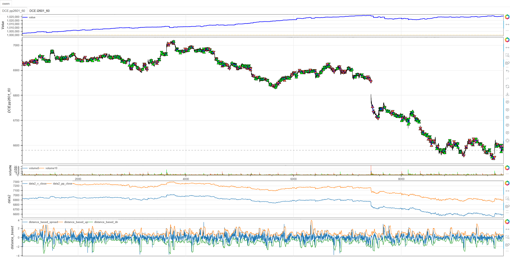
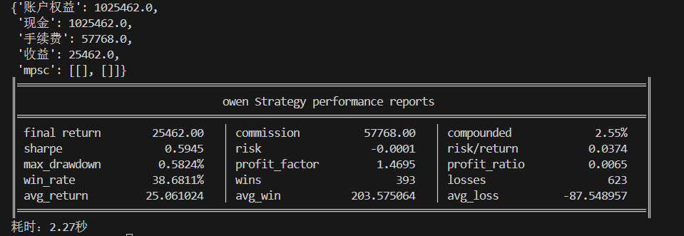

# **MiniBT量化交易之基于距离的配对交易策略**

## 概述

基于距离的配对交易策略（Distance-Based Pairs Trading）是一种经典的统计套利方法，通过计算两个相关资产标准化价格之间的距离来识别交易机会。该策略基于均值回归原理，认为高度相关的资产价格在短期内可能偏离长期均衡关系，但这种偏离最终会回归到历史平均水平。

## 原策略分析

### 策略核心逻辑

1. **价格标准化处理**：对两个资产价格分别进行Z-score标准化，消除量纲影响
2. **距离计算**：计算标准化后价格之间的差异作为距离指标
3. **统计边界构建**：基于距离序列的均值和标准差构建交易阈值
4. **均值回归交易**：当距离突破统计边界时开仓，回归到中心区域时平仓

### 策略参数

- `window`：统计计算窗口 (默认: 30)
- `K_THRESHOLD`：阈值倍数 (默认: 2.0)
- `POS_PCT`：仓位比例 (默认: 5%)
- `POSITION_RATIO`：头寸比例 (默认: 1.0)

## MiniBT 转换实现

### 指标类结构

```python
class DistanceBased(BtIndicator):
    """https://www.shinnytech.com/articles/trading-strategy/mean-reversion/distance-based-strategy"""
    overlap = False
```

### 核心方法实现

#### 1. 价格标准化处理

```python
def next(self):
    price_x = self.v_close
    price_y = self.pp_close
    window = 30
    K_THRESHOLD = 2.
    norm1 = price_x.zscore(window)
    norm2 = price_y.zscore(window)
```

#### 2. 距离计算与统计特征

```python
spread = norm1 - norm2
mean_spread = spread.sma(window)
std_spread = spread.stdev(window)
```

#### 3. 交易边界构建

```python
up = mean_spread+K_THRESHOLD*std_spread
dn = mean_spread-K_THRESHOLD*std_spread
```

## 转换技术细节

### 1. 价格标准化原理

使用Z-score方法标准化价格：
```
标准化价格 = (当前价格 - 历史均值) / 历史标准差
```

这种标准化能够：
- 消除价格绝对水平的差异
- 使不同价格的资产具有可比性
- 聚焦于相对价格变化

### 2. 距离指标定义

距离定义为两个标准化价格的差值：
```
距离 = 标准化价格X - 标准化价格Y
```

距离指标的含义：
- **正距离**：资产X相对强势，资产Y相对弱势
- **负距离**：资产X相对弱势，资产Y相对强势
- **零距离**：两个资产相对平衡

### 3. 统计边界计算

基于距离序列的统计特性构建交易边界：
```
上边界 = 距离均值 + K × 距离标准差
下边界 = 距离均值 - K × 距离标准差
```

### 4. 头寸比例计算

基于实时价格比例动态计算头寸：
```python
price_ratio = self.data1.close.new / self.data.close.new
trade_ratio = round(price_ratio * self.POSITION_RATIO, 2)
```

## 使用示例

```python
from minibt import *

class DistanceBased(BtIndicator):
    overlap = False

    def next(self):
        price_x = self.v_close
        price_y = self.pp_close
        window = 30
        K_THRESHOLD = 2.
        norm1 = price_x.zscore(window)
        norm2 = price_y.zscore(window)
        spread = norm1 - norm2
        mean_spread = spread.sma(window)
        std_spread = spread.stdev(window)
        up = mean_spread+K_THRESHOLD*std_spread
        dn = mean_spread-K_THRESHOLD*std_spread
        return spread, up, dn

class owen(Strategy):
    def __init__(self):
        self.min_start_length = 300
        self.data = self.get_kline(LocalDatas.pp2601_60, height=500)
        self.data1 = self.get_kline(LocalDatas.l2601_60, height=500)
        self.data2 = IndFrame(
            dict(v_close=self.data.close.values, pp_close=self.data1.close.values))
        self.distance_based = DistanceBased(self.data2)
        self.data.fixed_commission = 1.
        self.data1.fixed_commission = 1.
        self.POS_PCT = 0.05
        self.OPEN_H = 2.0
        self.OPEN_L = -2.0
        self.CLOSE_H = 0.5
        self.CLOSE_L = -0.5
        self.POSITION_RATIO = 1.

    def next(self):
        if not self.data.position:
            if self.distance_based.spread.new < self.distance_based.dn.new:
                lots = int(self.account.available *
                           self.POS_PCT / self.data1.margin)
                price_ratio = self.data1.close.new / self.data.close.new
                trade_ratio = round(price_ratio * self.POSITION_RATIO, 2)
                lots_x = int(lots * trade_ratio)
                if lots > 0 and lots_x > 0:
                    self.data.set_target_size(lots)
                    self.data1.set_target_size(-lots_x)
            elif self.distance_based.spread.new > self.distance_based.up.new:
                lots = int(self.account.available *
                           self.POS_PCT / self.data1.margin)
                price_ratio = self.data1.close.new / self.data.close.new
                trade_ratio = round(price_ratio * self.POSITION_RATIO, 2)
                lots_x = int(lots * trade_ratio)
                if lots > 0 and lots_x > 0:
                    self.data.set_target_size(-lots)
                    self.data1.set_target_size(lots_x)
        else:
            if self.CLOSE_L < self.distance_based.spread.new < self.CLOSE_H:
                self.data.set_target_size(0)
                self.data1.set_target_size(0)

if __name__ == "__main__":
    Bt().run()
```


## 参数说明

1. **window (统计窗口)**：
   - 控制标准化和统计特征的计算周期
   - 影响策略对市场变化的敏感度
   - 默认值30提供适中的统计稳定性

2. **K_THRESHOLD (阈值倍数)**：
   - 控制交易边界的宽度
   - 较大值产生更少但更可靠的信号
   - 默认值2.0基于正态分布假设

3. **POS_PCT (仓位比例)**：
   - 控制单次交易的资金使用比例
   - 影响策略的风险暴露程度
   - 默认值5%提供适中的仓位管理

4. **POSITION_RATIO (头寸比例)**：
   - 控制两个资产的头寸相对比例
   - 可根据资产波动性调整
   - 默认值1.0表示等价值头寸

## 算法原理详解

### 1. 标准化距离的经济学意义

基于距离的方法核心假设：
- 相关资产的价格运动应该同步
- 标准化后的价格距离应该围绕零值波动
- 极端距离代表临时的市场无效性
- 均值回归力量会使距离回到正常范围

### 2. 统计套利理论基础

策略基于统计套利的三个核心要素：
1. **可预测性**：距离序列具有均值回归特性
2. **可交易性**：能够构建对冲头寸实现市场中性
3. **经济意义**：捕捉市场暂时无效带来的套利机会

### 3. 交易信号逻辑

**做多距离信号**（距离 < 下边界）：
- 资产X相对低估，资产Y相对高估
- 做多资产X，做空资产Y
- 预期距离将向上回归到均值

**做空距离信号**（距离 > 上边界）：
- 资产X相对高估，资产Y相对低估
- 做空资产X，做多资产Y
- 预期距离将向下回归到均值

### 4. 头寸平衡机制

基于价格比例动态调整头寸：
```
头寸比例 = (资产Y价格 / 资产X价格) × 固定比例
```

确保两个头寸的美元价值基本相等，实现市场中性。

## 策略应用场景

### 1. 行业内部配对

在同一行业内选择高度相关的股票：

```python
def intra_industry_pairs_trading(stock_a, stock_b, window=30, k_threshold=2.0):
    # 价格标准化
    norm_a = stock_a.zscore(window)
    norm_b = stock_b.zscore(window)
    
    # 距离计算
    distance = norm_a - norm_b
    mean_distance = distance.rolling(window).mean()
    std_distance = distance.rolling(window).std()
    
    # 交易信号
    upper_band = mean_distance + k_threshold * std_distance
    lower_band = mean_distance - k_threshold * std_distance
    
    long_signal = distance < lower_band
    short_signal = distance > upper_band
    exit_signal = (distance > mean_distance - 0.5*std_distance) & \
                  (distance < mean_distance + 0.5*std_distance)
    
    return long_signal, short_signal, exit_signal, distance
```

### 2. 跨市场套利

在不同市场但相关的品种间套利：

```python
def cross_market_arbitrage(domestic_asset, foreign_asset, fx_rate, window=30):
    # 汇率调整
    adjusted_foreign = foreign_asset * fx_rate
    
    # 标准化距离
    norm_domestic = domestic_asset.zscore(window)
    norm_foreign = adjusted_foreign.zscore(window)
    
    distance = norm_domestic - norm_foreign
    zscore_distance = distance.zscore(window)
    
    # 考虑交易成本的信号
    transaction_cost = 0.002  # 0.2%交易成本
    effective_upper = 2.0 + transaction_cost * 10
    effective_lower = -2.0 - transaction_cost * 10
    
    long_signal = zscore_distance < effective_lower
    short_signal = zscore_distance > effective_upper
    
    return long_signal, short_signal, zscore_distance
```

### 3. 多配对组合优化

管理多个配对交易组合：

```python
def multi_pairs_portfolio(pairs_data, correlation_threshold=0.7):
    active_signals = {}
    portfolio_weights = {}
    
    for pair_name, (asset1, asset2) in pairs_data.items():
        # 计算相关性
        correlation = asset1.rolling(60).corr(asset2)
        
        if correlation.iloc[-1] > correlation_threshold:
            # 距离策略信号
            norm1 = asset1.zscore(30)
            norm2 = asset2.zscore(30)
            distance = norm1 - norm2
            zscore_distance = distance.zscore(30)
            
            # 信号强度
            signal_strength = abs(zscore_distance.iloc[-1])
            
            if signal_strength > 2.0:
                active_signals[pair_name] = {
                    'signal': np.sign(zscore_distance.iloc[-1]),
                    'strength': signal_strength,
                    'distance': zscore_distance.iloc[-1]
                }
    
    # 组合权重分配
    total_strength = sum(data['strength'] for data in active_signals.values())
    for pair_name, data in active_signals.items():
        weight = data['strength'] / total_strength
        portfolio_weights[pair_name] = weight
    
    return portfolio_weights, active_signals
```

## 风险管理建议

### 1. 基于波动率的动态仓位

```python
def volatility_adjusted_position(distance_std, base_position=0.05, max_risk=0.02):
    """
    根据距离波动率调整仓位
    """
    # 波动率调整因子
    vol_factor = min(1.0, 0.1 / distance_std)  # 基准波动率0.1
    
    # 风险调整
    position_size = base_position * vol_factor
    risk_limited_position = min(position_size, max_risk / distance_std)
    
    return risk_limited_position
```

### 2. 相关性监控止损

```python
def correlation_based_stop_loss(asset1, asset2, entry_correlation, 
                               min_correlation=0.5, lookback=60):
    """
    基于相关性变化的止损
    """
    current_correlation = asset1.rolling(lookback).corr(asset2).iloc[-1]
    
    # 相关性显著下降
    correlation_drop = entry_correlation - current_correlation > 0.3
    
    # 相关性低于阈值
    low_correlation = current_correlation < min_correlation
    
    stop_condition = correlation_drop | low_correlation
    
    return stop_condition, current_correlation
```

## 性能优化建议

### 1. 自适应参数调整

根据市场状态调整策略参数：

```python
def adaptive_parameters(distance_series, volatility_window=50):
    """
    根据距离序列特性自适应调整参数
    """
    # 距离波动率
    distance_vol = distance_series.rolling(volatility_window).std()
    
    # 市场状态分类
    high_vol_regime = distance_vol > distance_vol.quantile(0.7)
    low_vol_regime = distance_vol < distance_vol.quantile(0.3)
    
    # 自适应参数
    if high_vol_regime.iloc[-1]:
        # 高波动率：更宽的阈值，更小的仓位
        return 2.5, 0.03, 25  # K_THRESHOLD, POS_PCT, window
    elif low_vol_regime.iloc[-1]:
        # 低波动率：更窄的阈值，正常的仓位
        return 1.8, 0.05, 30
    else:
        # 正常市场：默认参数
        return 2.0, 0.05, 30
```

### 2. 交易成本优化

```python
def cost_aware_trading(signal_strength, current_position, target_position,
                      spread_cost=0.001, commission=0.0005):
    """
    考虑交易成本的交易决策
    """
    position_change = abs(target_position - current_position)
    
    # 总交易成本估计
    total_cost = position_change * (spread_cost + commission)
    
    # 预期收益阈值（成本的两倍）
    required_profit = total_cost * 2
    
    # 信号强度对应的预期收益
    expected_profit = signal_strength * 0.005  # 经验系数
    
    if expected_profit > required_profit:
        return target_position
    else:
        # 保持现有头寸或部分调整
        return current_position
```

## 扩展功能

### 1. 三维配对交易

扩展到三个相关资产的配对交易：

```python
def three_dimensional_pairs(asset1, asset2, asset3, window=30):
    """
    三维配对交易：在三资产系统中寻找统计套利机会
    """
    # 标准化价格
    norm1 = asset1.zscore(window)
    norm2 = asset2.zscore(window)
    norm3 = asset3.zscore(window)
    
    # 构建两个正交的距离指标
    distance_12 = norm1 - norm2
    distance_13 = norm1 - norm3
    distance_23 = norm2 - norm3
    
    # 主成分分析简化
    from sklearn.decomposition import PCA
    prices_matrix = np.column_stack([norm1, norm2, norm3])
    pca = PCA(n_components=2)
    principal_components = pca.fit_transform(prices_matrix)
    
    # 基于主成分的交易信号
    pc1, pc2 = principal_components[:, 0], principal_components[:, 1]
    pc1_zscore = (pc1 - pc1.mean()) / pc1.std()
    pc2_zscore = (pc2 - pc2.mean()) / pc2.std()
    
    return pc1_zscore, pc2_zscore, distance_12, distance_13, distance_23
```

### 2. 机器学习增强

使用机器学习改进信号生成：

```python
def ml_enhanced_signals(asset1, asset2, feature_window=30, model_retrain_freq=100):
    """
    使用机器学习模型增强交易信号
    """
    # 特征工程
    features = []
    
    # 基础距离特征
    norm1 = asset1.zscore(feature_window)
    norm2 = asset2.zscore(feature_window)
    distance = norm1 - norm2
    
    features.append(distance)
    features.append(distance.rolling(5).mean())
    features.append(distance.rolling(10).std())
    features.append(asset1.rolling(20).corr(asset2))
    
    # 技术指标特征
    features.append(asset1.rolling(10).mean() - asset2.rolling(10).mean())
    features.append(asset1.pct_change(5) - asset2.pct_change(5))
    
    # 波动率特征
    vol_ratio = asset1.rolling(20).std() / asset2.rolling(20).std()
    features.append(vol_ratio)
    
    # 标签生成（未来5期的距离变化）
    future_distance = distance.shift(-5) - distance
    label = (future_distance > 0).astype(int)
    
    # 这里可以添加机器学习模型训练和预测
    # 例如使用随机森林或梯度提升树
    
    return enhanced_long_signal, enhanced_short_signal
```

## 总结

基于距离的配对交易策略通过简洁有效的标准化距离计算和统计边界构建，为交易者提供了一个经典且实用的统计套利框架。该策略结合了均值回归原理和统计套利技术，在保持计算简洁性的同时提供可靠的交易信号。

转换过程中，我们完整实现了基于距离策略的核心算法，包括价格标准化、距离计算、统计边界构建和动态头寸调整。通过MiniBT框架的实现，用户可以在回测系统中充分利用这一经典的统计套利工具。

基于距离的配对交易策略特别适用于：
- 高相关性资产间的统计套利
- 均值回归明显的市场环境
- 多品种组合管理
- 市场中性策略构建

该策略的转换展示了如何将经典的统计套利方法转换为MiniBT框架可用的交易系统，为其他基于均值回归的策略开发提供了重要参考。基于距离方法的简洁性和直观性使其成为统计套利交易者的基础工具。

> 风险提示：本文涉及的交易策略、代码示例均为技术演示、教学探讨，仅用于展示逻辑思路，绝不构成任何投资建议、操作指引或决策依据 。金融市场复杂多变，存在价格波动、政策调整、流动性等多重风险，历史表现不预示未来结果。任何交易决策均需您自主判断、独立承担责任 —— 若依据本文内容操作，盈亏后果概由自身承担。请务必充分评估风险承受能力，理性对待市场，谨慎做出投资选择。