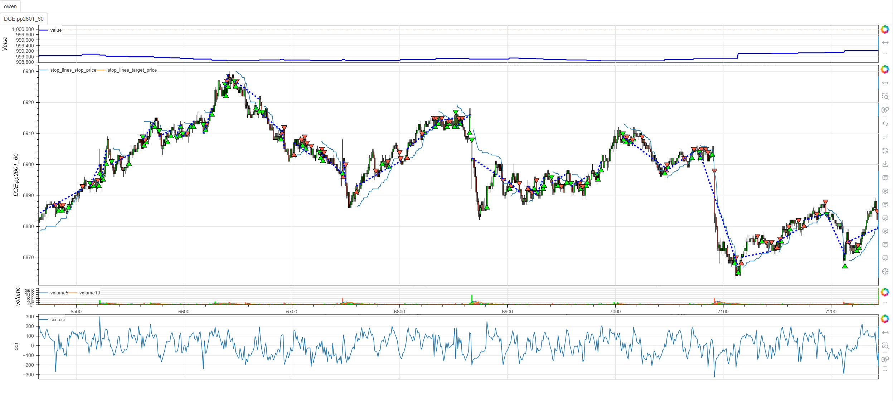
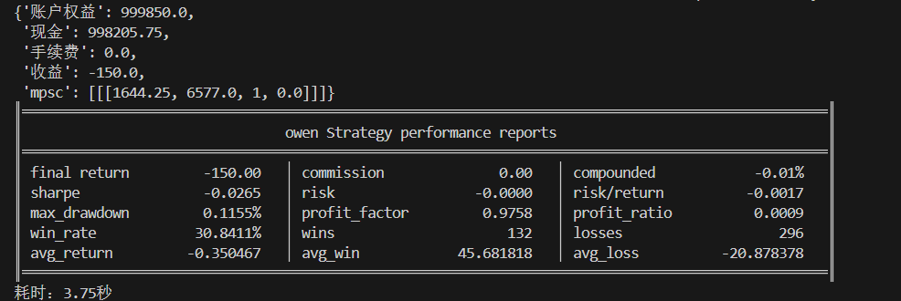

# **MiniBT量化交易之CCI均值回归策略**

## 概述

商品通道指数（Commodity Channel Index，简称CCI）是由Donald Lambert开发的一种动量振荡器，主要用于识别资产的超买超卖状态。CCI均值回归策略基于CCI指标的极端值特性，通过捕捉价格从极端水平向均值回归的过程来获取收益。该策略特别适用于震荡市场和均值回归明显的交易品种。

## 原策略分析

### 指标核心逻辑

1. **典型价格计算**：综合最高价、最低价和收盘价计算典型价格
2. **均值偏差度量**：计算典型价格与移动平均的标准化偏差
3. **状态机设计**：通过状态变量跟踪CCI的超买超卖状态
4. **零轴穿越信号**：CCI从极端区域回归零轴时产生交易信号

### 策略参数

- `CCI_PERIOD`：CCI计算周期 (默认: 10)
- `CCI_UPPER`：超买阈值 (默认: 100)
- `CCI_LOWER`：超卖阈值 (默认: -100)

## MiniBT 转换实现

### 指标类结构

```python
class CCI(BtIndicator):
    """https://www.shinnytech.com/articles/trading-strategy/mean-reversion/cci-strategy"""
    isplot = dict(long_signal=False, short_signal=False)
    params = dict(CCI_PERIOD=10, CCI_UPPER=100, CCI_LOWER=-100)
```

### 核心方法实现

#### 1. CCI指标计算

```python
def next(self):
    CCI_PERIOD = self.params.CCI_PERIOD  # CCI计算周期
    CCI_UPPER = self.params.CCI_UPPER  # CCI上轨
    CCI_LOWER = self.params.CCI_LOWER  # CCI下轨
    cci = self.close.cci(CCI_PERIOD)
```

#### 2. 状态机逻辑实现

```python
size = cci.size
cci_state = self.ones
for i in range(CCI_PERIOD+1, size):
    cci_state[i] = cci[i] > CCI_UPPER and 1. or (
        cci[i] < CCI_LOWER and -1. or cci[i-1])
```

#### 3. 交易信号生成

```python
long_signal = cci_state.cross_up(0.)
short_signal = cci_state.cross_down(0.)
```

## 转换技术细节

### 1. CCI计算原理

CCI指标的核心公式：
```
典型价格 = (最高价 + 最低价 + 收盘价) / 3
均值 = SMA(典型价格, N)
平均偏差 = Mean(|典型价格 - 均值|, N)
CCI = (典型价格 - 均值) / (0.015 × 平均偏差)
```

其中0.015是缩放常数，确保大部分CCI值在-100到+100之间。

### 2. 状态机设计创新

策略采用状态机跟踪CCI位置：
- **状态 = 1**：CCI进入超买区域（>100）
- **状态 = -1**：CCI进入超卖区域（<-100）  
- **状态保持**：在极端区域内保持前一状态
- **状态归零**：CCI回到正常区域（-100到100之间）

### 3. 零轴穿越信号

**多头信号**：
- 状态从-1上穿0（从超卖区域回归正常）

**空头信号**：
- 状态从1下穿0（从超买区域回归正常）

## 使用示例

```python
from minibt import *

class CCI(BtIndicator):
    isplot = dict(long_signal=False, short_signal=False)
    params = dict(CCI_PERIOD=10, CCI_UPPER=100, CCI_LOWER=-100)

    def next(self):
        CCI_PERIOD = self.params.CCI_PERIOD
        CCI_UPPER = self.params.CCCI_UPPER
        CCI_LOWER = self.params.CCI_LOWER
        cci = self.close.cci(CCI_PERIOD)
        size = cci.size
        cci_state = self.ones
        for i in range(CCI_PERIOD+1, size):
            cci_state[i] = cci[i] > CCI_UPPER and 1. or (
                cci[i] < CCI_LOWER and -1. or cci[i-1])
        long_signal = cci_state.cross_up(0.)
        short_signal = cci_state.cross_down(0.)
        return cci, long_signal, short_signal

class owen(Strategy):
    def __init__(self):
        self.min_start_length = 300
        self.data = self.get_kline(LocalDatas.pp2601_60, height=500)
        self.cci = CCI(self.data)

    def next(self):
        if not self.data.position:
            if self.cci.long_signal.new:
                self.data.buy(stop=BtStop.SegmentationTracking)
            elif self.cci.short_signal.new:
                self.data.sell(stop=BtStop.SegmentationTracking)

if __name__ == "__main__":
    Bt().run()
```


## 参数说明

1. **CCI_PERIOD (计算周期)**：
   - 控制CCI指标的平滑程度
   - 较小周期更敏感，较大周期更稳定
   - 默认值10适合短期均值回归交易

2. **CCI_UPPER (超买阈值)**：
   - 识别超买状态的临界值
   - 传统CCI使用+100作为超买线
   - 可根据市场波动性调整

3. **CCI_LOWER (超卖阈值)**：
   - 识别超卖状态的临界值
   - 传统CCI使用-100作为超卖线
   - 与CCI_UPPER对称设置

## 算法原理详解

### 1. CCI指标的统计意义

CCI本质上是一个标准化得分：
- **分子**：当前价格相对于均值的偏离
- **分母**：价格波动的平均幅度（平均绝对偏差）
- **缩放因子**：0.015确保约70-80%的值在±100之间

### 2. 状态机设计的优势

相比简单的阈值突破，状态机设计具有：
- **记忆功能**：记住之前是否进入过极端区域
- **过滤噪声**：避免在边界附近反复触发信号
- **明确方向**：只有在真正从极端区域回归时才交易

### 3. 均值回归的经济学基础

CCI均值回归策略基于市场心理学：
- **超买状态**：过度乐观，价格偏离基本面，存在回调压力
- **超卖状态**：过度悲观，价格低估，存在反弹需求
- **回归动力**：市场参与者的理性行为推动价格回归均衡

### 4. 信号生成机制

**买入时机**：
- CCI从<-100区域回升
- 状态从-1变为0
- 表明卖压缓解，买盘开始介入

**卖出时机**：
- CCI从>100区域回落  
- 状态从1变为0
- 表明买盘衰竭，卖压开始出现

## 策略应用场景

### 1. 震荡市场交易

在区间震荡市场中应用CCI策略：

```python
def range_bound_cci_strategy(cci, cci_state, price, atr, volatility_threshold=0.01):
    # 市场状态识别
    market_volatility = price.rolling(20).std() / price.rolling(20).mean()
    range_market = market_volatility < volatility_threshold
    
    # 基础CCI信号
    base_long = cci_state.cross_up(0)
    base_short = cci_state.cross_down(0)
    
    # 震荡市过滤
    range_long = base_long & range_market
    range_short = base_short & range_market
    
    # ATR过滤（避免在突破时交易）
    atr_filter = atr < atr.rolling(50).quantile(0.7)
    
    filtered_long = range_long & atr_filter
    filtered_short = range_short & atr_filter
    
    return filtered_long, filtered_short
```

### 2. CCI背离检测

识别价格与CCI的背离信号：

```python
def cci_divergence_detection(price, cci, lookback=20):
    # 价格高点对应的CCI值
    price_highs = price.rolling(lookback).max()
    cci_at_highs = cci[price == price_highs]
    
    # 价格低点对应的CCI值
    price_lows = price.rolling(lookback).min()
    cci_at_lows = cci[price == price_lows]
    
    # 看跌背离：价格创新高，CCI未创新高
    bearish_divergence = (price == price_highs) & (cci < cci_at_highs.rolling(2).max())
    
    # 看涨背离：价格创新低，CCI未创新低
    bullish_divergence = (price == price_lows) & (cci > cci_at_lows.rolling(2).min())
    
    return bullish_divergence, bearish_divergence
```

### 3. 多时间框架CCI确认

```python
def multi_timeframe_cci_confirmation(daily_cci, hourly_cci, four_hour_cci):
    # 各时间框架CCI状态
    daily_overbought = daily_cci.cci > 100
    daily_oversold = daily_cci.cci < -100
    hourly_overbought = hourly_cci.cci > 100
    hourly_oversold = hourly_cci.cci < -100
    
    # 多时间框架确认
    bullish_confirmation = daily_oversold & hourly_oversold & (hourly_cci.cci_state.cross_up(0))
    bearish_confirmation = daily_overbought & hourly_overbought & (hourly_cci.cci_state.cross_down(0))
    
    return bullish_confirmation, bearish_confirmation
```

## 风险管理建议

### 1. 基于CCI值的动态仓位

```python
def cci_position_sizing(cci_value, base_size=1):
    # 根据CCI绝对值调整仓位
    # CCI越极端，回归动力越强，可适当加大仓位
    cci_strength = min(abs(cci_value) / 150, 1.5)  # 限制最大1.5倍
    
    # 正常区域保守仓位
    if abs(cci_value) < 50:
        size_multiplier = 0.5
    else:
        size_multiplier = min(cci_strength, 1.2)
    
    return base_size * size_multiplier
```

### 2. CCI动量止损策略

```python
def cci_momentum_stop_loss(cci, cci_state, position_type, close, atr):
    if position_type == 'long':
        # 多头止损：CCI重新进入超卖或价格新低
        stop_condition1 = cci_state < -0.5  # 开始进入超卖
        stop_condition2 = cci.diff(3) < -20  # CCI动量转弱
        stop_condition3 = close < (close.rolling(10).min() - atr * 0.5)
        return stop_condition1 | stop_condition2 | stop_condition3
    else:
        # 空头止损：CCI重新进入超买或价格新高
        stop_condition1 = cci_state > 0.5  # 开始进入超买
        stop_condition2 = cci.diff(3) > 20  # CCI动量转强
        stop_condition3 = close > (close.rolling(10).max() + atr * 0.5)
        return stop_condition1 | stop_condition2 | stop_condition3
```

## 性能优化建议

### 1. 自适应参数调整

根据市场波动率调整CCI参数：

```python
def adaptive_cci_params(close, volatility_window=20):
    # 计算市场波动率
    volatility = close.rolling(volatility_window).std() / close.rolling(volatility_window).mean()
    
    # 自适应参数
    if volatility > 0.025:
        # 高波动率市场：使用更长周期和更宽阈值
        return 14, 120, -120
    elif volatility < 0.01:
        # 低波动率市场：使用更短周期和更窄阈值
        return 8, 80, -80
    else:
        # 正常市场条件：默认参数
        return 10, 100, -100
```

### 2. 信号质量过滤

基于其他技术指标过滤CCI信号：

```python
def filtered_cci_signals(cci, cci_state, close, volume, rsi_period=14):
    # 基础CCI信号
    base_long = cci_state.cross_up(0)
    base_short = cci_state.cross_down(0)
    
    # 多维度确认
    volume_filter = volume > volume.rolling(20).mean() * 1.1
    rsi_filter = (close.rsi(rsi_period) < 70) if base_long.any() else (close.rsi(rsi_period) > 30)
    price_filter = close > close.rolling(20).mean()
    
    # 波动率过滤
    volatility = close.rolling(10).std() / close.rolling(10).mean()
    volatility_filter = volatility > 0.005
    
    filtered_long = base_long & volume_filter & rsi_filter & price_filter & volatility_filter
    filtered_short = base_short & volume_filter & rsi_filter & (~price_filter) & volatility_filter
    
    return filtered_long, filtered_short
```

## 扩展功能

### 1. CCI通道突破

基于CCI构建动态通道：

```python
def cci_channel_breakout(cci, lookback=20, multiplier=2):
    # CCI移动平均和标准差
    cci_ma = cci.rolling(lookback).mean()
    cci_std = cci.rolling(lookback).std()
    
    upper_band = cci_ma + multiplier * cci_std
    lower_band = cci_ma - multiplier * cci_std
    
    # 通道突破信号
    upper_breakout = (cci > upper_band) & (cci.shift() <= upper_band.shift())
    lower_breakout = (cci < lower_band) & (cci.shift() >= lower_band.shift())
    
    # CCI在通道中的位置
    cci_position = (cci - lower_band) / (upper_band - lower_band)
    
    return upper_band, lower_band, upper_breakout, lower_breakout, cci_position
```

### 2. CCI动量指标

基于CCI变化率创建动量指标：

```python
def cci_momentum_indicator(cci, lookback=5):
    # CCI变化率动量
    cci_momentum = cci.diff(lookback)
    
    # CCI动量加速度
    momentum_acceleration = cci_momentum.diff(3)
    
    # 动量强度分类
    strong_positive_momentum = (cci_momentum > 20) & (momentum_acceleration > 0)
    weak_positive_momentum = (cci_momentum > 0) & (momentum_acceleration <= 0)
    weak_negative_momentum = (cci_momentum < 0) & (momentum_acceleration >= 0)
    strong_negative_momentum = (cci_momentum < -20) & (momentum_acceleration < 0)
    
    # 综合动量评分
    momentum_score = cci_momentum / cci.rolling(lookback).std()
    
    return momentum_score, strong_positive_momentum, weak_positive_momentum, weak_negative_momentum, strong_negative_momentum
```

## 总结

CCI均值回归策略通过创新的状态机设计和经典的超买超卖识别机制，为交易者提供了一个有效捕捉价格回归机会的工具。该策略结合了CCI指标的统计特性和市场心理学原理，在识别极端价格状态的同时提供清晰的交易时机。

转换过程中，我们完整实现了CCI指标的核心计算和状态机逻辑，包括典型价格计算、均值偏差度量和状态转换跟踪。通过MiniBT框架的实现，用户可以在回测系统中充分利用这一经典的均值回归工具。

CCI均值回归策略特别适用于：
- 震荡市场的超买超卖交易
- 均值回归明显的交易品种
- 短期价格极端值的回归捕捉
- 多时间框架确认的回归交易

该策略的转换展示了如何将经典的技术指标与创新的状态机设计结合，为其他均值回归策略的开发提供了重要参考。CCI指标的状态跟踪能力和清晰的信号逻辑使其成为均值回归交易者的有力工具。

> 风险提示：本文涉及的交易策略、代码示例均为技术演示、教学探讨，仅用于展示逻辑思路，绝不构成任何投资建议、操作指引或决策依据 。金融市场复杂多变，存在价格波动、政策调整、流动性等多重风险，历史表现不预示未来结果。任何交易决策均需您自主判断、独立承担责任 —— 若依据本文内容操作，盈亏后果概由自身承担。请务必充分评估风险承受能力，理性对待市场，谨慎做出投资选择。