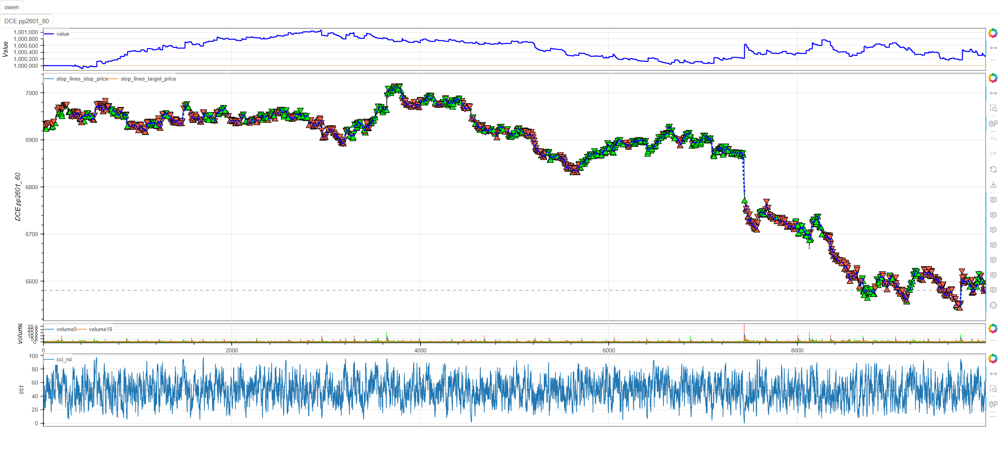
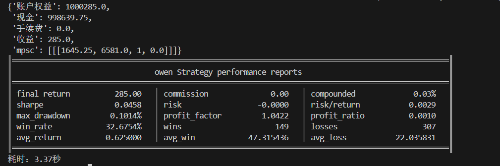

# **MiniBT量化交易之RSI超买/超卖交易策略**

## 概述

相对强弱指数（Relative Strength Index，简称RSI）是由J. Welles Wilder开发的一种动量振荡器，用于衡量价格变动的速度和幅度。RSI超买/超卖交易策略基于RSI指标的极端值特性，通过识别市场的过度买入和过度卖出状态来捕捉价格回归均值的交易机会。该策略是技术分析中最经典且广泛应用的均值回归策略之一。

## 原策略分析

### 指标核心逻辑

1. **价格动量计算**：通过上涨日和下跌日的价格变动计算相对强度
2. **标准化处理**：将相对强度转换为0-100的标准化指数
3. **阈值突破信号**：RSI从超卖区域上穿阈值时做多，从超买区域下穿阈值时做空
4. **均值回归原理**：利用市场过度反应后的价格回归特性

### 策略参数

- `RSI_PERIOD`：RSI计算周期 (默认: 6)
- `OVERBOUGHT_THRESHOLD`：超买阈值 (默认: 65)
- `OVERSOLD_THRESHOLD`：超卖阈值 (默认: 35)

## MiniBT 转换实现

### 指标类结构

```python
class RSI(BtIndicator):
    """https://www.shinnytech.com/articles/trading-strategy/mean-reversion/rsi-strategy"""
    isplot = dict(long_signal=False, short_signal=False)
    params = dict(RSI_PERIOD=6, OVERBOUGHT_THRESHOLD=65, OVERSOLD_THRESHOLD=35)
```

### 核心方法实现

#### 1. RSI指标计算

```python
def next(self):
    RSI_PERIOD = self.params.RSI_PERIOD  # RSI计算周期
    OVERBOUGHT_THRESHOLD = self.params.OVERBOUGHT_THRESHOLD  # 超买阈值
    OVERSOLD_THRESHOLD = self.params.OVERSOLD_THRESHOLD  # 超卖阈值
    rsi = self.close.rsi(RSI_PERIOD)
```

#### 2. 交易信号生成

```python
long_signal = rsi.cross_up(OVERSOLD_THRESHOLD)
short_signal = rsi.cross_down(OVERBOUGHT_THRESHOLD)
```

## 转换技术细节

### 1. RSI计算原理

RSI指标的核心计算过程：

```
RSI = 100 - (100 / (1 + RS))
其中：RS = 平均上涨幅度 / 平均下跌幅度
```

具体计算步骤：
1. 计算每个周期的价格变化
2. 分离上涨幅度和下跌幅度
3. 计算N周期内的平均上涨和平均下跌
4. 计算相对强度(RS)值
5. 转换为0-100的指数

### 2. 阈值突破策略

**多头信号逻辑**：
- RSI从低于35区域上穿35
- 表明市场从超卖状态开始恢复
- 预期价格将从过度下跌中反弹

**空头信号逻辑**：
- RSI从高于65区域下穿65
- 表明市场从超买状态开始回调
- 预期价格将从过度上涨中回落

### 3. 与传统参数的差异

与传统RSI策略的区别：
- 使用6周期而非14周期，提高敏感性
- 使用35/65阈值而非30/70，适应更频繁的交易
- 专注于从极端区域的回归而非绝对水平

## 使用示例

```python
from minibt import *

class RSI(BtIndicator):
    """https://www.shinnytech.com/articles/trading-strategy/mean-reversion/rsi-strategy"""
    isplot = dict(long_signal=False, short_signal=False)
    params = dict(RSI_PERIOD=6, OVERBOUGHT_THRESHOLD=65, OVERSOLD_THRESHOLD=35)

    def next(self):
        RSI_PERIOD = self.params.RSI_PERIOD
        OVERBOUGHT_THRESHOLD = self.params.OVERBOUGHT_THRESHOLD
        OVERSOLD_THRESHOLD = self.params.OVERSOLD_THRESHOLD
        rsi = self.close.rsi(RSI_PERIOD)
        long_signal = rsi.cross_up(OVERSOLD_THRESHOLD)
        short_signal = rsi.cross_down(OVERBOUGHT_THRESHOLD)
        return rsi, long_signal, short_signal

class owen(Strategy):
    def __init__(self):
        self.min_start_length = 300
        self.data = self.get_kline(LocalDatas.pp2601_60, height=500)
        self.rsi = RSI(self.data)

    def next(self):
        if not self.data.position:
            if self.rsi.long_signal.new:
                self.data.buy(stop=BtStop.SegmentationTracking)
            elif self.rsi.short_signal.new:
                self.data.sell(stop=BtStop.SegmentationTracking)

if __name__ == "__main__":
    Bt().run()
```


## 参数说明

1. **RSI_PERIOD (计算周期)**：
   - 控制RSI指标的平滑程度
   - 较小周期更敏感，较大周期更稳定
   - 默认值6提供较高的交易频率和敏感性

2. **OVERBOUGHT_THRESHOLD (超买阈值)**：
   - 识别超买状态的临界值
   - 传统RSI使用70，本策略使用65提高信号频率
   - 可根据市场特性调整

3. **OVERSOLD_THRESHOLD (超卖阈值)**：
   - 识别超卖状态的临界值
   - 传统RSI使用30，本策略使用35提高信号频率
   - 与超买阈值对称设置

## 算法原理详解

### 1. RSI的动量测量原理

RSI通过比较上涨和下跌动量来量化市场情绪：

- **上涨动量强**：RSI上升，反映买方力量占优
- **下跌动量强**：RSI下降，反映卖方力量占优
- **动量平衡**：RSI在50附近震荡，反映多空力量均衡

### 2. 超买超卖的心理学基础

RSI极端值反映市场心理状态：

**超买状态 (RSI > 65)**：
- 投资者过度乐观，追高情绪浓厚
- 买盘力量可能衰竭，存在获利了结压力
- 价格容易出现技术性回调

**超卖状态 (RSI < 35)**：
- 投资者过度悲观，恐慌性抛售
- 卖盘力量可能衰竭，存在抄底机会
- 价格容易出现技术性反弹

### 3. 阈值突破的交易逻辑

**回归均值原理**：
- 价格极端波动后倾向于回归平均水平
- RSI从极端区域回归反映市场情绪正常化
- 这种回归过程创造交易机会

**突破时机的选择**：
- 不在RSI刚进入极端区域时交易（可能继续极端）
- 在RSI开始离开极端区域时入场（确认回归开始）
- 提高交易的胜率和风险收益比

## 策略应用场景

### 1. 震荡市场交易

在区间震荡市场中应用RSI策略：

```python
def range_bound_rsi_strategy(rsi, price, atr, volatility_threshold=0.01):
    # 市场状态识别
    market_volatility = price.rolling(20).std() / price.rolling(20).mean()
    range_market = market_volatility < volatility_threshold
    
    # 基础RSI信号
    base_long = rsi.cross_up(35)
    base_short = rsi.cross_down(65)
    
    # 震荡市过滤
    range_long = base_long & range_market
    range_short = base_short & range_market
    
    # 波动率确认
    atr_filter = atr < atr.rolling(50).quantile(0.7)
    
    filtered_long = range_long & atr_filter
    filtered_short = range_short & atr_filter
    
    return filtered_long, filtered_short
```

### 2. RSI背离检测

识别价格与RSI的背离信号：

```python
def rsi_divergence_detection(price, rsi, lookback=20):
    # 价格高点对应的RSI值
    price_highs = price.rolling(lookback).max()
    rsi_at_highs = rsi[price == price_highs]
    
    # 价格低点对应的RSI值
    price_lows = price.rolling(lookback).min()
    rsi_at_lows = rsi[price == price_lows]
    
    # 看跌背离：价格创新高，RSI未创新高
    bearish_divergence = (price == price_highs) & (rsi < rsi_at_highs.rolling(2).max())
    
    # 看涨背离：价格创新低，RSI未创新低
    bullish_divergence = (price == price_lows) & (rsi > rsi_at_lows.rolling(2).min())
    
    return bullish_divergence, bearish_divergence
```

### 3. 多时间框架RSI确认

```python
def multi_timeframe_rsi_confirmation(daily_rsi, hourly_rsi, four_hour_rsi):
    # 各时间框架RSI状态
    daily_oversold = daily_rsi.rsi < 35
    daily_overbought = daily_rsi.rsi > 65
    hourly_oversold = hourly_rsi.rsi < 35
    hourly_overbought = hourly_rsi.rsi > 65
    
    # 多时间框架确认
    bullish_confirmation = daily_oversold & hourly_oversold & (hourly_rsi.rsi.cross_up(35))
    bearish_confirmation = daily_overbought & hourly_overbought & (hourly_rsi.rsi.cross_down(65))
    
    return bullish_confirmation, bearish_confirmation
```

## 风险管理建议

### 1. 基于RSI值的动态仓位

```python
def rsi_position_sizing(rsi_value, base_size=1):
    # 根据RSI与阈值的距离调整仓位
    # RSI越极端，回归动力越强
    
    if rsi_value < 35:
        # 超卖区域：根据超卖程度调整
        oversold_strength = (35 - rsi_value) / 35
        size_multiplier = 1.0 + oversold_strength * 0.5  # 最大1.5倍
    elif rsi_value > 65:
        # 超买区域：根据超买程度调整
        overbought_strength = (rsi_value - 65) / 35
        size_multiplier = 1.0 + overbought_strength * 0.5  # 最大1.5倍
    else:
        # 正常区域：保守仓位
        size_multiplier = 0.5
    
    return base_size * size_multiplier
```

### 2. RSI动量止损策略

```python
def rsi_momentum_stop_loss(rsi, position_type, close, atr):
    if position_type == 'long':
        # 多头止损：RSI重新进入超卖或价格新低
        stop_condition1 = rsi < 30  # 重新进入深度超卖
        stop_condition2 = rsi.diff(3) < -10  # RSI动量转弱
        stop_condition3 = close < (close.rolling(10).min() - atr * 0.5)
        return stop_condition1 | stop_condition2 | stop_condition3
    else:
        # 空头止损：RSI重新进入超买或价格新高
        stop_condition1 = rsi > 70  # 重新进入深度超买
        stop_condition2 = rsi.diff(3) > 10  # RSI动量转强
        stop_condition3 = close > (close.rolling(10).max() + atr * 0.5)
        return stop_condition1 | stop_condition2 | stop_condition3
```

## 性能优化建议

### 1. 自适应参数调整

根据市场波动率调整RSI参数：

```python
def adaptive_rsi_params(close, volatility_window=20):
    # 计算市场波动率
    volatility = close.rolling(volatility_window).std() / close.rolling(volatility_window).mean()
    
    # 自适应参数
    if volatility > 0.025:
        # 高波动率市场：使用更长周期和更严格阈值
        return 10, 70, 30
    elif volatility < 0.01:
        # 低波动率市场：使用更短周期和更宽松阈值
        return 4, 60, 40
    else:
        # 正常市场条件：默认参数
        return 6, 65, 35
```

### 2. 信号质量过滤

基于其他技术指标过滤RSI信号：

```python
def filtered_rsi_signals(rsi, close, volume, ma_period=20):
    # 基础RSI信号
    base_long = rsi.cross_up(35)
    base_short = rsi.cross_down(65)
    
    # 多维度确认
    volume_filter = volume > volume.rolling(20).mean() * 1.1
    trend_filter = close > close.rolling(ma_period).mean()
    
    # 价格动量确认
    price_momentum = close.diff(3) > 0 if base_long.any() else close.diff(3) < 0
    
    # 波动率过滤
    volatility = close.rolling(10).std() / close.rolling(10).mean()
    volatility_filter = volatility > 0.005
    
    filtered_long = base_long & volume_filter & trend_filter & price_momentum & volatility_filter
    filtered_short = base_short & volume_filter & (~trend_filter) & price_momentum & volatility_filter
    
    return filtered_long, filtered_short
```

## 扩展功能

### 1. RSI趋势强度指标

基于RSI构建趋势强度指标：

```python
def rsi_trend_strength(rsi, lookback=10):
    # RSI移动平均
    rsi_ma = rsi.rolling(lookback).mean()
    
    # RSI趋势方向
    rsi_trend = rsi > rsi_ma
    
    # 趋势强度
    trend_strength = (rsi - rsi_ma).abs() / rsi.rolling(lookback).std()
    
    # 趋势状态分类
    strong_bullish = rsi_trend & (trend_strength > 1.0)
    weak_bullish = rsi_trend & (trend_strength <= 1.0)
    weak_bearish = (~rsi_trend) & (trend_strength <= 1.0)
    strong_bearish = (~rsi_trend) & (trend_strength > 1.0)
    
    return trend_strength, strong_bullish, weak_bullish, weak_bearish, strong_bearish
```

### 2. RSI动量振荡器

基于RSI变化率创建动量指标：

```python
def rsi_momentum_oscillator(rsi, fast_period=3, slow_period=10):
    # RSI动量
    rsi_momentum = rsi.diff(fast_period)
    
    # 动量信号线
    momentum_signal = rsi_momentum.rolling(slow_period).mean()
    
    # 动量交叉信号
    momentum_cross_up = rsi_momentum.cross_up(momentum_signal)
    momentum_cross_down = rsi_momentum.cross_down(momentum_signal)
    
    # 动量背离
    momentum_divergence = (rsi_momentum > 0) & (momentum_signal < 0)
    momentum_convergence = (rsi_momentum < 0) & (momentum_signal > 0)
    
    return rsi_momentum, momentum_signal, momentum_cross_up, momentum_cross_down, momentum_divergence, momentum_convergence
```

## 总结

RSI超买/超卖交易策略通过简洁而有效的阈值突破机制，为交易者提供了一个经典且实用的均值回归工具。该策略基于市场心理学和价格动量原理，在识别市场极端情绪的同时提供清晰的回归交易时机。

转换过程中，我们充分利用了MiniBT框架内置的RSI指标功能，通过参数优化和信号逻辑实现了高效的策略执行。策略的阈值突破设计确保了在确认回归趋势开始时入场，提高了交易的可靠性。

RSI超买/超卖交易策略特别适用于：
- 震荡市场的均值回归交易
- 短期价格极端值的回归捕捉
- 市场情绪转折点的识别
- 多时间框架确认的回归交易

该策略的转换展示了如何将经典技术指标高效地应用于实际交易，为其他基于动量振荡器的策略开发提供了重要参考。RSI指标的直观性和广泛认可度使其成为均值回归交易者的基础工具。

> 风险提示：本文涉及的交易策略、代码示例均为技术演示、教学探讨，仅用于展示逻辑思路，绝不构成任何投资建议、操作指引或决策依据 。金融市场复杂多变，存在价格波动、政策调整、流动性等多重风险，历史表现不预示未来结果。任何交易决策均需您自主判断、独立承担责任 —— 若依据本文内容操作，盈亏后果概由自身承担。请务必充分评估风险承受能力，理性对待市场，谨慎做出投资选择。