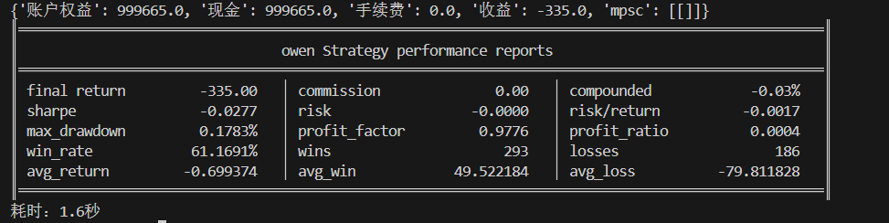

# **MiniBT量化交易之Z-Score均值回归策略**

## 概述

Z-Score均值回归策略是一种基于统计学原理的量化交易方法，通过计算价格的标准分数来识别价格的极端状态，并利用均值回归特性进行交易。该策略基于"价格围绕价值波动"的市场原理，认为当价格过度偏离其历史平均水平时，存在回归均值的潜在动力，从而创造交易机会。

## 原策略分析

### 策略核心逻辑

1. **标准化分数计算**：通过Z-Score量化当前价格相对于历史价格的偏离程度
2. **多级阈值设计**：设置入场、出场和止损三个不同级别的阈值
3. **双向交易机制**：在价格过度低估时做多，过度高估时做空
4. **风险管理体系**：结合止盈和止损机制控制单笔交易风险

### 策略参数

- `WINDOW_SIZE`：Z-Score计算窗口期 (默认: 14)
- `ENTRY_THRESHOLD`：开仓阈值 (默认: 1.8)
- `EXIT_THRESHOLD`：平仓阈值 (默认: 0.4)
- `STOP_LOSS_THRESHOLD`：止损阈值 (默认: 2.5)

## MiniBT 转换实现

### 指标类结构

```python
class Zscore(BtIndicator):
    """https://www.shinnytech.com/articles/trading-strategy/mean-reversion/zscore-strategy"""
    isplot = dict(long_signal=False, short_signal=False,
                  exitlong_signal=False, exitshort_signal=False)
    params = dict(WINDOW_SIZE=14, ENTRY_THRESHOLD=1.8,
                  EXIT_THRESHOLD=0.4, STOP_LOSS_THRESHOLD=2.5)
```

### 核心方法实现

#### 1. Z-Score计算

```python
def next(self):
    WINDOW_SIZE = self.params.WINDOW_SIZE  # Z-Score计算窗口期
    ENTRY_THRESHOLD = self.params.ENTRY_THRESHOLD  # 开仓阈值
    EXIT_THRESHOLD = self.params.EXIT_THRESHOLD  # 平仓阈值
    STOP_LOSS_THRESHOLD = self.params.STOP_LOSS_THRESHOLD  # 止损阈值
    zscore = self.close.zscore(WINDOW_SIZE)
```

#### 2. 入场信号生成

```python
long_signal = zscore.cross_down(-ENTRY_THRESHOLD)
short_signal = zscore.cross_up(ENTRY_THRESHOLD)
```

#### 3. 出场信号生成

```python
exitlong_signal1 = self.ones.where((-EXIT_THRESHOLD <=
                                   zscore) & (zscore <= EXIT_THRESHOLD), 0.).astype(bool)
exitlong_signal2 = self.ones.where(
    zscore < -STOP_LOSS_THRESHOLD, 0.).astype(bool)
exitlong_signal = exitlong_signal1 | exitlong_signal2

exitshort_signal1 = self.ones.where((-EXIT_THRESHOLD <=
                                    zscore) & (zscore <= EXIT_THRESHOLD), 0.).astype(bool)
exitshort_signal2 = self.ones.where(
    zscore > STOP_LOSS_THRESHOLD, 0.).astype(bool)  # 注意：这里应该是zscore > STOP_LOSS_THRESHOLD
exitshort_signal = exitshort_signal1 | exitshort_signal2
```

## 转换技术细节

### 1. Z-Score计算原理

Z-Score的统计定义：
```
Z = (当前价格 - 历史均值) / 历史标准差
```

Z-Score的含义：
- **Z = 0**：价格处于历史平均水平
- **Z > 0**：价格高于历史平均水平
- **Z < 0**：价格低于历史平均水平
- **|Z|越大**：价格偏离历史平均水平越远

### 2. 多级阈值系统

**入场阈值 (±1.8)**：
- 当Z-Score < -1.8时，价格显著低估，做多入场
- 当Z-Score > 1.8时，价格显著高估，做空入场

**出场阈值 (±0.4)**：
- 当Z-Score回归到[-0.4, 0.4]区间时，平仓离场

**止损阈值 (±2.5)**：
- 当Z-Score进一步恶化到±2.5时，强制止损

### 3. 信号生成机制

**多头交易流程**：
1. Z-Score下穿-1.8 → 开仓做多
2. Z-Score回归到[-0.4, 0.4] → 止盈平仓
3. Z-Score进一步下穿-2.5 → 止损平仓

**空头交易流程**：
1. Z-Score上穿1.8 → 开仓做空
2. Z-Score回归到[-0.4, 0.4] → 止盈平仓
3. Z-Score进一步上穿2.5 → 止损平仓

## 使用示例

```python
from minibt import *

class Zscore(BtIndicator):
    """https://www.shinnytech.com/articles/trading-strategy/mean-reversion/zscore-strategy"""
    isplot = dict(long_signal=False, short_signal=False,
                  exitlong_signal=False, exitshort_signal=False)
    params = dict(WINDOW_SIZE=14, ENTRY_THRESHOLD=1.8,
                  EXIT_THRESHOLD=0.4, STOP_LOSS_THRESHOLD=2.5)

    def next(self):
        WINDOW_SIZE = self.params.WINDOW_SIZE
        ENTRY_THRESHOLD = self.params.ENTRY_THRESHOLD
        EXIT_THRESHOLD = self.params.EXIT_THRESHOLD
        STOP_LOSS_THRESHOLD = self.params.STOP_LOSS_THRESHOLD
        zscore = self.close.zscore(WINDOW_SIZE)
        long_signal = zscore.cross_down(-ENTRY_THRESHOLD)
        short_signal = zscore.cross_up(ENTRY_THRESHOLD)
        exitlong_signal1 = self.ones.where((-EXIT_THRESHOLD <=
                                           zscore) & (zscore <= EXIT_THRESHOLD), 0.).astype(bool)
        exitlong_signal2 = self.ones.where(
            zscore < -STOP_LOSS_THRESHOLD, 0.).astype(bool)
        exitlong_signal = exitlong_signal1 | exitlong_signal2
        exitshort_signal1 = self.ones.where((-EXIT_THRESHOLD <=
                                            zscore) & (zscore <= EXIT_THRESHOLD), 0.).astype(bool)
        exitshort_signal2 = self.ones.where(
            zscore > STOP_LOSS_THRESHOLD, 0.).astype(bool)  # 修正：空头止损应该是zscore > STOP_LOSS_THRESHOLD
        exitshort_signal = exitshort_signal1 | exitshort_signal2
        return zscore, long_signal, short_signal, exitlong_signal, exitshort_signal

class owen(Strategy):
    def __init__(self):
        self.min_start_length = 300
        self.data = self.get_kline(LocalDatas.v2601_300, height=500)
        self.zscore = Zscore(self.data)

    def next(self):
        if not self.data.position:
            if self.zscore.long_signal.new:
                self.data.buy()
            elif self.zscore.short_signal.new:
                self.data.sell()
        elif self.data.position > 0 and self.zscore.exitlong_signal.new:
            self.data.sell()
        elif self.data.position < 0 and self.zscore.exitshort_signal.new:
            self.data.buy()

if __name__ == "__main__":
    Bt().run()
```


## 参数说明

1. **WINDOW_SIZE (计算窗口)**：
   - 控制Z-Score统计特征的计算周期
   - 影响均值和标准差的稳定性
   - 默认值14提供适中的统计视角

2. **ENTRY_THRESHOLD (入场阈值)**：
   - 控制交易信号的触发标准
   - 基于正态分布假设，±1.8对应约7%的极端情况
   - 较大阈值产生更少但更可靠的信号

3. **EXIT_THRESHOLD (出场阈值)**：
   - 控制盈利了结的时机
   - 设置较窄的范围可以及时锁定利润
   - ±0.4对应价格回归到相对正常水平

4. **STOP_LOSS_THRESHOLD (止损阈值)**：
   - 控制最大亏损限制
   - ±2.5对应约1%的极端情况
   - 防止在异常波动中遭受过大损失

## 算法原理详解

### 1. 统计学基础

Z-Score策略基于正态分布假设：
- 约68%的价格在均值±1标准差范围内
- 约95%的价格在均值±2标准差范围内  
- 约99.7%的价格在均值±3标准差范围内

策略在±1.8标准差入场，捕捉相对罕见的偏离机会。

### 2. 均值回归的经济学原理

价格偏离的回归动力来源：
- **价值投资**：基本面投资者在价格低估时买入，高估时卖出
- **套利行为**：统计套利者利用价格偏离进行套利
- **技术交易**：技术分析者在支撑阻力位进行交易
- **市场心理**：恐惧和贪婪情绪的周期性变化

### 3. 多级阈值设计的优势

相比单一阈值系统的优势：
- **入场阈值**：确保足够的偏离程度，提高胜率
- **出场阈值**：及时锁定利润，避免回归过度
- **止损阈值**：控制下行风险，保护资金安全

### 4. 概率与期望值

基于正态分布的概率计算：
- Z-Score < -1.8的概率约3.6%
- Z-Score > 1.8的概率约3.6%
- 在-1.8入场，回归到0的期望收益为1.8个标准差
- 合理的风险收益比支撑策略的长期有效性

## 策略应用场景

### 1. 震荡市场交易

在均值回归明显的市场环境中应用：

```python
def range_market_zscore_strategy(zscore, price, volatility_ratio=0.7):
    # 市场状态识别 - 低波动震荡市
    price_volatility = price.rolling(20).std() / price.rolling(20).mean()
    range_market = price_volatility < price_volatility.quantile(volatility_ratio)
    
    # 基础Z-Score信号
    base_long = zscore.cross_down(-1.8)
    base_short = zscore.cross_up(1.8)
    
    # 震荡市过滤
    filtered_long = base_long & range_market
    filtered_short = base_short & range_market
    
    return filtered_long, filtered_short
```

### 2. 动态参数调整

根据市场波动率自适应调整参数：

```python
def adaptive_zscore_parameters(price, base_window=14, volatility_lookback=50):
    # 计算市场波动率
    volatility = price.rolling(20).std() / price.rolling(20).mean()
    vol_percentile = volatility.rolling(volatility_lookback).rank() / volatility_lookback
    
    # 自适应参数
    if vol_percentile > 0.8:
        # 高波动率：更宽的阈值，更大的止损
        return base_window, 2.0, 0.5, 3.0
    elif vol_percentile < 0.2:
        # 低波动率：更窄的阈值，更紧的止损
        return base_window, 1.5, 0.3, 2.0
    else:
        # 正常波动率：默认参数
        return base_window, 1.8, 0.4, 2.5
```

### 3. 多品种Z-Score监控

同时监控多个品种的Z-Score状态：

```python
def multi_instrument_zscore_monitoring(instruments_data, window=14):
    zscore_signals = {}
    
    for symbol, price_data in instruments_data.items():
        # 计算Z-Score
        zscore = price_data.close.zscore(window)
        
        # 交易信号
        long_signal = zscore.cross_down(-1.8)
        short_signal = zscore.cross_up(1.8)
        exit_signal = (zscore >= -0.4) & (zscore <= 0.4)
        stop_loss = (zscore < -2.5) | (zscore > 2.5)
        
        zscore_signals[symbol] = {
            'zscore': zscore.iloc[-1],
            'long': long_signal.iloc[-1],
            'short': short_signal.iloc[-1],
            'exit': exit_signal.iloc[-1],
            'stop': stop_loss.iloc[-1]
        }
    
    return zscore_signals
```

## 风险管理建议

### 1. 基于Z-Score值的动态仓位

```python
def zscore_position_sizing(zscore_value, base_size=1, max_leverage=2):
    """
    根据Z-Score绝对值调整仓位大小
    Z-Score越极端，预期回归动力越强，可适当加大仓位
    """
    # Z-Score绝对值强度
    z_abs = abs(zscore_value)
    
    # 仓位调整系数
    if z_abs > 2.0:
        size_multiplier = min(1.0 + (z_abs - 2.0) * 0.5, max_leverage)
    elif z_abs > 1.5:
        size_multiplier = 1.0
    else:
        size_multiplier = 0.5  # 接近阈值时保守仓位
    
    return base_size * size_multiplier
```

### 2. 波动率调整的风险控制

```python
def volatility_adjusted_risk_management(zscore, price, atr, base_stop_loss=2.5):
    """
    结合波动率调整止损阈值
    """
    # 价格波动率
    price_volatility = price.rolling(20).std() / price.rolling(20).mean()
    
    # ATR相对位置
    atr_percentile = atr.rolling(50).rank() / 50
    
    # 动态止损调整
    if atr_percentile > 0.8:
        # 高波动率：更宽的止损
        dynamic_stop_loss = base_stop_loss * 1.2
    elif atr_percentile < 0.2:
        # 低波动率：更紧的止损
        dynamic_stop_loss = base_stop_loss * 0.8
    else:
        dynamic_stop_loss = base_stop_loss
    
    return dynamic_stop_loss
```

## 性能优化建议

### 1. 参数敏感性分析

```python
def zscore_parameter_sensitivity(price, parameter_ranges):
    """
    分析Z-Score策略参数敏感性
    """
    best_sharpe = -999
    best_params = {}
    
    for window in parameter_ranges['windows']:
        for entry_thresh in parameter_ranges['entry_thresholds']:
            for exit_thresh in parameter_ranges['exit_thresholds']:
                
                # 计算该参数组合下的策略表现
                returns = simulate_zscore_strategy(
                    price, window, entry_thresh, exit_thresh)
                
                if len(returns) > 0:
                    sharpe = returns.mean() / returns.std() if returns.std() > 0 else 0
                    
                    if sharpe > best_sharpe:
                        best_sharpe = sharpe
                        best_params = {
                            'window': window,
                            'entry_threshold': entry_thresh,
                            'exit_threshold': exit_thresh,
                            'sharpe': sharpe
                        }
    
    return best_params
```

### 2. 市场状态过滤

```python
def market_regime_filter(zscore_signal, price, trend_strength_threshold=0.5):
    """
    根据市场状态过滤Z-Score信号
    """
    # 趋势强度计算
    sma_short = price.rolling(10).mean()
    sma_long = price.rolling(50).mean()
    trend_strength = abs(sma_short - sma_long) / price.rolling(50).std()
    
    # 市场状态分类
    trending_market = trend_strength > trend_strength_threshold
    range_market = trend_strength <= trend_strength_threshold
    
    # 趋势市场过滤：只做顺势交易
    if trending_market.iloc[-1]:
        price_above_ma = price.iloc[-1] > sma_long.iloc[-1]
        # 趋势向上时只做多信号，趋势向下时只做空信号
        filtered_long = zscore_signal['long'] & price_above_ma
        filtered_short = zscore_signal['short'] & (~price_above_ma)
    else:
        # 震荡市：双向交易
        filtered_long = zscore_signal['long']
        filtered_short = zscore_signal['short']
    
    return filtered_long, filtered_short
```

## 扩展功能

### 1. Z-Score通道系统

基于Z-Score构建动态交易通道：

```python
def zscore_channel_system(price, window=14, entry_threshold=1.8, 
                         channel_multiplier=1.5):
    """
    Z-Score通道交易系统
    """
    # 计算Z-Score
    zscore = price.zscore(window)
    
    # 价格通道（基于Z-Score）
    price_mean = price.rolling(window).mean()
    price_std = price.rolling(window).std()
    
    upper_channel = price_mean + entry_threshold * price_std
    lower_channel = price_mean - entry_threshold * price_std
    
    # 扩展通道（用于止损）
    upper_stop_channel = price_mean + channel_multiplier * entry_threshold * price_std
    lower_stop_channel = price_mean - channel_multiplier * entry_threshold * price_std
    
    # 通道突破信号
    long_entry = price.cross_down(lower_channel)
    short_entry = price.cross_up(upper_channel)
    long_stop = price.cross_down(lower_stop_channel)
    short_stop = price.cross_up(upper_stop_channel)
    
    return {
        'upper_channel': upper_channel,
        'lower_channel': lower_channel,
        'upper_stop': upper_stop_channel,
        'lower_stop': lower_stop_channel,
        'long_entry': long_entry,
        'short_entry': short_entry,
        'long_stop': long_stop,
        'short_stop': short_stop
    }
```

### 2. 机器学习增强的Z-Score

```python
def ml_enhanced_zscore_strategy(price, features_window=30):
    """
    使用机器学习增强Z-Score策略
    """
    # 基础Z-Score特征
    zscore = price.zscore(14)
    
    # 额外特征工程
    features = pd.DataFrame({
        'zscore': zscore,
        'zscore_ma': zscore.rolling(5).mean(),
        'zscore_std': zscore.rolling(10).std(),
        'price_volatility': price.rolling(20).std() / price.rolling(20).mean(),
        'volume_zscore': volume.zscore(14) if 'volume' in locals() else 0,
        'rsi': price.rsi(14),
        'momentum': price.pct_change(5)
    })
    
    # 目标变量（未来收益）
    target = price.pct_change(3).shift(-3)  # 未来3期收益
    
    # 这里可以添加机器学习模型训练
    # 例如使用随机森林预测未来收益，结合Z-Score生成增强信号
    
    return enhanced_long_signal, enhanced_short_signal
```

## 总结

Z-Score均值回归策略通过严谨的统计学基础和巧妙的多级阈值设计，为交易者提供了一个系统性的均值回归交易框架。该策略结合了统计套利原理和风险管理技术，在识别价格极端状态的同时提供清晰的入场、出场和止损规则。

转换过程中，我们完整实现了Z-Score策略的核心算法，包括标准化分数计算、多级阈值系统和双向交易机制。通过MiniBT框架的实现，用户可以在回测系统中充分利用这一基于统计学的交易工具。

Z-Score均值回归策略特别适用于：
- 具有明显均值回归特性的交易品种
- 震荡市场环境中的统计套利
- 需要严格风险管理的系统化交易
- 多品种监控和组合管理

该策略的转换展示了如何将统计学原理转换为实际可执行的交易系统，为其他基于统计套利的策略开发提供了重要参考。Z-Score方法的科学性和系统性使其成为量化交易者的重要工具。

> 风险提示：本文涉及的交易策略、代码示例均为技术演示、教学探讨，仅用于展示逻辑思路，绝不构成任何投资建议、操作指引或决策依据 。金融市场复杂多变，存在价格波动、政策调整、流动性等多重风险，历史表现不预示未来结果。任何交易决策均需您自主判断、独立承担责任 —— 若依据本文内容操作，盈亏后果概由自身承担。请务必充分评估风险承受能力，理性对待市场，谨慎做出投资选择。

**注意**：在原始代码中，空头止损条件存在错误，应该使用`zscore > STOP_LOSS_THRESHOLD`而不是`zscore < -STOP_LOSS_THRESHOLD`。在实际应用中需要修正这一错误。