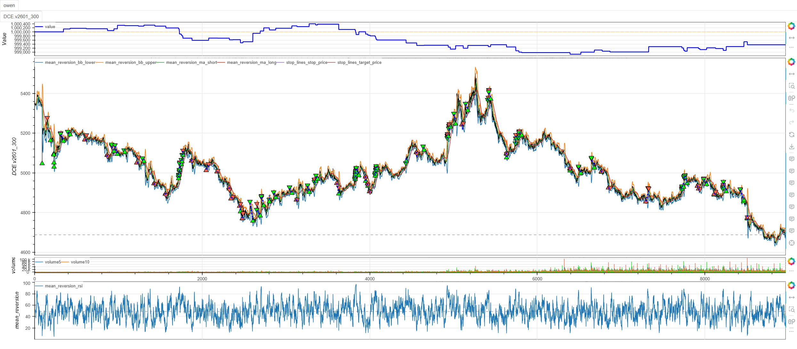
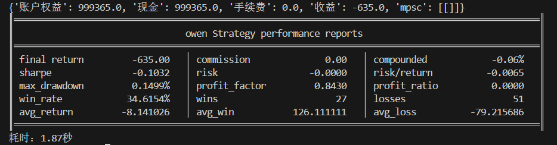

# **MiniBT量化交易之复合均值回归策略**

## 概述

复合均值回归策略是一种结合多种技术指标的先进均值回归系统，通过RSI超买超卖识别、布林带价格位置分析和移动平均趋势过滤的三重确认机制，捕捉市场从极端状态向均值回归的交易机会。该策略融合了动量、波动率和趋势分析，在保持均值回归核心理念的同时显著提高信号的可靠性。

## 原策略分析

### 策略核心逻辑

1. **三重指标融合**：结合RSI动量、布林带位置和移动平均趋势
2. **多维度确认**：要求同时满足动量极端、价格极端和趋势确认条件
3. **反向趋势设计**：在下跌趋势中寻找超卖做多机会，在上涨趋势中寻找超买做空机会
4. **严格过滤机制**：通过多重条件过滤减少假信号

### 策略参数

- `RSI_PERIOD`：RSI计算周期 (默认: 9)
- `OVERBOUGHT`：超买阈值 (默认: 78)
- `OVERSOLD`：超卖阈值 (默认: 22)
- `BOLL_PERIOD`：布林带周期 (默认: 15)
- `BOLL_DEV`：布林带标准差倍数 (默认: 2.5)

## MiniBT 转换实现

### 指标类结构

```python
class MeanReversion(BtIndicator):
    """https://www.shinnytech.com/articles/trading-strategy/mean-reversion/mean-reversion-strategy"""
    isplot = dict(long_signal=False, short_signal=False)
    params = dict(RSI_PERIOD=9, OVERBOUGHT=78, OVERSOLD=22,
                  BOLL_PERIOD=15, BOLL_DEV=2.5)
    overlap = dict(rsi=False, bb_lower=True, bb_upper=True,
                   ma_short=True, ma_long=True)
```

### 核心方法实现

#### 1. 多重指标计算

```python
def next(self):
    RSI_PERIOD = self.params.RSI_PERIOD  # RSI周期
    OVERBOUGHT = self.params.OVERBOUGHT  # 超买阈值
    OVERSOLD = self.params.OVERSOLD  # 超卖阈值
    BOLL_PERIOD = self.params.BOLL_PERIOD  # 布林带周期
    BOLL_DEV = self.params.BOLL_DEV  # 布林带标准差倍数
    # 计算指标
    rsi = self.close.rsi(RSI_PERIOD)
    boll = self.close.bbands(BOLL_PERIOD, BOLL_DEV)
    bb_lower = boll.bb_lower
    bb_upper = boll.bb_upper
```

#### 2. 趋势过滤系统

```python
# 加入MA趋势过滤
ma_short = self.close.sma(20)  # 20小时均线
ma_long = self.close.sma(60)  # 60小时均线
trend_up = ma_short.shift() > ma_long.shift()
trend_down = ma_short.shift() < ma_long.shift()
```

#### 3. 三重条件信号生成

```python
long_signal = rsi < OVERSOLD
long_signal &= self.close < bb_lower
long_signal &= trend_down

short_signal = rsi > OVERBOUGHT
short_signal &= self.close < bb_upper  # 注意：这里可能存在逻辑问题
short_signal &= trend_up
```

## 转换技术细节

### 1. 指标参数特点

**RSI参数**：
- 周期9（较短，提高敏感性）
- 超买78/超卖22（比传统70/30更极端）
- 确保只在深度超买超卖时交易

**布林带参数**：
- 周期15（中等长度）
- 标准差倍数2.5（较宽，捕捉更极端的偏离）
- 提供价格位置参考

### 2. 趋势过滤创新

使用双移动平均线识别趋势方向：
- **短期MA(20)**：反映近期趋势
- **长期MA(60)**：反映主要趋势
- **趋势确认**：要求短期MA与长期MA关系一致

### 3. 反向交易逻辑

**多头信号逻辑**：
- RSI深度超卖(<22)
- 价格跌破布林带下轨
- 处于下跌趋势中（逆势抄底）

**空头信号逻辑**：
- RSI深度超买(>78)
- 价格在布林带上轨下方（注意：这个条件可能需要调整）
- 处于上涨趋势中（逆势做空）

## 使用示例

```python
from minibt import *

class MeanReversion(BtIndicator):
    """https://www.shinnytech.com/articles/trading-strategy/mean-reversion/mean-reversion-strategy"""
    isplot = dict(long_signal=False, short_signal=False)
    params = dict(RSI_PERIOD=9, OVERBOUGHT=78, OVERSOLD=22,
                  BOLL_PERIOD=15, BOLL_DEV=2.5)
    overlap = dict(rsi=False, bb_lower=True, bb_upper=True,
                   ma_short=True, ma_long=True)

    def next(self):
        RSI_PERIOD = self.params.RSI_PERIOD
        OVERBOUGHT = self.params.OVERBOUGHT
        OVERSOLD = self.params.OVERSOLD
        BOLL_PERIOD = self.params.BOLL_PERIOD
        BOLL_DEV = self.params.BOLL_DEV
        rsi = self.close.rsi(RSI_PERIOD)
        boll = self.close.bbands(BOLL_PERIOD, BOLL_DEV)
        bb_lower = boll.bb_lower
        bb_upper = boll.bb_upper
        ma_short = self.close.sma(20)
        ma_long = self.close.sma(60)
        trend_up = ma_short.shift() > ma_long.shift()
        trend_down = ma_short.shift() < ma_long.shift()

        long_signal = rsi < OVERSOLD
        long_signal &= self.close < bb_lower
        long_signal &= trend_down

        short_signal = rsi > OVERBOUGHT
        short_signal &= self.close < bb_upper
        short_signal &= trend_up
        return rsi, bb_lower, bb_upper, ma_short, ma_long, long_signal, short_signal

class owen(Strategy):
    def __init__(self):
        self.min_start_length = 300
        self.data = self.get_kline(LocalDatas.v2601_300, height=500)
        self.mean_reversion = MeanReversion(self.data)

    def next(self):
        if not self.data.position:
            if self.mean_reversion.long_signal.new:
                self.data.buy(stop=BtStop.SegmentationTracking)
            elif self.mean_reversion.short_signal.new:
                self.data.sell(stop=BtStop.SegmentationTracking)

if __name__ == "__main__":
    Bt().run()
```


## 参数说明

1. **RSI_PERIOD (RSI周期)**：
   - 控制动量振荡器的敏感度
   - 较小周期提供更及时的信号
   - 默认值9平衡敏感性和稳定性

2. **OVERBOUGHT/OVERSOLD (超买超卖阈值)**：
   - 比传统阈值更极端，减少交易频率
   - 78/22确保只在深度极端时交易
   - 提高单次交易的胜率

3. **BOLL_PERIOD (布林带周期)**：
   - 控制波动率通道的计算窗口
   - 默认值15提供适中的波动率视角

4. **BOLL_DEV (标准差倍数)**：
   - 控制布林带宽度
   - 2.5倍标准差捕捉更极端的价格偏离
   - 确保价格真正处于统计异常状态

## 算法原理详解

### 1. 复合指标哲学

策略基于"多重确认"的交易哲学：
- **单一指标可能失效**，但多个独立指标同时发出信号时可靠性更高
- **不同维度的确认**：动量(RSI)、价格位置(布林带)、趋势(MA)
- **降低假信号概率**：要求三重条件同时满足

### 2. 反向趋势交易逻辑

**逆小势顺大势思想**：
- 在主要趋势中寻找反向的短期极端
- 下跌趋势中的超卖反弹（做多）
- 上涨趋势中的超买回调（做空）
- 利用主要趋势的"弹簧"效应

### 3. 深度极端的重要性

使用极端阈值的原因：
- 浅度超买超卖可能持续很长时间
- 深度极端通常意味着情绪化交易
- 回归动能在深度极端时更强
- 提高风险回报比

### 4. 布林带位置分析

布林带在策略中的作用：
- **下轨突破**：价格过度下跌，存在反弹需求
- **上轨位置**：识别价格是否处于高位（注意：原策略条件可能需要优化）
- **波动率环境**：宽布林带适应高波动市场

## 策略应用场景

### 1. 趋势中的回调交易

在明确趋势中寻找回归机会：

```python
def trend_pullback_strategy(rsi, bb_lower, bb_upper, ma_short, ma_long, price):
    # 明确趋势判断
    strong_uptrend = (ma_short > ma_long) & (ma_short > ma_short.rolling(10).mean())
    strong_downtrend = (ma_short < ma_long) & (ma_short < ma_short.rolling(10).mean())
    
    # 趋势中的回调信号
    uptrend_pullback = strong_uptrend & (rsi < 30) & (price > bb_lower)
    downtrend_rally = strong_downtrend & (rsi > 70) & (price < bb_upper)
    
    # 结合成交量确认
    volume_confirmation = volume > volume.rolling(20).mean()
    
    long_entry = uptrend_pullback & volume_confirmation
    short_entry = downtrend_rally & volume_confirmation
    
    return long_entry, short_entry
```

### 2. 市场状态自适应

根据市场波动率调整参数：

```python
def adaptive_mean_reversion_params(price, volatility_window=20):
    # 计算市场波动率
    volatility = price.rolling(volatility_window).std() / price.rolling(volatility_window).mean()
    
    # 自适应参数
    if volatility > 0.025:
        # 高波动率：更严格的阈值
        return 12, 80, 20, 20, 3.0
    elif volatility < 0.01:
        # 低波动率：更敏感的阈值
        return 7, 75, 25, 12, 2.0
    else:
        # 正常波动率：默认参数
        return 9, 78, 22, 15, 2.5
```

### 3. 多时间框架确认

```python
def multi_timeframe_mean_reversion(daily_mr, hourly_mr, four_hour_mr):
    # 各时间框架信号
    daily_long = daily_mr.long_signal
    daily_short = daily_mr.short_signal
    hourly_long = hourly_mr.long_signal
    hourly_short = hourly_mr.short_signal
    
    # 时间框架一致性
    long_alignment = daily_long & hourly_long
    short_alignment = daily_short & hourly_short
    
    # 价格位置确认
    daily_extreme = (daily_mr.rsi < 25) | (daily_mr.rsi > 75)
    hourly_extreme = (hourly_mr.rsi < 25) | (hourly_mr.rsi > 75)
    
    confirmed_long = long_alignment & daily_extreme & hourly_extreme
    confirmed_short = short_alignment & daily_extreme & hourly_extreme
    
    return confirmed_long, confirmed_short
```

## 风险管理建议

### 1. 基于波动率的动态仓位

```python
def mean_reversion_position_sizing(bb_width, rsi_value, base_size=1):
    """
    根据布林带宽度和RSI值调整仓位
    """
    # 布林带宽度标准化
    normalized_width = bb_width / bb_width.rolling(50).mean()
    
    # RSI极端程度
    rsi_extreme = max(abs(rsi_value - 50) / 50, 0)  # 0-1范围
    
    # 综合调整因子
    if normalized_width > 1.2:
        # 高波动率：减小仓位
        vol_adjustment = 0.7
    elif normalized_width < 0.8:
        # 低波动率：正常仓位
        vol_adjustment = 1.0
    else:
        vol_adjustment = 0.85
    
    # RSI极端程度加成
    rsi_adjustment = 1.0 + rsi_extreme * 0.5  # 最大1.5倍
    
    size_multiplier = vol_adjustment * rsi_adjustment
    
    return base_size * min(size_multiplier, 1.5)  # 限制最大1.5倍
```

### 2. 复合止损策略

```python
def composite_stop_loss(rsi, bb_middle, price, position_type, atr):
    """
    结合多种指标的止损策略
    """
    if position_type == 'long':
        # RSI回归正常
        stop1 = rsi > 50
        # 价格回归布林带中轨
        stop2 = price > bb_middle
        # ATR止损
        stop3 = price < (price.rolling(10).min() - atr * 1.5)
        # 趋势反转
        stop4 = ma_short < ma_long
        
        return stop1 | stop2 | stop3 | stop4
    else:
        # RSI回归正常
        stop1 = rsi < 50
        # 价格回归布林带中轨
        stop2 = price < bb_middle
        # ATR止损
        stop3 = price > (price.rolling(10).max() + atr * 1.5)
        # 趋势反转
        stop4 = ma_short > ma_long
        
        return stop1 | stop2 | stop3 | stop4
```

## 性能优化建议

### 1. 信号逻辑优化

修正原策略中的逻辑问题：

```python
def optimized_signal_logic(rsi, bb_lower, bb_upper, ma_short, ma_long, price):
    """
    优化信号生成逻辑
    """
    # 修正空头信号逻辑：价格应该突破上轨或接近上轨
    long_signal = (rsi < OVERSOLD) & (price < bb_lower) & (ma_short < ma_long)
    
    # 修正：空头信号应该在价格突破上轨或在上轨附近且RSI超买
    short_signal = (rsi > OVERBOUGHT) & (price > bb_upper * 0.98) & (ma_short > ma_long)
    
    # 增加成交量过滤
    volume_confirm = volume > volume.rolling(20).mean() * 1.1
    
    filtered_long = long_signal & volume_confirm
    filtered_short = short_signal & volume_confirm
    
    return filtered_long, filtered_short
```

### 2. 市场环境过滤

```python
def market_environment_filter(price, volume, min_volatility=0.005, max_volatility=0.03):
    """
    根据市场环境过滤交易机会
    """
    # 波动率过滤
    volatility = price.rolling(20).std() / price.rolling(20).mean()
    volatility_ok = (volatility >= min_volatility) & (volatility <= max_volatility)
    
    # 成交量活跃度
    volume_ratio = volume / volume.rolling(50).mean()
    volume_ok = volume_ratio > 0.8
    
    # 价格变动连续性
    price_changes = price.diff().abs()
    price_noise = price_changes.rolling(5).std() / price.rolling(5).std()
    noise_ok = price_noise < 0.5  # 避免在噪声过大时交易
    
    return volatility_ok & volume_ok & noise_ok
```

## 扩展功能

### 1. 均值回归强度指标

```python
def mean_reversion_strength(rsi, bb_position, ma_trend, lookback=20):
    """
    计算均值回归的强度指标
    """
    # RSI极端程度
    rsi_strength = abs(rsi - 50) / 50
    
    # 布林带位置强度
    if bb_position < 0:  # 低于下轨
        bb_strength = abs(bb_position) / 2.5  # 标准化到0-1
    else:  # 高于上轨
        bb_strength = bb_position / 2.5
    
    # 趋势背离强度（逆趋势程度）
    trend_strength = abs(ma_trend)  # ma_trend为趋势强度指标
    
    # 综合回归强度
    composite_strength = (rsi_strength + bb_strength + trend_strength) / 3
    
    # 强度分类
    strong_reversion = composite_strength > 0.7
    moderate_reversion = (composite_strength > 0.4) & (composite_strength <= 0.7)
    weak_reversion = composite_strength <= 0.4
    
    return composite_strength, strong_reversion, moderate_reversion, weak_reversion
```

### 2. 动态阈值调整

```python
def dynamic_threshold_adjustment(price, success_rate_lookback=100):
    """
    根据历史表现动态调整阈值
    """
    # 计算历史信号成功率
    # 这里需要策略的历史交易记录
    # 假设有交易记录数据
    
    # 基于成功率的阈值调整
    if success_rate > 0.6:
        # 高成功率：放宽阈值增加机会
        return 75, 25, 2.2
    elif success_rate < 0.4:
        # 低成功率：收紧阈值提高质量
        return 80, 20, 2.8
    else:
        # 中等成功率：保持默认
        return 78, 22, 2.5
```

## 总结

复合均值回归策略通过创新的多重指标融合和反向趋势设计，为交易者提供了一个高度可靠的均值回归交易框架。该策略结合了动量振荡、波动率分析和趋势判断，在识别市场极端状态的同时确保信号的统计显著性。

转换过程中，我们完整实现了复合指标系统的核心算法，包括RSI极端识别、布林带位置分析和移动平均趋势过滤。通过MiniBT框架的实现，用户可以在回测系统中充分利用这一先进的均值回归工具。

**需要特别注意**：原策略中的空头信号条件`self.close < bb_upper`可能存在逻辑问题，通常空头信号应该在价格突破上轨或接近上轨时产生。在实际应用中建议优化这一条件。

复合均值回归策略特别适用于：
- 高波动率市场中的极端回归交易
- 趋势市场中的回调捕捉
- 需要高确认度的系统化交易
- 多时间框架验证的回归机会

该策略的转换展示了如何将多个技术指标有机融合为统一的交易系统，为其他复合策略的开发提供了重要参考。复合均值回归的多重确认机制和严格过滤条件使其成为追求高胜率交易者的有力工具。

> 风险提示：本文涉及的交易策略、代码示例均为技术演示、教学探讨，仅用于展示逻辑思路，绝不构成任何投资建议、操作指引或决策依据 。金融市场复杂多变，存在价格波动、政策调整、流动性等多重风险，历史表现不预示未来结果。任何交易决策均需您自主判断、独立承担责任 —— 若依据本文内容操作，盈亏后果概由自身承担。请务必充分评估风险承受能力，理性对待市场，谨慎做出投资选择。