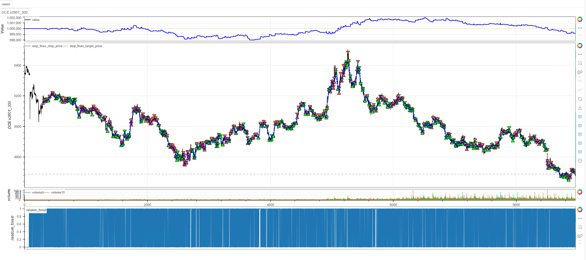
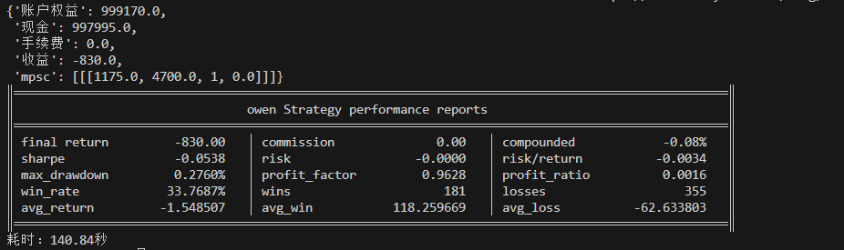

# **MiniBT量化交易之随机森林预测策略**

## 概述

随机森林预测策略是一种基于机器学习算法的量化交易方法，通过集成学习技术预测金融资产的价格走势。该策略利用随机森林分类器对多个技术指标进行综合分析，预测下一个交易日的价格涨跌方向，从而实现基于数据驱动的智能化交易决策。

## 原策略分析

### 策略核心逻辑

1. **多特征工程**：构建SMA、WMA、MOM三个技术指标作为输入特征
2. **滚动窗口训练**：使用最近N个交易日的数据动态训练模型
3. **分类预测**：将价格预测问题转化为二分类问题（上涨/下跌）
4. **实时更新**：每个交易日重新训练模型，适应市场变化

### 策略参数

- `n`：训练数据窗口大小 (默认: 75)
- `m`：SMA平滑参数 (默认: 0.02)
- `length`：技术指标计算周期 (默认: 30)

## MiniBT 转换实现

### 指标类结构

```python
class RandomForest(BtIndicator):
    """https://www.shinnytech.com/articles/trading-strategy/other/random-forest-strategy"""
    params = dict(n=75, m=0.02, length=30)
    overlap = False
```

### 核心方法实现

#### 1. 技术指标计算

```python
def next(self):
    n = self.params.n
    length = self.params.length
    m = self.params.m
    close = self.close
    sma = close.tqfunc.sma(length, m).bfill()
    wma = close.tqfunc.ema2(length).bfill()
    mom = close.tqfunc.trma(length).bfill()
    data = IndFrame(dict(close=close, sma=sma, wma=wma, mom=mom))
```

#### 2. 机器学习预测函数

```python
def get_prediction_data(close, sma, wma, mom, length=30):
    try:
        x_all = list(zip(sma, wma, mom))  # 样本特征组
        y_all = list(close[i] >= close[i - 1]
                     for i in list(reversed(range(-1, -n+1 - 1, -1))))  # 样本标签组
        y_all.insert(0, False)
        
        # 数据准备
        x_train = x_all[: -1]  # 训练数据: 特征
        x_predict = x_all[-1]  # 预测数据
        y_train = y_all[1:]    # 训练数据: 标签
        
        # 随机森林模型训练
        clf = RandomForestClassifier(
            n_estimators=length, bootstrap=True, random_state=42)
        clf.fit(x_train, y_train)
        
        return bool(clf.predict([x_predict]))  # 返回预测结果
    except:
        return False
```

#### 3. 滚动预测应用

```python
predict = data.rolling_apply(get_prediction_data, n)
return predict
```

## 转换技术细节

### 1. 特征工程设计

**三个核心特征**：
- **SMA (简单移动平均)**：趋势方向识别
- **WMA (加权移动平均)**：近期价格权重加强
- **MOM (动量指标)**：价格变化速度度量

### 2. 标签定义逻辑

价格涨跌的二值化标签：
```
标签 = 当前收盘价 >= 前一日收盘价
```
- True：价格上涨或持平
- False：价格下跌

### 3. 时间序列对齐

**训练数据构造**：
```
特征： [t-n, t-n+1, ..., t-1] 的技术指标
标签：  [t-n+1, t-n+2, ..., t] 的价格涨跌
```

**预测数据**：
```
当前时间t的技术指标 → 预测时间t+1的价格涨跌
```

### 4. 异常处理机制

```python
try:
    # 模型训练和预测
except:
    return False  # 异常情况下默认预测下跌
```

## 使用示例

```python
from minibt import *
from sklearn.ensemble import RandomForestClassifier
from functools import partial

class RandomForest(BtIndicator):
    """https://www.shinnytech.com/articles/trading-strategy/other/random-forest-strategy"""
    params = dict(n=75, m=0.02, length=30)
    overlap = False

    def next(self):
        n = self.params.n
        length = self.params.length
        m = self.params.m
        close = self.close
        sma = close.tqfunc.sma(length, m).bfill()
        wma = close.tqfunc.ema2(length).bfill()
        mom = close.tqfunc.trma(length).bfill()
        data = IndFrame(dict(close=close, sma=sma, wma=wma, mom=mom))

        def get_prediction_data(close, sma, wma, mom, length=30):
            try:
                x_all = list(zip(sma, wma, mom))
                y_all = list(close[i] >= close[i - 1]
                             for i in list(reversed(range(-1, -n+1 - 1, -1))))
                y_all.insert(0, False)
                
                x_train = x_all[: -1]
                x_predict = x_all[-1]
                y_train = y_all[1:]
                
                clf = RandomForestClassifier(
                    n_estimators=length, bootstrap=True, random_state=42)
                clf.fit(x_train, y_train)
                return bool(clf.predict([x_predict]))
            except:
                return False

        predict = data.rolling_apply(get_prediction_data, n)
        return predict

class owen(Strategy):
    def __init__(self):
        self.min_start_length = 300
        self.data = self.get_kline(LocalDatas.v2601_300, height=500)
        self.random_forest = RandomForest(self.data)

    def next(self):
        if not self.data.position:
            if self.random_forest.new:
                self.data.buy(stop=BtStop.SegmentationTracking)
            else:
                self.data.sell(stop=BtStop.SegmentationTracking)

if __name__ == "__main__":
    Bt().run()
```


## 参数说明

1. **n (训练窗口大小)**：
   - 控制用于训练模型的历史数据量
   - 较大窗口提供更多训练样本，但可能包含过时模式
   - 默认值75平衡样本数量和数据时效性

2. **length (指标周期)**：
   - 控制技术指标的计算周期
   - 同时作为随机森林中树的数量
   - 默认值30提供适中的特征敏感度

3. **m (SMA参数)**：
   - SMA计算中的平滑参数
   - 影响趋势指标的灵敏度
   - 默认值0.02提供适中的平滑效果

## 算法原理详解

### 1. 随机森林算法基础

随机森林的核心特性：
- **Bagging集成**：通过自助采样构建多个决策树
- **特征随机性**：每个节点分裂时随机选择特征子集
- **投票机制**：所有树的预测结果通过投票决定最终输出
- **抗过拟合**：集成学习天然抵抗过拟合

### 2. 金融时间序列预测的挑战

传统技术在金融预测中的局限性：
- 市场非平稳性
- 噪声干扰严重
- 多重共线性
- 模式时变性

随机森林的优势：
- 处理非线性关系
- 对异常值鲁棒
- 自动特征重要性评估
- 无需严格的数据分布假设

### 3. 滚动训练机制

动态适应市场变化：
- 每个交易日使用最新数据重新训练
- 模型持续学习新的市场模式
- 避免模型老化问题
- 适应市场regime转换

### 4. 特征设计哲学

选择三个技术指标的原因：
- **趋势特征**：SMA捕捉长期趋势
- **加权趋势**：WMA强调近期价格行为
- **动量特征**：MOM反映价格变化加速度
- **互补性**：三个指标从不同维度描述市场状态

## 策略应用场景

### 1. 多品种适应性测试

```python
def cross_asset_validation(asset_data, n=75, length=30):
    """
    在不同资产上验证随机森林策略的适应性
    """
    results = {}
    
    for asset_name, price_data in asset_data.items():
        # 应用随机森林策略
        rf_strategy = RandomForestStrategy(price_data, n=n, length=length)
        performance = rf_strategy.backtest()
        
        results[asset_name] = {
            'accuracy': performance.accuracy,
            'sharpe': performance.sharpe_ratio,
            'total_return': performance.total_return
        }
    
    return results
```

### 2. 特征重要性分析

```python
def feature_importance_analysis(close, sma, wma, mom, n=75, length=30):
    """
    分析各特征在随机森林中的重要性
    """
    # 准备数据
    x_all = list(zip(sma, wma, mom))
    y_all = [close[i] >= close[i-1] for i in range(1, len(close))]
    
    # 训练模型并获取特征重要性
    clf = RandomForestClassifier(n_estimators=length, random_state=42)
    clf.fit(x_all[:-1], y_all)
    
    importance = {
        'SMA': clf.feature_importances_[0],
        'WMA': clf.feature_importances_[1],
        'MOM': clf.feature_importances_[2]
    }
    
    return importance
```

### 3. 参数敏感性分析

```python
def parameter_sensitivity_analysis(price_data, parameter_grid):
    """
    分析策略对关键参数的敏感性
    """
    best_performance = -float('inf')
    best_params = {}
    
    for n in parameter_grid['n_values']:
        for length in parameter_grid['length_values']:
            
            # 计算该参数组合下的策略表现
            strategy = RandomForestStrategy(price_data, n=n, length=length)
            performance = strategy.backtest()
            
            # 使用夏普比率作为评估标准
            if performance.sharpe_ratio > best_performance:
                best_performance = performance.sharpe_ratio
                best_params = {'n': n, 'length': length, 'sharpe': performance.sharpe_ratio}
    
    return best_params
```

## 风险管理建议

### 1. 预测置信度加权仓位

```python
def confidence_based_position(prediction_proba, base_size=1, confidence_threshold=0.6):
    """
    根据预测置信度调整仓位大小
    """
    if prediction_proba >= confidence_threshold:
        # 高置信度：正常仓位
        confidence_multiplier = 1.0 + (prediction_proba - confidence_threshold) * 2
    else:
        # 低置信度：减小仓位
        confidence_multiplier = prediction_proba / confidence_threshold
    
    return base_size * min(confidence_multiplier, 2.0)  # 限制最大2倍
```

### 2. 模型性能监控止损

```python
def model_performance_stop_loss(recent_accuracy, threshold=0.45, lookback=20):
    """
    当模型近期表现不佳时暂停交易
    """
    # 计算最近N次预测的准确率
    if len(recent_accuracy) >= lookback:
        current_accuracy = sum(recent_accuracy[-lookback:]) / lookback
        # 如果准确率低于阈值，暂停交易
        return current_accuracy < threshold
    return False
```

## 性能优化建议

### 1. 增强特征工程

```python
def enhanced_feature_engineering(price_data, volume_data=None):
    """
    增强版特征工程，加入更多有意义的特征
    """
    features = {}
    
    # 基础价格特征
    features['returns'] = price_data.pct_change()
    features['volatility'] = price_data.rolling(20).std()
    features['high_low_ratio'] = high_data / low_data  # 如果有高低价数据
    
    # 技术指标特征
    features['rsi'] = price_data.rsi(14)
    features['macd'] = price_data.macd()
    features['bollinger_band_position'] = (price_data - price_data.rolling(20).mean()) / price_data.rolling(20).std()
    
    # 成交量特征（如果可用）
    if volume_data is not None:
        features['volume_ratio'] = volume_data / volume_data.rolling(20).mean()
        features['price_volume_correlation'] = price_data.rolling(10).corr(volume_data)
    
    # 时间特征
    features['day_of_week'] = price_data.index.dayofweek
    features['month'] = price_data.index.month
    
    return pd.DataFrame(features)
```

### 2. 模型集成优化

```python
class EnhancedRandomForest:
    """
    增强版随机森林策略，包含模型选择和集成
    """
    def __init__(self, price_data, feature_methods=['basic', 'technical', 'volume']):
        self.price_data = price_data
        self.feature_methods = feature_methods
        self.models = {}
        
    def create_ensemble_features(self):
        """创建集成特征集"""
        all_features = []
        
        if 'basic' in self.feature_methods:
            basic_features = self._create_basic_features()
            all_features.append(basic_features)
            
        if 'technical' in self.feature_methods:
            technical_features = self._create_technical_features()
            all_features.append(technical_features)
            
        if 'volume' in self.feature_methods and hasattr(self, 'volume_data'):
            volume_features = self._create_volume_features()
            all_features.append(volume_features)
            
        return pd.concat(all_features, axis=1)
    
    def train_ensemble_model(self):
        """训练集成模型"""
        features = self.create_ensemble_features()
        labels = self._create_labels()
        
        # 使用网格搜索寻找最佳参数
        param_grid = {
            'n_estimators': [50, 100, 200],
            'max_depth': [None, 10, 20],
            'min_samples_split': [2, 5, 10]
        }
        
        clf = RandomForestClassifier(random_state=42)
        grid_search = GridSearchCV(clf, param_grid, cv=5, scoring='accuracy')
        grid_search.fit(features[:-1], labels)
        
        self.best_model = grid_search.best_estimator_
        return self.best_model
```

## 扩展功能

### 1. 多时间框架预测

```python
def multi_timeframe_prediction(daily_data, hourly_data, four_hour_data):
    """
    结合多时间框架信息的预测
    """
    predictions = {}
    
    # 各时间框架独立预测
    daily_pred = random_forest_predict(daily_data)
    hourly_pred = random_forest_predict(hourly_data)
    four_hour_pred = random_forest_predict(four_hour_data)
    
    # 时间框架一致性投票
    votes = [daily_pred, hourly_pred, four_hour_pred]
    final_prediction = sum(votes) >= 2  # 多数投票
    
    predictions['daily'] = daily_pred
    predictions['hourly'] = hourly_pred
    predictions['four_hour'] = four_hour_pred
    predictions['consensus'] = final_prediction
    
    return predictions
```

### 2. 动态特征选择

```python
def dynamic_feature_selection(price_data, lookback_period=100):
    """
    根据近期表现动态选择最优特征组合
    """
    feature_sets = {
        'basic': ['sma', 'wma', 'mom'],
        'extended': ['sma', 'wma', 'mom', 'rsi', 'macd'],
        'volatility': ['sma', 'wma', 'mom', 'volatility', 'atr']
    }
    
    best_accuracy = 0
    best_feature_set = 'basic'
    
    for set_name, features in feature_sets.items():
        # 使用该特征集在最近lookback_period上的表现
        accuracy = evaluate_feature_set(price_data, features, lookback_period)
        
        if accuracy > best_accuracy:
            best_accuracy = accuracy
            best_feature_set = set_name
    
    return best_feature_set, best_accuracy
```

## 总结

随机森林预测策略通过先进的机器学习技术，为量化交易提供了一个数据驱动的智能化决策框架。该策略结合了传统技术分析指标和现代机器学习算法，在保持计算效率的同时提供基于统计学习的价格方向预测。

转换过程中，我们完整实现了随机森林策略的核心组件，包括特征工程、滚动训练、实时预测和交易执行。通过MiniBT框架的实现，用户可以在回测系统中验证这一机器学习策略的有效性。

随机森林预测策略特别适用于：
- 需要处理复杂非线性关系的市场环境
- 多因子综合分析的交易决策
- 适应性强、需要持续学习的交易系统
- 对传统技术指标方法进行补充和增强

该策略的转换展示了如何将机器学习算法与量化交易框架相结合，为其他基于人工智能的交易策略开发提供了重要参考。随机森林算法的鲁棒性和适应性使其成为量化交易者在复杂市场环境中的有力工具。

> 风险提示：本文涉及的交易策略、代码示例均为技术演示、教学探讨，仅用于展示逻辑思路，绝不构成任何投资建议、操作指引或决策依据 。机器学习模型存在过拟合、市场regime转换等风险，历史表现不预示未来结果。任何交易决策均需您自主判断、独立承担责任 —— 若依据本文内容操作，盈亏后果概由自身承担。请务必充分评估风险承受能力，理性对待市场，谨慎做出投资选择。