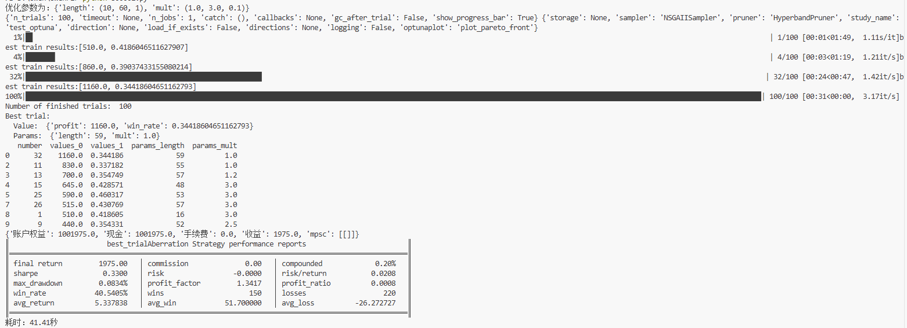
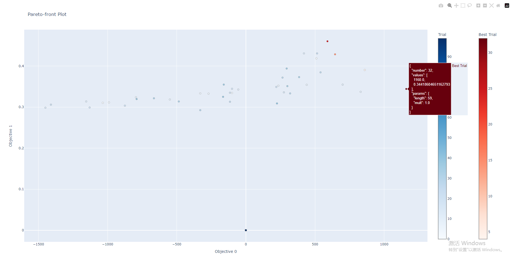
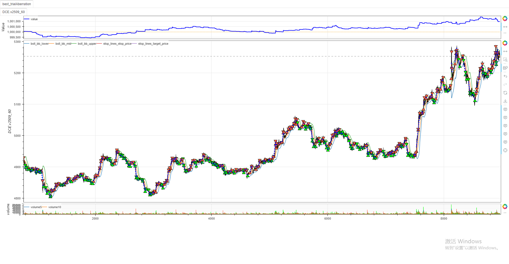

# **MiniBT量化策略之Aberration（布林线突破）量化策略**

## **一、策略原理**

Aberration 策略是一种经典的趋势跟踪策略，基于布林带（Bollinger Bands）技术指标构建。其核心逻辑是：

- **当价格突破布林带上轨时**，认为市场进入强势上涨趋势，执行买入操作；
- **当价格跌破布林带下轨时**，认为市场进入强势下跌趋势，执行卖出操作；
- **使用分段跟踪止损（SegmentationTracking）** 来控制风险和保护利润。

该策略适用于具有明显趋势性的市场（如期货、外汇等），能在趋势行情中捕捉较大的价格变动。

---

## **二、代码实现（基于 minibt 框架）**

```python
from minibt import *

class Aberration(Strategy):
    params = dict(length=26, mult=2)  # 默认参数：周期26，倍数2

    def __init__(self):
        self.data = self.get_kline(LocalDatas.v2509_60_1)  # 获取60分钟级别数据
        self.data.height = 600
        self.boll = self.data.close.bbands(self.params.length, self.params.mult)
        self.boll.overlap = True
        self.boll.isplot = dict(bb_width=False, bb_percent=False)  # 仅绘制上下轨

    def next(self):
        if not self.data.position:
            if self.data.close.new > self.boll.bb_upper.new:
                self.data.buy(stop=BtStop.SegmentationTracking)  # 突破上轨买入
            elif self.data.close.new < self.boll.bb_lower.new:
                self.data.sell(stop=BtStop.SegmentationTracking)  # 突破下轨卖出


if __name__ == "__main__":
    Bt().optstrategy(["profit", "win_rate"], (1, 1), opconfig=OptunaConfig(100),
                     length=range(10, 61), mult=(1., 3., 0.1), skip=False).run()
```

---

## **三、参数优化与结果分析**

### **优化配置**
- **优化参数**：
  - `length`（布林带周期）：范围 10~60，步长 1
  - `mult`（布林带宽度倍数）：范围 1.0~3.0，步长 0.1
- **优化目标**：最大化收益（`profit`）和胜率（`win_rate`）
- **优化算法**：NSGA-II（多目标遗传算法）
- **试验次数**：100 次

### **优化结果**
- **最佳参数组合**：
  - `length = 59`
  - `mult = 1.0`
- **对应性能**：
  - 收益：1160.0
  - 胜率：34.42%
  




### **性能摘要（回测结果）**
- **最终收益**：1975.0（0.20%）
- **夏普比率**：0.33
- **最大回撤**：0.0834%
- **胜率**：40.54%
- **平均盈利/亏损**：51.70 / -26.27
- 


## **四、策略特点与适用性**

1. **趋势跟随性强**：在单边行情中表现优异，能有效捕捉趋势启动信号；
2. **风险控制良好**：通过跟踪止损机制控制亏损，平均亏损远小于平均盈利；
3. **参数敏感度高**：布林带周期和倍数对策略性能影响显著，需定期优化；
4. **适用于高波动品种**：如商品期货、股指期货等趋势性较强的市场。

## **五、注意事项**

- 若 `skip=True`，则跳过参数优化，使用默认参数运行；
- 建议结合品种特性调整参数范围，避免过拟合；
- 可进一步引入过滤条件（如成交量、波动率）以提升策略稳定性。

如果需要进一步调整策略逻辑或优化目标，欢迎继续沟通！

> 风险提示：本文涉及的交易策略、代码示例均为技术演示、教学探讨，仅用于展示逻辑思路，绝不构成任何投资建议、操作指引或决策依据 。金融市场复杂多变，存在价格波动、政策调整、流动性等多重风险，历史表现不预示未来结果。任何交易决策均需您自主判断、独立承担责任 —— 若依据本文内容操作，盈亏后果概由自身承担。请务必充分评估风险承受能力，理性对待市场，谨慎做出投资选择。