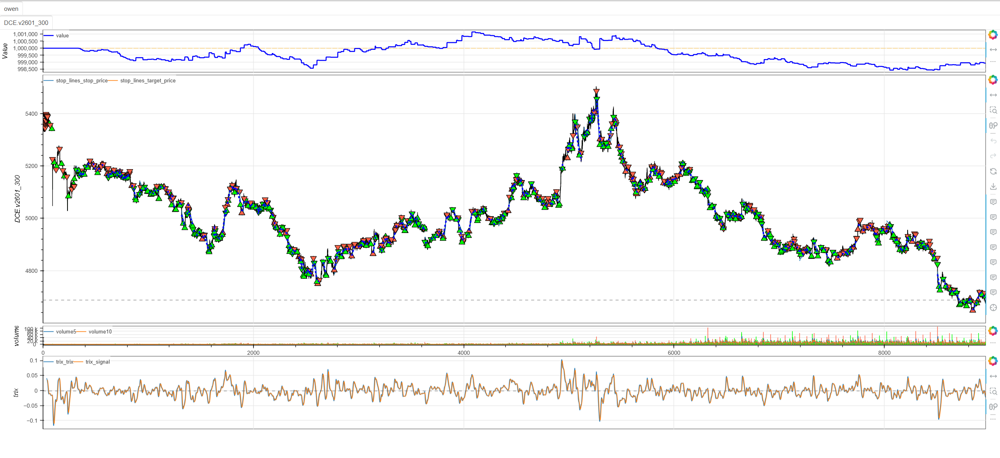
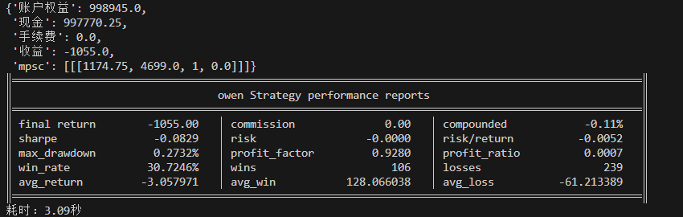

# **MiniBT量化策略之三重指数平滑平均线 (TRIX) 趋势策略**

## 概述

TRIX（三重指数平滑移动平均线）是一种经典的趋势动量振荡器，由Jack Hutson开发。该指标通过三次指数平滑处理来彻底过滤市场噪声，专门用于识别中长期趋势的转折点。TRIX在保持趋势跟踪能力的同时，提供清晰可靠的交易信号，特别适合趋势跟踪策略和动量分析。

## 原策略分析

### 指标核心逻辑

1. **三重平滑处理**：通过三次EMA平滑彻底过滤短期波动
2. **变化率计算**：计算三次平滑后值的百分比变化率
3. **信号线生成**：对TRIX线进行移动平均创建确认信号
4. **交叉信号识别**：通过主线与信号线的交叉产生交易信号

### 指标参数

- `TRIX_PERIOD`：TRIX计算周期 (默认: 12)
- `SIGNAL_PERIOD`：信号线计算周期 (默认: 9)
- `MA_PERIOD`：移动平均周期 (默认: 60，当前策略中未使用)

## MiniBT 转换实现

### 指标类结构

```python
class TRIX(BtIndicator):
    params = dict(TRIX_PERIOD=12, SIGNAL_PERIOD=9, MA_PERIOD=60)
    isplot = dict(long_signal=False, short_signal=False)
```

### 核心方法实现

#### 1. 三重指数平滑计算

```python
def next(self):
    ema1 = self.close.ema(self.params.TRIX_PERIOD)
    ema2 = ema1.ema(self.params.TRIX_PERIOD)
    ema3 = ema2.ema(self.params.TRIX_PERIOD)
```

#### 2. TRIX值计算

```python
trix = ema3.diff().ZeroDivision(ema3.shift())*100.
```

#### 3. 信号线生成

```python
signal = trix.sma(self.params.SIGNAL_PERIOD)
```

#### 4. 交易信号生成

```python
long_signal = trix.cross_up(signal)
short_signal = trix.cross_down(signal)
return trix, signal, long_signal, short_signal
```

## 转换技术细节

### 1. 三重指数平滑

转换代码使用MiniBT的EMA方法链式调用实现三重平滑：

```python
ema1 = self.close.ema(self.params.TRIX_PERIOD)
ema2 = ema1.ema(self.params.TRIX_PERIOD)
ema3 = ema2.ema(self.params.TRIX_PERIOD)
```

### 2. TRIX值计算

使用差分和零除保护方法计算百分比变化率：

```python
trix = ema3.diff().ZeroDivision(ema3.shift())*100.
```

### 3. 信号线计算

对TRIX线进行简单移动平均生成信号线：

```python
signal = trix.sma(self.params.SIGNAL_PERIOD)
```

### 4. 交叉信号检测

使用MiniBT的交叉检测方法识别交易信号：

```python
long_signal = trix.cross_up(signal)
short_signal = trix.cross_down(signal)
```

## 使用示例

```python
class TRIX(BtIndicator):
    """https://www.shinnytech.com/articles/trading-strategy/trend-following/trix-strategy"""
    params = dict(TRIX_PERIOD=12, SIGNAL_PERIOD=9, MA_PERIOD=60)
    isplot = dict(long_signal=False, short_signal=False)

    def next(self):
        ema1 = self.close.ema(self.params.TRIX_PERIOD)
        ema2 = ema1.ema(self.params.TRIX_PERIOD)
        ema3 = ema2.ema(self.params.TRIX_PERIOD)
        trix = ema3.diff().ZeroDivision(ema3.shift())*100.
        signal = trix.sma(self.params.SIGNAL_PERIOD)
        long_signal = trix.cross_up(signal)
        short_signal = trix.cross_down(signal)
        return trix, signal, long_signal, short_signal

class owen(Strategy):
    def __init__(self):
        self.min_start_length = 300
        self.data = self.get_kline(LocalDatas.v2601_300, height=500)
        self.trix = TRIX(self.data)

    def next(self):
        if not self.data.position:
            if self.trix.long_signal.new:
                self.data.buy(stop=BtStop.SegmentationTracking)
            elif self.trix.short_signal.new:
                self.data.sell(stop=BtStop.SegmentationTracking)

if __name__ == "__main__":
    Bt().run()
```


## 参数说明

1. **TRIX_PERIOD (TRIX计算周期)**：
   - 控制三重EMA的平滑程度
   - 影响趋势信号的敏感度
   - 较小的值产生更多信号，较大的值信号更可靠但滞后

2. **SIGNAL_PERIOD (信号线周期)**：
   - 控制信号线的平滑程度
   - 影响交叉信号的确认延迟
   - 较小的值产生更及时的交叉，较大的值过滤更多假信号

3. **MA_PERIOD (移动平均周期)**：
   - 当前策略中未使用的备用参数
   - 可用于额外的趋势过滤或确认

## 算法原理详解

### 1. 三重平滑机制

TRIX通过三次EMA平滑实现极强的噪声过滤：

```python
# 第一次平滑：基础趋势
ema1 = close.ema(period)
# 第二次平滑：强化趋势  
ema2 = ema1.ema(period)
# 第三次平滑：终极过滤
ema3 = ema2.ema(period)
```

这种设计使得TRIX对短期价格波动极其不敏感，专门捕捉中长期趋势。

### 2. 变化率计算原理

TRIX值反映的是三次平滑后价格的变化率：

```python
trix = (当前三期EMA - 上期三期EMA) / 上期三期EMA × 100
```

这种百分比变化率能够：
- 消除价格绝对值的影响
- 放大趋势转折信号
- 提供标准化的振荡器数值

### 3. 零轴参考意义

TRIX的零轴具有重要参考价值：
- **零轴上方**：整体趋势向上
- **零轴下方**：整体趋势向下
- **零轴穿越**：潜在趋势转折信号

## 转换注意事项

### 1. 数值稳定性处理

在计算变化率时添加零除保护：

```python
trix = ema3.diff().ZeroDivision(ema3.shift())*100.
```

### 2. 信号可视化配置

明确哪些信号需要绘图显示：

```python
isplot = dict(long_signal=False, short_signal=False)
```

### 3. 数据长度要求

由于三重平滑的计算特性，需要足够的数据长度：

```python
self.min_start_length = 300
```

## 策略应用场景

### 1. 趋势跟踪策略

TRIX特别适合趋势明显的市场环境：

```python
def trend_following_strategy(trix, signal, close):
    # 多头信号：TRIX上穿信号线且趋势向上
    long_entry = (trix.cross_up(signal)) & (trix > 0)
    # 空头信号：TRIX下穿信号线且趋势向下
    short_entry = (trix.cross_down(signal)) & (trix < 0)
    
    return long_entry, short_entry
```

### 2. 零轴突破策略

利用TRIX零轴突破识别主要趋势变化：

```python
def zero_line_breakout_strategy(trix, lookback=20):
    # 零轴向上突破
    zero_line_bullish = (trix > 0) & (trix.shift() <= 0)
    # 零轴向下跌破
    zero_line_bearish = (trix < 0) & (trix.shift() >= 0)
    
    # 结合动量确认
    momentum_confirmation = trix.diff(5) > 0
    
    confirmed_bullish = zero_line_bullish & momentum_confirmation
    confirmed_bearish = zero_line_bearish & (~momentum_confirmation)
    
    return confirmed_bullish, confirmed_bearish
```

### 3. 背离检测策略

识别价格与TRIX的背离信号：

```python
def trix_divergence_detection(price, trix, lookback=30):
    # 价格高点对应的TRIX值
    price_highs = price.rolling(lookback).max()
    trix_at_highs = trix[price == price_highs]
    
    # 价格低点对应的TRIX值
    price_lows = price.rolling(lookback).min()
    trix_at_lows = trix[price == price_lows]
    
    # 看跌背离：价格创新高，TRIX未创新高
    bearish_divergence = (price == price_highs) & (trix < trix_at_highs.rolling(2).max())
    
    # 看涨背离：价格创新低，TRIX未创新低
    bullish_divergence = (price == price_lows) & (trix > trix_at_lows.rolling(2).min())
    
    return bullish_divergence, bearish_divergence
```

## 风险管理建议

### 1. 动态仓位管理

根据TRIX值调整仓位大小：

```python
def trix_position_sizing(self,trix_value:IndSeries, base_size:int=1):
    # 根据TRIX绝对值调整仓位
    # TRIX值较大时趋势明确，可适当加大仓位
    trix_strength = (trix_value.abs() / 10).tqfunc.min(2.0)  # 限制最大2倍
    
    # 零轴附近减小仓位
    size_multiplier = 0.5*trix_value.ones
    size_multiplier.where(trix_value.abs()<1,trix_strength.tqfunc.min(1.5))
    return base_size * size_multiplier
```

### 2. 止损策略

基于TRIX信号的动态止损：

```python
def trix_stop_loss(trix, signal, position_type, close, atr):
    if position_type == 'long':
        # 多头止损：TRIX下穿信号线或价格回撤超过1.5倍ATR
        stop_condition1 = trix < signal
        stop_condition2 = close < (close.rolling(10).max() - 1.5 * atr)
        return stop_condition1 | stop_condition2
    else:
        # 空头止损：TRIX上穿信号线或价格反弹超过1.5倍ATR
        stop_condition1 = trix > signal
        stop_condition2 = close > (close.rolling(10).min() + 1.5 * atr)
        return stop_condition1 | stop_condition2
```

## 性能优化建议

### 1. 自适应参数调整

根据市场波动率调整TRIX参数：

```python
def adaptive_trix_params(close, volume, window=50):
    # 计算市场波动率
    volatility = close.rolling(window).std() / close.rolling(window).mean()
    volume_ratio = volume / volume.rolling(window).mean()
    
    # 自适应参数
    if volatility > 0.025:
        # 高波动率市场：使用更平滑的参数减少噪声
        return 15, 12
    elif volatility < 0.01:
        # 低波动率市场：使用更敏感的参数捕捉小幅波动
        return 8, 6
    else:
        # 正常市场条件：默认参数
        return 12, 9
```

### 2. 多时间框架确认

结合不同时间框架的TRIX信号：

```python
def multi_timeframe_trix_confirmation(daily_trix, hourly_trix, four_hour_trix):
    # 各时间框架趋势方向
    daily_trend = daily_trix > daily_trix.ema(10)
    hourly_trend = hourly_trix > hourly_trix.ema(10)
    four_hour_trend = four_hour_trix > four_hour_trix.ema(10)
    
    # 一致性得分
    alignment_score = daily_trend.astype(int) + hourly_trend.astype(int) + four_hour_trend.astype(int)
    
    # 强一致性入场信号
    strong_bullish_entry = (alignment_score == 3) & (hourly_trix.cross_up(hourly_trix.ema(9)))
    strong_bearish_entry = (alignment_score == -3) & (hourly_trix.cross_down(hourly_trix.ema(9)))
    
    return strong_bullish_entry, strong_bearish_entry
```

## 扩展功能

### 1. TRIX动量指标

基于TRIX变化率创建动量指标：

```python
def trix_momentum_indicator(trix, signal, lookback=5):
    # TRIX动量（变化率）
    trix_momentum = trix.diff(lookback)
    signal_momentum = signal.diff(lookback)
    
    # 动量背离检测
    momentum_bullish_divergence = (trix_momentum > 0) & (signal_momentum < 0)
    momentum_bearish_divergence = (trix_momentum < 0) & (signal_momentum > 0)
    
    # 综合动量强度
    momentum_strength = (trix_momentum.abs() + signal_momentum.abs()) / 2
    
    return trix_momentum, signal_momentum, momentum_bullish_divergence, momentum_bearish_divergence, momentum_strength
```

### 2. TRIX通道突破

基于TRIX创建动态通道：

```python
def trix_channel_breakout(trix, lookback=20):
    # TRIX的布林通道
    trix_upper = trix.rolling(lookback).mean() + 2 * trix.rolling(lookback).std()
    trix_lower = trix.rolling(lookback).mean() - 2 * trix.rolling(lookback).std()
    trix_middle = trix.rolling(lookback).mean()
    
    # 通道突破信号
    upper_breakout = (trix > trix_upper) & (trix.shift() <= trix_upper.shift())
    lower_breakout = (trix < trix_lower) & (trix.shift() >= trix_lower.shift())
    
    # 通道内位置
    trix_position = (trix - trix_lower) / (trix_upper - trix_lower)
    
    return trix_upper, trix_lower, trix_middle, trix_position, upper_breakout, lower_breakout
```

## 总结

TRIX指标通过创新的三重平滑处理和变化率计算，为交易者提供了一个强大而稳定的趋势动量振荡器。该指标结合了趋势识别、动量分析和信号确认功能，在保持对中长期趋势敏感性的同时有效过滤短期噪声。

转换过程中，我们完整实现了指标的所有核心算法，包括三重EMA平滑、百分比变化率计算和信号线生成。通过MiniBT框架的实现，用户可以在回测系统中充分利用这一经典的趋势分析工具。

TRIX指标特别适用于：
- 中长期趋势的识别和跟踪
- 趋势转折点的早期 detection
- 动量确认和趋势强度评估
- 低噪声环境下的稳定信号生成

该指标的转换展示了如何将经典的趋势动量算法转换为MiniBT框架可用的技术指标，为其他趋势类指标的实现提供了重要参考。TRIX指标的稳定性和可靠性使其成为趋势交易者的重要工具。

> 风险提示：本文涉及的交易策略、代码示例均为技术演示、教学探讨，仅用于展示逻辑思路，绝不构成任何投资建议、操作指引或决策依据 。金融市场复杂多变，存在价格波动、政策调整、流动性等多重风险，历史表现不预示未来结果。任何交易决策均需您自主判断、独立承担责任 —— 若依据本文内容操作，盈亏后果概由自身承担。请务必充分评估风险承受能力，理性对待市场，谨慎做出投资选择。