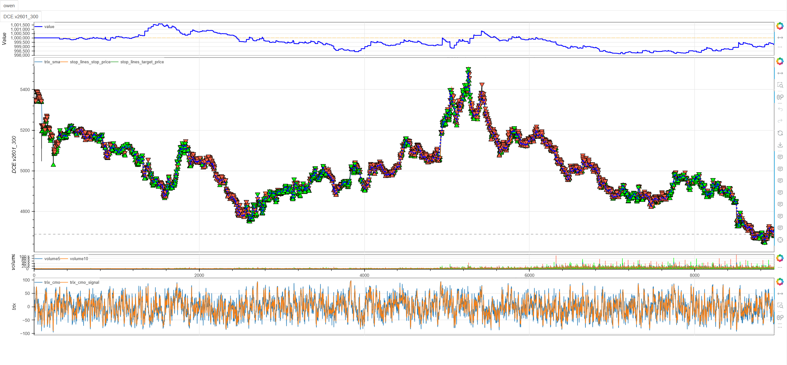
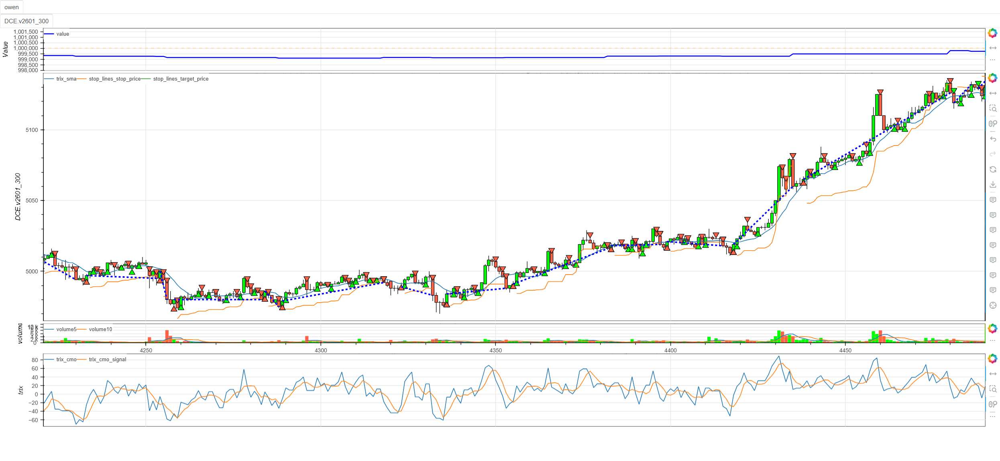
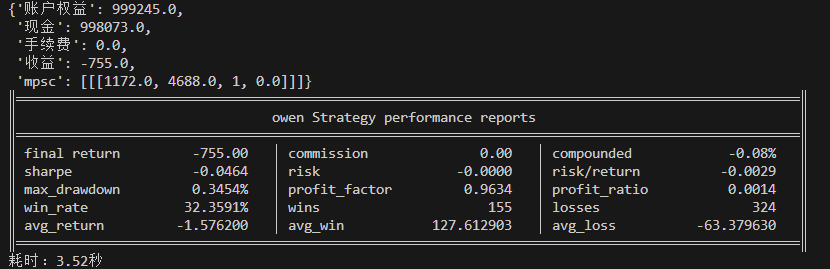

# **MiniBT量化交易之CMO策略**

## 概述

钱德动量震荡指标（Chande Momentum Oscillator, CMO）是由Tushar Chande博士开发的一种动量振荡器。该指标通过计算指定周期内上涨日和下跌日的价格变动来度量动量，其数值范围在-100到+100之间。CMO策略结合了动量分析、超买超卖识别和趋势确认，为交易者提供全面的市场动量视角。

## 原策略分析

### 指标核心逻辑

1. **动量计算**：通过上涨日和下跌日的价格变动计算纯动量
2. **信号线生成**：对CMO进行移动平均创建确认信号
3. **动量斜率分析**：计算CMO的变化率识别动量加速/减速
4. **多重信号触发**：结合阈值突破、信号线交叉和零轴穿越

### 指标参数

- `CMO_PERIOD`：CMO计算周期 (默认: 6)
- `SIGNAL_PERIOD`：信号线计算周期 (默认: 4)
- `CMO_SLOPE_PERIOD`：CMO斜率计算周期 (默认: 2)
- `OVERBOUGHT_THRESHOLD`：超买阈值 (默认: 50)
- `OVERSOLD_THRESHOLD`：超卖阈值 (默认: -50)
- `SMA_PERIOD`：移动平均周期 (默认: 10)

## MiniBT 转换实现

### 指标类结构

```python
class CMO(BtIndicator):
    """https://www.shinnytech.com/articles/trading-strategy/trend-following/cmo-strategy"""
    params = dict(CMO_PERIOD=6, SIGNAL_PERIOD=4, CMO_SLOPE_PERIOD=2,
                  OVERBOUGHT_THRESHOLD=50, OVERSOLD_THRESHOLD=-50, SMA_PERIOD=10)
    isplot = dict(cmo_slope=False, long_signal=False, short_signal=False)
    overlap = dict(sma=True, cmo=False, cmo_signal=False)
```

### 核心方法实现

#### 1. CMO指标计算

```python
def next(self):
    cmo = self.close.cmo(self.params.CMO_PERIOD)
```

#### 2. 信号线和斜率计算

```python
cmo_signal = cmo.sma(self.params.SIGNAL_PERIOD)
cmo_slope = cmo.diff(self.params.CMO_SLOPE_PERIOD)
sma = self.close.sma(self.params.SMA_PERIOD)
```

#### 3. 多重信号生成

```python
long_signal = cmo.cross_up(self.params.OVERSOLD_THRESHOLD)
long_signal |= cmo.cross_up(cmo_signal)
long_signal |= cmo.cross_up(0.)
short_signal = cmo.cross_down(self.params.OVERBOUGHT_THRESHOLD)
short_signal |= cmo.cross_down(cmo_signal)
short_signal |= cmo.cross_down(0.)
```

## 转换技术细节

### 1. CMO计算原理

CMO的计算基于价格变动：

```
CMO = (Su - Sd) / (Su + Sd) × 100
```

其中：
- Su = N日内上涨日的价格变动总和
- Sd = N日内下跌日的价格变动总和

### 2. 信号线生成

对CMO值进行移动平均平滑：

```python
cmo_signal = cmo.sma(self.params.SIGNAL_PERIOD)
```

### 3. 动量斜率分析

计算CMO的变化率识别动量变化：

```python
cmo_slope = cmo.diff(self.params.CMO_SLOPE_PERIOD)
```

### 4. 多重信号逻辑

采用"或"逻辑组合多个信号条件：

```python
long_signal = condition1 | condition2 | condition3
```

## 使用示例

```python
from minibt import *

class CMO(BtIndicator):
    """https://www.shinnytech.com/articles/trading-strategy/trend-following/cmo-strategy"""
    params = dict(CMO_PERIOD=6, SIGNAL_PERIOD=4, CMO_SLOPE_PERIOD=2,
                  OVERBOUGHT_THRESHOLD=50, OVERSOLD_THRESHOLD=-50, SMA_PERIOD=10)
    isplot = dict(cmo_slope=False, long_signal=False, short_signal=False)
    overlap = dict(sma=True, cmo=False, cmo_signal=False)

    def next(self):
        cmo = self.close.cmo(self.params.CMO_PERIOD)
        cmo_signal = cmo.sma(self.params.SIGNAL_PERIOD)
        cmo_slope = cmo.diff(self.params.CMO_SLOPE_PERIOD)
        sma = self.close.sma(self.params.SMA_PERIOD)
        long_signal = cmo.cross_up(self.params.OVERSOLD_THRESHOLD)
        long_signal |= cmo.cross_up(cmo_signal)
        long_signal |= cmo.cross_up(0.)
        short_signal = cmo.cross_down(self.params.OVERBOUGHT_THRESHOLD)
        short_signal |= cmo.cross_down(cmo_signal)
        short_signal |= cmo.cross_down(0.)

        return sma, cmo, cmo_signal, cmo_slope, long_signal, short_signal

class owen(Strategy):
    def __init__(self):
        self.min_start_length = 300
        self.data = self.get_kline(LocalDatas.v2601_300, height=500)
        self.cmo = CMO(self.data)

    def next(self):
        if not self.data.position:
            if self.cmo.long_signal.new:
                self.data.buy(stop=BtStop.SegmentationTracking)
            elif self.cmo.short_signal.new:
                self.data.sell(stop=BtStop.SegmentationTracking)

if __name__ == "__main__":
    Bt().run()
```



## 参数说明

1. **CMO_PERIOD (CMO计算周期)**：
   - 控制动量计算的回顾周期
   - 较小周期更敏感，较大周期更稳定
   - 默认值6适合捕捉短期动量变化

2. **SIGNAL_PERIOD (信号线周期)**：
   - 控制信号线的平滑程度
   - 影响交叉信号的确认延迟
   - 默认值4提供及时的确认信号

3. **CMO_SLOPE_PERIOD (斜率周期)**：
   - 控制动量变化率的计算周期
   - 识别动量的加速或减速
   - 默认值2捕捉近期动量变化

4. **阈值参数**：
   - `OVERBOUGHT_THRESHOLD=50`：超买水平
   - `OVERSOLD_THRESHOLD=-50`：超卖水平
   - 可根据市场波动性调整

## 算法原理详解

### 1. CMO计算机制

CMO通过分离上涨和下跌动量提供纯净的动量视图：

```python
# 伪代码表示CMO计算
def calculate_cmo(close, period):
    gains = []  # 上涨幅度
    losses = [] # 下跌幅度
    
    for i in range(1, len(close)):
        change = close[i] - close[i-1]
        if change > 0:
            gains.append(change)
            losses.append(0)
        else:
            gains.append(0)
            losses.append(abs(change))
    
    # 计算周期内总和
    sum_gains = sum(gains[-period:])
    sum_losses = sum(losses[-period:])
    
    # CMO公式
    cmo = (sum_gains - sum_losses) / (sum_gains + sum_losses) * 100
    return cmo
```

### 2. 多重信号逻辑

策略采用三重信号确认机制：

**多头信号条件**：
1. CMO从超卖区域(-50)上穿 → 超卖反弹
2. CMO上穿信号线 → 动量确认
3. CMO上穿零轴 → 趋势转强

**空头信号条件**：
1. CMO从超买区域(50)下穿 → 超买回调
2. CMO下穿信号线 → 动量减弱
3. CMO下穿零轴 → 趋势转弱

### 3. 可视化配置

```python
isplot = dict(cmo_slope=False, long_signal=False, short_signal=False)
overlap = dict(sma=True, cmo=False, cmo_signal=False)
```

- `sma`在主图显示，用于趋势确认
- `cmo`和`cmo_signal`在副图显示
- 交易信号可选择是否绘图

## 策略应用场景

### 1. 动量反转策略

利用CMO的超买超卖特性进行反转交易：

```python
def momentum_reversal_strategy(cmo, cmo_signal, close):
    # 超卖反弹多头
    oversold_bounce = (cmo < OVERSOLD_THRESHOLD) & (cmo.shift() >= OVERSOLD_THRESHOLD)
    # 超买回调空头
    overbought_pullback = (cmo > OVERBOUGHT_THRESHOLD) & (cmo.shift() <= OVERBOUGHT_THRESHOLD)
    
    # 结合信号线确认
    long_entry = oversold_bounce & (cmo > cmo_signal)
    short_entry = overbought_pullback & (cmo < cmo_signal)
    
    return long_entry, short_entry
```

### 2. 动量延续策略

识别动量加速的延续机会：

```python
def momentum_continuation_strategy(cmo, cmo_slope, close):
    # 动量加速识别
    momentum_acceleration = cmo_slope > 0
    # 强势动量区域
    strong_momentum = (cmo > 25) | (cmo < -25)
    
    # 动量延续信号
    long_continuation = strong_momentum & momentum_acceleration & (cmo > 0)
    short_continuation = strong_momentum & momentum_acceleration & (cmo < 0)
    
    return long_continuation, short_continuation
```

### 3. 多时间框架动量确认

```python
def multi_timeframe_cmo_confirmation(daily_cmo, hourly_cmo, four_hour_cmo):
    # 各时间框架动量方向
    daily_momentum = daily_cmo > 0
    hourly_momentum = hourly_cmo > 0
    four_hour_momentum = four_hour_cmo > 0
    
    # 动量一致性
    momentum_alignment = daily_momentum.astype(int) + hourly_momentum.astype(int) + four_hour_momentum.astype(int)
    
    # 强动量确认信号
    strong_bullish_momentum = (momentum_alignment == 3) & (hourly_cmo.cross_up(hourly_cmo.ema(4)))
    strong_bearish_momentum = (momentum_alignment == -3) & (hourly_cmo.cross_down(hourly_cmo.ema(4)))
    
    return strong_bullish_momentum, strong_bearish_momentum
```

## 风险管理建议

### 1. 基于CMO值的动态仓位

```python
def cmo_position_sizing(cmo_value:IndSeries, base_size=1):
    # 根据CMO绝对值调整仓位
    # 动量越强，仓位可适当增加
    cmo_strength = (cmo_value.abs() / 50).tqfunc.min(1.5)  # 限制最大1.5倍
    # 零轴附近保守仓位
    size_multiplier = 0.5 * cmo_value.ones
    size_multiplier.where(cmo_value.abs()<10,cmo_strength)
    return base_size * size_multiplier
```

### 2. CMO动量止损策略

```python
def cmo_momentum_stop_loss(cmo, cmo_signal, position_type, close, atr):
    if position_type == 'long':
        # 多头止损：CMO下穿信号线且动量转弱
        stop_condition1 = (cmo < cmo_signal) & (cmo < 0)
        stop_condition2 = close < (close.rolling(10).max() - 1.2 * atr)
        return stop_condition1 | stop_condition2
    else:
        # 空头止损：CMO上穿信号线且动量转强
        stop_condition1 = (cmo > cmo_signal) & (cmo > 0)
        stop_condition2 = close > (close.rolling(10).min() + 1.2 * atr)
        return stop_condition1 | stop_condition2
```

## 性能优化建议

### 1. 自适应参数调整

根据市场状态调整CMO参数：

```python
def adaptive_cmo_params(close, volatility_window=20):
    # 计算市场波动率
    volatility = close.rolling(volatility_window).std() / close.rolling(volatility_window).mean()
    
    # 自适应参数
    if volatility > 0.025:
        # 高波动率市场：使用更长周期减少噪声
        return 8, 6, 3
    elif volatility < 0.01:
        # 低波动率市场：使用更短周期提高敏感性
        return 4, 3, 1
    else:
        # 正常市场条件：默认参数
        return 6, 4, 2
```

### 2. 信号质量过滤

基于CMO斜率过滤低质量信号：

```python
def signal_quality_filter(cmo, cmo_slope, cmo_signal, min_slope=5):
    # 基础信号
    base_long = cmo.cross_up(cmo_signal) | cmo.cross_up(0)
    base_short = cmo.cross_down(cmo_signal) | cmo.cross_down(0)
    
    # 动量斜率过滤
    slope_filter = (cmo_slope).abs() > min_slope
    
    # 过滤后的信号
    filtered_long = base_long & slope_filter & (cmo_slope > 0)
    filtered_short = base_short & slope_filter & (cmo_slope < 0)
    
    return filtered_long, filtered_short
```

## 扩展功能

### 1. CMO背离检测

```python
def cmo_divergence_detection(price, cmo, lookback=20):
    # 价格高点对应的CMO值
    price_highs = price.rolling(lookback).max()
    cmo_at_highs = cmo[price == price_highs]
    
    # 价格低点对应的CMO值
    price_lows = price.rolling(lookback).min()
    cmo_at_lows = cmo[price == price_lows]
    
    # 看跌背离：价格创新高，CMO未创新高
    bearish_divergence = (price == price_highs) & (cmo < cmo_at_highs.rolling(2).max())
    
    # 看涨背离：价格创新低，CMO未创新低
    bullish_divergence = (price == price_lows) & (cmo > cmo_at_lows.rolling(2).min())
    
    return bullish_divergence, bearish_divergence
```

### 2. CMO动量强度指标

```python
def cmo_momentum_strength(cmo, cmo_signal, lookback=10):
    # CMO波动幅度
    cmo_range = cmo.rolling(lookback).max() - cmo.rolling(lookback).min()
    
    # CMO与信号线分离度
    separation = (cmo - cmo_signal).abs()
    
    # 动量强度得分（0-100）
    range_strength = (cmo_range / 100) * 50  # CMO范围0-100
    separation_strength = (separation / separation.quantile(0.9)) * 50
    
    momentum_strength = (range_strength + separation_strength) / 2
    
    return momentum_strength.clip(0, 100)
```

## 总结

CMO策略通过创新的动量计算方法和多重信号确认机制，为交易者提供了一个全面而灵敏的动量分析工具。该策略结合了超买超卖识别、动量确认和趋势分析，在保持对市场变化敏感性的同时提供可靠的交易信号。

转换过程中，我们完整实现了CMO指标的所有核心功能，包括纯动量计算、信号线生成、斜率分析和多重信号逻辑。通过MiniBT框架的实现，用户可以在回测系统中充分利用这一先进的动量分析工具。

CMO策略特别适用于：
- 动量市场的趋势识别和跟踪
- 超买超卖区域的反转交易
- 动量加速和减速的识别
- 多时间框架动量确认

该策略的转换展示了如何将复杂的动量分析算法转换为MiniBT框架可用的交易策略，为其他动量类指标的实现提供了重要参考。CMO指标的纯净动量视角和多重信号确认机制使其成为动量交易者的有力工具。

> 风险提示：本文涉及的交易策略、代码示例均为技术演示、教学探讨，仅用于展示逻辑思路，绝不构成任何投资建议、操作指引或决策依据 。金融市场复杂多变，存在价格波动、政策调整、流动性等多重风险，历史表现不预示未来结果。任何交易决策均需您自主判断、独立承担责任 —— 若依据本文内容操作，盈亏后果概由自身承担。请务必充分评估风险承受能力，理性对待市场，谨慎做出投资选择。