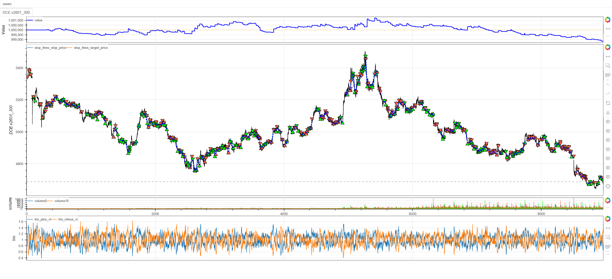
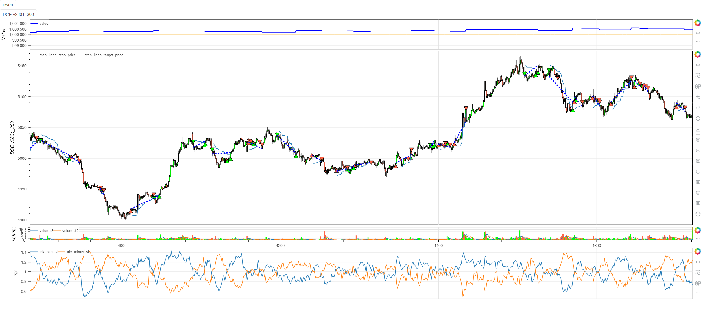
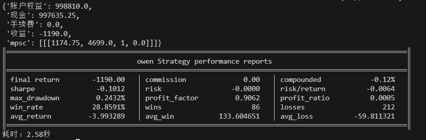

# **MiniBT量化交易之涡旋指标策略**

## 概述

涡旋指标（Vortex Indicator）由Etienne Botes和Douglas Siepman开发，是一种用于识别趋势方向和趋势强度的技术指标。该指标通过分析价格的高点和低点之间的运动来捕捉市场的"涡旋"运动，特别擅长识别新趋势的开始和现有趋势的延续。涡旋指标策略结合了趋势识别、动量确认和波动率分析，为交易者提供可靠的趋势跟踪信号。

## 原策略分析

### 指标核心逻辑

1. **涡旋运动计算**：通过高低价相对运动识别趋势方向
2. **真实波动范围**：使用ATR进行标准化处理
3. **双线交叉信号**：正向VI与负向VI的交叉产生交易信号
4. **阈值过滤机制**：通过VI_THRESHOLD过滤弱趋势信号

### 指标参数

- `VI_PERIOD`：涡旋指标计算周期 (默认: 14)
- `ATR_PERIOD`：真实波动范围计算周期 (默认: 14)
- `VI_THRESHOLD`：趋势强度阈值 (默认: 1.0)

## MiniBT 转换实现

### 指标类结构

```python
class Vortex(BtIndicator):
    """https://www.shinnytech.com/articles/trading-strategy/trend-following/vortex-indicator-strategy"""
    params = dict(VI_PERIOD=14, ATR_PERIOD=14, VI_THRESHOLD=1.0,)
    isplot = dict(long_signal=False, short_signal=False)
```

### 核心方法实现

#### 1. 基础波动计算

```python
def next(self):
    tr = self.true_range()
```

#### 2. 涡旋运动计算

```python
# 计算正向涡旋运动(+VM)
plus_vm = (self.high-self.low.shift()).abs()
# 计算负向涡旋运动(-VM)
minus_vm = (self.low-self.high.shift()).abs()
```

#### 3. 周期总和计算

```python
tr_sum = tr.rolling(self.params.ATR_PERIOD).sum()
plus_vm_sum = plus_vm.rolling(self.params.ATR_PERIOD).sum()
minus_vm_sum = minus_vm.rolling(self.params.ATR_PERIOD).sum()
```

#### 4. 涡旋指标计算

```python
plus_vi = plus_vm_sum/tr_sum
minus_vi = minus_vm_sum/tr_sum
```

#### 5. 交易信号生成

```python
long_signal = plus_vi.cross_up(minus_vi)
long_signal &= plus_vi > self.params.VI_THRESHOLD
short_signal = minus_vi.cross_up(plus_vi)
short_signal &= minus_vi > self.params.VI_THRESHOLD
```

## 转换技术细节

### 1. 真实波动范围计算

使用MiniBT内置方法计算真实波动：

```python
tr = self.true_range()
```

### 2. 涡旋运动定义

**正向涡旋运动(+VM)**：
- 测量当前高点与前期低点的距离
- 反映上升趋势的强度

**负向涡旋运动(-VM)**：
- 测量当前低点与前期高点的距离  
- 反映下降趋势的强度

### 3. 标准化处理

通过真实波动范围对涡旋运动进行标准化：

```python
plus_vi = plus_vm_sum / tr_sum
minus_vi = minus_vm_sum / tr_sum
```

### 4. 双重条件信号

采用"与"逻辑组合交叉信号和强度阈值：

```python
long_signal = cross_condition & strength_condition
```

## 使用示例

```python
from minibt import *

class Vortex(BtIndicator):
    """https://www.shinnytech.com/articles/trading-strategy/trend-following/vortex-indicator-strategy"""
    params = dict(VI_PERIOD=14, ATR_PERIOD=14, VI_THRESHOLD=1.0,)
    isplot = dict(long_signal=False, short_signal=False)

    def next(self):
        tr = self.true_range()
        plus_vm = (self.high-self.low.shift()).abs()
        minus_vm = (self.low-self.high.shift()).abs()
        tr_sum = tr.rolling(self.params.ATR_PERIOD).sum()
        plus_vm_sum = plus_vm.rolling(self.params.ATR_PERIOD).sum()
        minus_vm_sum = minus_vm.rolling(self.params.ATR_PERIOD).sum()
        plus_vi = plus_vm_sum/tr_sum
        minus_vi = minus_vm_sum/tr_sum
        long_signal = plus_vi.cross_up(minus_vi)
        long_signal &= plus_vi > self.params.VI_THRESHOLD
        short_signal = minus_vi.cross_up(plus_vi)
        short_signal &= minus_vi > self.params.VI_THRESHOLD
        return plus_vi, minus_vi, long_signal, short_signal

class owen(Strategy):
    def __init__(self):
        self.min_start_length = 300
        self.data = self.get_kline(LocalDatas.v2601_300, height=500)
        self.vortex = Vortex(self.data)

    def next(self):
        if not self.data.position:
            if self.vortex.long_signal.new:
                self.data.buy(stop=BtStop.SegmentationTracking)
            elif self.vortex.short_signal.new:
                self.data.sell(stop=BtStop.SegmentationTracking)

if __name__ == "__main__":
    Bt().run()
```



## 参数说明

1. **VI_PERIOD (涡旋指标周期)**：
   - 控制涡旋运动的平滑周期
   - 影响趋势信号的稳定性
   - 默认值14平衡敏感性和可靠性

2. **ATR_PERIOD (波动率周期)**：
   - 控制真实波动范围的计算周期
   - 影响标准化处理的准确性
   - 通常与VI_PERIOD保持一致

3. **VI_THRESHOLD (趋势强度阈值)**：
   - 过滤弱趋势信号的临界值
   - 阈值越高，信号越可靠但数量越少
   - 默认值1.0适合大多数市场条件

## 算法原理详解

### 1. 涡旋运动计算原理

涡旋指标基于价格极值点的相对运动：

**正向涡旋运动(+VM)**：
```
+VM = |当前最高价 - 前一期最低价|
```

**负向涡旋运动(-VM)**：
```
-VM = |当前最低价 - 前一期最高价|
```

### 2. 标准化处理机制

通过真实波动范围进行标准化：

```
+VI = N周期+VM总和 / N周期TR总和
-VI = N周期-VM总和 / N周期TR总和
```

这种标准化确保：
- 消除价格绝对值的影响
- 适应不同波动率环境
- 提供可比性的指标数值

### 3. 信号生成逻辑

**多头信号**：
- +VI上穿-VI（趋势方向转变）
- +VI > 阈值（趋势强度确认）

**空头信号**：
- -VI上穿+VI（趋势方向转变）  
- -VI > 阈值（趋势强度确认）

### 4. 阈值过滤意义

VI_THRESHOLD的作用：
- 过滤震荡市中的假信号
- 确保趋势具有足够强度
- 提高信号的质量和可靠性

## 策略应用场景

### 1. 趋势起始识别

利用涡旋指标捕捉新趋势的开始：

```python
def trend_initiation_strategy(plus_vi, minus_vi, threshold=1.0):
    # 上升趋势起始
    uptrend_start = (plus_vi.cross_up(minus_vi)) & (plus_vi > threshold)
    # 下降趋势起始
    downtrend_start = (minus_vi.cross_up(plus_vi)) & (minus_vi > threshold)
    
    # 结合价格位置确认
    price_confirmation = close > close.rolling(20).mean()
    
    confirmed_uptrend = uptrend_start & price_confirmation
    confirmed_downtrend = downtrend_start & (~price_confirmation)
    
    return confirmed_uptrend, confirmed_downtrend
```

### 2. 趋势延续确认

识别现有趋势的加强信号：

```python
def trend_continuation_strategy(plus_vi, minus_vi, close, lookback=10):
    # 趋势方向
    trend_direction = plus_vi > minus_vi
    
    # 趋势强度变化
    plus_strength = plus_vi.diff(5) > 0
    minus_strength = minus_vi.diff(5) > 0
    
    # 趋势延续信号
    uptrend_continuation = trend_direction & plus_strength & (close > close.rolling(20).mean())
    downtrend_continuation = (~trend_direction) & minus_strength & (close < close.rolling(20).mean())
    
    return uptrend_continuation, downtrend_continuation
```

### 3. 多时间框架趋势确认

```python
def multi_timeframe_vortex_confirmation(daily_vi, hourly_vi, four_hour_vi):
    # 各时间框架趋势方向
    daily_trend = daily_vi.plus_vi > daily_vi.minus_vi
    hourly_trend = hourly_vi.plus_vi > hourly_vi.minus_vi
    four_hour_trend = four_hour_vi.plus_vi > four_hour_vi.minus_vi
    
    # 趋势一致性
    trend_alignment = daily_trend.astype(int) + hourly_trend.astype(int) + four_hour_trend.astype(int)
    
    # 强趋势确认信号
    strong_uptrend_confirmation = (trend_alignment == 3) & (hourly_vi.plus_vi.cross_up(hourly_vi.minus_vi))
    strong_downtrend_confirmation = (trend_alignment == -3) & (hourly_vi.minus_vi.cross_up(hourly_vi.plus_vi))
    
    return strong_uptrend_confirmation, strong_downtrend_confirmation
```

## 风险管理建议

### 1. 基于VI值的动态仓位

```python
def vortex_position_sizing(plus_vi:IndSeries, minus_vi:IndSeries, base_size=1):
    # 根据VI值差异调整仓位
    vi_diff = (plus_vi - minus_vi).abs()
    # 趋势强度评估
    # 强趋势：正常仓位
    # 中等趋势：适度减小仓位
    # 弱趋势：保守仓位
    size_multiplier = 0.5 * plus_vi.ones
    size_multiplier = size_multiplier.mask(vi_diff>0.5,1.).mask((vi_diff<=0.5) & (vi_diff>0.2),0.7)
    return base_size * size_multiplier
```

### 2. 涡旋指标止损策略

```python
def vortex_stop_loss(plus_vi, minus_vi, position_type, close, atr):
    if position_type == 'long':
        # 多头止损：+VI下穿-VI或价格回撤超过1倍ATR
        stop_condition1 = plus_vi < minus_vi
        stop_condition2 = close < (close.rolling(10).max() - atr)
        return stop_condition1 | stop_condition2
    else:
        # 空头止损：-VI下穿+VI或价格反弹超过1倍ATR
        stop_condition1 = minus_vi < plus_vi
        stop_condition2 = close > (close.rolling(10).min() + atr)
        return stop_condition1 | stop_condition2
```

## 性能优化建议

### 1. 自适应参数调整

根据市场波动率调整涡旋指标参数：

```python
def adaptive_vortex_params(close, volatility_window=20):
    # 计算市场波动率
    volatility = close.rolling(volatility_window).std() / close.rolling(volatility_window).mean()
    
    # 自适应参数
    if volatility > 0.03:
        # 高波动率市场：使用更长周期和更高阈值
        return 20, 20, 1.2
    elif volatility < 0.01:
        # 低波动率市场：使用更短周期和更低阈值
        return 10, 10, 0.8
    else:
        # 正常市场条件：默认参数
        return 14, 14, 1.0
```

### 2. 信号质量过滤

基于VI值变化率过滤低质量信号：

```python
def vortex_signal_quality_filter(plus_vi, minus_vi, min_strength_change=0.1):
    # 基础交叉信号
    base_long = plus_vi.cross_up(minus_vi)
    base_short = minus_vi.cross_up(plus_vi)
    
    # 趋势强度变化过滤
    plus_strength_change = plus_vi.diff(3) > min_strength_change
    minus_strength_change = minus_vi.diff(3) > min_strength_change
    
    # 过滤后的信号
    filtered_long = base_long & plus_strength_change & (plus_vi > 1.0)
    filtered_short = base_short & minus_strength_change & (minus_vi > 1.0)
    
    return filtered_long, filtered_short
```

## 扩展功能

### 1. 涡旋指标背离检测

```python
def vortex_divergence_detection(price, plus_vi, minus_vi, lookback=20):
    # 价格高点对应的VI值
    price_highs = price.rolling(lookback).max()
    plus_vi_at_highs = plus_vi[price == price_highs]
    minus_vi_at_highs = minus_vi[price == price_highs]
    
    # 价格低点对应的VI值
    price_lows = price.rolling(lookback).min()
    plus_vi_at_lows = plus_vi[price == price_lows]
    minus_vi_at_lows = minus_vi[price == price_lows]
    
    # 看跌背离：价格创新高，+VI未创新高
    bearish_divergence = (price == price_highs) & (plus_vi < plus_vi_at_highs.rolling(2).max())
    
    # 看涨背离：价格创新低，-VI未创新低
    bullish_divergence = (price == price_lows) & (minus_vi < minus_vi_at_lows.rolling(2).max())
    
    return bullish_divergence, bearish_divergence
```

### 2. 涡旋趋势强度指标

```python
def vortex_trend_strength(plus_vi, minus_vi, lookback=10):
    # VI值差异
    vi_difference = plus_vi - minus_vi
    
    # 趋势强度得分（-100到+100）
    raw_strength = vi_difference * 50  # 放大差异
    
    # 平滑处理
    smoothed_strength = raw_strength.rolling(5).mean()
    
    # 趋势强度分类
    strong_uptrend = smoothed_strength > 25
    weak_uptrend = (smoothed_strength > 0) & (smoothed_strength <= 25)
    weak_downtrend = (smoothed_strength < 0) & (smoothed_strength >= -25)
    strong_downtrend = smoothed_strength < -25
    
    return smoothed_strength, strong_uptrend, weak_uptrend, weak_downtrend, strong_downtrend
```

## 总结

涡旋指标策略通过创新的价格极值点运动分析和标准化处理，为交易者提供了一个强大而可靠的趋势识别工具。该策略结合了趋势方向判断、趋势强度评估和波动率适应，在保持对趋势变化敏感性的同时提供高质量的交易信号。

转换过程中，我们完整实现了涡旋指标的所有核心算法，包括涡旋运动计算、真实波动范围标准化、双线交叉信号和阈值过滤机制。通过MiniBT框架的实现，用户可以在回测系统中充分利用这一先进的趋势分析工具。

涡旋指标策略特别适用于：
- 趋势市场的方向识别和跟踪
- 新趋势起点的早期 detection
- 趋势强度的定量评估
- 多时间框架趋势确认

该策略的转换展示了如何将复杂的价格运动分析算法转换为MiniBT框架可用的交易策略，为其他趋势类指标的实现提供了重要参考。涡旋指标的独特视角和可靠信号生成机制使其成为趋势跟踪交易者的有力工具。

> 风险提示：本文涉及的交易策略、代码示例均为技术演示、教学探讨，仅用于展示逻辑思路，绝不构成任何投资建议、操作指引或决策依据 。金融市场复杂多变，存在价格波动、政策调整、流动性等多重风险，历史表现不预示未来结果。任何交易决策均需您自主判断、独立承担责任 —— 若依据本文内容操作，盈亏后果概由自身承担。请务必充分评估风险承受能力，理性对待市场，谨慎做出投资选择。