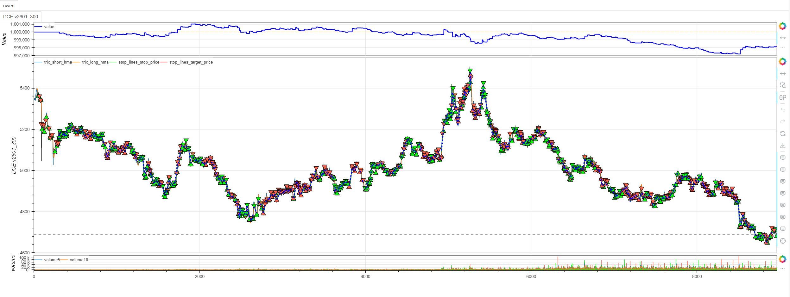
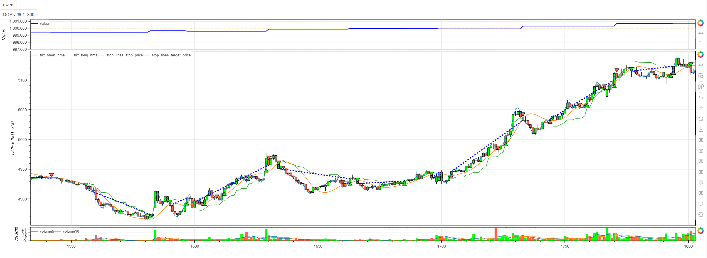
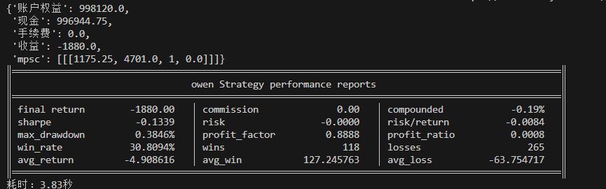

# **MiniBT量化交易之Hull移动平均线策略**

## 概述

赫尔移动平均线（Hull Moving Average，简称HMA）由Alan Hull开发，是一种通过加权移动平均计算来显著减少滞后性的先进趋势指标。该指标通过巧妙的数学构造，在保持平滑性的同时大幅提高对价格变化的响应速度，被誉为"无滞后的移动平均线"。Hull策略结合了快速信号响应和趋势确认机制，为交易者提供高质量的趋势跟踪信号。

## 原策略分析

### 指标核心逻辑

1. **双重WMA平滑**：通过两次加权移动平均计算基础组件
2. **差分放大机制**：利用WMA差值放大价格变化信号
3. **最终平滑处理**：对放大信号进行平方根周期WMA平滑
4. **双周期交叉**：短期HMA与长期HMA交叉产生交易信号

### 指标参数

- `LONG_HMA_PERIOD`：长期HMA周期 (默认: 30)
- `SHORT_HMA_PERIOD`：短期HMA周期 (默认: 5)

## MiniBT 转换实现

### 指标类结构

```python
class Hull(BtIndicator):
    """https://www.shinnytech.com/articles/trading-strategy/trend-following/hull-strategy"""
    params = dict(LONG_HMA_PERIOD=30, SHORT_HMA_PERIOD=5)
    isplot = dict(long_signal=False, short_signal=False)
    overlap = True
```

### 核心方法实现

#### 1. HMA计算辅助方法

```python
def _hma(self, period):
    half_period = period // 2
    sqrt_period = int(np.sqrt(period))
    wma1 = self.close.wma(half_period)
    wma2 = self.close.wma(period)
    raw_hma = 2 * wma1 - wma2
    return raw_hma.wma(sqrt_period)
```

#### 2. 双周期HMA计算

```python
def next(self):
    short_hma = self._hma(self.params.SHORT_HMA_PERIOD)
    long_hma = self._hma(self.params.LONG_HMA_PERIOD)
```

#### 3. 交易信号生成

```python
long_signal = short_hma.cross_up(long_hma)
long_signal &= self.close > long_hma
short_signal = short_hma.cross_down(long_hma)
short_signal &= self.close < long_hma
```

## 转换技术细节

### 1. HMA计算步骤分解

HMA的计算分为三个关键步骤：

**步骤1：计算半周期和全周期WMA**
```python
wma1 = self.close.wma(half_period)  # 半周期WMA
wma2 = self.close.wma(period)       # 全周期WMA
```

**步骤2：构造原始HMA**
```python
raw_hma = 2 * wma1 - wma2  # 差分放大
```

**步骤3：最终平滑处理**
```python
return raw_hma.wma(sqrt_period)  # 平方根周期WMA
```

### 2. 信号确认机制

采用双重确认条件：

**多头信号**：
- 短期HMA上穿长期HMA（趋势方向）
- 收盘价高于长期HMA（价格位置确认）

**空头信号**：
- 短期HMA下穿长期HMA（趋势方向）  
- 收盘价低于长期HMA（价格位置确认）

### 3. 可视化配置

```python
overlap = True  # HMA在主图显示
isplot = dict(long_signal=False, short_signal=False)  # 交易信号可选显示
```

## 使用示例

```python
from minibt import *
import numpy as np

class Hull(BtIndicator):
    """https://www.shinnytech.com/articles/trading-strategy/trend-following/hull-strategy"""
    params = dict(LONG_HMA_PERIOD=30, SHORT_HMA_PERIOD=5)
    isplot = dict(long_signal=False, short_signal=False)
    overlap = True

    def _hma(self, period):
        half_period = period // 2
        sqrt_period = int(np.sqrt(period))
        wma1 = self.close.wma(half_period)
        wma2 = self.close.wma(period)
        raw_hma = 2 * wma1 - wma2
        return raw_hma.wma(sqrt_period)

    def next(self):
        short_hma = self._hma(self.params.SHORT_HMA_PERIOD)
        long_hma = self._hma(self.params.LONG_HMA_PERIOD)
        long_signal = short_hma.cross_up(long_hma)
        long_signal &= self.close > long_hma
        short_signal = short_hma.cross_down(long_hma)
        short_signal &= self.close < long_hma
        return short_hma, long_hma, long_signal, short_signal

class owen(Strategy):
    def __init__(self):
        self.min_start_length = 300
        self.data = self.get_kline(LocalDatas.v2601_300, height=500)
        self.hull = Hull(self.data)

    def next(self):
        if not self.data.position:
            if self.hull.long_signal.new:
                self.data.buy(stop=BtStop.SegmentationTracking)
            elif self.hull.short_signal.new:
                self.data.sell(stop=BtStop.SegmentationTracking)

if __name__ == "__main__":
    Bt().run()
```



## 参数说明

1. **LONG_HMA_PERIOD (长期HMA周期)**：
   - 控制主要趋势的识别周期
   - 较大值提供更稳定的趋势信号
   - 默认值30适合中期趋势跟踪

2. **SHORT_HMA_PERIOD (短期HMA周期)**：
   - 控制短期动量的响应速度
   - 较小值提供更及时的信号
   - 默认值5平衡敏感性和稳定性

## 算法原理详解

### 1. HMA数学构造原理

HMA通过巧妙的数学设计实现"无滞后"效果：

```
HMA = WMA(2 × WMA(n/2) - WMA(n), √n)
```

其中：
- `WMA(n/2)`：半周期加权移动平均，快速响应
- `WMA(n)`：全周期加权移动平均，稳定基准
- `2 × WMA(n/2) - WMA(n)`：差分放大，消除滞后
- `WMA(√n)`：最终平滑，保持曲线平滑性

### 2. 滞后消除机制

传统移动平均线的滞后主要源于对历史数据的平等加权。HMA通过以下方式解决：

**相位校正**：通过半周期和全周期WMA的差值，校正价格数据的相位偏移
**动量放大**：2倍系数的应用放大近期价格变化的权重
**自适应平滑**：平方根周期的WMA提供恰到好处的最终平滑

### 3. 信号生成逻辑

**趋势方向确认**：
- 短期HMA代表近期动量方向
- 长期HMA代表主要趋势方向
- 交叉信号确认趋势变化

**价格位置确认**：
- 收盘价相对于长期HMA的位置
- 确保信号与价格走势一致
- 过滤假突破和噪声信号

## 策略应用场景

### 1. 趋势起始捕捉

利用HMA的快速响应特性捕捉新趋势：

```python
def trend_initiation_detection(short_hma, long_hma, close, confirmation_bars=3):
    # 基础交叉信号
    base_long = short_hma.cross_up(long_hma)
    base_short = short_hma.cross_down(long_hma)
    
    # 趋势确认：连续N根K线保持位置
    trend_confirmation = (short_hma > long_hma).rolling(confirmation_bars).sum() == confirmation_bars
    
    confirmed_long = base_long & trend_confirmation & (close > long_hma)
    confirmed_short = base_short & (~trend_confirmation) & (close < long_hma)
    
    return confirmed_long, confirmed_short
```

### 2. 趋势回调入场

识别趋势中的回调入场机会：

```python
def trend_pullback_entry(short_hma, long_hma, close, atr, lookback=10):
    # 主要趋势方向
    main_trend = short_hma > long_hma
    
    # 回调识别：价格回撤至长期HMA附近
    pullback_to_support = (close <= long_hma * 1.02) & (close >= long_hma * 0.98)
    pullback_to_resistance = (close >= long_hma * 0.98) & (close <= long_hma * 1.02)
    
    # 动量恢复信号
    momentum_recovery = short_hma.diff(3) > 0
    
    long_pullback = main_trend & pullback_to_support & momentum_recovery
    short_pullback = (~main_trend) & pullback_to_resistance & (~momentum_recovery)
    
    return long_pullback, short_pullback
```

### 3. 多时间框架HMA确认

```python
def multi_timeframe_hull_confirmation(daily_hull, hourly_hull, four_hour_hull):
    # 各时间框架趋势方向
    daily_trend = daily_hull.short_hma > daily_hull.long_hma
    hourly_trend = hourly_hull.short_hma > hourly_hull.long_hma
    four_hour_trend = four_hour_hull.short_hma > four_hour_hull.long_hma
    
    # 趋势一致性评分
    trend_alignment = daily_trend.astype(int) + hourly_trend.astype(int) + four_hour_trend.astype(int)
    
    # 强趋势确认信号
    strong_bullish_confirmation = (trend_alignment == 3) & (hourly_hull.short_hma.cross_up(hourly_hull.long_hma))
    strong_bearish_confirmation = (trend_alignment == -3) & (hourly_hull.short_hma.cross_down(hourly_hull.long_hma))
    
    return strong_bullish_confirmation, strong_bearish_confirmation
```

## 风险管理建议

### 1. 基于HMA斜率的动态仓位

```python
def hull_position_sizing(short_hma:IndSeries, long_hma:IndSeries, base_size=1):
    # 计算HMA斜率作为趋势强度指标
    short_slope = short_hma.diff(5)
    long_slope = long_hma.diff(10)
    # 趋势强度评估
    # 强势趋势：正常仓位
    # 中等趋势：适度仓位
    # 弱势趋势：保守仓位
    size_multiplier = 0.5 * short_hma.ones
    size_multiplier = size_multiplier.mask(short_slope.abs()> long_slope.abs() * 2 , 1.).mask((short_slope.abs()> long_slope.abs()) & (short_slope.abs()<= long_slope.abs() * 2),0.7)
    return base_size * size_multiplier
```

### 2. HMA动态止损策略

```python
def hull_dynamic_stop_loss(short_hma, long_hma, position_type, close, atr):
    if position_type == 'long':
        # 多头止损：短期HMA下穿长期HMA或价格跌破长期HMA
        stop_condition1 = short_hma < long_hma
        stop_condition2 = close < long_hma
        # 或价格回撤超过1倍ATR
        stop_condition3 = close < (close.rolling(10).max() - atr)
        return stop_condition1 | stop_condition2 | stop_condition3
    else:
        # 空头止损：短期HMA上穿长期HMA或价格突破长期HMA
        stop_condition1 = short_hma > long_hma
        stop_condition2 = close > long_hma
        # 或价格反弹超过1倍ATR
        stop_condition3 = close > (close.rolling(10).min() + atr)
        return stop_condition1 | stop_condition2 | stop_condition3
```

## 性能优化建议

### 1. 自适应周期调整

根据市场波动率动态调整HMA周期：

```python
def adaptive_hull_params(close, volatility_window=20):
    # 计算市场波动率
    volatility = close.rolling(volatility_window).std() / close.rolling(volatility_window).mean()
    
    # 自适应参数
    if volatility > 0.025:
        # 高波动率市场：使用更长周期减少噪声
        return 8, 35
    elif volatility < 0.01:
        # 低波动率市场：使用更短周期提高敏感性
        return 3, 20
    else:
        # 正常市场条件：默认参数
        return 5, 30
```

### 2. 信号质量过滤

基于HMA分离度过滤低质量信号：

```python
def hull_signal_quality_filter(short_hma, long_hma, close, min_separation=0.005):
    # 基础交叉信号
    base_long = short_hma.cross_up(long_hma)
    base_short = short_hma.cross_down(long_hma)
    
    # HMA分离度过滤
    separation = abs(short_hma - long_hma) / long_hma
    separation_filter = separation > min_separation
    
    # 价格确认过滤
    price_filter_long = close > long_hma
    price_filter_short = close < long_hma
    
    filtered_long = base_long & separation_filter & price_filter_long
    filtered_short = base_short & separation_filter & price_filter_short
    
    return filtered_long, filtered_short
```

## 扩展功能

### 1. HMA通道系统

基于HMA构建动态通道：

```python
def hull_channel_system(short_hma, long_hma, close, lookback=20, multiplier=2):
    # HMA波动率通道
    hma_std = short_hma.rolling(lookback).std()
    
    upper_channel = short_hma + multiplier * hma_std
    lower_channel = short_hma - multiplier * hma_std
    
    # 通道突破信号
    upper_breakout = (close > upper_channel) & (close.shift() <= upper_channel.shift())
    lower_breakout = (close < lower_channel) & (close.shift() >= lower_channel.shift())
    
    # 通道内位置
    channel_position = (close - lower_channel) / (upper_channel - lower_channel)
    
    return upper_channel, lower_channel, upper_breakout, lower_breakout, channel_position
```

### 2. HMA动量指标

基于HMA变化率创建动量指标：

```python
def hull_momentum_indicator(short_hma, long_hma, lookback=5):
    # HMA变化率动量
    short_momentum = short_hma.diff(lookback) / lookback
    long_momentum = long_hma.diff(lookback * 2) / (lookback * 2)
    
    # 动量背离检测
    bullish_momentum_divergence = (short_momentum > 0) & (long_momentum < 0)
    bearish_momentum_divergence = (short_momentum < 0) & (long_momentum > 0)
    
    # 综合动量强度
    momentum_strength = (abs(short_momentum) + abs(long_momentum)) / 2
    
    return short_momentum, long_momentum, bullish_momentum_divergence, bearish_momentum_divergence, momentum_strength
```

## 总结

Hull移动平均线策略通过创新的数学构造和巧妙的滞后消除机制，为交易者提供了一个响应迅速且平滑可靠的趋势跟踪工具。该策略结合了快速信号生成、趋势确认和价格位置验证，在保持交易信号质量的同时大幅减少传统移动平均线的滞后问题。

转换过程中，我们完整实现了HMA的核心算法，包括双重WMA计算、差分放大构造和最终平滑处理。通过MiniBT框架的实现，用户可以在回测系统中充分利用这一先进的趋势分析工具。

Hull移动平均线策略特别适用于：
- 需要快速响应的趋势跟踪交易
- 减少信号滞后的平滑趋势识别
- 中期趋势的方向确认和跟踪
- 多时间框架趋势分析

该策略的转换展示了如何将复杂的数学构造算法转换为MiniBT框架可用的交易指标，为其他先进移动平均线指标的实现提供了重要参考。HMA的无滞后特性和平滑响应使其成为趋势交易者的理想工具。

> 风险提示：本文涉及的交易策略、代码示例均为技术演示、教学探讨，仅用于展示逻辑思路，绝不构成任何投资建议、操作指引或决策依据 。金融市场复杂多变，存在价格波动、政策调整、流动性等多重风险，历史表现不预示未来结果。任何交易决策均需您自主判断、独立承担责任 —— 若依据本文内容操作，盈亏后果概由自身承担。请务必充分评估风险承受能力，理性对待市场，谨慎做出投资选择。