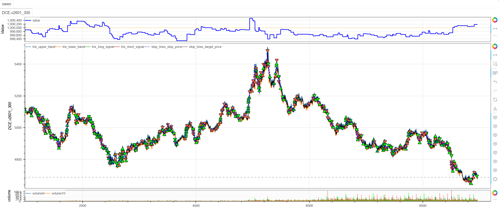

# **MiniBT量化交易之Keltner Channel策略**

## 概述

凯尔特纳通道（Keltner Channel）是由Chester Keltner开发，后经Linda Bradford Raschke改进的一种波动率通道指标。该策略通过指数移动平均线（EMA）和平均真实波幅（ATR）构建动态价格通道，结合趋势识别和波动率自适应机制，为交易者提供有效的趋势跟踪和突破交易信号。

## 原策略分析

### 指标核心逻辑

1. **动态通道构建**：基于EMA中轨和ATR波动率构建上下轨道
2. **趋势方向确认**：通过双EMA系统识别趋势方向
3. **自适应通道宽度**：根据趋势强度动态调整通道宽度
4. **通道突破信号**：价格突破通道边界时产生交易信号

### 指标参数

- `EMA_PERIOD`：中轨EMA周期 (默认: 8)
- `ATR_PERIOD`：ATR计算周期 (默认: 7)
- `ATR_MULTIPLIER`：ATR乘数 (默认: 1.5)
- `SHORT_EMA_PERIOD`：短期EMA周期 (默认: 5)
- `trend`：趋势强度阈值 (默认: 0.5)
- `mult`：强趋势通道收缩系数 (默认: 0.8)

## MiniBT 转换实现

### 指标类结构

```python
class KeltnerChannel(BtIndicator):
    """https://www.shinnytech.com/articles/trading-strategy/trend-following/keltner-channel-strategy"""
    params = dict(EMA_PERIOD=8, ATR_PERIOD=7, ATR_MULTIPLIER=1.5,
                  SHORT_EMA_PERIOD=5, trend=0.5, mult=0.8)
    # isplot = dict(long_signal=False, short_signal=False)
    overlap = True
```

### 核心方法实现

#### 1. 基础指标计算

```python
def next(self):
    # 计算中轨（EMA）和短期EMA（用于趋势确认）
    ema = self.close.ema(self.params.EMA_PERIOD)
    ema_short = self.close.ema(self.params.SHORT_EMA_PERIOD)
```

#### 2. 趋势分析系统

```python
# 计算趋势方向和强度
trend_direction = self.zeros().ifs(ema_short > ema, 1., ema_short < ema, -1.)
trend_strength = (ema_short-ema).abs()/self.close*100.
```

#### 3. 波动率计算

```python
# 计算ATR
tr = self.true_range()
atr = tr.sma(self.params.ATR_PERIOD)
```

#### 4. 动态通道构建

```python
# 动态调整ATR乘数，根据趋势强度调整通道宽度, 强趋势时使用更窄的通道
dynamic_multiplier = self.full(self.params.ATR_MULTIPLIER).mask(
    trend_strength > 0.5, self.params.ATR_MULTIPLIER*0.8)
# 计算通道上下轨
upper_band = ema + dynamic_multiplier * atr
lower_band = ema - dynamic_multiplier * atr
```

#### 5. 交易信号生成

```python
long_signal = self.close > upper_band
long_signal &= trend_direction > 0.
short_signal = self.close < lower_band
short_signal &= trend_direction < 0.
```

## 转换技术细节

### 1. 双EMA趋势系统

**中轨EMA**：
- 周期8，提供主要趋势方向
- 作为通道的基准线

**短期EMA**：
- 周期5，提供快速趋势确认
- 用于计算趋势强度和方向

### 2. 趋势量化计算

```python
trend_direction = self.zeros().ifs(ema_short > ema, 1., ema_short < ema, -1.)
trend_strength = (ema_short-ema).abs()/self.close*100.
```

这种设计能够：
- 明确量化趋势方向（1为上涨，-1为下跌）
- 计算趋势强度百分比
- 为动态通道调整提供依据

### 3. 自适应通道机制

**动态乘数调整**：
```python
dynamic_multiplier = self.full(ATR_MULTIPLIER).mask(
    trend_strength > 0.5, ATR_MULTIPLIER*0.8)
```

强趋势时（趋势强度>0.5%）：
- 使用更窄的通道（乘数×0.8）
- 提高突破信号的敏感性
- 适应趋势市场的特性

### 4. 双重确认信号

**多头信号条件**：
- 价格突破上轨
- 趋势方向为上涨

**空头信号条件**：
- 价格突破下轨  
- 趋势方向为下跌

## 使用示例

```python
from minibt import *

class KeltnerChannel(BtIndicator):
    params = dict(EMA_PERIOD=8, ATR_PERIOD=7, ATR_MULTIPLIER=1.5,
                  SHORT_EMA_PERIOD=5, trend=0.5, mult=0.8)
    overlap = True

    def next(self):
        ema = self.close.ema(self.params.EMA_PERIOD)
        ema_short = self.close.ema(self.params.SHORT_EMA_PERIOD)
        trend_direction = self.zeros().ifs(ema_short > ema, 1., ema_short < ema, -1.)
        trend_strength = (ema_short-ema).abs()/self.close*100.
        tr = self.true_range()
        atr = tr.sma(self.params.ATR_PERIOD)
        dynamic_multiplier = self.full(self.params.ATR_MULTIPLIER).mask(
            trend_strength > 0.5, self.params.ATR_MULTIPLIER*0.8)
        upper_band = ema + dynamic_multiplier * atr
        lower_band = ema - dynamic_multiplier * atr
        long_signal = self.close > upper_band
        long_signal &= trend_direction > 0.
        short_signal = self.close < lower_band
        short_signal &= trend_direction < 0.
        return upper_band, lower_band, long_signal, short_signal

class owen(Strategy):
    def __init__(self):
        self.min_start_length = 300
        self.data = self.get_kline(LocalDatas.v2601_300, height=500)
        self.keltner = KeltnerChannel(self.data)

    def next(self):
        if not self.data.position:
            if self.keltner.long_signal.new:
                self.data.buy(stop=BtStop.SegmentationTracking)
            elif self.keltner.short_signal.new:
                self.data.sell(stop=BtStop.SegmentationTracking)

if __name__ == "__main__":
    Bt().run()
```



## 参数说明

1. **EMA_PERIOD (中轨周期)**：
   - 控制主要趋势的平滑程度
   - 较小周期更敏感，较大周期更稳定
   - 默认值8适合短期趋势跟踪

2. **ATR_PERIOD (波动率周期)**：
   - 控制ATR计算的回顾周期
   - 影响通道宽度的稳定性
   - 默认值7提供适中的波动率响应

3. **ATR_MULTIPLIER (通道宽度乘数)**：
   - 控制通道的基本宽度
   - 较大值产生更宽的通道
   - 默认值1.5平衡敏感性和可靠性

4. **SHORT_EMA_PERIOD (短期EMA周期)**：
   - 控制趋势确认的响应速度
   - 影响趋势方向的及时性
   - 默认值5提供快速趋势确认

## 算法原理详解

### 1. 凯尔特纳通道构造

传统凯尔特纳通道公式：
```
中轨 = EMA(收盘价, N)
上轨 = 中轨 + M × ATR(K)
下轨 = 中轨 - M × ATR(K)
```

本策略的创新之处在于：
- 使用SMA计算ATR而非EMA
- 引入动态乘数调整机制
- 结合双EMA趋势确认系统

### 2. 动态通道调整机制

**趋势强度计算**：
```
趋势强度 = |短期EMA - 中轨EMA| / 收盘价 × 100%
```

**动态乘数逻辑**：
- 趋势强度 > 0.5%：认定为强趋势，使用收缩通道
- 趋势强度 ≤ 0.5%：正常市场，使用标准通道

这种设计能够：
- 在强趋势市场提高突破敏感性
- 在震荡市场减少假信号
- 自适应不同市场环境

### 3. 趋势方向量化

使用条件赋值明确趋势方向：
```
趋势方向 = 1   当短期EMA > 中轨EMA
趋势方向 = -1  当短期EMA < 中轨EMA
```

这种二元化处理：
- 简化趋势判断逻辑
- 提高信号清晰度
- 便于策略执行

## 策略应用场景

### 1. 趋势突破交易

利用通道突破捕捉趋势起始：

```python
def trend_breakout_strategy(upper_band, lower_band, trend_direction, close, volume):
    # 基础突破信号
    base_long_breakout = (close > upper_band) & (trend_direction > 0)
    base_short_breakout = (close < lower_band) & (trend_direction < 0)
    
    # 成交量确认
    volume_confirmation = volume > volume.rolling(20).mean() * 1.2
    
    # 波动率过滤
    volatility_filter = close.rolling(10).std() / close.rolling(10).mean() > 0.01
    
    confirmed_long = base_long_breakout & volume_confirmation & volatility_filter
    confirmed_short = base_short_breakout & volume_confirmation & volatility_filter
    
    return confirmed_long, confirmed_short
```

### 2. 通道回归交易

在震荡市中利用通道边界进行回归交易：

```python
def mean_reversion_strategy(upper_band, lower_band, ema, close, rsi_period=14):
    # RSI过滤
    rsi = close.rsi(rsi_period)
    
    # 超买超卖区域
    overbought = (close > upper_band) & (rsi > 70)
    oversold = (close < lower_band) & (rsi < 30)
    
    # 回归信号
    reversion_long = oversold & (close.shift() <= lower_band.shift())
    reversion_short = overbought & (close.shift() >= upper_band.shift())
    
    return reversion_long, reversion_short
```

### 3. 通道收缩扩张识别

识别通道形态变化：

```python
def channel_contraction_expansion(upper_band, lower_band, lookback=20):
    # 通道宽度
    channel_width = upper_band - lower_band
    
    # 宽度变化率
    width_change = channel_width.diff(5)
    width_change_pct = width_change / channel_width.shift(5)
    
    # 收缩识别（波动率压缩）
    contraction = (width_change_pct < -0.1) & (channel_width < channel_width.rolling(lookback).mean())
    
    # 扩张识别（波动率释放）
    expansion = (width_change_pct > 0.15) & (channel_width > channel_width.rolling(lookback).mean())
    
    return contraction, expansion, channel_width
```

## 风险管理建议

### 1. 基于通道宽度的动态仓位

```python
def keltner_position_sizing(channel_width, close, base_size=1):
    # 标准化通道宽度
    normalized_width = channel_width / close
    
    # 波动率调整因子
    if normalized_width > normalized_width.rolling(50).quantile(0.8):
        # 高波动率：减小仓位
        size_multiplier = 0.7
    elif normalized_width < normalized_width.rolling(50).quantile(0.2):
        # 低波动率：正常仓位
        size_multiplier = 1.0
    else:
        # 中等波动率：适度仓位
        size_multiplier = 0.85
    
    return base_size * size_multiplier
```

### 2. 通道跟踪止损策略

```python
def keltner_trailing_stop(upper_band, lower_band, ema, position_type, close):
    if position_type == 'long':
        # 多头止损：价格跌破中轨或下轨
        stop_condition1 = close < ema
        stop_condition2 = close < lower_band
        # 或从最高点回撤超过通道宽度的50%
        stop_condition3 = close < (close.rolling(10).max() - (upper_band - lower_band) * 0.5)
        return stop_condition1 | stop_condition2 | stop_condition3
    else:
        # 空头止损：价格突破中轨或上轨
        stop_condition1 = close > ema
        stop_condition2 = close > upper_band
        # 或从最低点反弹超过通道宽度的50%
        stop_condition3 = close > (close.rolling(10).min() + (upper_band - lower_band) * 0.5)
        return stop_condition1 | stop_condition2 | stop_condition3
```

## 性能优化建议

### 1. 自适应参数调整

根据市场状态动态调整参数：

```python
def adaptive_keltner_params(close, volume, volatility_window=20):
    # 计算市场波动率和成交量特征
    volatility = close.rolling(volatility_window).std() / close.rolling(volatility_window).mean()
    volume_ratio = volume / volume.rolling(volatility_window).mean()
    
    # 自适应参数
    if volatility > 0.025 and volume_ratio > 1.2:
        # 高波动率高成交量：使用更敏感的参数
        return 5, 5, 1.2, 3
    elif volatility < 0.01 and volume_ratio < 0.8:
        # 低波动率低成交量：使用更稳定的参数
        return 12, 10, 2.0, 8
    else:
        # 正常市场条件：默认参数
        return 8, 7, 1.5, 5
```

### 2. 信号质量增强

基于多维度确认提高信号质量：

```python
def enhanced_signal_quality(upper_band, lower_band, trend_direction, close, volume, rsi_period=14):
    # 基础信号
    base_long = (close > upper_band) & (trend_direction > 0)
    base_short = (close < lower_band) & (trend_direction < 0)
    
    # 多维度确认
    volume_confirm = volume > volume.rolling(20).mean() * 1.1
    rsi_confirm = (close.rsi(rsi_period) > 50) if base_long.any() else (close.rsi(rsi_period) < 50)
    volatility_confirm = close.rolling(10).std() / close.rolling(10).mean() > 0.008
    
    # 增强信号
    enhanced_long = base_long & volume_confirm & rsi_confirm & volatility_confirm
    enhanced_short = base_short & volume_confirm & rsi_confirm & volatility_confirm
    
    return enhanced_long, enhanced_short
```

## 扩展功能

### 1. 多时间框架通道确认

```python
def multi_timeframe_keltner_confirmation(daily_kc, hourly_kc, four_hour_kc):
    # 各时间框架趋势方向
    daily_trend = daily_kc.trend_direction > 0
    hourly_trend = hourly_kc.trend_direction > 0
    four_hour_trend = four_hour_kc.trend_direction > 0
    
    # 趋势一致性
    trend_alignment = daily_trend.astype(int) + hourly_trend.astype(int) + four_hour_trend.astype(int)
    
    # 通道位置确认
    daily_position = (daily_kc.close > daily_kc.ema) & (daily_kc.close < daily_kc.upper_band)
    hourly_position = (hourly_kc.close > hourly_kc.ema) & (hourly_kc.close < hourly_kc.upper_band)
    
    # 强确认信号
    strong_bullish = (trend_alignment == 3) & daily_position & hourly_position
    strong_bearish = (trend_alignment == -3) & (~daily_position) & (~hourly_position)
    
    return strong_bullish, strong_bearish
```

### 2. 通道形态分析

```python
def keltner_channel_patterns(upper_band, lower_band, ema, close, lookback=10):
    # 通道斜率
    upper_slope = upper_band.diff(5)
    lower_slope = lower_band.diff(5)
    ema_slope = ema.diff(5)
    
    # 通道扩张模式
    expanding_channel = (upper_slope > 0) & (lower_slope < 0)
    contracting_channel = (upper_slope < 0) & (lower_slope > 0)
    
    # 平行通道
    parallel_channel = (abs(upper_slope - lower_slope) < 0.001)
    
    # 价格在通道中的位置
    channel_position = (close - lower_band) / (upper_band - lower_band)
    
    return expanding_channel, contracting_channel, parallel_channel, channel_position
```

## 总结

凯尔特纳通道策略通过创新的动态通道构建和趋势自适应机制，为交易者提供了一个灵活而可靠的趋势跟踪工具。该策略结合了波动率通道、趋势确认和自适应宽度调整，在保持传统通道指标优点的同时大幅提升了信号的准确性和适应性。

转换过程中，我们完整实现了凯尔特纳通道的核心算法，包括双EMA趋势系统、ATR波动率计算、动态乘数调整和突破信号生成。通过MiniBT框架的实现，用户可以在回测系统中充分利用这一先进的通道分析工具。

凯尔特纳通道策略特别适用于：
- 趋势市场的突破交易
- 波动率环境下的动态风险管理
- 多时间框架趋势确认
- 自适应市场环境的通道交易

该策略的转换展示了如何将复杂的动态通道算法转换为MiniBT框架可用的交易指标，为其他通道类指标的实现提供了重要参考。凯尔特纳通道的动态适应性和趋势确认机制使其成为通道交易者的有力工具。

> 风险提示：本文涉及的交易策略、代码示例均为技术演示、教学探讨，仅用于展示逻辑思路，绝不构成任何投资建议、操作指引或决策依据 。金融市场复杂多变，存在价格波动、政策调整、流动性等多重风险，历史表现不预示未来结果。任何交易决策均需您自主判断、独立承担责任 —— 若依据本文内容操作，盈亏后果概由自身承担。请务必充分评估风险承受能力，理性对待市场，谨慎做出投资选择。