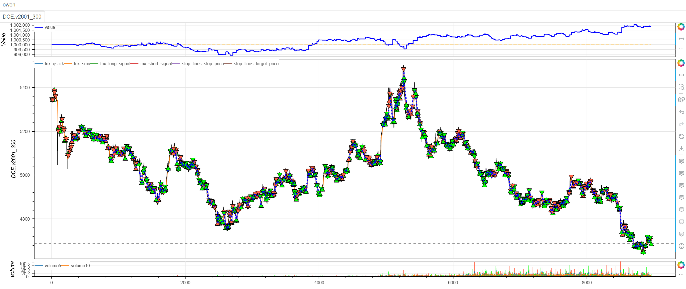
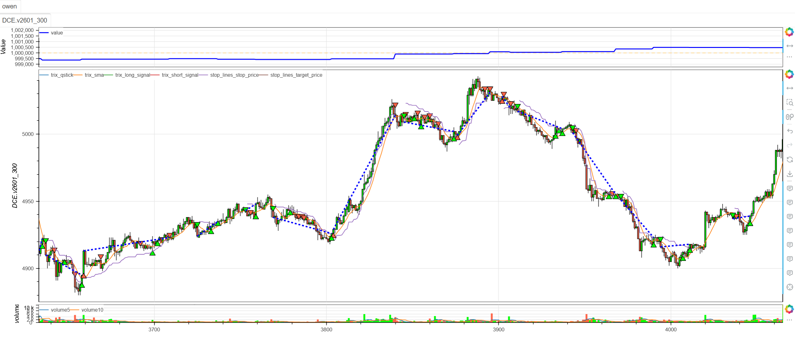
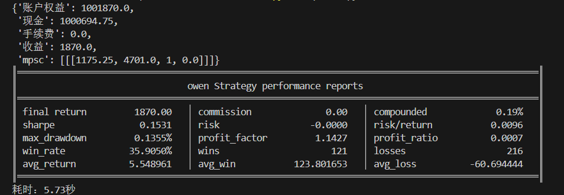

# **MiniBT量化交易之Qstick趋势策略**

## 概述

Qstick指标是由著名技术分析师Tushar Chande博士开发的一种独特动量指标，专门用于衡量市场的买卖压力。该指标通过计算开盘价与收盘价之差的移动平均来量化价格动量的方向和强度。Qstick策略结合了价格动量分析和趋势确认机制，为交易者提供清晰的市场买卖压力视角。

## 原策略分析

### 指标核心逻辑

1. **买卖压力量化**：通过收盘价与开盘价差值衡量每日买卖压力
2. **动量平滑处理**：对每日买卖压力进行移动平均平滑
3. **趋势确认过滤**：结合简单移动平均线确认主要趋势方向
4. **零轴穿越信号**：Qstick指标零轴穿越产生交易信号

### 指标参数

- `QSTICK_PERIOD`：Qstick计算周期 (默认: 10)
- `SMA_PERIOD`：趋势确认SMA周期 (默认: 8)

## MiniBT 转换实现

### 指标类结构

```python
class Qstick(BtIndicator):
    """https://www.shinnytech.com/articles/trading-strategy/trend-following/qstick-strategy"""
    params = dict(QSTICK_PERIOD=10, SMA_PERIOD=8)
    overlap = True
```

### 核心方法实现

#### 1. Qstick指标计算

```python
def next(self):
    # 计算Qstick指标
    qstick = (self.close-self.open).sma(self.params.QSTICK_PERIOD)
```

#### 2. 趋势确认指标

```python
# 计算价格SMA，用于确认趋势
sma = self.close.sma(self.params.SMA_PERIOD)
```

#### 3. 交易信号生成

```python
long_signal = qstick.cross_up(0.)
long_signal &= self.close > sma
short_signal = qstick.cross_down(0.)
short_signal &= self.close < sma
```

## 转换技术细节

### 1. Qstick计算原理

Qstick的核心是衡量买卖压力：

```
单日买卖压力 = 收盘价 - 开盘价
Qstick = SMA(单日买卖压力, N)
```

这种设计能够：
- 直接反映买卖双方的力量对比
- 过滤单日价格波动的噪声
- 提供平滑的动量视角

### 2. 零轴的意义

Qstick的零轴具有重要含义：
- **零轴上方**：买方力量占主导，平均收盘价高于开盘价
- **零轴下方**：卖方力量占主导，平均收盘价低于开盘价
- **零轴穿越**：买卖力量平衡发生变化

### 3. 双重确认机制

**多头信号条件**：
- Qstick上穿零轴（买方力量增强）
- 价格在SMA上方（趋势向上确认）

**空头信号条件**：
- Qstick下穿零轴（卖方力量增强）
- 价格在SMA下方（趋势向下确认）

### 4. 可视化配置

```python
overlap = True  # 指标在主图显示，便于观察与价格的关系
```

## 使用示例

```python
from minibt import *

class Qstick(BtIndicator):
    params = dict(QSTICK_PERIOD=10, SMA_PERIOD=8)
    overlap = True

    def next(self):
        qstick = (self.close-self.open).sma(self.params.QSTICK_PERIOD)
        sma = self.close.sma(self.params.SMA_PERIOD)
        long_signal = qstick.cross_up(0.)
        long_signal &= self.close > sma
        short_signal = qstick.cross_down(0.)
        short_signal &= self.close < sma
        return qstick, sma, long_signal, short_signal

class owen(Strategy):
    def __init__(self):
        self.min_start_length = 300
        self.data = self.get_kline(LocalDatas.v2601_300, height=500)
        self.qstick = Qstick(self.data)

    def next(self):
        if not self.data.position:
            if self.qstick.long_signal.new:
                self.data.buy(stop=BtStop.SegmentationTracking)
            elif self.qstick.short_signal.new:
                self.data.sell(stop=BtStop.SegmentationTracking)

if __name__ == "__main__":
    Bt().run()
```



## 参数说明

1. **QSTICK_PERIOD (Qstick计算周期)**：
   - 控制买卖压力计算的平滑程度
   - 较小周期更敏感，较大周期更稳定
   - 默认值10提供适中的动量视角

2. **SMA_PERIOD (趋势确认周期)**：
   - 控制主要趋势的识别周期
   - 影响趋势确认的及时性
   - 默认值8适合短期趋势跟踪

## 算法原理详解

### 1. 买卖压力量化

Qstick指标的独特之处在于直接关注价格的内在动力：

```
每日买卖压力 = 收盘价 - 开盘价
```

这种计算方式能够：
- 反映日内交易的真实结果
- 忽略价格区间内的波动噪声
- 直接衡量多空双方的胜负情况

### 2. 动量平滑机制

通过移动平均平滑每日买卖压力：

```
Qstick = SMA(收盘价-开盘价, N)
```

平滑处理的作用：
- 过滤单日的异常波动
- 识别持续的买卖压力趋势
- 提供稳定的动量信号

### 3. 零轴穿越信号

零轴在Qstick指标中代表买卖力量的平衡点：

- **上穿零轴**：买方开始持续占据优势
- **下穿零轴**：卖方开始持续占据优势
- **零轴附近震荡**：买卖力量相对平衡

### 4. 趋势确认必要性

单纯依靠Qstick信号可能产生假信号，因此需要趋势过滤：

- **价格 > SMA**：确认上升趋势环境
- **价格 < SMA**：确认下降趋势环境
- 提高信号在趋势中的可靠性

## 策略应用场景

### 1. 动量转折识别

利用Qstick捕捉买卖力量的转折点：

```python
def momentum_turnaround_strategy(qstick, sma, close, volume):
    # 基础零轴穿越信号
    base_long = qstick.cross_up(0)
    base_short = qstick.cross_down(0)
    
    # 动量强度确认
    momentum_strength = qstick.diff(3) > 0  # 近期动量增强
    
    # 成交量确认
    volume_confirmation = volume > volume.rolling(20).mean()
    
    # 趋势环境确认
    trend_confirmation = close > sma
    
    confirmed_long = base_long & momentum_strength & volume_confirmation & trend_confirmation
    confirmed_short = base_short & (~momentum_strength) & volume_confirmation & (~trend_confirmation)
    
    return confirmed_long, confirmed_short
```

### 2. Qstick背离检测

识别价格与Qstick的背离信号：

```python
def qstick_divergence_detection(price, qstick, lookback=20):
    # 价格高点对应的Qstick值
    price_highs = price.rolling(lookback).max()
    qstick_at_highs = qstick[price == price_highs]
    
    # 价格低点对应的Qstick值
    price_lows = price.rolling(lookback).min()
    qstick_at_lows = qstick[price == price_lows]
    
    # 看跌背离：价格创新高，Qstick未创新高
    bearish_divergence = (price == price_highs) & (qstick < qstick_at_highs.rolling(2).max())
    
    # 看涨背离：价格创新低，Qstick未创新低
    bullish_divergence = (price == price_lows) & (qstick > qstick_at_lows.rolling(2).min())
    
    return bullish_divergence, bearish_divergence
```

### 3. Qstick动量强度分析

基于Qstick值分析动量强度：

```python
def qstick_momentum_strength(qstick, lookback=10):
    # Qstick绝对值强度
    absolute_strength = abs(qstick)
    
    # Qstick变化率动量
    momentum_rate = qstick.diff(5)
    
    # 动量强度分类
    strong_bullish = (qstick > 0) & (absolute_strength > absolute_strength.rolling(lookback).mean())
    weak_bullish = (qstick > 0) & (absolute_strength <= absolute_strength.rolling(lookback).mean())
    weak_bearish = (qstick < 0) & (absolute_strength <= absolute_strength.rolling(lookback).mean())
    strong_bearish = (qstick < 0) & (absolute_strength > absolute_strength.rolling(lookback).mean())
    
    # 综合动量得分
    momentum_score = qstick / absolute_strength.rolling(lookback).std()
    
    return momentum_score, strong_bullish, weak_bullish, weak_bearish, strong_bearish
```

## 风险管理建议

### 1. 基于Qstick值的动态仓位

```python
def qstick_position_sizing(qstick_value, base_size=1):
    # 根据Qstick绝对值调整仓位
    qstick_strength = min(abs(qstick_value) / 10, 2.0)  # 假设10为典型强信号值
    
    # 零轴附近保守仓位
    if abs(qstick_value) < 2:
        size_multiplier = 0.5
    elif abs(qstick_value) < 5:
        size_multiplier = 0.7
    else:
        size_multiplier = min(qstick_strength, 1.5)
    
    return base_size * size_multiplier
```

### 2. Qstick动量止损策略

```python
def qstick_momentum_stop_loss(qstick, sma, position_type, close, atr):
    if position_type == 'long':
        # 多头止损：Qstick下穿零轴或价格跌破SMA
        stop_condition1 = qstick < 0
        stop_condition2 = close < sma
        # 或价格回撤超过1倍ATR
        stop_condition3 = close < (close.rolling(10).max() - atr)
        return stop_condition1 | stop_condition2 | stop_condition3
    else:
        # 空头止损：Qstick上穿零轴或价格突破SMA
        stop_condition1 = qstick > 0
        stop_condition2 = close > sma
        # 或价格反弹超过1倍ATR
        stop_condition3 = close > (close.rolling(10).min() + atr)
        return stop_condition1 | stop_condition2 | stop_condition3
```

## 性能优化建议

### 1. 自适应周期调整

根据市场波动率调整Qstick参数：

```python
def adaptive_qstick_params(close, volatility_window=20):
    # 计算市场波动率
    volatility = close.rolling(volatility_window).std() / close.rolling(volatility_window).mean()
    
    # 自适应参数
    if volatility > 0.025:
        # 高波动率市场：使用更长周期减少噪声
        return 15, 12
    elif volatility < 0.01:
        # 低波动率市场：使用更短周期提高敏感性
        return 6, 5
    else:
        # 正常市场条件：默认参数
        return 10, 8
```

### 2. 信号质量增强

基于多维度确认提高信号质量：

```python
def enhanced_qstick_signals(qstick, sma, close, volume, rsi_period=14):
    # 基础信号
    base_long = qstick.cross_up(0)
    base_short = qstick.cross_down(0)
    
    # 多维度确认
    trend_strength = (close > sma).rolling(5).sum() >= 3  # 连续3天在SMA上方
    volume_confirmation = volume > volume.rolling(20).mean() * 1.1
    rsi_confirmation = (close.rsi(rsi_period) > 50) if base_long.any() else (close.rsi(rsi_period) < 50)
    
    # 增强信号
    enhanced_long = base_long & trend_strength & volume_confirmation & rsi_confirmation
    enhanced_short = base_short & (~trend_strength) & volume_confirmation & rsi_confirmation
    
    return enhanced_long, enhanced_short
```

## 扩展功能

### 1. 多时间框架Qstick确认

```python
def multi_timeframe_qstick_confirmation(daily_qstick, hourly_qstick, four_hour_qstick):
    # 各时间框架买卖压力方向
    daily_pressure = daily_qstick > 0
    hourly_pressure = hourly_qstick > 0
    four_hour_pressure = four_hour_qstick > 0
    
    # 压力一致性
    pressure_alignment = daily_pressure.astype(int) + hourly_pressure.astype(int) + four_hour_pressure.astype(int)
    
    # 强压力确认信号
    strong_buying_pressure = (pressure_alignment == 3) & (hourly_qstick.cross_up(0))
    strong_selling_pressure = (pressure_alignment == -3) & (hourly_qstick.cross_down(0))
    
    return strong_buying_pressure, strong_selling_pressure
```

### 2. Qstick波动率通道

基于Qstick构建动态通道：

```python
def qstick_volatility_channel(qstick, lookback=20, multiplier=2):
    # Qstick移动平均和标准差
    qstick_ma = qstick.rolling(lookback).mean()
    qstick_std = qstick.rolling(lookback).std()
    
    # 波动率通道
    upper_band = qstick_ma + multiplier * qstick_std
    lower_band = qstick_ma - multiplier * qstick_std
    
    # 通道突破信号
    upper_breakout = (qstick > upper_band) & (qstick.shift() <= upper_band.shift())
    lower_breakout = (qstick < lower_band) & (qstick.shift() >= lower_band.shift())
    
    # Qstick在通道中的位置
    qstick_position = (qstick - lower_band) / (upper_band - lower_band)
    
    return upper_band, lower_band, upper_breakout, lower_breakout, qstick_position
```

## 总结

Qstick趋势策略通过独特的买卖压力量化方法和简洁有效的信号生成机制，为交易者提供了一个直观而可靠的市场动量分析工具。该策略直接关注价格的内在动力——买卖双方的力量对比，在保持计算简单性的同时提供有洞察力的交易信号。

转换过程中，我们完整实现了Qstick指标的核心算法，包括买卖压力计算、移动平均平滑和趋势确认机制。通过MiniBT框架的实现，用户可以在回测系统中充分利用这一直观的动量分析工具。

Qstick趋势策略特别适用于：
- 买卖压力变化的早期识别
- 动量转折点的捕捉
- 趋势环境中的动量确认
- 多时间框架动量分析

该策略的转换展示了如何将简洁有效的动量指标转换为MiniBT框架可用的交易策略，为其他动量类指标的实现提供了重要参考。Qstick指标的直观性和有效性使其成为动量交易者的实用工具。

> 风险提示：本文涉及的交易策略、代码示例均为技术演示、教学探讨，仅用于展示逻辑思路，绝不构成任何投资建议、操作指引或决策依据 。金融市场复杂多变，存在价格波动、政策调整、流动性等多重风险，历史表现不预示未来结果。任何交易决策均需您自主判断、独立承担责任 —— 若依据本文内容操作，盈亏后果概由自身承担。请务必充分评估风险承受能力，理性对待市场，谨慎做出投资选择。