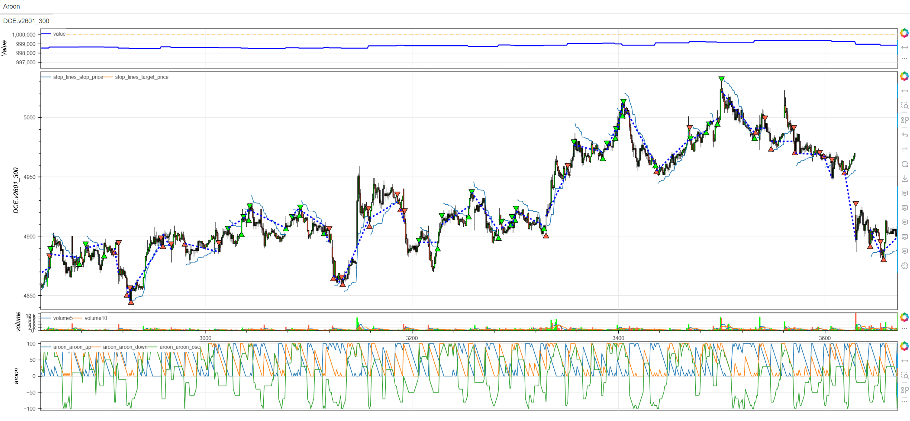
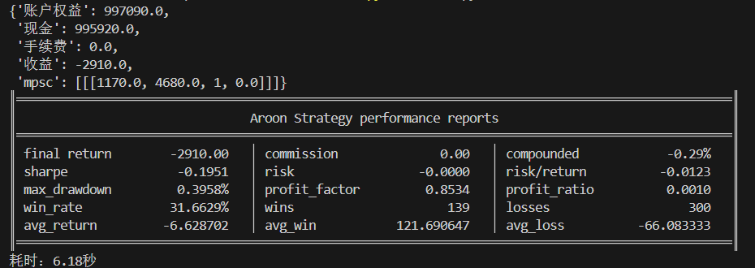

# **MiniBT量化交易之Aroon指标趋势交易策略**

## 概述

Aroon指标是由图莎尔·钱德（Tushar Chande）开发的一种独特的技术分析工具，专门用于识别趋势的开始、强度和方向变化。该指标通过计算价格在一定周期内达到最高点和最低点的时间来量化趋势的强度和市场结构的变化。Aroon策略能够有效捕捉新趋势的起始点，为交易者提供早期趋势识别信号。

## 原策略分析

### 指标核心逻辑

1. **时间位置分析**：基于价格达到极值点的时间位置而非价格本身
2. **双线系统设计**：Aroon Up和Aroon Down分别衡量上升和下降趋势强度
3. **阈值突破信号**：通过预设阈值识别趋势的启动和转换
4. **趋势状态判断**：结合双线关系判断市场处于上升、下降或盘整状态

### 指标参数

- `AROON_PERIOD`：Aroon计算周期 (默认: 10)
- `AROON_UPPER_THRESHOLD`：上阈值 (默认: 75)
- `AROON_LOWER_THRESHOLD`：下阈值 (默认: 25)

## MiniBT 转换实现

### 策略类结构

```python
class Aroon(Strategy):
    """https://www.shinnytech.com/articles/trading-strategy/trend-following/aroon-strategy"""
    params = dict(AROON_PERIOD=10, AROON_UPPER_THRESHOLD=75,
                  AROON_LOWER_THRESHOLD=25)
```

### 核心方法实现

#### 1. Aroon指标初始化

```python
def __init__(self):
    self.min_start_length = 300
    self.data = self.get_kline(LocalDatas.v2601_300, height=500)
    self.aroon = self.data.aroon(self.params.AROON_PERIOD)
```

#### 2. 交易信号定义

```python
self.long_signal = self.aroon.aroon_up > self.params.AROON_UPPER_THRESHOLD
self.long_signal &= self.aroon.aroon_down < self.params.AROON_LOWER_THRESHOLD
self.short_signal = self.aroon.aroon_down > self.params.AROON_UPPER_THRESHOLD
self.short_signal &= self.aroon.aroon_up < self.params.AROON_LOWER_THRESHOLD
```

#### 3. 可视化配置

```python
self.long_signal.isplot = False
self.short_signal.isplot = False
```

#### 4. 策略执行逻辑

```python
def next(self):
    if not self.data.position:
        if self.long_signal.new:
            self.data.buy(stop=BtStop.SegmentationTracking)
        elif self.short_signal.new:
            self.data.sell(stop=BtStop.SegmentationTracking)
```

## 转换技术细节

### 1. Aroon指标计算原理

Aroon指标基于价格在指定周期内达到极值点的时间：

```
Aroon Up = [(周期 - 距离最高价的天数) / 周期] × 100
Aroon Down = [(周期 - 距离最低价的天数) / 周期] × 100
```

### 2. 内置指标调用

使用MiniBT框架内置的Aroon指标：

```python
self.aroon = self.data.aroon(self.params.AROON_PERIOD)
```

### 3. 双重条件信号逻辑

**多头信号条件**：
- Aroon Up > 75（上升趋势强劲）
- Aroon Down < 25（下降趋势疲弱）

**空头信号条件**：
- Aroon Down > 75（下降趋势强劲）  
- Aroon Up < 25（上升趋势疲弱）

### 4. 新信号检测机制

```python
if self.long_signal.new:
```

使用`.new`属性确保只在信号首次出现时执行交易。

## 使用示例

```python
from minibt import *

class Aroon(Strategy):
    params = dict(AROON_PERIOD=10, AROON_UPPER_THRESHOLD=75,
                  AROON_LOWER_THRESHOLD=25)

    def __init__(self):
        self.min_start_length = 300
        self.data = self.get_kline(LocalDatas.v2601_300, height=500)
        self.aroon = self.data.aroon(self.params.AROON_PERIOD)
        self.long_signal = self.aroon.aroon_up > self.params.AROON_UPPER_THRESHOLD
        self.long_signal &= self.aroon.aroon_down < self.params.AROON_LOWER_THRESHOLD
        self.short_signal = self.aroon.aroon_down > self.params.AROON_UPPER_THRESHOLD
        self.short_signal &= self.aroon.aroon_up < self.params.AROON_LOWER_THRESHOLD
        self.long_signal.isplot = False
        self.short_signal.isplot = False

    def next(self):
        if not self.data.position:
            if self.long_signal.new:
                self.data.buy(stop=BtStop.SegmentationTracking)
            elif self.short_signal.new:
                self.data.sell(stop=BtStop.SegmentationTracking)

if __name__ == "__main__":
    Bt().run()
```


## 参数说明

1. **AROON_PERIOD (计算周期)**：
   - 控制趋势识别的时间窗口
   - 较小周期更敏感，较大周期更稳定
   - 默认值10适合中期趋势分析

2. **AROON_UPPER_THRESHOLD (上阈值)**：
   - 识别强劲趋势的临界值
   - 默认值75表示趋势强度达到75%以上
   - 较高阈值产生更可靠但更少的信号

3. **AROON_LOWER_THRESHOLD (下阈值)**：
   - 识别疲弱趋势的临界值
   - 默认值25表示趋势强度低于25%
   - 较低阈值提供更严格的趋势转换确认

## 算法原理详解

### 1. Aroon指标核心思想

Aroon指标的独特之处在于关注"时间"而非"价格"：

- **Aroon Up**：衡量上升趋势的强度，值越高表示近期创出新高
- **Aroon Down**：衡量下降趋势的强度，值越高表示近期创出新低
- **交叉关系**：双线的相对位置反映趋势的主导方向

### 2. 阈值突破逻辑

**强势上升趋势特征**：
- Aroon Up > 75：价格在近期频繁创出新高
- Aroon Down < 25：价格很少创出新低
- 表明买方完全控制市场

**强势下降趋势特征**：
- Aroon Down > 75：价格在近期频繁创出新低
- Aroon Up < 25：价格很少创出新高
- 表明卖方完全控制市场

### 3. 趋势状态识别

基于Aroon双线关系判断市场状态：

- **上升趋势**：Aroon Up > Aroon Down
- **下降趋势**：Aroon Down > Aroon Up  
- **盘整状态**：双线在中间区域（25-75）交织
- **趋势转换**：双线交叉且突破阈值

### 4. 信号质量特征

Aroon信号的特点：
- **早期预警**：在趋势初期提供信号
- **减少滞后**：基于时间而非价格，减少传统指标的滞后
- **趋势确认**：双线系统提供趋势强度的量化确认

## 策略应用场景

### 1. 趋势起始识别

利用Aroon捕捉新趋势的起始点：

```python
def trend_initiation_detection(aroon_up, aroon_down, upper_threshold=75, lower_threshold=25):
    # 上升趋势起始
    uptrend_start = (aroon_up > upper_threshold) & (aroon_down < lower_threshold)
    # 下降趋势起始
    downtrend_start = (aroon_down > upper_threshold) & (aroon_up < lower_threshold)
    
    # 趋势强度确认
    uptrend_strength = aroon_up - aroon_down
    downtrend_strength = aroon_down - aroon_up
    
    strong_uptrend = uptrend_start & (uptrend_strength > 50)
    strong_downtrend = downtrend_start & (downtrend_strength > 50)
    
    return strong_uptrend, strong_downtrend
```

### 2. 趋势延续确认

识别现有趋势的加强信号：

```python
def trend_continuation_confirmation(aroon_up, aroon_down, close, lookback=5):
    # 基础趋势方向
    trend_direction = aroon_up > aroon_down
    
    # 趋势强度维持
    up_strength_maintained = (aroon_up.rolling(lookback).min() > 50)
    down_strength_maintained = (aroon_down.rolling(lookback).min() > 50)
    
    # 价格确认
    price_confirmation = close > close.rolling(20).mean()
    
    uptrend_continuation = trend_direction & up_strength_maintained & price_confirmation
    downtrend_continuation = (~trend_direction) & down_strength_maintained & (~price_confirmation)
    
    return uptrend_continuation, downtrend_continuation
```

### 3. Aroon震荡识别

识别市场盘整和突破前兆：

```python
def aroon_oscillation_detection(aroon_up, aroon_down, period=10):
    # 双线接近（盘整特征）
    lines_close = (aroon_up - aroon_down).abs() < 20
    
    # 双线在中间区域（无明确趋势）
    in_middle_zone = (aroon_up.between(40, 60)) & (aroon_down.between(40, 60))
    
    # 震荡收敛（可能突破前兆）
    oscillation_convergence = lines_close & in_middle_zone
    
    # 突破方向预判
    potential_breakout_up = oscillation_convergence & (aroon_up.diff(3) > 10)
    potential_breakout_down = oscillation_convergence & (aroon_down.diff(3) > 10)
    
    return oscillation_convergence, potential_breakout_up, potential_breakout_down
```

## 风险管理建议

### 1. 基于Aroon值的动态仓位

```python
def aroon_position_sizing(aroon_up, aroon_down, base_size=1):
    # 计算趋势强度差异
    trend_strength_diff = abs(aroon_up - aroon_down)
    
    # 根据趋势强度调整仓位
    if trend_strength_diff > 60:
        # 强趋势：正常仓位
        size_multiplier = 1.0
    elif trend_strength_diff > 30:
        # 中等趋势：适度仓位
        size_multiplier = 0.7
    else:
        # 弱趋势：保守仓位
        size_multiplier = 0.5
    
    return base_size * size_multiplier
```

### 2. Aroon趋势止损策略

```python
def aroon_trend_stop_loss(aroon_up, aroon_down, position_type, close, atr):
    if position_type == 'long':
        # 多头止损：Aroon Down上穿Aroon Up或价格回撤
        stop_condition1 = aroon_down > aroon_up
        stop_condition2 = aroon_up < 50  # 上升趋势减弱
        stop_condition3 = close < (close.rolling(10).max() - atr)
        return stop_condition1 | stop_condition2 | stop_condition3
    else:
        # 空头止损：Aroon Up上穿Aroon Down或价格反弹
        stop_condition1 = aroon_up > aroon_down
        stop_condition2 = aroon_down < 50  # 下降趋势减弱
        stop_condition3 = close > (close.rolling(10).min() + atr)
        return stop_condition1 | stop_condition2 | stop_condition3
```

## 性能优化建议

### 1. 自适应参数调整

根据市场波动率调整Aroon参数：

```python
def adaptive_aroon_params(close, volatility_window=20):
    # 计算市场波动率
    volatility = close.rolling(volatility_window).std() / close.rolling(volatility_window).mean()
    
    # 自适应参数
    if volatility > 0.025:
        # 高波动率市场：使用更长周期和更严格阈值
        return 14, 80, 20
    elif volatility < 0.01:
        # 低波动率市场：使用更短周期和更宽松阈值
        return 8, 70, 30
    else:
        # 正常市场条件：默认参数
        return 10, 75, 25
```

### 2. 信号质量过滤

基于Aroon线变化率过滤低质量信号：

```python
def filtered_aroon_signals(aroon_up, aroon_down, upper_threshold=75, lower_threshold=25, min_change=10):
    # 基础信号
    base_long = (aroon_up > upper_threshold) & (aroon_down < lower_threshold)
    base_short = (aroon_down > upper_threshold) & (aroon_up < lower_threshold)
    
    # Aroon线变化率过滤
    up_momentum = aroon_up.diff(3) > min_change
    down_momentum = aroon_down.diff(3) > min_change
    
    # 过滤后的信号
    filtered_long = base_long & up_momentum & (~down_momentum)
    filtered_short = base_short & down_momentum & (~up_momentum)
    
    return filtered_long, filtered_short
```

## 扩展功能

### 1. Aroon振荡器指标

基于Aroon双线差值创建振荡器：

```python
def aroon_oscillator(aroon_up, aroon_down, lookback=10):
    # Aroon振荡器
    aroon_osc = aroon_up - aroon_down
    
    # 振荡器信号线
    oscillator_signal = aroon_osc.rolling(5).mean()
    
    # 振荡器交叉信号
    osc_cross_up = aroon_osc.cross_up(oscillator_signal)
    osc_cross_down = aroon_osc.cross_down(oscillator_signal)
    
    # 振荡器强度
    osc_strength = abs(aroon_osc) / 100
    
    return aroon_osc, oscillator_signal, osc_cross_up, osc_cross_down, osc_strength
```

### 2. 多时间框架Aroon确认

```python
def multi_timeframe_aroon_confirmation(daily_aroon, hourly_aroon, four_hour_aroon):
    # 各时间框架趋势方向
    daily_trend = daily_aroon.aroon_up > daily_aroon.aroon_down
    hourly_trend = hourly_aroon.aroon_up > hourly_aroon.aroon_down
    four_hour_trend = four_hour_aroon.aroon_up > four_hour_aroon.aroon_down
    
    # 趋势一致性
    trend_alignment = daily_trend.astype(int) + hourly_trend.astype(int) + four_hour_trend.astype(int)
    
    # 各时间框架趋势强度
    daily_strength = (daily_aroon.aroon_up > 70) | (daily_aroon.aroon_down > 70)
    hourly_strength = (hourly_aroon.aroon_up > 70) | (hourly_aroon.aroon_down > 70)
    
    # 强确认信号
    strong_bullish = (trend_alignment == 3) & daily_strength & hourly_strength
    strong_bearish = (trend_alignment == -3) & daily_strength & hourly_strength
    
    return strong_bullish, strong_bearish
```

## 总结

Aroon指标趋势交易策略通过创新的时间位置分析和双线系统设计，为交易者提供了一个独特而有效的趋势识别工具。该策略关注价格达到极值点的时间特征，而非传统的价格水平分析，在减少信号滞后的同时提供早期趋势预警。

转换过程中，我们充分利用了MiniBT框架内置的Aroon指标功能，通过简洁的参数配置和信号逻辑实现了高效的策略执行。策略的双重条件确认机制确保了信号的可靠性，而阈值突破设计则提供了清晰的入场时机。

Aroon指标趋势交易策略特别适用于：
- 新趋势起始点的早期识别
- 趋势强度的量化评估
- 趋势状态的明确判断
- 多时间框架趋势确认

该策略的转换展示了如何将内置技术指标高效地应用于实际交易策略，为其他基于标准技术指标的策略开发提供了重要参考。Aroon指标的独特视角和可靠信号生成机制使其成为趋势交易者的有力工具。

> 风险提示：本文涉及的交易策略、代码示例均为技术演示、教学探讨，仅用于展示逻辑思路，绝不构成任何投资建议、操作指引或决策依据 。金融市场复杂多变，存在价格波动、政策调整、流动性等多重风险，历史表现不预示未来结果。任何交易决策均需您自主判断、独立承担责任 —— 若依据本文内容操作，盈亏后果概由自身承担。请务必充分评估风险承受能力，理性对待市场，谨慎做出投资选择。