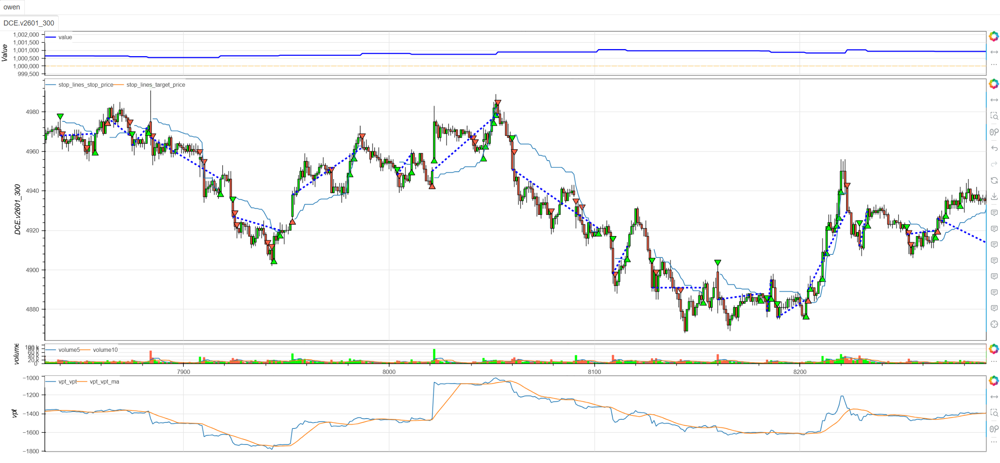
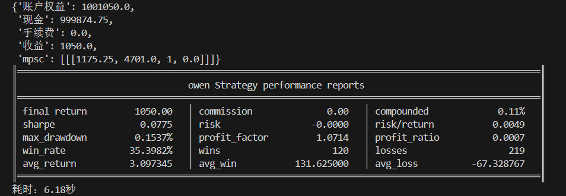

# **MiniBT量化交易之量价趋势策略（VPT）**

## 概述

量价趋势指标（Volume Price Trend，简称VPT）是一种将价格变动与成交量相结合的技术指标，通过量化资金流向和价格动量的关系来识别趋势的强度和持续性。该策略基于"量在价先"的核心原理，认为成交量的变化会先于价格变化，从而提供早期趋势信号。

## 原策略分析

### 指标核心逻辑

1. **量价结合计算**：将价格变动百分比与成交量相乘，量化资金推动力
2. **累积效应分析**：通过累积计算反映持续的资金流向
3. **移动平均平滑**：使用VPT移动平均线识别主要趋势方向
4. **成交量确认**：通过成交量放大验证信号的可靠性

### 指标参数

- `VPT_MA_PERIOD`：VPT移动平均周期 (默认: 14)
- `VOLUME_THRESHOLD`：成交量阈值倍数 (默认: 1.5)

## MiniBT 转换实现

### 指标类结构

```python
class VPT(BtIndicator):
    """https://www.shinnytech.com/articles/trading-strategy/trend-following/vpt-strategy"""
    params = dict(VPT_MA_PERIOD=14, VOLUME_THRESHOLD=1.5,)
    isplot = dict(long_signal=False, short_signal=False)
    overlap = False
```

### 核心方法实现

#### 1. VPT指标核心计算

```python
def next(self):
    size = self.V
    vpt = self.volume.values
    volume = self.volume.values
    close = self.close.values
    diff = self.close.diff().values
    for i in range(1, size):
        vpt[i] = vpt[i-1]+volume[i]*diff[i]/close[i-1]
    vpt = IndSeries(vpt)
```

#### 2. 辅助指标计算

```python
vpt_ma = vpt.sma(self.params.VPT_MA_PERIOD)
avg_volume = self.volume.sma(self.params.VPT_MA_PERIOD)
```

#### 3. 三重条件信号生成

```python
long_signal = vpt > vpt_ma
long_signal &= self.close.diff() > 0.
long_signal &= self.volume > (self.params.VOLUME_THRESHOLD*avg_volume)

short_signal = vpt < vpt_ma
short_signal &= self.close.diff() < 0.
short_signal &= self.volume > (self.params.VOLUME_THRESHOLD*avg_volume)
```

## 转换技术细节

### 1. VPT计算原理

VPT指标的核心公式：
```
VPT_t = VPT_{t-1} + Volume_t × (Price_t - Price_{t-1}) / Price_{t-1}
```

这种计算方式能够：
- 将价格变动标准化为百分比变化
- 通过成交量加权放大重要价格变动
- 通过累积效应反映持续的资金流向

### 2. 手动循环实现

由于VPT需要累积计算，采用手动循环实现：

```python
for i in range(1, size):
    vpt[i] = vpt[i-1] + volume[i] * diff[i] / close[i-1]
```

### 3. 三重确认机制

**多头信号条件**：
- VPT > VPT_MA（资金流向向上）
- 价格变动为正（价格上涨确认）
- 成交量放大（资金参与确认）

**空头信号条件**：
- VPT < VPT_MA（资金流向向下）
- 价格变动为负（价格下跌确认）
- 成交量放大（资金参与确认）

### 4. 可视化配置

```python
overlap = False  # VPT在副图显示
isplot = dict(long_signal=False, short_signal=False)  # 交易信号可选显示
```

## 使用示例

```python
from minibt import *

class VPT(BtIndicator):
    params = dict(VPT_MA_PERIOD=14, VOLUME_THRESHOLD=1.5,)
    isplot = dict(long_signal=False, short_signal=False)
    overlap = False

    def next(self):
        size = self.V
        vpt = self.volume.values
        volume = self.volume.values
        close = self.close.values
        diff = self.close.diff().values
        for i in range(1, size):
            vpt[i] = vpt[i-1]+volume[i]*diff[i]/close[i-1]
        vpt = IndSeries(vpt)
        vpt_ma = vpt.sma(self.params.VPT_MA_PERIOD)
        avg_volume = self.volume.sma(self.params.VPT_MA_PERIOD)

        long_signal = vpt > vpt_ma
        long_signal &= self.close.diff() > 0.
        long_signal &= self.volume > (self.params.VOLUME_THRESHOLD*avg_volume)
        short_signal = vpt < vpt_ma
        short_signal &= self.close.diff() < 0.
        short_signal &= self.volume > (self.params.VOLUME_THRESHOLD*avg_volume)
        return vpt, vpt_ma, long_signal, short_signal

class owen(Strategy):
    def __init__(self):
        self.min_start_length = 300
        self.data = self.get_kline(LocalDatas.v2601_300, height=500)
        self.vpt = VPT(self.data)

    def next(self):
        if not self.data.position:
            if self.vpt.long_signal.new:
                self.data.buy(stop=BtStop.SegmentationTracking)
            elif self.vpt.short_signal.new:
                self.data.sell(stop=BtStop.SegmentationTracking)

if __name__ == "__main__":
    Bt().run()
```


## 参数说明

1. **VPT_MA_PERIOD (移动平均周期)**：
   - 控制VPT主要趋势的平滑程度
   - 影响趋势信号的稳定性
   - 默认值14提供适中的趋势视角

2. **VOLUME_THRESHOLD (成交量阈值)**：
   - 控制成交量放大的确认标准
   - 较高阈值要求更强的资金参与
   - 默认值1.5倍平均成交量提供合理的确认水平

## 算法原理详解

### 1. 量价关系理论基础

VPT指标基于经典的量价关系理论：

- **量增价涨**：健康上升趋势的特征
- **量增价跌**：可能预示趋势反转
- **量缩价涨**：上升趋势可能衰竭
- **量缩价跌**：下降趋势可能延续

### 2. 资金流向量化

VPT通过数学公式量化资金流向：

```
资金推动力 = 成交量 × 价格变动百分比
```

这种设计能够：
- 放大有成交量支持的价格变动
- 忽略无量空涨空跌的虚假信号
- 反映真实的资金推动力量

### 3. 累积效应意义

VPT的累积计算反映持续的资金流向：

- **持续上升**：资金持续流入，趋势健康
- **持续下降**：资金持续流出，趋势疲弱
- **横向震荡**：资金博弈平衡，趋势不明

### 4. 三重确认的重要性

策略采用三重确认确保信号质量：

1. **VPT方向**：资金流向的技术确认
2. **价格方向**：市场表现的事实确认
3. **成交量放大**：资金参与的强度确认

## 策略应用场景

### 1. 趋势启动识别

利用VPT捕捉有资金支持的新趋势：

```python
def trend_initiation_with_volume(vpt, vpt_ma, close, volume, avg_volume, threshold=1.5):
    # 基础VPT突破信号
    vpt_breakout = vpt.cross_up(vpt_ma)
    vpt_breakdown = vpt.cross_down(vpt_ma)
    
    # 成交量确认
    volume_confirmation = volume > (threshold * avg_volume)
    
    # 价格动量确认
    price_momentum = close.diff(3) > 0
    
    # 综合趋势启动信号
    trend_start_long = vpt_breakout & volume_confirmation & price_momentum
    trend_start_short = vpt_breakdown & volume_confirmation & (~price_momentum)
    
    return trend_start_long, trend_start_short
```

### 2. 量价背离检测

识别价格与VPT的背离信号：

```python
def vpt_divergence_detection(price, vpt, lookback=20):
    # 价格高点对应的VPT值
    price_highs = price.rolling(lookback).max()
    vpt_at_highs = vpt[price == price_highs]
    
    # 价格低点对应的VPT值
    price_lows = price.rolling(lookback).min()
    vpt_at_lows = vpt[price == price_lows]
    
    # 看跌背离：价格创新高，VPT未创新高
    bearish_divergence = (price == price_highs) & (vpt < vpt_at_highs.rolling(2).max())
    
    # 看涨背离：价格创新低，VPT未创新低
    bullish_divergence = (price == price_lows) & (vpt > vpt_at_lows.rolling(2).min())
    
    return bullish_divergence, bearish_divergence
```

### 3. VPT动量强度分析

基于VPT变化率分析动量强度：

```python
def vpt_momentum_analysis(vpt, vpt_ma, lookback=10):
    # VPT变化率动量
    vpt_momentum = vpt.diff(5)
    vpt_ma_momentum = vpt_ma.diff(5)
    
    # 动量背离检测
    momentum_bullish_divergence = (vpt_momentum > 0) & (vpt_ma_momentum < 0)
    momentum_bearish_divergence = (vpt_momentum < 0) & (vpt_ma_momentum > 0)
    
    # VPT与均线分离度
    separation = vpt - vpt_ma
    separation_strength = separation / vpt_ma
    
    # 综合动量评分
    momentum_score = (vpt_momentum + separation_strength * 10) / 2
    
    return momentum_score, momentum_bullish_divergence, momentum_bearish_divergence
```

## 风险管理建议

### 1. 基于VPT值的动态仓位

```python
def vpt_position_sizing(vpt, vpt_ma, base_size=1):
    # 计算VPT与均线的分离度
    separation = (vpt - vpt_ma) / vpt_ma
    
    # 根据分离度调整仓位
    if abs(separation) > 0.1:
        # 强趋势：正常仓位
        size_multiplier = 1.0
    elif abs(separation) > 0.05:
        # 中等趋势：适度仓位
        size_multiplier = 0.7
    else:
        # 弱趋势：保守仓位
        size_multiplier = 0.5
    
    return base_size * size_multiplier
```

### 2. VPT趋势止损策略

```python
def vpt_trend_stop_loss(vpt, vpt_ma, position_type, close, atr):
    if position_type == 'long':
        # 多头止损：VPT下穿均线或价格回撤
        stop_condition1 = vpt < vpt_ma
        stop_condition2 = vpt.diff(3) < 0  # VPT动量转负
        stop_condition3 = close < (close.rolling(10).max() - atr)
        return stop_condition1 | stop_condition2 | stop_condition3
    else:
        # 空头止损：VPT上穿均线或价格反弹
        stop_condition1 = vpt > vpt_ma
        stop_condition2 = vpt.diff(3) > 0  # VPT动量转正
        stop_condition3 = close > (close.rolling(10).min() + atr)
        return stop_condition1 | stop_condition2 | stop_condition3
```

## 性能优化建议

### 1. 自适应参数调整

根据市场状态调整VPT参数：

```python
def adaptive_vpt_params(close, volume, volatility_window=20):
    # 计算市场波动率和成交量特征
    volatility = close.rolling(volatility_window).std() / close.rolling(volatility_window).mean()
    volume_volatility = volume.rolling(volatility_window).std() / volume.rolling(volatility_window).mean()
    
    # 自适应参数
    if volatility > 0.025 and volume_volatility > 1.5:
        # 高波动率市场：使用更长周期和更高成交量阈值
        return 20, 2.0
    elif volatility < 0.01 and volume_volatility < 0.8:
        # 低波动率市场：使用更短周期和更低成交量阈值
        return 10, 1.2
    else:
        # 正常市场条件：默认参数
        return 14, 1.5
```

### 2. 信号质量增强

基于多维度确认提高信号质量：

```python
def enhanced_vpt_signals(vpt, vpt_ma, close, volume, avg_volume, rsi_period=14):
    # 基础信号
    base_long = (vpt > vpt_ma) & (close.diff() > 0) & (volume > 1.5 * avg_volume)
    base_short = (vpt < vpt_ma) & (close.diff() < 0) & (volume > 1.5 * avg_volume)
    
    # 多维度确认
    rsi_confirmation = (close.rsi(rsi_period) > 50) if base_long.any() else (close.rsi(rsi_period) < 50)
    price_trend = close > close.rolling(20).mean()
    vpt_trend = vpt > vpt.rolling(20).mean()
    
    # 增强信号
    enhanced_long = base_long & rsi_confirmation & price_trend & vpt_trend
    enhanced_short = base_short & rsi_confirmation & (~price_trend) & (~vpt_trend)
    
    return enhanced_long, enhanced_short
```

## 扩展功能

### 1. VPT通道系统

基于VPT构建动态通道：

```python
def vpt_channel_system(vpt, lookback=20, multiplier=2):
    # VPT波动率通道
    vpt_ma = vpt.rolling(lookback).mean()
    vpt_std = vpt.rolling(lookback).std()
    
    upper_band = vpt_ma + multiplier * vpt_std
    lower_band = vpt_ma - multiplier * vpt_std
    
    # 通道突破信号
    upper_breakout = (vpt > upper_band) & (vpt.shift() <= upper_band.shift())
    lower_breakout = (vpt < lower_band) & (vpt.shift() >= lower_band.shift())
    
    # VPT在通道中的位置
    vpt_position = (vpt - lower_band) / (upper_band - lower_band)
    
    return upper_band, lower_band, upper_breakout, lower_breakout, vpt_position
```

### 2. 多时间框架VPT确认

```python
def multi_timeframe_vpt_confirmation(daily_vpt, hourly_vpt, four_hour_vpt):
    # 各时间框架资金流向
    daily_flow = daily_vpt.vpt > daily_vpt.vpt_ma
    hourly_flow = hourly_vpt.vpt > hourly_vpt.vpt_ma
    four_hour_flow = four_hour_vpt.vpt > four_hour_vpt.vpt_ma
    
    # 资金流向一致性
    flow_alignment = daily_flow.astype(int) + hourly_flow.astype(int) + four_hour_flow.astype(int)
    
    # 强资金流向确认
    strong_inflow = (flow_alignment == 3) & (hourly_vpt.vpt.cross_up(hourly_vpt.vpt_ma))
    strong_outflow = (flow_alignment == -3) & (hourly_vpt.vpt.cross_down(hourly_vpt.vpt_ma))
    
    return strong_inflow, strong_outflow
```

## 总结

量价趋势策略（VPT）通过创新的量价结合计算和累积效应分析，为交易者提供了一个深入洞察资金流向的强大工具。该策略将成交量与价格变动有机融合，在量化资金推动力的同时提供清晰的趋势信号。

转换过程中，我们完整实现了VPT指标的核心算法，包括量价乘积计算、累积效应处理和移动平均分析。通过MiniBT框架的实现，用户可以在回测系统中充分利用这一先进的量价分析工具。

VPT策略特别适用于：
- 有成交量支持的趋势识别
- 资金流向的早期 detection
- 量价关系的定量分析
- 多时间框架资金流向确认

该策略的转换展示了如何将复杂的量价关系算法转换为MiniBT框架可用的交易指标，为其他量价类指标的实现提供了重要参考。VPT指标的资金流向视角和量价确认机制使其成为趋势交易者的有力工具。

> 风险提示：本文涉及的交易策略、代码示例均为技术演示、教学探讨，仅用于展示逻辑思路，绝不构成任何投资建议、操作指引或决策依据 。金融市场复杂多变，存在价格波动、政策调整、流动性等多重风险，历史表现不预示未来结果。任何交易决策均需您自主判断、独立承担责任 —— 若依据本文内容操作，盈亏后果概由自身承担。请务必充分评估风险承受能力，理性对待市场，谨慎做出投资选择。