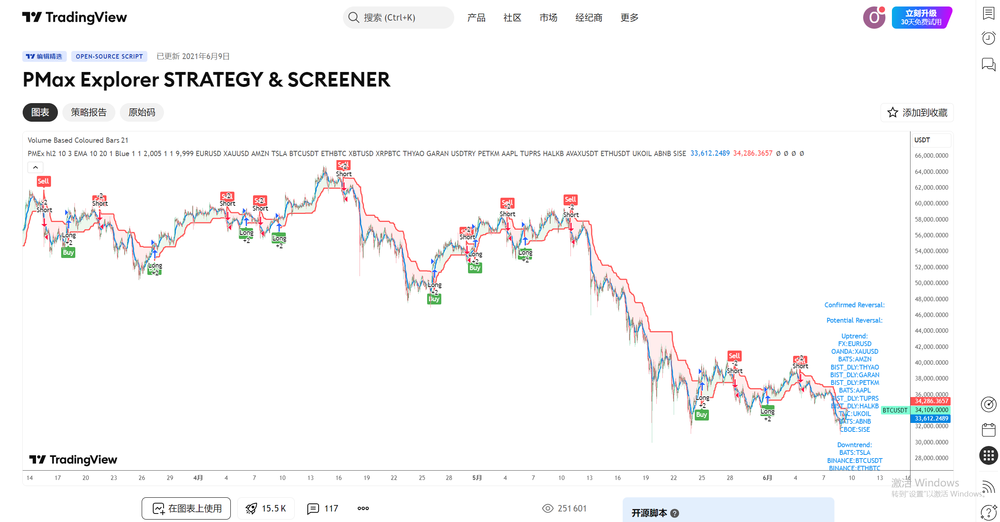
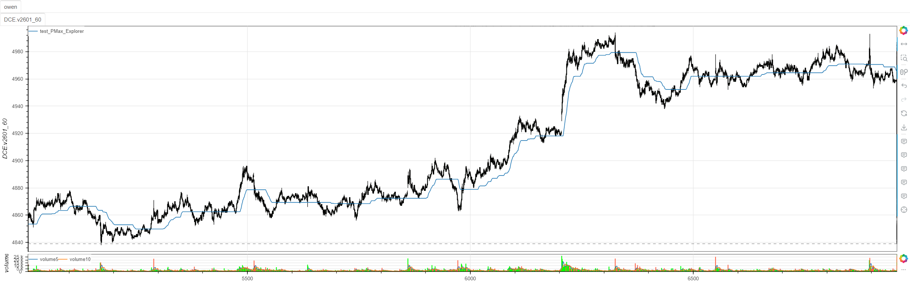

# **MiniBT量化交易之TradingView指标：PMax Explorer**

## 概述

本文将详细介绍如何将 TradingView 上的 PMax Explorer 指标转换为 MiniBT 框架可用的技术指标。这个指标基于超级趋势(SuperTrend)的概念，但进行了重要改进，支持多种移动平均线算法和自适应计算，为交易者提供更灵活的动态支撑阻力系统。

## 原策略分析

### 指标核心逻辑

1. **多算法移动平均**：支持20多种不同的移动平均线算法
2. **自适应通道计算**：基于ATR构建动态支撑阻力通道
3. **智能方向切换**：根据价格与移动平均线关系自动调整通道方向
4. **自定义平均线**：实现VAR、WWMA、ZLEMA、TSF等特殊移动平均算法

### 指标参数

- `Periods`：ATR周期 (默认: 10)
- `Multiplier`：ATR乘数 (默认: 3)
- `mav`：移动平均线类型 (默认: "ema")
- `length`：移动平均线周期 (默认: 10)
- `var_length`：VAR计算长度 (默认: 9)



## MiniBT 转换实现

### 指标类结构

```python
class PMax_Explorer(BtIndicator):
    """https://cn.tradingview.com/script/nHGK4Qtp/"""
    params = dict(Periods=10, Multiplier=3,
                  mav="ema", length=10, var_length=9)
    overlap = True
```

### 核心方法实现

#### 1. VAR (波动率调整移动平均)

```python
def var_Func(self, src: IndSeries, length: int, var_length):
    valpha = 2/(length+1)
    vud1 = src-src.shift()
    vud1 = vud1.apply(lambda x: x > 0. and x or 0.)
    vdd1 = vud1.apply(lambda x: x < 0. and -x or 0.)
    vUD = vud1.rolling(var_length).sum()
    vDD = vdd1.rolling(var_length).sum()
    vCMO = (vUD-vDD).ZeroDivision(vUD+vDD)
    vCMO = vCMO.values
    nanlen = len(vCMO[np.isnan(vCMO)])
    size = src.size
    value = src.values
    VAR = np.zeros(size)
    for i in range(nanlen+1, size):
        VAR[i] = valpha*abs(vCMO[i])*value[i] + \
            (1-valpha*abs(vCMO[i]))*VAR[i-1]
    return IndSeries(VAR)
```

#### 2. WWMA (Welles Wilder移动平均)

```python
def wwma_Func(self, src: IndSeries, length: int):
    wwalpha = 1 / length
    value = src.value
    size = src.size
    WWMA = np.zeros(size)
    for i in range(1, size):
        WWMA[i] = wwalpha*value[i] + (1-wwalpha)*WWMA[i-1]
    return IndSeries(WWMA)
```

#### 3. ZLEMA (零滞后指数移动平均)

```python
def zlema_Func(self, src: IndSeries, length: int):
    zxLag = length/2 == round(length/2) and length/2 or (length - 1) / 2
    zxEMAData = src + src.shift(zxLag)
    ZLEMA = zxEMAData.ema(length)
    return ZLEMA
```

#### 4. TSF (时间序列预测)

```python
def tsf_Func(self, src: IndSeries, length: int):
    lrc = src.linreg(length)
    lrc1 = src.linreg(length, 1)
    lrs = lrc-lrc1
    TSF = src.linreg(length)+lrs
    return TSF
```

#### 5. 移动平均线选择器

```python
def getMA(self, src: IndSeries, mav: str, length: int) -> IndSeries:
    """
    >>> "dema", "ema", "fwma", "hma", "linreg", "midpoint", "pwma", "rma",
        "sinwma", "sma", "swma", "t3", "tema", "trima", "vidya", "wma", "zlma"
        "var", "wwma", "zlema", "tsf"
    """
    if mav in ["dema", "ema", "fwma", "hma", "linreg", "midpoint", "pwma", "rma",
               "sinwma", "sma", "swma", "t3", "tema", "trima", "vidya", "wma", "zlma"]:
        return src.ma(mav, length)
    elif mav in ["var", "wwma", "zlema", "tsf"]:
        return getattr(self, f"{mav}_Func")(src, length)
    else:
        return src.ema(length)
```

#### 6. PMax 核心计算

```python
def Pmax_Func(self, src: IndSeries):
    atr = self.atr(self.params.Periods)
    ma = self.getMA(src, self.params.mav, self.params.length)
    up = ma + self.params.Multiplier*atr
    dn = ma - self.params.Multiplier*atr
    up = up.values
    dn = dn.values
    upnanlen = len(up[np.isnan(up)])
    dnnanlen = len(dn[np.isnan(dn)])
    nanlen = max(upnanlen, dnnanlen)
    size = self.V
    PMax = np.zeros(size)
    PMax[nanlen] = dn[nanlen]
    dir = np.ones(size)
    MAvg = ma.values
    for i in range(nanlen+1, size):
        dir[i] = (dir[i-1] == -1 and MAvg[i] > PMax[i-1]
                  ) and 1 or ((dir[i-1] == 1 and MAvg[i] < PMax[i-1]) and -1 or dir[i-1])
        PMax[i] = dir[i] == 1 and max(
            dn[i], PMax[i-1]) or min(up[i], PMax[i-1])
    return PMax
```

## 转换技术细节

### 1. VAR移动平均实现

VAR基于CMO(钱德动量摆动指标)实现自适应平滑：

```python
# 计算价格变化方向
vud1 = src-src.shift()
vud1 = vud1.apply(lambda x: x > 0. and x or 0.)  # 上涨幅度
vdd1 = vud1.apply(lambda x: x < 0. and -x or 0.) # 下跌幅度

# 计算CMO指标
vUD = vud1.rolling(var_length).sum()
vDD = vdd1.rolling(var_length).sum()
vCMO = (vUD-vDD).ZeroDivision(vUD+vDD)

# 自适应平滑
VAR[i] = valpha*abs(vCMO[i])*value[i] + (1-valpha*abs(vCMO[i]))*VAR[i-1]
```

### 2. WWMA移动平均

Welles Wilder移动平均使用固定平滑系数：

```python
wwalpha = 1 / length
WWMA[i] = wwalpha*value[i] + (1-wwalpha)*WWMA[i-1]
```

### 3. ZLEMA零滞后EMA

通过价格超前处理减少滞后：

```python
zxLag = length/2 == round(length/2) and length/2 or (length - 1) / 2
zxEMAData = src + src.shift(zxLag)  # 超前处理
ZLEMA = zxEMAData.ema(length)
```

### 4. TSF时间序列预测

基于线性回归的预测：

```python
lrc = src.linreg(length)      # 当前线性回归值
lrc1 = src.linreg(length, 1)  # 下一期线性回归值
lrs = lrc-lrc1                # 回归斜率
TSF = src.linreg(length)+lrs  # 预测值
```

### 5. PMax方向切换逻辑

智能方向切换机制：

```python
dir[i] = (dir[i-1] == -1 and MAvg[i] > PMax[i-1]) and 1 or 
         ((dir[i-1] == 1 and MAvg[i] < PMax[i-1]) and -1 or dir[i-1])
```

## 使用示例
```python
class PMax_Explorer(BtIndicator):
    """https://cn.tradingview.com/script/nHGK4Qtp/"""

    params = dict(Periods=10, Multiplier=3,
                  mav="ema", length=10, var_length=9)
    overlap = True

    def var_Func(self, src: IndSeries, length: int, var_length):
        valpha = 2/(length+1)
        vud1 = src-src.shift()
        vud1 = vud1.apply(lambda x: x > 0. and x or 0.)
        vdd1 = vud1.apply(lambda x: x < 0. and -x or 0.)
        vUD = vud1.rolling(var_length).sum()
        vDD = vdd1.rolling(var_length).sum()
        vCMO = (vUD-vDD).ZeroDivision(vUD+vDD)
        vCMO = vCMO.values
        nanlen = len(vCMO[np.isnan(vCMO)])
        size = src.size
        value = src.values
        VAR = np.zeros(size)
        for i in range(nanlen+1, size):
            VAR[i] = valpha*abs(vCMO[i])*value[i] + \
                (1-valpha*abs(vCMO[i]))*VAR[i-1]
        return IndSeries(VAR)

    def wwma_Func(self, src: IndSeries, length: int):
        wwalpha = 1 / length
        value = src.value
        size = src.size
        WWMA = np.zeros(size)
        for i in range(1, size):
            WWMA[i] = wwalpha*value[i] + (1-wwalpha)*WWMA[i-1]
        return IndSeries(WWMA)

    def zlema_Func(self, src: IndSeries, length: int):
        zxLag = length/2 == round(length/2) and length/2 or (length - 1) / 2
        zxEMAData = src + src.shift(zxLag)
        ZLEMA = zxEMAData.ema(length)
        return ZLEMA

    def tsf_Func(self, src: IndSeries, length: int):
        lrc = src.linreg(length)
        lrc1 = src.linreg(length, 1)
        lrs = lrc-lrc1
        TSF = src.linreg(length)+lrs
        return TSF

    def getMA(self, src: IndSeries, mav: str, length: int) -> IndSeries:
        """
        >>> "dema", "ema", "fwma", "hma", "linreg", "midpoint", "pwma", "rma",
            "sinwma", "sma", "swma", "t3", "tema", "trima", "vidya", "wma", "zlma"
            "var", "wwma", "zlema", "tsf"
        """
        if mav in ["dema", "ema", "fwma", "hma", "linreg", "midpoint", "pwma", "rma",
                   "sinwma", "sma", "swma", "t3", "tema", "trima", "vidya", "wma", "zlma"]:
            return src.ma(mav, length)
        elif mav in ["var", "wwma", "zlema", "tsf"]:
            return getattr(self, f"{mav}_Func")(src, length)
        else:
            return src.ema(length)

    def Pmax_Func(self, src: IndSeries):
        atr = self.atr(self.params.Periods)
        ma = self.getMA(src, self.params.mav, self.params.length)
        up = ma + self.params.Multiplier*atr
        dn = ma - self.params.Multiplier*atr
        up = up.values
        dn = dn.values
        upnanlen = len(up[np.isnan(up)])
        dnnanlen = len(dn[np.isnan(dn)])
        nanlen = max(upnanlen, dnnanlen)
        size = self.V
        PMax = np.zeros(size)
        PMax[nanlen] = dn[nanlen]
        dir = np.ones(size)
        MAvg = ma.values
        for i in range(nanlen+1, size):
            dir[i] = (dir[i-1] == -1 and MAvg[i] > PMax[i-1]
                      ) and 1 or ((dir[i-1] == 1 and MAvg[i] < PMax[i-1]) and -1 or dir[i-1])
            # if dir[i] != dir[i-1]:
            #     PMax[i] = dir[i] > dir[i-1] and dn[i] or up[i]
            #     continue
            PMax[i] = dir[i] == 1 and max(
                dn[i], PMax[i-1]) or min(up[i], PMax[i-1])
        return PMax

    def next(self):
        pmax = self.Pmax_Func(self.hl2())
        return pmax
```
```python
from minibt import *


class owen(Strategy):

    def __init__(self):
        self.min_start_length = 300
        self.data = self.get_kline(LocalDatas.v2601_60_1, height=500)
        self.test = self.data.tradingview.PMax_Explorer()


if __name__ == "__main__":
    Bt().run()
```

## 参数说明

1. **Periods**：ATR周期
   - 控制波动率计算的窗口大小
   - 影响通道对市场波动的敏感度

2. **Multiplier**：ATR乘数
   - 控制通道宽度
   - 较大的值产生更宽的通道，信号更可靠但滞后
   - 较小的值产生更窄的通道，信号更敏感但可能有更多噪音

3. **mav**：移动平均线类型
   - 支持20多种移动平均算法
   - 不同算法适合不同市场环境

4. **length**：移动平均周期
   - 控制移动平均线的平滑程度
   - 影响趋势判断的灵敏度

5. **var_length**：VAR计算长度
   - 仅当mav="var"时有效
   - 控制CMO指标的计算周期

## 移动平均算法详解

### 1. 标准移动平均
- **sma**：简单移动平均
- **ema**：指数移动平均
- **wma**：加权移动平均
- **dema/tema**：双/三重指数移动平均

### 2. 特殊移动平均
- **hma**：赫尔移动平均，减少滞后
- **linreg**：线性回归移动平均
- **sinwma**：正弦加权移动平均
- **fwma**：分形自适应移动平均

### 3. 自定义算法
- **var**：波动率调整移动平均
- **wwma**：Welles Wilder移动平均
- **zlema**：零滞后指数移动平均
- **tsf**：时间序列预测

## 转换注意事项

### 1. 初始值处理

正确处理NaN值的起始位置：

```python
upnanlen = len(up[np.isnan(up)])
dnnanlen = len(dn[np.isnan(dn)])
nanlen = max(upnanlen, dnnanlen)
PMax[nanlen] = dn[nanlen]  # 初始值设为下轨
```

### 2. 方向切换逻辑

智能方向判断避免频繁切换：

```python
dir[i] = (dir[i-1] == -1 and MAvg[i] > PMax[i-1]) and 1 or 
         ((dir[i-1] == 1 and MAvg[i] < PMax[i-1]) and -1 or dir[i-1])
```

### 3. 通道连续性

确保通道切换时的连续性：

```python
PMax[i] = dir[i] == 1 and max(dn[i], PMax[i-1]) or min(up[i], PMax[i-1])
```

## 策略应用场景

### 1. 趋势跟踪

使用PMax作为动态止损和趋势跟踪：

```python
def trend_following_strategy(pmax, close):
    # 趋势方向
    trend_direction = np.where(close > pmax, 1, -1)
    
    # 趋势转换信号
    trend_change = (trend_direction == 1) & (np.roll(trend_direction, 1) == -1)
    trend_reversal = (trend_direction == -1) & (np.roll(trend_direction, 1) == 1)
    
    return trend_change, trend_reversal
```

### 2. 多时间框架确认

结合不同时间框架的PMax信号：

```python
def multi_timeframe_confirmation(daily_pmax, hourly_pmax, close):
    # 日线趋势
    daily_trend = close > daily_pmax
    
    # 小时线信号
    hourly_signal = close > hourly_pmax
    
    # 确认信号
    confirmed_long = daily_trend & hourly_signal
    confirmed_short = (~daily_trend) & (~hourly_signal)
    
    return confirmed_long, confirmed_short
```

### 3. 波动率自适应

根据市场波动率调整参数：

```python
def adaptive_pmax_params(close, volatility_period=20):
    # 计算波动率
    volatility = close.rolling(volatility_period).std() / close.rolling(volatility_period).mean()
    
    # 自适应参数
    adaptive_multiplier = np.where(volatility > 0.02, 2.0, 3.0)
    adaptive_length = np.where(volatility > 0.02, 8, 12)
    
    return adaptive_multiplier, adaptive_length
```

### 4. 组合策略

PMax与其他指标结合使用：

```python
def combined_strategy(pmax, rsi, volume):
    # PMax趋势方向
    pmax_trend = close > pmax
    
    # RSI超买超卖
    rsi_oversold = rsi < 30
    rsi_overbought = rsi > 70
    
    # 成交量确认
    volume_confirm = volume > volume.rolling(20).mean()
    
    # 综合信号
    long_signal = (~pmax_trend) & rsi_oversold & volume_confirm
    short_signal = pmax_trend & rsi_overbought & volume_confirm
    
    return long_signal, short_signal
```

## 不同移动平均算法的适用场景

### 1. 趋势市场
- **EMA/HMA**：响应快速，适合强趋势
- **T3/DEMA**：平滑且滞后小，适合中长期趋势

### 2. 震荡市场
- **SMA**：稳定性好，减少虚假信号
- **VAR**：自适应波动率，自动调整灵敏度

### 3. 转折点识别
- **ZLEMA/TSF**：滞后小，适合捕捉趋势转换
- **LinReg**：基于回归，适合识别趋势强度

## 性能优化建议

### 1. 参数网格优化

系统化测试参数组合：

```python
def parameter_grid_optimization():
    param_grid = {
        'Periods': [5, 10, 14, 20],
        'Multiplier': [2.0, 2.5, 3.0, 3.5],
        'mav': ['ema', 'hma', 'sma', 'var'],
        'length': [5, 10, 14, 20]
    }
    # 遍历所有参数组合进行回测
```

### 2. 市场状态识别

根据市场状态选择最佳算法：

```python
def market_regime_detection(close, window=50):
    # 计算市场状态指标
    returns = close.pct_change()
    volatility = returns.rolling(window).std()
    trend_strength = close.rolling(window).apply(
        lambda x: (x[-1] - x[0]) / (x.max() - x.min())
    )
    
    # 判断市场状态
    high_vol = volatility > volatility.quantile(0.7)
    strong_trend = abs(trend_strength) > 0.5
    
    if strong_trend:
        return 'trending'
    elif high_vol:
        return 'volatile'
    else:
        return 'ranging'
```

## 扩展功能

### 1. PMax通道宽度指标

基于PMax计算通道宽度变化：

```python
def pmax_channel_width(pmax, close, lookback=20):
    # 计算通道宽度变化率
    ma = close.rolling(lookback).mean()
    channel_ratio = (pmax - ma) / ma
    
    # 宽度动量
    width_momentum = channel_ratio.diff(5)
    
    return channel_ratio, width_momentum
```

### 2. 多周期PMax一致性

分析不同周期PMax的一致性：

```python
def multi_period_pmax_alignment(short_pmax, medium_pmax, long_pmax):
    # 计算各周期趋势方向
    short_trend = close > short_pmax
    medium_trend = close > medium_pmax  
    long_trend = close > long_pmax
    
    # 趋势一致性得分
    alignment_score = (short_trend.astype(int) + 
                      medium_trend.astype(int) + 
                      long_trend.astype(int)) / 3
    
    return alignment_score
```

## 总结

PMax Explorer指标通过创新的多算法移动平均系统和智能方向切换机制，为交易者提供了一个高度可定制化的动态支撑阻力系统。该指标不仅保留了传统SuperTrend指标的优点，还通过支持多种移动平均算法大大增强了适应性。

转换过程中，我们完整实现了原指标的所有核心功能，包括20多种移动平均算法、VAR自适应平滑、ZLEMA零滞后处理、TSF时间序列预测等高级特性。通过MiniBT框架的实现，用户可以在回测系统中充分利用这一强大的技术指标。

PMax Explorer特别适用于：
- 趋势识别和跟踪策略
- 动态止损和止盈设置
- 多时间框架趋势分析
- 自适应参数交易系统

该指标的转换展示了如何将复杂的多算法技术指标从TradingView移植到MiniBT框架，为其他高级技术指标的实现提供了重要参考。PMax Explorer的灵活性和强大功能使其成为趋势交易者的重要工具。

> 风险提示：本文涉及的交易策略、代码示例均为技术演示、教学探讨，仅用于展示逻辑思路，绝不构成任何投资建议、操作指引或决策依据 。金融市场复杂多变，存在价格波动、政策调整、流动性等多重风险，历史表现不预示未来结果。任何交易决策均需您自主判断、独立承担责任 —— 若依据本文内容操作，盈亏后果概由自身承担。请务必充分评估风险承受能力，理性对待市场，谨慎做出投资选择。