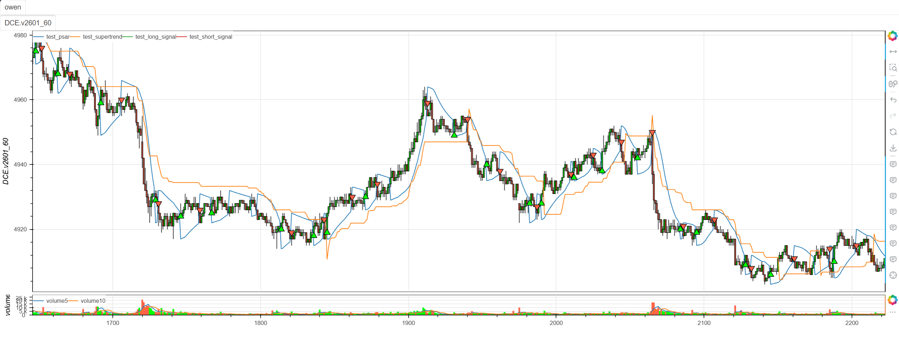

# **MiniBT量化交易之TradingView指标：RJ Trend Engine Final Version**

## 概述

本文将详细介绍如何将 TradingView 上的 RJ Trend Engine Final Version 指标转换为 MiniBT 框架可用的技术指标。这是一个多指标融合的趋势引擎，结合了抛物线转向指标(PSAR)、超级趋势(SuperTrend)和平均趋向指数(ADX)，通过多种技术指标的协同作用来识别趋势方向和交易机会。

## 原策略分析

### 指标核心逻辑

1. **多指标融合系统**：结合PSAR、SuperTrend、ADX三个核心指标
2. **趋势方向确认**：通过指标一致性验证趋势强度
3. **反转信号识别**：支持标准趋势信号和反转趋势信号
4. **多重过滤机制**：减少虚假信号，提高交易质量

### 指标参数

- `psarStart`：PSAR起始加速因子 (默认: 0.02)
- `psarIncrement`：PSAR加速因子增量 (默认: 0.02)
- `psarMax`：PSAR最大加速因子 (默认: 0.2)
- `stAtrPeriod`：SuperTrend ATR周期 (默认: 10)
- `stFactor`：SuperTrend乘数 (默认: 3.0)
- `adxLen`：ADX计算周期 (默认: 14)
- `adxThreshold`：ADX趋势阈值 (默认: 20)
- `bbLength`：布林带周期 (默认: 20)
- `bbStdDev`：布林带标准差 (默认: 3.0)
> 注：该指标出版物已下架
## MiniBT 转换实现

### 指标类结构

```python
class RJ_Trend_Engine(BtIndicator):
    """https://cn.tradingview.com/script/xZ9IlWfi-RJ-Trend-Engine-Final-Version/"""
    params = dict(
        psarStart=0.02,
        psarIncrement=0.02,
        psarMax=0.2,
        stAtrPeriod=10,
        stFactor=3.0,
        adxLen=14,
        adxThreshold=20,
        bbLength=20,
        bbStdDev=3.0
    )
    overlap = True
```

### 核心方法实现

#### 1. 多指标计算

```python
def next(self):
    psar = self.SAR(self.params.psarStart, self.params.psarMax)
    supertrend, st_direction, * \
        _ = self.supertrend(self.params.stAtrPeriod,
                            self.params.stFactor).to_lines()
    adx, diplus, diminus = self.adx(
        self.params.adxLen, self.params.adxLen).to_lines()
```

#### 2. PSAR翻转信号检测

```python
psarFlipUp = (self.close > psar) & (self.open < psar.shift())
psarFlipDown = (self.close < psar) & (self.open > psar.shift())
```

#### 3. 趋势状态判断

```python
stIsUptrend = st_direction < 0
stIsDowntrend = st_direction > 0
adxIsTrending = adx > self.params.adxThreshold
```

#### 4. 交易信号生成

```python
standardBuySignal = psarFlipUp & stIsUptrend & adxIsTrending
standardSellSignal = psarFlipDown & stIsDowntrend & adxIsTrending
reversalBuySignal = psarFlipUp & adxIsTrending & stIsDowntrend
reversalSellSignal = psarFlipDown & adxIsTrending & stIsUptrend
long_signal = standardBuySignal | reversalBuySignal
short_signal = standardSellSignal | reversalSellSignal
```

## 转换技术细节

### 1. PSAR指标计算

原策略使用抛物线转向指标识别趋势反转点：

```python
// Parabolic SAR Calculation
psar = ta.sar(psarStart, psarIncrement, psarMax)
```

转换代码使用MiniBT的内置SAR方法：

```python
psar = self.SAR(self.params.psarStart, self.params.psarMax)
```

### 2. SuperTrend趋势判断

原策略使用SuperTrend确定主要趋势方向：

```python
// SuperTrend Calculation
[supertrend, st_direction] = ta.supertrend(stFactor, stAtrPeriod)
```

转换代码使用MiniBT的SuperTrend实现：

```python
supertrend, st_direction, * \
    _ = self.supertrend(self.params.stAtrPeriod,
                        self.params.stFactor).to_lines()
```

### 3. ADX趋势强度确认

原策略使用ADX确认趋势强度：

```python
// ADX Trend Strength
[adx, diplus, diminus] = ta.dmi(adxLen, adxLen)
adxIsTrending = adx > adxThreshold
```

转换代码使用MiniBT的ADX实现：

```python
adx, diplus, diminus = self.adx(
    self.params.adxLen, self.params.adxLen).to_lines()
adxIsTrending = adx > self.params.adxThreshold
```

### 4. 信号逻辑实现

原策略采用双重信号机制：

```python
// Standard Signals (Trend Following)
standardBuySignal = psarFlipUp and stIsUptrend and adxIsTrending
standardSellSignal = psarFlipDown and stIsDowntrend and adxIsTrending

// Reversal Signals (Counter-trend)
reversalBuySignal = psarFlipUp and adxIsTrending and stIsDowntrend
reversalSellSignal = psarFlipDown and adxIsTrending and stIsUptrend
```

转换代码保持了相同的逻辑结构：

```python
standardBuySignal = psarFlipUp & stIsUptrend & adxIsTrending
standardSellSignal = psarFlipDown & stIsDowntrend & adxIsTrending
reversalBuySignal = psarFlipUp & adxIsTrending & stIsDowntrend
reversalSellSignal = psarFlipDown & adxIsTrending & stIsUptrend
```

## 使用示例
```python
class RJ_Trend_Engine(BtIndicator):
    """https://cn.tradingview.com/script/xZ9IlWfi-RJ-Trend-Engine-Final-Version/"""
    params = dict(
        psarStart=0.02,
        psarIncrement=0.02,
        psarMax=0.2,
        stAtrPeriod=10,
        stFactor=3.0,
        adxLen=14,
        adxThreshold=20,
        bbLength=20,
        bbStdDev=3.0
    )
    overlap = True

    def next(self):
        psar = self.SAR(self.params.psarStart, self.params.psarMax)
        supertrend, st_direction, * \
            _ = self.supertrend(self.params.stAtrPeriod,
                                self.params.stFactor).to_lines()
        adx, diplus, diminus = self.adx(
            self.params.adxLen, self.params.adxLen).to_lines()
        psarFlipUp = (self.close > psar) & (self.open < psar.shift())
        psarFlipDown = (self.close < psar) & (self.open > psar.shift())
        stIsUptrend = st_direction < 0
        stIsDowntrend = st_direction > 0
        adxIsTrending = adx > self.params.adxThreshold
        standardBuySignal = psarFlipUp & stIsUptrend & adxIsTrending
        standardSellSignal = psarFlipDown & stIsDowntrend & adxIsTrending
        reversalBuySignal = psarFlipUp & adxIsTrending & stIsDowntrend
        reversalSellSignal = psarFlipDown & adxIsTrending & stIsUptrend
        long_signal = standardBuySignal | reversalBuySignal
        short_signal = standardSellSignal | reversalSellSignal
        return psar, supertrend, long_signal, short_signal
```
```python
from minibt import *


class owen(Strategy):

    def __init__(self):
        self.min_start_length = 300
        self.data = self.get_kline(LocalDatas.v2601_60_1, height=500)
        self.test = self.data.tradingview.RJ_Trend_Engine()


if __name__ == "__main__":
    Bt().run()
```

## 参数说明

1. **PSAR参数组**
   - `psarStart`：起始加速因子，控制PSAR初始灵敏度
   - `psarIncrement`：加速因子增量，控制PSAR加速速率
   - `psarMax`：最大加速因子，限制PSAR最大灵敏度

2. **SuperTrend参数组**
   - `stAtrPeriod`：ATR周期，影响趋势对波动的敏感度
   - `stFactor`：ATR乘数，控制趋势通道宽度

3. **ADX参数组**
   - `adxLen`：ADX计算周期，影响趋势强度判断的平滑度
   - `adxThreshold`：趋势阈值，ADX高于此值认为存在趋势

4. **布林带参数组**（当前版本未使用）
   - `bbLength`：布林带周期
   - `bbStdDev`：布林带标准差乘数

## 信号逻辑详解

### 1. 标准趋势信号（Trend Following）

**多头标准信号**：
```python
standardBuySignal = psarFlipUp & stIsUptrend & adxIsTrending
```
- PSAR向上翻转（价格突破PSAR）
- SuperTrend显示上升趋势
- ADX确认趋势强度足够

**空头标准信号**：
```python
standardSellSignal = psarFlipDown & stIsDowntrend & adxIsTrending
```
- PSAR向下翻转（价格跌破PSAR）
- SuperTrend显示下降趋势
- ADX确认趋势强度足够

### 2. 反转趋势信号（Counter-trend）

**多头反转信号**：
```python
reversalBuySignal = psarFlipUp & adxIsTrending & stIsDowntrend
```
- PSAR向上翻转
- ADX确认存在趋势
- 但SuperTrend仍显示下降趋势（潜在反转）

**空头反转信号**：
```python
reversalSellSignal = psarFlipDown & adxIsTrending & stIsUptrend
```
- PSAR向下翻转
- ADX确认存在趋势
- 但SuperTrend仍显示上升趋势（潜在反转）

## 转换注意事项

### 1. 方向符号约定

注意SuperTrend方向符号的约定：
```python
stIsUptrend = st_direction < 0  # 原策略中-1表示上升趋势
stIsDowntrend = st_direction > 0  # 原策略中1表示下降趋势
```

### 2. PSAR翻转检测

PSAR翻转需要结合开收盘价判断：
```python
psarFlipUp = (self.close > psar) & (self.open < psar.shift())
psarFlipDown = (self.close < psar) & (self.open > psar.shift())
```

### 3. 信号组合逻辑

使用位运算组合信号：
```python
long_signal = standardBuySignal | reversalBuySignal  # 逻辑或运算
short_signal = standardSellSignal | reversalSellSignal
```

## 策略应用场景

### 1. 趋势跟踪策略

使用标准信号进行趋势跟踪：

```python
def trend_following_strategy(psar, supertrend, adx, close, open_price):
    # 计算所有信号组件
    psar_flip_up = (close > psar) & (open_price < psar.shift())
    psar_flip_down = (close < psar) & (open_price > psar.shift())
    st_uptrend = supertrend.direction < 0
    st_downtrend = supertrend.direction > 0
    adx_trending = adx > 20
    
    # 标准趋势信号
    long_entry = psar_flip_up & st_uptrend & adx_trending
    short_entry = psar_flip_down & st_downtrend & adx_trending
    
    return long_entry, short_entry
```

### 2. 反转交易策略

利用反转信号捕捉趋势转折点：

```python
def reversal_strategy(psar, supertrend, adx, close, open_price):
    # 计算信号组件
    psar_flip_up = (close > psar) & (open_price < psar.shift())
    psar_flip_down = (close < psar) & (open_price > psar.shift())
    st_uptrend = supertrend.direction < 0
    st_downtrend = supertrend.direction > 0
    adx_trending = adx > 20
    
    # 反转信号
    reversal_long = psar_flip_up & adx_trending & st_downtrend
    reversal_short = psar_flip_down & adx_trending & st_uptrend
    
    return reversal_long, reversal_short
```

### 3. 多时间框架确认

结合不同时间框架的趋势信号：

```python
def multi_timeframe_confirmation(daily_engine, hourly_engine):
    # 日线趋势方向
    daily_trend = daily_engine.st_direction < 0  # 日线上升趋势
    
    # 小时线交易信号
    hourly_long = hourly_engine.long_signal
    hourly_short = hourly_engine.short_signal
    
    # 确认信号：日线趋势与小时线信号一致
    confirmed_long = daily_trend & hourly_long
    confirmed_short = (~daily_trend) & hourly_short
    
    return confirmed_long, confirmed_short
```

### 4. 动态仓位管理

根据趋势强度调整仓位：

```python
def dynamic_position_sizing(adx, atr, base_size=1):
    # 根据ADX强度调整仓位
    trend_strength = (adx - 20) / 40  # 归一化到0-1范围
    position_multiplier = 0.5 + trend_strength  # 0.5到1.5倍
    
    # 根据波动率调整仓位
    volatility_adjustment = 1.0 / (atr / atr.mean())  # 波动率反向调整
    
    final_size = base_size * position_multiplier * volatility_adjustment
    return final_size.clip(0.1, 3.0)  # 限制仓位范围
```

## 风险管理建议

### 1. 止损策略

基于指标动态止损：

```python
def dynamic_stop_loss(psar, supertrend, position_type, close):
    if position_type == 'long':
        # 多头止损：PSAR和SuperTrend下轨的较低者
        stop_level = max(psar, supertrend)
        return close < stop_level
    else:
        # 空头止损：PSAR和SuperTrend上轨的较高者
        stop_level = min(psar, supertrend)
        return close > stop_level
```

### 2. 止盈策略

基于ATR的移动止盈：

```python
def trailing_take_profit(entry_price, atr, position_type, close, trail_multiplier=2):
    if position_type == 'long':
        # 多头移动止盈：最高价回撤2倍ATR
        trailing_high = close.rolling(20).max()
        return close < (trailing_high - trail_multiplier * atr)
    else:
        # 空头移动止盈：最低价反弹2倍ATR
        trailing_low = close.rolling(20).min()
        return close > (trailing_low + trail_multiplier * atr)
```

## 性能优化建议

### 1. 参数自适应调整

根据市场波动率动态调整参数：

```python
def adaptive_parameters(close, volatility_lookback=50):
    # 计算市场波动率
    volatility = close.rolling(volatility_lookback).std() / close.rolling(volatility_lookback).mean()
    
    # 自适应参数
    adaptive_st_factor = np.where(volatility > 0.02, 2.5, 3.5)
    adaptive_adx_threshold = np.where(volatility > 0.02, 25, 15)
    
    return adaptive_st_factor, adaptive_adx_threshold
```

### 2. 信号过滤机制

添加额外的过滤条件：

```python
def filtered_signals(engine_signals, volume, rsi, lookback=20):
    long_signal, short_signal = engine_signals
    
    # 成交量确认
    volume_confirm = volume > volume.rolling(lookback).mean()
    
    # RSI过滤（避免超买超卖区域）
    rsi_filter = (rsi > 30) & (rsi < 70)
    
    # 综合过滤
    filtered_long = long_signal & volume_confirm & rsi_filter
    filtered_short = short_signal & volume_confirm & rsi_filter
    
    return filtered_long, filtered_short
```

## 扩展功能

### 1. 趋势强度评分

基于多指标创建趋势强度评分：

```python
def trend_strength_score(psar, supertrend, adx, di_plus, di_minus):
    # PSAR趋势得分（距离价格远近）
    psar_score = abs(psar - close) / atr
    
    # SuperTrend趋势得分
    st_score = abs(close - supertrend) / atr
    
    # ADX趋势强度得分
    adx_score = (adx - 20) / 40  # 归一化到0-1
    
    # DMI方向得分
    dmi_score = (di_plus - di_minus) / (di_plus + di_minus)
    
    # 综合趋势强度得分
    total_score = (psar_score + st_score + adx_score + abs(dmi_score)) / 4
    
    return total_score.clip(0, 1)
```

### 2. 信号质量评估

评估交易信号的历史表现：

```python
def signal_quality_assessment(signals, returns, lookback_period=100):
    long_signals, short_signals = signals
    
    # 计算信号后N期的平均收益
    long_performance = []
    short_performance = []
    
    for i in range(len(signals)):
        if long_signals[i]:
            future_return = returns[i+1:i+lookback_period+1].mean()
            long_performance.append(future_return)
        elif short_signals[i]:
            future_return = -returns[i+1:i+lookback_period+1].mean()
            short_performance.append(future_return)
    
    long_quality = np.mean(long_performance) if long_performance else 0
    short_quality = np.mean(short_performance) if short_performance else 0
    
    return long_quality, short_quality
```

## 总结

RJ Trend Engine Final Version 通过创新的多指标融合方法，为交易者提供了一个强大而灵活的趋势识别系统。该指标结合了PSAR的敏感性、SuperTrend的稳定性以及ADX的趋势强度确认，在保持信号质量的同时提供了标准趋势和反转趋势两种交易机会。

转换过程中，我们完整保留了原指标的核心逻辑，包括PSAR翻转检测、SuperTrend趋势判断、ADX强度确认以及双重信号生成机制。通过MiniBT框架的实现，用户可以在回测系统中充分利用这一先进的趋势引擎。

RJ Trend Engine 特别适用于：
- 趋势市场的趋势跟踪策略
- 趋势转折点的反转交易机会
- 多时间框架的趋势确认
- 动态风险管理和仓位控制

该指标的转换展示了如何将复杂的多指标系统从TradingView移植到MiniBT框架，为其他综合性技术指标的实现提供了重要参考。RJ Trend Engine 的模块化设计和清晰的信号逻辑使其成为趋势交易者的有力工具。

> 风险提示：本文涉及的交易策略、代码示例均为技术演示、教学探讨，仅用于展示逻辑思路，绝不构成任何投资建议、操作指引或决策依据 。金融市场复杂多变，存在价格波动、政策调整、流动性等多重风险，历史表现不预示未来结果。任何交易决策均需您自主判断、独立承担责任 —— 若依据本文内容操作，盈亏后果概由自身承担。请务必充分评估风险承受能力，理性对待市场，谨慎做出投资选择。