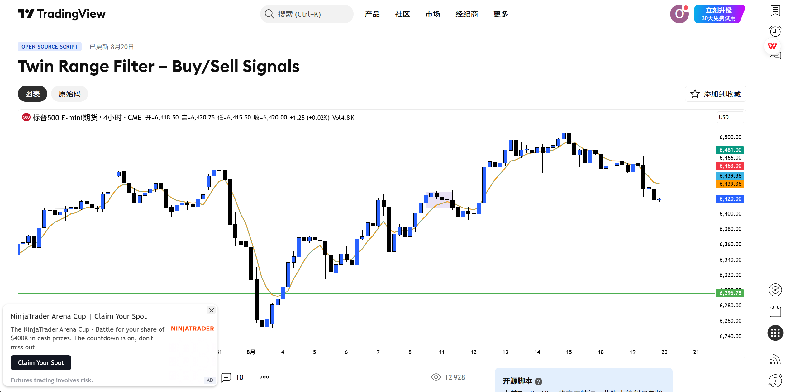
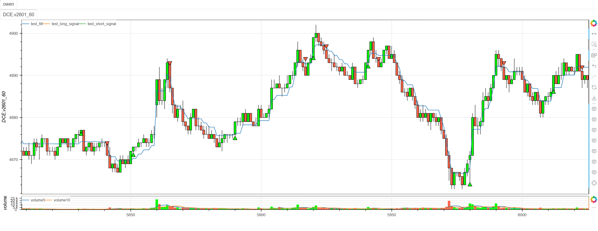

# **MiniBT量化交易之TradingView指标：Twin Range Filter Buy Sell Signals**

## 概述

本文将详细介绍如何将 TradingView 上的 Twin Range Filter 指标转换为 MiniBT 框架可用的技术指标。这是一个基于双重范围过滤的创新趋势跟踪系统，通过两个不同参数的平滑范围过滤器来识别趋势方向和交易机会，有效减少市场噪声干扰。

## 原策略分析

### 指标核心逻辑

1. **双重范围过滤**：使用两个不同周期的平滑范围进行双重过滤
2. **动态范围计算**：基于价格波动率自适应调整过滤范围
3. **趋势累积计数**：通过连续上升/下降周期数确认趋势强度
4. **状态切换机制**：确保交易信号在趋势转换时触发

### 指标参数

- `per1`：第一个过滤器周期 (默认: 127)
- `mult1`：第一个过滤器乘数 (默认: 1.6)
- `per2`：第二个过滤器周期 (默认: 155)
- `mult2`：第二个过滤器乘数 (默认: 2.0)



## MiniBT 转换实现

### 指标类结构

```python
class Twin_Range_Filter(BtIndicator):
    """https://cn.tradingview.com/script/57i9oK2t-Twin-Range-Filter-Buy-Sell-Signals/"""
    params = dict(
        per1=127,
        mult1=1.6,
        per2=155,
        mult2=2.0,
    )
    overlap = True
```

### 核心方法实现

#### 1. 平滑范围计算

```python
def smoothrng(self, x: IndSeries, t: int, m: float):
    wper = t * 2 - 1
    avrng = x.diff().abs().ema(t)
    return avrng.ema(wper) * m
```

#### 2. 范围过滤线计算

```python
def rngfilt(self, x: IndSeries, r: IndSeries):
    size = x.size
    x = x.values
    r = r.values
    rf = np.zeros(size)
    lennan = max(len(x[pd.isnull(x)]), len(r[pd.isnull(r)]))
    rf[lennan] = x[lennan]
    for i in range(lennan+1, size):
        rf[i] = x[i] > rf[i-1] and (x[i] - r[i] < rf[i-1] and rf[i-1] or x[i] - r[i]) or (
            x[i] + r[i] > rf[i-1] and rf[i-1] or x[i] + r[i])
    return rf
```

#### 3. 趋势检测机制

```python
# // === Trend Detection ===
size = self.V
upward = np.zeros(size)
downward = np.zeros(size)
lennan = len(filt[pd.isnull(filt)])
for i in range(lennan+1, size):
    upward[i] = filt[i] > filt[i-1] and upward[i-1] + \
        1 or (0 if filt[i] < filt[i-1] else upward[i-1])
    downward[i] = filt[i] < filt[i-1] and downward[i-1] + \
        1 or (0 if filt[i] > filt[i-1] else downward[i-1])
```

#### 4. 交易信号生成

```python
# // === Entry Conditions ===
longCond = (source > filt) & (upward > 0)
shortCond = (source < filt) & (downward > 0)
CondIni = np.zeros(size)
for i in range(1, size):
    CondIni[i] = longCond[i] and 1 or (
        shortCond[i] and -1 or CondIni[i-1])
CondIni = pd.Series(CondIni)
long_signal = longCond & (CondIni.shift() == -1)
short_signal = shortCond & (CondIni.shift() == 1)
```

## 转换技术细节

### 1. 平滑范围计算原理

原策略使用双重EMA平滑价格波动率：

```pine
// Smooth Range Calculation
smoothrng(x, t, m) =>
    wper = t * 2 - 1
    avrng = ta.ema(math.abs(x - x[1]), t)
    ta.ema(avrng, wper) * m
```

转换代码使用MiniBT的EMA方法实现：

```python
def smoothrng(self, x: IndSeries, t: int, m: float):
    wper = t * 2 - 1
    avrng = x.diff().abs().ema(t)  # 价格变化的绝对值EMA
    return avrng.ema(wper) * m     # 二次平滑并乘以乘数
```

### 2. 范围过滤线算法

原策略使用递归方式计算动态过滤线：

```pine
// Range Filter Line
rngfilt(x, r) =>
    float rf = 0.0
    rf := x > rf ? math.max(rf, x - r) : math.min(rf, x + r)
```

转换代码使用循环方式实现相同的逻辑：

```python
for i in range(lennan+1, size):
    rf[i] = x[i] > rf[i-1] and (x[i] - r[i] < rf[i-1] and rf[i-1] or x[i] - r[i]) or (
        x[i] + r[i] > rf[i-1] and rf[i-1] or x[i] + r[i])
```

### 3. 趋势累积计数器

原策略通过连续周期计数确认趋势强度：

```pine
// Trend Accumulation
upward := filt > filt[1] ? nz(upward[1]) + 1 : filt < filt[1] ? 0 : nz(upward[1])
downward := filt < filt[1] ? nz(downward[1]) + 1 : filt > filt[1] ? 0 : nz(downward[1])
```

转换代码实现了相同的累积逻辑：

```python
upward[i] = filt[i] > filt[i-1] and upward[i-1] + 1 or (0 if filt[i] < filt[i-1] else upward[i-1])
downward[i] = filt[i] < filt[i-1] and downward[i-1] + 1 or (0 if filt[i] > filt[i-1] else downward[i-1])
```

### 4. 状态切换机制

原策略确保信号在状态转换时触发：

```pine
// State Transition
CondIni = 0
CondIni := longCond ? 1 : shortCond ? -1 : CondIni[1]
longSignal = longCond and CondIni[1] == -1
shortSignal = shortCond and CondIni[1] == 1
```

转换代码保持了相同的状态管理：

```python
CondIni[i] = longCond[i] and 1 or (shortCond[i] and -1 or CondIni[i-1])
long_signal = longCond & (CondIni.shift() == -1)  # 从前一空头状态转换
short_signal = shortCond & (CondIni.shift() == 1)  # 从前一多头状态转换
```

## 使用示例
```python
class Twin_Range_Filter(BtIndicator):
    """https://cn.tradingview.com/script/57i9oK2t-Twin-Range-Filter-Buy-Sell-Signals/"""

    params = dict(
        per1=127,
        mult1=1.6,
        per2=155,
        mult2=2.0,
    )
    overlap = True

    def smoothrng(self, x: IndSeries, t: int, m: float):
        wper = t * 2 - 1
        avrng = x.diff().abs().ema(t)
        return avrng.ema(wper) * m

    def rngfilt(self, x: IndSeries, r: IndSeries):
        size = x.size
        x = x.values
        r = r.values
        rf = np.zeros(size)
        lennan = max(len(x[pd.isnull(x)]), len(r[pd.isnull(r)]))
        rf[lennan] = x[lennan]
        for i in range(lennan+1, size):
            rf[i] = x[i] > rf[i-1] and (x[i] - r[i] < rf[i-1] and rf[i-1] or x[i] - r[i]) or (
                x[i] + r[i] > rf[i-1] and rf[i-1] or x[i] + r[i])
        return rf

    def next(self):
        source = self.close
        smrng1 = self.smoothrng(
            source, self.params.per1, self.params.mult1)
        smrng2 = self.smoothrng(
            source, self.params.per2, self.params.mult2)
        smrng = (smrng1 + smrng2) / 2
        filt = self.rngfilt(source, smrng)

        # // === Trend Detection ===
        size = self.V
        upward = np.zeros(size)
        downward = np.zeros(size)
        lennan = len(filt[pd.isnull(filt)])
        for i in range(lennan+1, size):
            upward[i] = filt[i] > filt[i-1] and upward[i-1] + \
                1 or (0 if filt[i] < filt[i-1] else upward[i-1])
            downward[i] = filt[i] < filt[i-1] and downward[i-1] + \
                1 or (0 if filt[i] > filt[i-1] else downward[i-1])

        # // === Entry Conditions ===
        longCond = (source > filt) & (upward > 0)
        shortCond = (source < filt) & (downward > 0)
        CondIni = np.zeros(size)
        for i in range(1, size):
            CondIni[i] = longCond[i] and 1 or (
                shortCond[i] and -1 or CondIni[i-1])
        CondIni = pd.Series(CondIni)
        long_signal = longCond & (CondIni.shift() == -1)
        short_signal = shortCond & (CondIni.shift() == 1)
        return filt, long_signal, short_signal
```
```python
from minibt import *


class owen(Strategy):

    def __init__(self):
        self.data = self.get_kline(LocalDatas.v2601_60_1, height=500)
        self.test = self.data.tradingview.Twin_Range_Filter()


if __name__ == "__main__":
    Bt().run()

```



## 参数说明

1. **per1/mult1**：第一个过滤器参数
   - `per1`：第一个EMA周期，控制短期波动率计算
   - `mult1`：第一个乘数，控制过滤范围宽度

2. **per2/mult2**：第二个过滤器参数  
   - `per2`：第二个EMA周期，控制长期波动率计算
   - `mult2`：第二个乘数，控制过滤范围宽度

3. **双重过滤优势**
   - 两个不同周期的过滤器提供更稳定的信号
   - 减少单一参数对市场条件变化的敏感性
   - 通过平均值平衡短期和长期波动率

## 算法原理详解

### 1. 平滑范围计算

```python
avrng = x.diff().abs().ema(t)        # 价格变化绝对值的EMA
smooth_rng = avrng.ema(wper) * m     # 二次平滑并缩放
```

其中 `wper = t * 2 - 1` 是 Wilder 平滑周期

### 2. 范围过滤线逻辑

过滤线采用类似超级趋势的递归算法：

```python
if current_price > previous_filter:
    current_filter = max(previous_filter, current_price - smooth_range)
else:
    current_filter = min(previous_filter, current_price + smooth_range)
```

### 3. 趋势强度量化

通过连续周期计数量化趋势强度：
- `upward`：过滤线连续上升的周期数
- `downward`：过滤线连续下降的周期数

### 4. 状态转换机制

确保信号在趋势转换时触发：
- 多头信号：当前满足多头条件且前一状态为空头
- 空头信号：当前满足空头条件且前一状态为多头

## 转换注意事项

### 1. 初始值处理

正确处理NaN值的起始位置：

```python
lennan = max(len(x[pd.isnull(x)]), len(r[pd.isnull(r)]))
rf[lennan] = x[lennan]  # 使用第一个有效值作为初始值
```

### 2. 循环计算优化

由于过滤线计算具有递归依赖，必须使用循环：

```python
for i in range(lennan+1, size):
    # 递归计算过滤线值
```

### 3. 趋势计数逻辑

趋势累积计数器的实现：

```python
upward[i] = filt[i] > filt[i-1] and upward[i-1] + 1 or (0 if filt[i] < filt[i-1] else upward[i-1])
```

## 策略应用场景

### 1. 趋势跟踪策略

使用Twin Range Filter进行趋势识别：

```python
def trend_identification(filt, close, upward, downward):
    # 趋势方向
    trend_direction = np.where(close > filt, 1, -1)
    
    # 趋势强度
    trend_strength = np.where(trend_direction == 1, upward, downward)
    
    # 强趋势识别
    strong_uptrend = (trend_direction == 1) & (upward > 10)
    strong_downtrend = (trend_direction == -1) & (downward > 10)
    
    return strong_uptrend, strong_downtrend
```

### 2. 波动率自适应交易

根据市场波动率调整交易参数：

```python
def volatility_adaptive_trading(close, base_period=100):
    # 计算市场波动率
    volatility = close.rolling(base_period).std() / close.rolling(base_period).mean()
    
    # 自适应参数
    adaptive_per1 = np.where(volatility > 0.02, 100, 150)
    adaptive_mult1 = np.where(volatility > 0.02, 1.8, 1.4)
    adaptive_per2 = np.where(volatility > 0.02, 130, 180)
    adaptive_mult2 = np.where(volatility > 0.02, 2.2, 1.8)
    
    return adaptive_per1, adaptive_mult1, adaptive_per2, adaptive_mult2
```

### 3. 多时间框架确认

结合不同时间框架的信号：

```python
def multi_timeframe_confirmation(daily_filter, hourly_filter, daily_close, hourly_close):
    # 日线趋势方向
    daily_trend = daily_close > daily_filter.filt
    
    # 小时线交易信号
    hourly_long = hourly_filter.long_signal
    hourly_short = hourly_filter.short_signal
    
    # 确认信号
    confirmed_long = daily_trend & hourly_long
    confirmed_short = (~daily_trend) & hourly_short
    
    return confirmed_long, confirmed_short
```

### 4. 过滤线突破策略

基于过滤线突破的增强策略：

```python
def filter_breakout_strategy(filt, close, lookback=20):
    # 计算过滤线与价格的偏离度
    deviation = (close - filt) / filt
    
    # 突破强度
    breakout_strength = deviation.rolling(lookback).apply(
        lambda x: (x[-1] - x[:-1].mean()) / x[:-1].std()
    )
    
    # 强突破信号
    strong_breakout = breakout_strength > 2.0
    strong_breakdown = breakout_strength < -2.0
    
    return strong_breakout, strong_breakdown
```

## 风险管理建议

### 1. 动态止损策略

基于过滤线的动态止损：

```python
def dynamic_stop_loss(filt, close, position_type, atr, multiplier=1.5):
    if position_type == 'long':
        # 多头止损：过滤线下方1.5倍ATR
        stop_level = filt - multiplier * atr
        return close < stop_level
    else:
        # 空头止损：过滤线上方1.5倍ATR
        stop_level = filt + multiplier * atr
        return close > stop_level
```

### 2. 趋势衰竭预警

识别趋势可能衰竭的信号：

```python
def trend_exhaustion_warning(upward, downward, close, filt, lookback=10):
    # 上升趋势衰竭：连续上升周期减少但价格仍在高位
    uptrend_exhaustion = (upward.diff() < 0) & (close > filt) & (upward > lookback)
    
    # 下降趋势衰竭：连续下降周期减少但价格仍在低位  
    downtrend_exhaustion = (downward.diff() < 0) & (close < filt) & (downward > lookback)
    
    return uptrend_exhaustion, downtrend_exhaustion
```

## 性能优化建议

### 1. 参数网格优化

系统化测试参数组合：

```python
def parameter_grid_optimization():
    param_grid = {
        'per1': [100, 127, 150],
        'mult1': [1.4, 1.6, 1.8],
        'per2': [140, 155, 170],
        'mult2': [1.8, 2.0, 2.2]
    }
    # 遍历所有参数组合进行回测
```

### 2. 市场状态识别

根据市场状态选择最佳参数：

```python
def market_regime_detection(close, volume, window=50):
    # 计算市场状态指标
    returns = close.pct_change()
    volatility = returns.rolling(window).std()
    volume_trend = volume.rolling(window).mean()
    
    # 市场状态分类
    high_vol = volatility > volatility.quantile(0.7)
    high_volume = volume > volume_trend
    
    if high_vol and high_volume:
        return 'trending_volatile'
    elif high_vol and not high_volume:
        return 'ranging_volatile'
    elif not high_vol and high_volume:
        return 'trending_calm'
    else:
        return 'ranging_calm'
```

## 扩展功能

### 1. 过滤线通道指标

基于过滤线创建动态通道：

```python
def filter_channel_indicator(filt, smrng, close, multiplier=1.0):
    # 上轨和下轨
    upper_band = filt + multiplier * smrng
    lower_band = filt - multiplier * smrng
    
    # 通道宽度
    channel_width = (upper_band - lower_band) / filt
    
    # 价格在通道中的位置
    channel_position = (close - lower_band) / (upper_band - lower_band)
    
    return upper_band, lower_band, channel_width, channel_position
```

### 2. 信号质量评估

评估交易信号的历史表现：

```python
def signal_quality_analysis(long_signals, short_signals, returns, holding_period=20):
    long_performance = []
    short_performance = []
    
    for i in range(len(long_signals)):
        if long_signals[i]:
            # 多头信号后N期的收益
            future_return = returns[i+1:i+holding_period+1].sum()
            long_performance.append(future_return)
        elif short_signals[i]:
            # 空头信号后N期的收益
            future_return = -returns[i+1:i+holding_period+1].sum()
            short_performance.append(future_return)
    
    long_quality = np.mean(long_performance) if long_performance else 0
    short_quality = np.mean(short_performance) if short_performance else 0
    
    return long_quality, short_quality
```

## 总结

Twin Range Filter 指标通过创新的双重范围过滤机制，为交易者提供了一个强大而稳定的趋势识别系统。该指标结合了波动率自适应范围计算、趋势强度量化和状态转换确认，在保持信号质量的同时有效减少市场噪声干扰。

转换过程中，我们完整实现了原指标的所有核心算法，包括平滑范围计算、递归过滤线算法、趋势累积计数和状态转换机制。通过MiniBT框架的实现，用户可以在回测系统中充分利用这一先进的趋势过滤技术。

Twin Range Filter 特别适用于：
- 趋势市场的趋势识别和跟踪
- 波动率自适应交易系统
- 多时间框架趋势确认
- 动态风险管理和止损设置

该指标的转换展示了如何将复杂的递归过滤算法从TradingView移植到MiniBT框架，为其他类似技术指标的实现提供了重要参考。Twin Range Filter 的稳定性和适应性使其成为趋势交易者的有力工具。

> 风险提示：本文涉及的交易策略、代码示例均为技术演示、教学探讨，仅用于展示逻辑思路，绝不构成任何投资建议、操作指引或决策依据 。金融市场复杂多变，存在价格波动、政策调整、流动性等多重风险，历史表现不预示未来结果。任何交易决策均需您自主判断、独立承担责任 —— 若依据本文内容操作，盈亏后果概由自身承担。请务必充分评估风险承受能力，理性对待市场，谨慎做出投资选择。