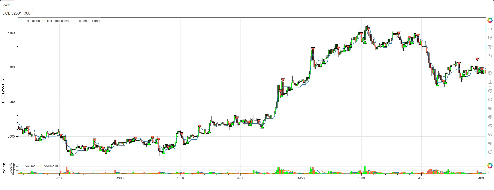

# **MiniBT量化交易之TradingView指标：UT Bot Alerts**

## 概述

本文将详细介绍如何将 TradingView 上的 UT Bot Alerts 指标转换为 MiniBT 框架可用的技术指标。这是一个基于 ATR（平均真实范围）的动态追踪止损系统，结合了趋势识别和信号警报功能，为交易者提供清晰的入场和出场点。

## 原策略分析

### 指标核心逻辑

1. **ATR动态止损**：基于ATR计算动态止损线，适应市场波动
2. **趋势状态跟踪**：通过递归算法持续跟踪趋势方向
3. **信号交叉检测**：使用EMA与止损线的交叉生成交易信号
4. **Heikin Ashi支持**：可选使用Heikin Ashi蜡烛图平滑价格数据

### 指标参数

- `a`：关键值，控制灵敏度 (默认: 1.0)
- `c`：ATR周期 (默认: 10)
- `h`：是否使用Heikin Ashi蜡烛 (默认: False)


## MiniBT 转换实现

### 指标类结构

```python
class UT_Bot_Alerts(BtIndicator):
    """https://cn.tradingview.com/script/n8ss8BID-UT-Bot-Alerts/"""
    params = dict(a=1., c=10, h=False)
    overlap = True
```

### 核心方法实现

#### 1. ATR动态止损计算

```python
def next(self):
    # // Inputs
    a = self.params.a  # "Key Vaule. 'This changes the sensitivity'"
    c = self.params.c  # "ATR Period"
    h = self.params.h  # "Signals from Heikin Ashi Candles"

    xATR = self.atr(c)
    nLoss = a * xATR
    if h:
        close = self.ha().close
    else:
        close = self.close
```

#### 2. 动态止损线递归计算

```python
size = close.size
up = (close+nLoss).values
dn = (close-nLoss).values
src = close.values
xATRTrailingStop = np.zeros(size)
pos = np.zeros(size)
index = self.get_first_valid_index(up, dn)
for i in range(index+1, size):
    xATRTrailingStop[i] = (src[i] > xATRTrailingStop[i-1] and src[i-1] > xATRTrailingStop[i-1]) and max(xATRTrailingStop[i-1], dn[i]) or \
        ((src[i] < xATRTrailingStop[i-1] and src[i-1] < xATRTrailingStop[i-1]) and min(xATRTrailingStop[i-1], up[i]) or
         ((src[i] > xATRTrailingStop[i-1]) and dn[i] or up[i]))
```

#### 3. 位置状态跟踪

```python
pos[i] = (src[i-1] < xATRTrailingStop[i-1] and src[i] > xATRTrailingStop[i-1]) and 1 or \
    ((src[i-1] > xATRTrailingStop[i-1] and src[i]
     < xATRTrailingStop[i-1]) and -1 or pos[i-1])
```

#### 4. 交易信号生成

```python
ema = close.ema(1, talib=False)
above = ema.cross_up(xATRTrailingStop)
below = ema.cross_down(xATRTrailingStop)

long_signal = close > xATRTrailingStop
long_signal &= above
short_signal = close < xATRTrailingStop
short_signal &= below
```

## 转换技术细节

### 1. ATR动态止损原理

原策略使用ATR乘以关键值计算动态止损范围：

```pine
// ATR Trailing Stop Calculation
xATR = ta.atr(c)
nLoss = a * xATR
up = close + nLoss
dn = close - nLoss
```

转换代码使用MiniBT的ATR方法实现：

```python
xATR = self.atr(c)
nLoss = a * xATR
up = (close+nLoss).values
dn = (close-nLoss).values
```

### 2. 递归止损线算法

原策略使用复杂的递归逻辑计算动态止损线：

```pine
// Dynamic Trailing Stop Calculation
xATRTrailingStop = 0.0
xATRTrailingStop := src > xATRTrailingStop[1] and src[1] > xATRTrailingStop[1] ? math.max(xATRTrailingStop[1], dn) : 
                   src < xATRTrailingStop[1] and src[1] < xATRTrailingStop[1] ? math.min(xATRTrailingStop[1], up) : 
                   src > xATRTrailingStop[1] ? dn : up
```

转换代码使用循环方式实现相同的逻辑：

```python
for i in range(index+1, size):
    xATRTrailingStop[i] = (src[i] > xATRTrailingStop[i-1] and src[i-1] > xATRTrailingStop[i-1]) and max(xATRTrailingStop[i-1], dn[i]) or \
        ((src[i] < xATRTrailingStop[i-1] and src[i-1] < xATRTrailingStop[i-1]) and min(xATRTrailingStop[i-1], up[i]) or
         ((src[i] > xATRTrailingStop[i-1]) and dn[i] or up[i]))
```

### 3. 位置状态跟踪

原策略跟踪价格相对于止损线的位置状态：

```pine
// Position State Tracking
pos = 0
pos := src[1] < xATRTrailingStop[1] and src > xATRTrailingStop ? 1 :
      src[1] > xATRTrailingStop[1] and src < xATRTrailingStop ? -1 : pos[1]
```

转换代码实现了相同的状态跟踪逻辑：

```python
pos[i] = (src[i-1] < xATRTrailingStop[i-1] and src[i] > xATRTrailingStop[i-1]) and 1 or \
    ((src[i-1] > xATRTrailingStop[i-1] and src[i] < xATRTrailingStop[i-1]) and -1 or pos[i-1])
```

### 4. 信号交叉检测

原策略使用EMA与止损线的交叉生成信号：

```pine
// Signal Generation
ema = ta.ema(close, 1)
above = ta.crossover(ema, xATRTrailingStop)
below = ta.crossunder(ema, xATRTrailingStop)

longSignal = close > xATRTrailingStop and above
shortSignal = close < xATRTrailingStop and below
```

转换代码使用MiniBT的交叉检测方法：

```python
ema = close.ema(1, talib=False)
above = ema.cross_up(xATRTrailingStop)
below = ema.cross_down(xATRTrailingStop)

long_signal = close > xATRTrailingStop
long_signal &= above
short_signal = close < xATRTrailingStop
short_signal &= below
```

## 使用示例
```python
class UT_Bot_Alerts(BtIndicator):
    """https://cn.tradingview.com/script/n8ss8BID-UT-Bot-Alerts/"""
    params = dict(a=1., c=10, h=False)
    overlap = True

    def next(self):
        # // Inputs
        a = self.params.a  # "Key Vaule. 'This changes the sensitivity'"
        c = self.params.c  # "ATR Period"
        h = self.params.h  # "Signals from Heikin Ashi Candles"

        xATR = self.atr(c)
        nLoss = a * xATR
        if h:
            close = self.ha().close
        else:
            close = self.close
        size = close.size
        up = (close+nLoss).values
        dn = (close-nLoss).values
        src = close.values
        xATRTrailingStop = np.zeros(size)
        pos = np.zeros(size)
        index = self.get_first_valid_index(up, dn)
        for i in range(index+1, size):
            xATRTrailingStop[i] = (src[i] > xATRTrailingStop[i-1] and src[i-1] > xATRTrailingStop[i-1]) and max(xATRTrailingStop[i-1], dn[i]) or \
                ((src[i] < xATRTrailingStop[i-1] and src[i-1] < xATRTrailingStop[i-1]) and min(xATRTrailingStop[i-1], up[i]) or
                 ((src[i] > xATRTrailingStop[i-1]) and dn[i] or up[i]))

            pos[i] = (src[i-1] < xATRTrailingStop[i-1] and src[i] > xATRTrailingStop[i-1]) and 1 or \
                ((src[i-1] > xATRTrailingStop[i-1] and src[i]
                 < xATRTrailingStop[i-1]) and -1 or pos[i-1])

        ema = close.ema(1, talib=False)
        above = ema.cross_up(xATRTrailingStop)
        below = ema.cross_down(xATRTrailingStop)

        long_signal = close > xATRTrailingStop
        long_signal &= above
        short_signal = close < xATRTrailingStop
        short_signal &= below
        alerts = xATRTrailingStop

        return alerts, long_signal, short_signal
```
```python
from minibt import *


class owen(Strategy):

    def __init__(self):
        self.data = self.get_kline(LocalDatas.v2601_300, height=500)
        self.test = self.data.tradingview.UT_Bot_Alerts()


if __name__ == "__main__":
    Bt().run()
```


## 参数说明

1. **a (关键值)**：
   - 控制ATR止损的灵敏度
   - 较小的值产生更紧密的止损，信号更敏感但可能有更多噪音
   - 较大的值产生更宽松的止损，信号更可靠但可能滞后

2. **c (ATR周期)**：
   - 控制ATR计算的窗口大小
   - 影响波动率估计的平滑程度
   - 较短的周期对近期波动更敏感

3. **h (Heikin Ashi模式)**：
   - 当设置为True时，使用Heikin Ashi蜡烛图计算信号
   - Heikin Ashi可以平滑价格数据，减少市场噪音
   - 适合趋势跟踪策略

## 算法原理详解

### 1. ATR动态止损计算

```python
xATR = self.atr(c)          # 计算ATR
nLoss = a * xATR            # 动态止损范围
up = close + nLoss          # 上止损边界
dn = close - nLoss          # 下止损边界
```

### 2. 递归止损线逻辑

止损线采用复杂的条件逻辑：

```python
if (当前价格 > 前一期止损线) and (前一期价格 > 前一期止损线):
    当前止损线 = max(前一期止损线, 下边界)
elif (当前价格 < 前一期止损线) and (前一期价格 < 前一期止损线):
    当前止损线 = min(前一期止损线, 上边界)
elif 当前价格 > 前一期止损线:
    当前止损线 = 下边界
else:
    当前止损线 = 上边界
```

### 3. 位置状态跟踪

位置状态反映价格与止损线的相对关系：
- `1`：价格从下方突破止损线（多头信号）
- `-1`：价格从上方跌破止损线（空头信号）
- 保持前值：无状态变化

### 4. 信号确认机制

交易信号需要双重确认：
1. 价格在止损线的正确一侧
2. EMA与止损线发生交叉

## 转换注意事项

### 1. 初始值处理

正确处理序列的初始NaN值：

```python
index = self.get_first_valid_index(up, dn)  # 获取第一个有效索引
```

### 2. 递归计算要求

由于止损线计算具有强递归依赖，必须使用循环：

```python
for i in range(index+1, size):
    # 递归计算止损线
```

### 3. Heikin Ashi支持

可选使用Heikin Ashi蜡烛图：

```python
if h:
    close = self.ha().close  # 使用Heikin Ashi收盘价
else:
    close = self.close       # 使用标准收盘价
```

### 4. EMA周期选择

使用EMA(1)相当于原价格序列，但保持了EMA方法的统一性：

```python
ema = close.ema(1, talib=False)  # 周期为1的EMA
```

## 策略应用场景

### 1. 趋势跟踪策略

使用UT Bot Alerts进行趋势识别和跟踪：

```python
def trend_following_with_bot(alerts, close, ema_period=20):
    # 趋势方向
    trend_direction = np.where(close > alerts, 1, -1)
    
    # 趋势强度（价格与止损线的距离）
    trend_strength = abs(close - alerts) / alerts
    
    # 强趋势过滤
    strong_trend = trend_strength > trend_strength.rolling(50).quantile(0.7)
    
    return trend_direction, trend_strength, strong_trend
```

### 2. 波动率自适应交易

根据市场波动率调整关键参数：

```python
def volatility_adaptive_parameters(close, base_period=50):
    # 计算市场波动率
    volatility = close.rolling(base_period).std() / close.rolling(base_period).mean()
    
    # 自适应参数
    adaptive_a = np.where(volatility > 0.02, 0.8, 1.2)
    adaptive_c = np.where(volatility > 0.02, 8, 14)
    
    return adaptive_a, adaptive_c
```

### 3. 多时间框架确认

结合不同时间框架的信号：

```python
def multi_timeframe_bot_signals(daily_bot, hourly_bot):
    # 日线趋势方向
    daily_trend = daily_bot.close > daily_bot.alerts
    
    # 小时线交易信号
    hourly_long = hourly_bot.long_signal
    hourly_short = hourly_bot.short_signal
    
    # 确认信号
    confirmed_long = daily_trend & hourly_long
    confirmed_short = (~daily_trend) & hourly_short
    
    return confirmed_long, confirmed_short
```

### 4. 组合过滤策略

结合其他指标进行信号过滤：

```python
def filtered_bot_signals(bot_signals, rsi, volume, lookback=20):
    long_signal, short_signal = bot_signals
    
    # RSI过滤（避免超买超卖区域）
    rsi_filter = (rsi > 30) & (rsi < 70)
    
    # 成交量确认
    volume_confirm = volume > volume.rolling(lookback).mean()
    
    # 综合过滤信号
    filtered_long = long_signal & rsi_filter & volume_confirm
    filtered_short = short_signal & rsi_filter & volume_confirm
    
    return filtered_long, filtered_short
```

## 风险管理建议

### 1. 动态仓位管理

根据ATR值调整仓位大小：

```python
def atr_position_sizing(atr, close, base_size=1, risk_per_trade=0.02):
    # 基于ATR的仓位计算
    atr_ratio = atr / close
    position_size = base_size * (risk_per_trade / atr_ratio)
    
    # 限制仓位范围
    return position_size.clip(0.1, 3.0)
```

### 2. 止损优化策略

基于波动率优化止损：

```python
def optimized_stop_loss(alerts, atr, close, position_type, multiplier=1.0):
    if position_type == 'long':
        # 多头止损：动态止损线下方的ATR距离
        stop_level = alerts - multiplier * atr
        return close < stop_level
    else:
        # 空头止损：动态止损线上方的ATR距离
        stop_level = alerts + multiplier * atr
        return close > stop_level
```

## 性能优化建议

### 1. 参数敏感性分析

系统化测试参数组合：

```python
def parameter_sensitivity_analysis():
    param_grid = {
        'a': [0.8, 1.0, 1.2, 1.5],
        'c': [8, 10, 12, 14],
        'h': [True, False]
    }
    # 遍历参数组合进行回测分析
```

### 2. 市场状态识别

根据市场特征选择最佳参数：

```python
def market_condition_analysis(close, volume, window=50):
    # 计算市场状态指标
    returns = close.pct_change()
    volatility = returns.rolling(window).std()
    volume_trend = volume.rolling(window).mean()
    
    # 市场状态分类
    high_vol = volatility > volatility.quantile(0.7)
    trending_market = abs(returns.rolling(window).mean()) > returns.rolling(window).std()
    
    if high_vol and trending_market:
        return 'trending_volatile'
    elif high_vol and not trending_market:
        return 'ranging_volatile'
    elif not high_vol and trending_market:
        return 'trending_calm'
    else:
        return 'ranging_calm'
```

## 扩展功能

### 1. 信号强度指标

基于价格与止损线距离创建信号强度：

```python
def signal_strength_indicator(close, alerts, atr):
    # 计算价格与止损线的标准化距离
    distance = (close - alerts) / atr
    
    # 信号强度（0到1范围）
    strength = abs(distance) / (abs(distance).rolling(100).quantile(0.9))
    
    # 方向信息
    direction = np.where(distance > 0, 1, -1)
    
    return strength.clip(0, 1), direction
```

### 2. 警报级别系统

创建多级别交易警报：

```python
def alert_level_system(bot_signals, trend_strength, volatility):
    long_signal, short_signal = bot_signals
    
    # 警报级别计算
    alert_level = np.zeros(len(long_signal))
    
    for i in range(len(long_signal)):
        if long_signal[i]:
            if trend_strength[i] > 0.7 and volatility[i] < 0.02:
                alert_level[i] = 3  # 强烈多头信号
            elif trend_strength[i] > 0.5:
                alert_level[i] = 2  # 中等多头信号
            else:
                alert_level[i] = 1  # 弱多头信号
        elif short_signal[i]:
            if trend_strength[i] > 0.7 and volatility[i] < 0.02:
                alert_level[i] = -3  # 强烈空头信号
            elif trend_strength[i] > 0.5:
                alert_level[i] = -2  # 中等空头信号
            else:
                alert_level[i] = -1  # 弱空头信号
    
    return alert_level
```

## 总结

UT Bot Alerts 指标通过创新的ATR动态止损算法，为交易者提供了一个强大而灵活的趋势跟踪系统。该指标结合了波动率自适应止损、递归状态跟踪和交叉信号确认，在保持信号质量的同时提供了清晰的交易时机。

转换过程中，我们完整实现了原指标的所有核心功能，包括ATR动态范围计算、递归止损线算法、位置状态跟踪和双重确认信号生成。通过MiniBT框架的实现，用户可以在回测系统中充分利用这一先进的趋势跟踪工具。

UT Bot Alerts 特别适用于：
- 趋势市场的动态止损和跟踪
- 波动率自适应交易系统
- 多时间框架趋势确认
- 自动化交易信号生成

该指标的转换展示了如何将复杂的递归止损算法从TradingView移植到MiniBT框架，为其他动态止损系统的实现提供了重要参考。UT Bot Alerts 的灵敏度和适应性使其成为趋势交易者的有力工具。

> 风险提示：本文涉及的交易策略、代码示例均为技术演示、教学探讨，仅用于展示逻辑思路，绝不构成任何投资建议、操作指引或决策依据 。金融市场复杂多变，存在价格波动、政策调整、流动性等多重风险，历史表现不预示未来结果。任何交易决策均需您自主判断、独立承担责任 —— 若依据本文内容操作，盈亏后果概由自身承担。请务必充分评估风险承受能力，理性对待市场，谨慎做出投资选择。