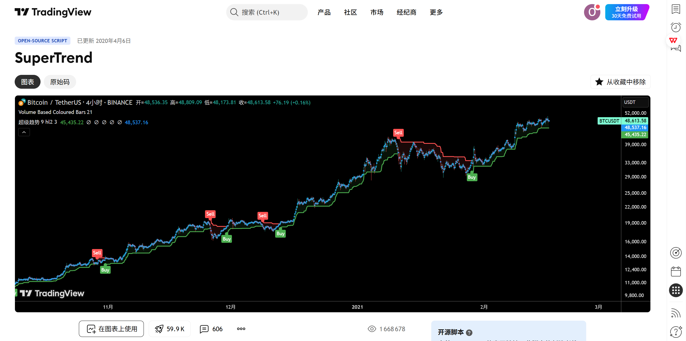
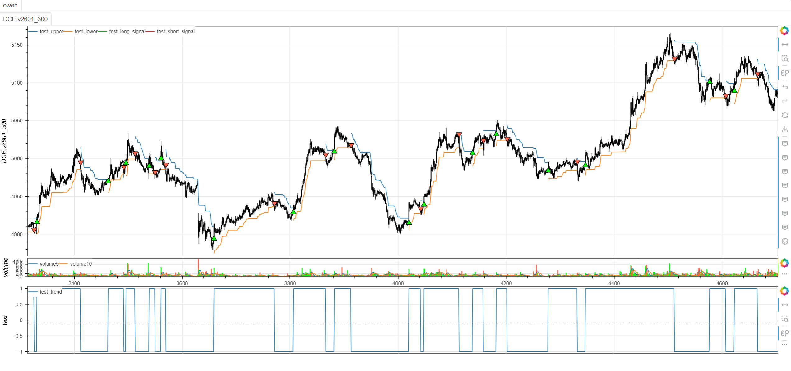

# **MiniBT量化交易之TradingView指标：SuperTrend**

## 概述

本文将详细介绍如何将 TradingView 上的 SuperTrend 指标转换为 MiniBT 框架可用的技术指标。SuperTrend 是一种基于 ATR（平均真实范围）的趋势跟踪指标，通过动态上下轨和趋势方向判断，为交易者提供清晰的趋势识别和交易信号。

## 原策略分析

### 指标核心逻辑

1. **ATR动态通道**：基于ATR计算动态上下轨道
2. **趋势方向识别**：通过价格与轨道关系判断趋势方向
3. **轨道连续性**：在趋势持续时保持轨道连续性
4. **趋势转换信号**：在趋势转换点生成交易信号

### 指标参数

- `Periods`：ATR周期 (默认: 10)
- `Multiplier`：ATR乘数 (默认: 3.0)
- `changeATR`：是否对ATR进行平滑处理 (默认: True)



## MiniBT 转换实现

### 指标类结构

```python
class SuperTrend(BtIndicator):
    """https://cn.tradingview.com/script/r6dAP7yi/"""
    params = dict(Periods=10, Multiplier=3., changeATR=True,)
    overlap = dict(upper=True, lower=True, trend=False)
```

### 核心方法实现

#### 1. ATR计算与处理

```python
def next(self):
    src = self.hl2()
    size = src.size
    atr = self.atr(self.params.Periods)
    if not self.params.changeATR:
        atr = atr.sma(self.params.Periods)
```

#### 2. 上下轨基础计算

```python
close = self.close.values
up = (src-self.params.Multiplier*atr).values
dn = (src+self.params.Multiplier*atr).values
index = self.get_first_valid_index(up, dn)
upper = np.full(size, np.nan)
lower = np.full(size, np.nan)
trend = np.ones(size)
```

#### 3. 递归轨道计算

```python
for i in range(index+1, size):
    up[i] = close[i-1] > up[i-1] and max(up[i], up[i-1]) or up[i]
    dn[i] = close[i-1] < dn[i-1] and min(dn[i], dn[i-1]) or dn[i]
    trend[i] = (trend[i-1] == -1 and close[i] > dn[i-1]) and 1 or (
        (trend[i-1] == 1 and close[i] < up[i-1]) and -1 or trend[i-1])
```

#### 4. 轨道赋值与信号生成

```python
if trend[i] != trend[i-1]:
    lower[i] = up[i]
    upper[i] = dn[i]
elif trend[i] == 1:
    lower[i] = up[i]
else:
    upper[i] = dn[i]

trend = pd.Series(trend)
long_signal = trend == 1
long_signal &= trend.shift() == -1
short_signal = trend == -1
short_signal &= trend.shift() == 1
```

## 转换技术细节

### 1. ATR计算与平滑

原策略提供ATR平滑选项：

```pine
// ATR Calculation
atr = ta.atr(Periods)
if not changeATR
    atr := ta.sma(atr, Periods)
```

转换代码使用MiniBT的ATR方法实现：

```python
atr = self.atr(self.params.Periods)
if not self.params.changeATR:
    atr = atr.sma(self.params.Periods)
```

### 2. 基础轨道计算

原策略使用hl2作为基础价格计算轨道：

```pine
// Basic Band Calculation
up = hl2 - Multiplier * atr
dn = hl2 + Multiplier * atr
```

转换代码保持相同的计算逻辑：

```python
up = (src-self.params.Multiplier*atr).values
dn = (src+self.params.Multiplier*atr).values
```

### 3. 递归轨道调整

原策略使用递归逻辑调整轨道：

```pine
// Recursive Band Adjustment
up := close[1] > up[1] ? math.max(up, up[1]) : up
dn := close[1] < dn[1] ? math.min(dn, dn[1]) : dn
```

转换代码使用循环实现相同的递归逻辑：

```python
for i in range(index+1, size):
    up[i] = close[i-1] > up[i-1] and max(up[i], up[i-1]) or up[i]
    dn[i] = close[i-1] < dn[i-1] and min(dn[i], dn[i-1]) or dn[i]
```

### 4. 趋势方向判断

原策略基于价格与轨道关系判断趋势：

```pine
// Trend Direction
trend = 1
trend := trend[1] == -1 and close > dn[1] ? 1 : 
        trend[1] == 1 and close < up[1] ? -1 : trend[1]
```

转换代码实现了相同的趋势判断逻辑：

```python
trend[i] = (trend[i-1] == -1 and close[i] > dn[i-1]) and 1 or (
    (trend[i-1] == 1 and close[i] < up[i-1]) and -1 or trend[i-1])
```

## 使用示例
```python
class SuperTrend(BtIndicator):
    """https://cn.tradingview.com/script/r6dAP7yi/"""
    params = dict(Periods=10, Multiplier=3., changeATR=True,)
    overlap = dict(upper=True, lower=True, trend=False)

    def next(self):
        src = self.hl2()
        size = src.size
        atr = self.atr(self.params.Periods)
        if not self.params.changeATR:
            atr = atr.sma(self.params.Periods)
        close = self.close.values
        up = (src-self.params.Multiplier*atr).values
        dn = (src+self.params.Multiplier*atr).values
        index = self.get_first_valid_index(up, dn)
        upper = np.full(size, np.nan)
        lower = np.full(size, np.nan)
        trend = np.ones(size)
        for i in range(index+1, size):
            up[i] = close[i-1] > up[i-1] and max(up[i], up[i-1]) or up[i]
            dn[i] = close[i-1] < dn[i-1] and min(dn[i], dn[i-1]) or dn[i]
            trend[i] = (trend[i-1] == -1 and close[i] > dn[i-1]) and 1 or (
                (trend[i-1] == 1 and close[i] < up[i-1]) and -1 or trend[i-1])
            if trend[i] != trend[i-1]:
                lower[i] = up[i]
                upper[i] = dn[i]
            elif trend[i] == 1:
                lower[i] = up[i]
            else:
                upper[i] = dn[i]
        trend = pd.Series(trend)
        long_signal = trend == 1
        long_signal &= trend.shift() == -1
        short_signal = trend == -1
        short_signal &= trend.shift() == 1
        return upper, lower, trend, long_signal, short_signal
```

```python
from minibt import *


class owen(Strategy):

    def __init__(self):
        self.data = self.get_kline(LocalDatas.v2601_300, height=500)
        self.test = self.data.tradingview.SuperTrend()


if __name__ == "__main__":
    Bt().run()

```


## 参数说明

1. **Periods (ATR周期)**：
   - 控制ATR计算的窗口大小
   - 影响趋势对价格波动的敏感度
   - 较小的周期更敏感，较大的周期更稳定

2. **Multiplier (ATR乘数)**：
   - 控制轨道宽度
   - 影响信号的可靠性和滞后性
   - 较大的乘数产生更宽的轨道，信号更可靠但可能滞后

3. **changeATR (ATR平滑)**：
   - 是否对ATR进行SMA平滑处理
   - 平滑后的ATR更稳定，减少虚假信号
   - 非平滑ATR对近期波动更敏感

## 算法原理详解

### 1. 基础价格选择

使用hl2（最高最低价的平均值）作为基础价格：
```python
src = self.hl2()  # (high + low) / 2
```

### 2. 轨道计算逻辑

上下轨基于ATR动态调整：
```python
# 基础上下轨
up = src - Multiplier * atr  # 下轨（支撑）
dn = src + Multiplier * atr  # 上轨（阻力）
```

### 3. 轨道连续性机制

在趋势持续时保持轨道连续性：
```python
# 上升趋势时，下轨只能上升或保持，不能下降
up[i] = close[i-1] > up[i-1] and max(up[i], up[i-1]) or up[i]

# 下降趋势时，上轨只能下降或保持，不能上升
dn[i] = close[i-1] < dn[i-1] and min(dn[i], dn[i-1]) or dn[i]
```

### 4. 趋势转换条件

趋势转换基于价格与轨道的突破：
```python
# 下降转上升：价格突破上轨
trend[i] = (trend[i-1] == -1 and close[i] > dn[i-1]) and 1

# 上升转下降：价格突破下轨
trend[i] = (trend[i-1] == 1 and close[i] < up[i-1]) and -1
```

## 转换注意事项

### 1. 初始值处理

正确处理序列的初始NaN值：
```python
index = self.get_first_valid_index(up, dn)  # 获取第一个有效索引
upper = np.full(size, np.nan)  # 初始化上轨为NaN
lower = np.full(size, np.nan)  # 初始化下轨为NaN
```

### 2. 递归计算要求

由于轨道计算具有强递归依赖，必须使用循环：
```python
for i in range(index+1, size):
    # 递归计算轨道和趋势
```

### 3. 轨道赋值逻辑

根据趋势方向赋值上下轨：
```python
if trend[i] != trend[i-1]:
    # 趋势转换时，同时更新上下轨
    lower[i] = up[i]
    upper[i] = dn[i]
elif trend[i] == 1:
    # 上升趋势只显示下轨
    lower[i] = up[i]
else:
    # 下降趋势只显示上轨
    upper[i] = dn[i]
```

### 4. 信号生成时机

信号在趋势转换时生成：
```python
long_signal = trend == 1 and trend.shift() == -1  # 下降转上升
short_signal = trend == -1 and trend.shift() == 1  # 上升转下降
```

## 策略应用场景

### 1. 趋势跟踪策略

使用SuperTrend进行趋势识别和跟踪：

```python
def supertrend_trend_following(upper, lower, trend, close):
    # 当前趋势状态
    current_trend = trend.iloc[-1]
    
    # 趋势强度（价格与轨道的距离）
    if current_trend == 1:
        trend_strength = (close - lower) / (upper - lower)
    else:
        trend_strength = (upper - close) / (upper - lower)
    
    # 强趋势过滤
    strong_trend = trend_strength > 0.5
    
    return current_trend, trend_strength, strong_trend
```

### 2. 多时间框架确认

结合不同时间框架的SuperTrend信号：

```python
def multi_timeframe_supertrend(daily_st, hourly_st):
    # 日线趋势方向
    daily_trend = daily_st.trend
    
    # 小时线交易信号
    hourly_long = hourly_st.long_signal
    hourly_short = hourly_st.short_signal
    
    # 确认信号：日线趋势与小时线信号一致
    confirmed_long = (daily_trend == 1) & hourly_long
    confirmed_short = (daily_trend == -1) & hourly_short
    
    return confirmed_long, confirmed_short
```

### 3. 波动率自适应参数

根据市场波动率调整SuperTrend参数：

```python
def volatility_adaptive_supertrend(close, volume, base_period=50):
    # 计算市场波动率
    volatility = close.rolling(base_period).std() / close.rolling(base_period).mean()
    volume_ratio = volume / volume.rolling(base_period).mean()
    
    # 自适应参数
    adaptive_periods = np.where(volatility > 0.02, 8, 12)
    adaptive_multiplier = np.where(volatility > 0.02, 2.5, 3.5)
    
    # 高波动率高成交量时使用更敏感的参数
    if volatility.iloc[-1] > 0.03 and volume_ratio.iloc[-1] > 1.5:
        adaptive_periods = 6
        adaptive_multiplier = 2.0
    
    return adaptive_periods, adaptive_multiplier
```

### 4. 组合过滤策略

结合其他指标进行信号过滤：

```python
def filtered_supertrend_signals(supertrend_signals, rsi, macd, volume):
    long_signal, short_signal = supertrend_signals
    
    # RSI过滤（避免超买超卖区域）
    rsi_filter = (rsi > 30) & (rsi < 70)
    
    # MACD趋势确认
    macd_filter = macd > macd.rolling(20).mean()
    
    # 成交量确认
    volume_filter = volume > volume.rolling(20).mean()
    
    # 综合过滤信号
    filtered_long = long_signal & rsi_filter & macd_filter & volume_filter
    filtered_short = short_signal & (~rsi_filter) & (~macd_filter) & volume_filter
    
    return filtered_long, filtered_short
```

## 风险管理建议

### 1. 动态止损策略

基于SuperTrend轨道的动态止损：

```python
def supertrend_stop_loss(upper, lower, trend, close, position_type, atr_multiplier=1.0):
    if position_type == 'long':
        # 多头止损：下轨下方ATR距离
        base_stop = lower
        stop_level = base_stop - atr_multiplier * (upper - lower)
        return close < stop_level
    else:
        # 空头止损：上轨上方ATR距离
        base_stop = upper
        stop_level = base_stop + atr_multiplier * (upper - lower)
        return close > stop_level
```

### 2. 仓位大小管理

根据轨道宽度调整仓位：

```python
def supertrend_position_sizing(upper, lower, close, base_size=1, risk_per_trade=0.02):
    # 计算轨道宽度（波动率代理）
    band_width = (upper - lower) / close
    
    # 基于波动率的仓位调整
    volatility_adjustment = 1.0 / (band_width / band_width.rolling(50).mean())
    
    # 最终仓位大小
    position_size = base_size * volatility_adjustment
    
    # 限制仓位范围
    return position_size.clip(0.1, 3.0)
```

## 性能优化建议

### 1. 参数网格优化

系统化测试SuperTrend参数组合：

```python
def supertrend_parameter_optimization():
    param_grid = {
        'Periods': [7, 10, 14, 20],
        'Multiplier': [2.0, 2.5, 3.0, 3.5, 4.0],
        'changeATR': [True, False]
    }
    
    best_params = None
    best_performance = -np.inf
    
    # 遍历参数组合进行回测
    for periods in param_grid['Periods']:
        for multiplier in param_grid['Multiplier']:
            for change_atr in param_grid['changeATR']:
                performance = backtest_supertrend(periods, multiplier, change_atr)
                
                if performance > best_performance:
                    best_performance = performance
                    best_params = {
                        'Periods': periods,
                        'Multiplier': multiplier,
                        'changeATR': change_atr
                    }
    
    return best_params, best_performance
```

### 2. 市场状态识别

根据市场特征选择最佳参数：

```python
def market_regime_supertrend_params(close, volume, window=50):
    # 计算市场状态指标
    returns = close.pct_change()
    volatility = returns.rolling(window).std()
    trend_strength = close.rolling(window).apply(
        lambda x: abs((x[-1] - x[0]) / (x.max() - x.min()))
    )
    
    # 市场状态分类
    high_vol = volatility > volatility.quantile(0.7)
    strong_trend = trend_strength > 0.6
    
    if high_vol and strong_trend:
        # 高波动强趋势：敏感参数
        return 8, 2.0, True
    elif high_vol and not strong_trend:
        # 高波动震荡：稳定参数
        return 14, 3.5, True
    elif not high_vol and strong_trend:
        # 低波动强趋势：适中参数
        return 10, 2.5, False
    else:
        # 低波动震荡：宽松参数
        return 12, 3.0, False
```

## 扩展功能

### 1. SuperTrend通道指标

基于SuperTrend创建动态通道：

```python
def supertrend_channel_indicator(upper, lower, close, trend):
    # 通道中轨
    middle = (upper + lower) / 2
    
    # 通道宽度
    channel_width = (upper - lower) / middle
    
    # 价格在通道中的位置
    if trend == 1:
        channel_position = (close - lower) / (upper - lower)
    else:
        channel_position = (upper - close) / (upper - lower)
    
    # 通道突破强度
    breakout_strength = (close - middle) / (upper - lower) * 2
    
    return middle, channel_width, channel_position, breakout_strength
```

### 2. 趋势强度评分

基于SuperTrend创建趋势强度指标：

```python
def supertrend_trend_strength(trend, upper, lower, close, lookback=20):
    # 趋势持续时间
    trend_duration = trend.groupby((trend != trend.shift()).cumsum()).cumcount() + 1
    
    # 轨道扩展程度
    band_expansion = (upper - lower) / (upper - lower).rolling(lookback).mean()
    
    # 价格与轨道的距离
    if trend == 1:
        distance_ratio = (close - lower) / (upper - lower)
    else:
        distance_ratio = (upper - close) / (upper - lower)
    
    # 综合趋势强度（0-100）
    strength_score = (
        (trend_duration / trend_duration.rolling(lookback).max() * 40) +
        (band_expansion.clip(0, 2) * 30) +
        (distance_ratio * 30)
    )
    
    return strength_score.clip(0, 100)
```

## 总结

SuperTrend 指标通过创新的ATR动态轨道算法，为交易者提供了一个强大而直观的趋势跟踪系统。该指标结合了波动率自适应轨道、趋势方向识别和状态转换信号，在保持算法简洁性的同时提供了可靠的交易时机。

转换过程中，我们完整实现了原指标的所有核心功能，包括ATR轨道计算、递归轨道调整、趋势方向判断和转换信号生成。通过MiniBT框架的实现，用户可以在回测系统中充分利用这一经典的趋势跟踪工具。

SuperTrend 特别适用于：
- 趋势市场的趋势识别和跟踪
- 动态止损和风险管理
- 多时间框架趋势分析
- 自动化交易系统

该指标的转换展示了如何将经典的递归轨道算法从TradingView移植到MiniBT框架，为其他趋势跟踪指标的实现提供了重要参考。SuperTrend 的简洁性和有效性使其成为趋势交易者的必备工具。

> 风险提示：本文涉及的交易策略、代码示例均为技术演示、教学探讨，仅用于展示逻辑思路，绝不构成任何投资建议、操作指引或决策依据 。金融市场复杂多变，存在价格波动、政策调整、流动性等多重风险，历史表现不预示未来结果。任何交易决策均需您自主判断、独立承担责任 —— 若依据本文内容操作，盈亏后果概由自身承担。请务必充分评估风险承受能力，理性对待市场，谨慎做出投资选择。