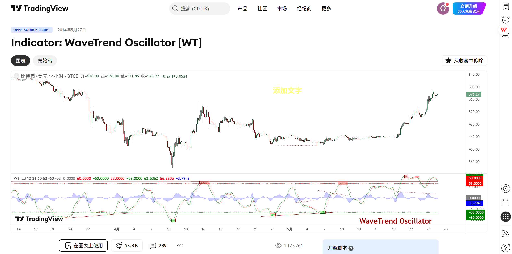
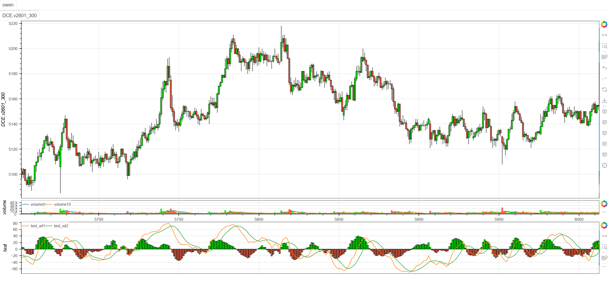

# **MiniBT量化交易之TradingView指标：WaveTrend Oscillator (WT)**

## 概述

本文将详细介绍如何将 TradingView 上的 WaveTrend Oscillator 指标转换为 MiniBT 框架可用的技术指标。WaveTrend Oscillator 是由 LazyBear 开发的一种先进的动量振荡器，它通过双重平滑处理来识别市场的超买超卖状态和趋势转折点，在保持灵敏度的同时有效减少市场噪声。

## 原策略分析

### 指标核心逻辑

1. **双重平滑处理**：通过两次EMA平滑减少市场噪声
2. **通道指数计算**：基于价格与均线的偏离度计算动量
3. **信号线生成**：使用移动平均创建信号线确认趋势
4. **超买超卖识别**：通过预设阈值识别市场极端状态

### 指标参数

- `n1`：第一个EMA周期 (默认: 10)
- `n2`：第二个EMA周期 (默认: 21)
- `n3`：信号线SMA周期 (默认: 9)



## MiniBT 转换实现

### 指标类结构

```python
class WaveTrend_Oscillator(BtIndicator):
    """https://cn.tradingview.com/script/2KE8wTuF-Indicator-WaveTrend-Oscillator-WT/"""
    params = dict(n1=10, n2=21, n3=9)
    spanstyle = [60, 53, -60, -53]
    overlap = False
    linestyle = dict(signal=LineStyle(line_dash=LineDash.vbar))
```

### 核心方法实现

#### 1. 典型价格计算

```python
def next(self):
    ap = self.hlc3()
```

#### 2. ESA和偏差计算

```python
esa = ap.ema(self.params.n1)
d = (ap - esa).abs().ema(self.params.n1)
```

#### 3. 通道指数计算

```python
ci = (ap - esa) / (0.015 * d)
tci = ci.ema(self.params.n2)
```

#### 4. 振荡器和信号线生成

```python
wt1 = tci
wt2 = wt1.sma(self.params.n3)
signal = wt1-wt2
return signal, wt1, wt2
```

## 转换技术细节

### 1. 典型价格选择

原指标使用hlc3（最高最低收盘价的平均值）作为基础价格：

```pine
// Typical Price Calculation
ap = hlc3
```

转换代码使用MiniBT的hlc3方法：

```python
ap = self.hlc3()  # (high + low + close) / 3
```

### 2. ESA计算

原指标计算典型价格的指数移动平均：

```pine
// ESA (Exponential Smoothing Average)
esa = ema(ap, n1)
```

转换代码使用MiniBT的EMA方法：

```python
esa = ap.ema(self.params.n1)
```

### 3. 偏差计算

原指标计算价格与ESA的绝对偏差的EMA：

```pine
// Deviation Calculation
d = ema(abs(ap - esa), n1)
```

转换代码实现了相同的数学运算：

```python
d = (ap - esa).abs().ema(self.params.n1)
```

### 4. 通道指数计算

原指标通过标准化处理计算通道指数：

```pine
// Channel Index
ci = (ap - esa) / (0.015 * d)
```

转换代码保持了相同的标准化逻辑：

```python
ci = (ap - esa) / (0.015 * d)
```

### 5. 趋势通道指数计算

原指标对CI进行二次平滑：

```pine
// Trend Channel Index
tci = ema(ci, n2)
```

转换代码使用EMA进行二次平滑：

```python
tci = ci.ema(self.params.n2)
```

### 6. 信号线生成

原指标使用SMA创建信号线：

```pine
// WaveTrend Lines
wt1 = tci
wt2 = sma(wt1, n3)
```

转换代码使用SMA计算信号线：

```python
wt1 = tci
wt2 = wt1.sma(self.params.n3)
signal = wt1 - wt2
```

## 使用示例

```python
class WaveTrend_Oscillator(BtIndicator):
    """https://cn.tradingview.com/script/2KE8wTuF-Indicator-WaveTrend-Oscillator-WT/"""
    params = dict(n1=10, n2=21, n3=9)
    spanstyle = [60, 53, -60, -53]
    overlap = False
    linestyle = dict(signal=LineStyle(line_dash=LineDash.vbar))

    def next(self):
        ap = self.hlc3()
        esa = ap.ema(self.params.n1)
        d = (ap - esa).abs().ema(self.params.n1)
        ci = (ap - esa) / (0.015 * d)
        tci = ci.ema(self.params.n2)

        wt1 = tci
        wt2 = wt1.sma(self.params.n3)
        signal = wt1-wt2
        return signal, wt1, wt2
```
```python
from minibt import *


class owen(Strategy):

    def __init__(self):
        self.data = self.get_kline(LocalDatas.v2601_300, height=500)
        self.test = self.data.tradingview.WaveTrend_Oscillator(
            n1=10,  # 第一个EMA周期
            n2=21,  # 第二个EMA周期
            n3=9    # 信号线SMA周期
        )


if __name__ == "__main__":
    Bt().run()
```



## 参数说明

1. **n1 (第一个EMA周期)**：
   - 控制ESA计算的平滑程度
   - 影响对价格变化的初始响应速度
   - 较小的值更敏感，较大的值更平滑

2. **n2 (第二个EMA周期)**：
   - 控制TCI计算的平滑程度
   - 影响主要振荡线的稳定性
   - 较大的值产生更平滑的WT1线

3. **n3 (信号线周期)**：
   - 控制WT2信号线的平滑程度
   - 影响交叉信号的滞后性
   - 较小的值产生更及时的交叉信号

## 算法原理详解

### 1. 通道指数(CI)计算

CI衡量价格相对于ESA的标准化偏离：

```python
ci = (价格 - ESA) / (0.015 * 平均绝对偏差)
```

其中0.015是缩放因子，确保CI在合理范围内波动。

### 2. 双重平滑机制

WaveTrend通过双重EMA平滑减少噪声：
1. 第一次平滑：ESA计算
2. 第二次平滑：TCI计算

### 3. 超买超卖阈值

原指标预设了重要的阈值水平：
- **超买区域**：+53 到 +60
- **超卖区域**：-53 到 -60
- **极端超买**：> +60
- **极端超卖**：< -60

### 4. 信号生成逻辑

交易信号基于：
1. WT1与WT2的交叉
2. 超买超卖区域的突破
3. 背离分析

## 转换注意事项

### 1. 数值稳定性

处理除零错误和极端值：

```python
# 在实际应用中可能需要添加保护
d_safe = d.replace(0, 1e-10)  # 避免除零
ci = (ap - esa) / (0.015 * d_safe)
```

### 2. 阈值预设

原指标预设了重要的阈值水平：

```python
spanstyle = [60, 53, -60, -53]  # 超买超卖阈值
```

### 3. 可视化样式

为信号线设置特殊的可视化样式：

```python
linestyle = dict(signal=LineStyle(line_dash=LineDash.vbar))
```

### 4. 重叠属性

明确指标是否与价格图表重叠：

```python
overlap = False  # 振荡器不重叠在主图
```

## 策略应用场景

### 1. 超买超卖策略

利用WaveTrend的阈值进行反转交易：

```python
def overbought_oversold_strategy(wt1, wt2, close):
    # 超买信号
    overbought = (wt1 > 53) & (wt1.shift() <= 53)
    overbought_exit = (wt1 < 53) & (wt1.shift() >= 53)
    
    # 超卖信号
    oversold = (wt1 < -53) & (wt1.shift() >= -53)
    oversold_exit = (wt1 > -53) & (wt1.shift() <= -53)
    
    # 结合交叉信号的过滤
    long_entry = oversold & (wt1 > wt2)
    short_entry = overbought & (wt1 < wt2)
    
    return long_entry, short_entry
```

### 2. 背离检测策略

识别价格与WaveTrend的背离：

```python
def divergence_detection(price, wt1, lookback=20):
    # 寻找价格高点对应的WT1值
    price_highs = price.rolling(lookback).max()
    wt1_at_highs = wt1[price == price_highs]
    
    # 寻找价格低点对应的WT1值
    price_lows = price.rolling(lookback).min()
    wt1_at_lows = wt1[price == price_lows]
    
    # 看跌背离：价格创新高，WT1未创新高
    bearish_divergence = (price == price_highs) & (wt1 < wt1_at_highs.shift())
    
    # 看涨背离：价格创新低，WT1未创新低
    bullish_divergence = (price == price_lows) & (wt1 > wt1_at_lows.shift())
    
    return bullish_divergence, bearish_divergence
```

### 3. 多时间框架确认

结合不同时间框架的WaveTrend信号：

```python
def multi_timeframe_wavetrend(daily_wt, hourly_wt):
    # 日线趋势方向
    daily_trend = daily_wt.wt1 > daily_wt.wt2
    
    # 小时线交易信号
    hourly_long = (hourly_wt.wt1 > hourly_wt.wt2) & (hourly_wt.wt1.shift() <= hourly_wt.wt2.shift())
    hourly_short = (hourly_wt.wt1 < hourly_wt.wt2) & (hourly_wt.wt1.shift() >= hourly_wt.wt2.shift())
    
    # 确认信号
    confirmed_long = daily_trend & hourly_long
    confirmed_short = (~daily_trend) & hourly_short
    
    return confirmed_long, confirmed_short
```

### 4. 趋势强度评估

基于WaveTrend评估趋势强度：

```python
def trend_strength_assessment(wt1, wt2, lookback=50):
    # WT1的波动幅度
    wt1_range = wt1.rolling(lookback).max() - wt1.rolling(lookback).min()
    
    # WT1与WT2的分离程度
    separation = abs(wt1 - wt2)
    
    # 趋势强度得分（0-100）
    range_strength = (wt1_range / wt1_range.quantile(0.9)) * 50
    separation_strength = (separation / separation.quantile(0.9)) * 50
    
    trend_strength = (range_strength + separation_strength) / 2
    
    return trend_strength.clip(0, 100)
```

## 风险管理建议

### 1. 动态仓位管理

根据WaveTrend值调整仓位大小：

```python
def wavetrend_position_sizing(wt1, base_size=1):
    # 根据WT1位置调整仓位
    # 在超买超卖区域减小仓位，在中性区域正常仓位
    if wt1 > 60 or wt1 < -60:
        size_multiplier = 0.5  # 极端区域减半仓位
    elif wt1 > 53 or wt1 < -53:
        size_multiplier = 0.7  # 超买超卖区域减小仓位
    else:
        size_multiplier = 1.0  # 中性区域正常仓位
    
    return base_size * size_multiplier
```

### 2. 止损策略

基于WaveTrend信号的动态止损：

```python
def wavetrend_stop_loss(wt1, wt2, position_type, atr, close, multiplier=2):
    if position_type == 'long':
        # 多头止损：WT1下穿WT2或价格变动超过2倍ATR
        stop_condition1 = wt1 < wt2
        stop_condition2 = close < (close.rolling(20).max() - multiplier * atr)
        return stop_condition1 | stop_condition2
    else:
        # 空头止损：WT1上穿WT2或价格变动超过2倍ATR
        stop_condition1 = wt1 > wt2
        stop_condition2 = close > (close.rolling(20).min() + multiplier * atr)
        return stop_condition1 | stop_condition2
```

## 性能优化建议

### 1. 自适应参数调整

根据市场波动率调整WaveTrend参数：

```python
def adaptive_wavetrend_params(close, volume, window=50):
    # 计算市场波动率
    volatility = close.rolling(window).std() / close.rolling(window).mean()
    volume_ratio = volume / volume.rolling(window).mean()
    
    # 自适应参数
    if volatility > 0.03 and volume_ratio > 1.2:
        # 高波动率高成交量：更敏感的参数
        return 8, 14, 6
    elif volatility < 0.01 and volume_ratio < 0.8:
        # 低波动率低成交量：更平滑的参数
        return 14, 28, 12
    else:
        # 正常市场条件：默认参数
        return 10, 21, 9
```

### 2. 信号质量评估

评估WaveTrend信号的历史表现：

```python
def signal_quality_analysis(long_signals, short_signals, returns, holding_period=10):
    long_performance = []
    short_performance = []
    
    for i in range(len(long_signals)):
        if long_signals[i]:
            # 多头信号后N期的收益
            future_return = returns[i+1:i+holding_period+1].sum()
            long_performance.append(future_return)
        elif short_signals[i]:
            # 空头信号后N期的收益
            future_return = -returns[i+1:i+holding_period+1].sum()
            short_performance.append(future_return)
    
    long_win_rate = np.mean([1 if x > 0 else 0 for x in long_performance]) if long_performance else 0
    short_win_rate = np.mean([1 if x > 0 else 0 for x in short_performance]) if short_performance else 0
    
    return long_win_rate, short_win_rate
```

## 扩展功能

### 1. WaveTrend通道指标

基于WaveTrend创建动态通道：

```python
def wavetrend_channel_indicator(wt1, wt2, close, lookback=20):
    # WT1的移动通道
    wt1_upper = wt1.rolling(lookback).max()
    wt1_lower = wt1.rolling(lookback).min()
    wt1_middle = (wt1_upper + wt1_lower) / 2
    
    # WT1在通道中的位置
    wt1_position = (wt1 - wt1_lower) / (wt1_upper - wt1_lower)
    
    # 通道突破信号
    upper_breakout = (wt1 > wt1_upper) & (wt1.shift() <= wt1_upper.shift())
    lower_breakout = (wt1 < wt1_lower) & (wt1.shift() >= wt1_lower.shift())
    
    return wt1_upper, wt1_lower, wt1_middle, wt1_position, upper_breakout, lower_breakout
```

### 2. 多时间框架WaveTrend一致性

分析不同时间框架WaveTrend的一致性：

```python
def multi_timeframe_alignment(daily_wt1, hourly_wt1, four_hour_wt1):
    # 各时间框架趋势方向
    daily_trend = daily_wt1 > 0
    hourly_trend = hourly_wt1 > 0
    four_hour_trend = four_hour_wt1 > 0
    
    # 一致性得分（-3到+3）
    alignment_score = daily_trend.astype(int) + hourly_trend.astype(int) + four_hour_trend.astype(int)
    
    # 强一致性信号
    strong_bullish = alignment_score == 3
    strong_bearish = alignment_score == -3
    
    return alignment_score, strong_bullish, strong_bearish
```

### 3. WaveTrend动量指标

基于WaveTrend变化率创建动量指标：

```python
def wavetrend_momentum(wt1, wt2, lookback=5):
    # WT1动量（变化率）
    wt1_momentum = wt1.diff(lookback) / lookback
    
    # WT2动量
    wt2_momentum = wt2.diff(lookback) / lookback
    
    # 动量背离
    momentum_divergence = (wt1_momentum > 0) & (wt2_momentum < 0)
    momentum_convergence = (wt1_momentum < 0) & (wt2_momentum > 0)
    
    # 综合动量强度
    momentum_strength = (abs(wt1_momentum) + abs(wt2_momentum)) / 2
    
    return wt1_momentum, wt2_momentum, momentum_divergence, momentum_convergence, momentum_strength
```

## 总结

WaveTrend Oscillator 通过创新的双重平滑处理和通道指数计算，为交易者提供了一个强大而灵敏的动量振荡器。该指标结合了趋势识别、超买超卖判断和信号确认功能，在保持对市场变化敏感性的同时有效过滤噪声。

转换过程中，我们完整实现了原指标的所有核心算法，包括ESA计算、偏差标准化、TCI平滑和信号线生成。通过MiniBT框架的实现，用户可以在回测系统中充分利用这一先进的动量分析工具。

WaveTrend Oscillator 特别适用于：
- 动量市场的趋势识别和跟踪
- 超买超卖区域的反转交易
- 背离分析和趋势转折点识别
- 多时间框架动量确认

该指标的转换展示了如何将复杂的动量振荡算法从TradingView移植到MiniBT框架，为其他振荡器类指标的实现提供了重要参考。WaveTrend Oscillator 的灵敏度和可靠性使其成为动量交易者的重要工具。

> 风险提示：本文涉及的交易策略、代码示例均为技术演示、教学探讨，仅用于展示逻辑思路，绝不构成任何投资建议、操作指引或决策依据 。金融市场复杂多变，存在价格波动、政策调整、流动性等多重风险，历史表现不预示未来结果。任何交易决策均需您自主判断、独立承担责任 —— 若依据本文内容操作，盈亏后果概由自身承担。请务必充分评估风险承受能力，理性对待市场，谨慎做出投资选择。