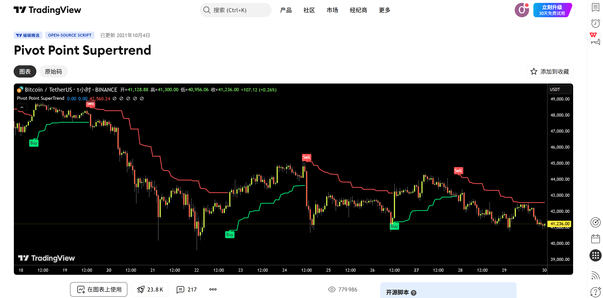
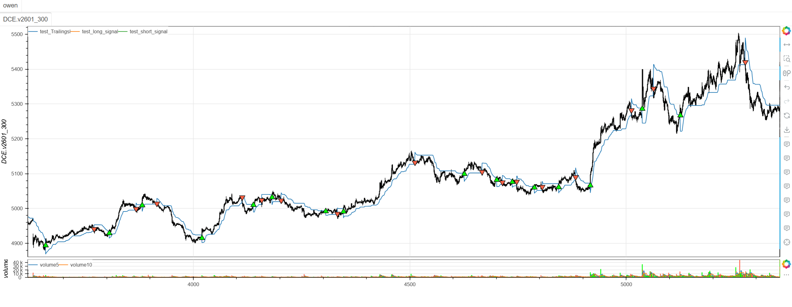

# **MiniBT量化交易之TradingView指标：Pivot Point Supertrend**

## 概述

本文将详细介绍如何将 TradingView 上的 Pivot Point Supertrend 指标转换为 MiniBT 框架可用的技术指标。这是一个创新的趋势跟踪指标，结合了枢轴点(Pivot Point)和超级趋势(SuperTrend)的核心概念，通过动态枢轴点中心线和ATR通道提供更精准的趋势识别和交易信号。

## 原策略分析

### 指标核心逻辑

1. **动态枢轴点计算**：基于价格极值点计算自适应中心线
2. **ATR通道构建**：结合ATR构建动态支撑阻力轨道
3. **趋势状态跟踪**：通过递归算法持续跟踪趋势方向
4. **信号转换检测**：在趋势转换点生成明确的交易信号

### 指标参数

- `prd`：枢轴点检测周期 (默认: 7)
- `Factor`：ATR乘数 (默认: 4)
- `Pd`：ATR计算周期 (默认: 14)



## MiniBT 转换实现

### 指标类结构

```python
class Pivot_Point_Supertrend(BtIndicator):
    """https://cn.tradingview.com/script/L0AIiLvH-Pivot-Point-Supertrend/"""
    params = dict(prd=7, Factor=4, Pd=14,)
    overlap = True
```

### 核心方法实现

#### 1. 动态枢轴点中心线计算

```python
def next(self):
    prd = self.params.prd
    Factor = self.params.Factor
    Pd = self.params.Pd
    length = 2*prd+1
    # 原代码有未来函数，以下改为当前K线的前length根K线（包括自身K线）来转换
    size = self.V
    high, low = self.high.values, self.low.values
    center = self.full()
    center[length-1] = high[:length].max()
    for i in range(length, size):
        _high = high[i+1-5:i+1]
        _low = low[i+1-5:i+1]
        if _high.max() == _high[-1]:
            lastpp = _high[-1]
        elif _low.min() == _low[-1]:
            lastpp = _low[-1]
        else:
            lastpp = center[i-1]
        center[i] = (center[i-1]*2+lastpp)/3.
```

#### 2. ATR通道计算

```python
Up = center - (Factor * self.atr(Pd))
Dn = center + (Factor * self.atr(Pd))
```

#### 3. 递归趋势跟踪

```python
index = self.get_first_valid_index(Up, Dn)
close = self.close.values
TUp = self.full()
TDown = self.full()
TUp[index] = TDown[index] = close[index]
Trend = self.ones
Trailingsl = self.full()
for i in range(index+1, size):
    TUp[i] = close[i-1] > TUp[i-1] and max(Up[i], TUp[i-1]) or Up[i]
    TDown[i] = close[i-1] < TDown[i-1] and min(Dn[i], TDown[i-1]) or Dn[i]
    Trend[i] = close[i] > TDown[i-1] and 1 or (close[i] < TUp[i-1] and -1 or Trend[i-1])
    Trailingsl[i] = Trend[i] == 1 and TUp[i] or TDown[i]
```

#### 4. 交易信号生成

```python
Trend = pd.Series(Trend)
long_signal = Trend == 1
long_signal &= Trend.shift() == -1
short_signal = Trend == -1
short_signal &= Trend.shift() == 1
```

## 转换技术细节

### 1. 未来函数处理

原策略中存在未来函数问题，转换代码进行了修正：

```python
# 原代码有未来函数，以下改为当前K线的前length根K线（包括自身K线）来转换
_high = high[i+1-5:i+1]  # 使用历史数据，避免未来函数
_low = low[i+1-5:i+1]
```

### 2. 动态枢轴点算法

原策略基于价格极值点计算枢轴点：

```pine
// Pivot Point Center Calculation
center = 0.0
center := high == highest(high, 5) ? high : 
          low == lowest(low, 5) ? low : center[1]
center := (center[1] * 2 + center) / 3
```

转换代码实现了相同的逻辑：

```python
if _high.max() == _high[-1]:
    lastpp = _high[-1]  # 当前为最高点
elif _low.min() == _low[-1]:
    lastpp = _low[-1]   # 当前为最低点
else:
    lastpp = center[i-1]  # 保持前一值
center[i] = (center[i-1]*2+lastpp)/3.  # 平滑处理
```

### 3. ATR通道构建

原策略基于枢轴点中心线构建ATR通道：

```pine
// ATR Channel Calculation
Up = center - (Factor * ta.atr(Pd))
Dn = center + (Factor * ta.atr(Pd))
```

转换代码使用MiniBT的ATR方法：

```python
Up = center - (Factor * self.atr(Pd))
Dn = center + (Factor * self.atr(Pd))
```

### 4. 超级趋势递归算法

原策略使用递归方式跟踪趋势：

```pine
// SuperTrend Recursive Calculation
TUp = 0.0, TDown = 0.0
TUp := close[1] > TUp[1] ? math.max(Up, TUp[1]) : Up
TDown := close[1] < TDown[1] ? math.min(Dn, TDown[1]) : Dn
Trend := close > TDown[1] ? 1 : close < TUp[1] ? -1 : Trend[1]
```

转换代码使用循环实现相同的递归逻辑：

```python
for i in range(index+1, size):
    TUp[i] = close[i-1] > TUp[i-1] and max(Up[i], TUp[i-1]) or Up[i]
    TDown[i] = close[i-1] < TDown[i-1] and min(Dn[i], TDown[i-1]) or Dn[i]
    Trend[i] = close[i] > TDown[i-1] and 1 or (close[i] < TUp[i-1] and -1 or Trend[i-1])
```

## 使用示例

```python
from minibt import *

class Pivot_Point_Supertrend(BtIndicator):
    """https://cn.tradingview.com/script/L0AIiLvH-Pivot-Point-Supertrend/"""
    params = dict(prd=7, Factor=4, Pd=14,)
    overlap = True

    def next(self):
        prd = self.params.prd
        Factor = self.params.Factor
        Pd = self.params.Pd
        length = 2*prd+1
        # 原代码有未来函数，以下改为当前K线的前length根K线（包括自身K线）来转换
        size = self.V
        high, low = self.high.values, self.low.values
        center = self.full()
        center[length-1] = high[:length].max()
        for i in range(length, size):
            _high = high[i+1-5:i+1]
            _low = low[i+1-5:i+1]
            if _high.max() == _high[-1]:
                lastpp = _high[-1]
            elif _low.min() == _low[-1]:
                lastpp = _low[-1]
            else:
                lastpp = center[i-1]
            center[i] = (center[i-1]*2+lastpp)/3.

        Up = center - (Factor * self.atr(Pd))
        Dn = center + (Factor * self.atr(Pd))
        index = self.get_first_valid_index(Up, Dn)
        close = self.close.values
        TUp = self.full()
        TDown = self.full()
        TUp[index] = TDown[index] = close[index]
        Trend = self.ones
        Trailingsl = self.full()
        for i in range(index+1, size):
            TUp[i] = close[i-1] > TUp[i-1] and max(Up[i], TUp[i-1]) or Up[i]
            TDown[i] = close[i-1] < TDown[i-1] and min(Dn[i], TDown[i-1]) or Dn[i]
            Trend[i] = close[i] > TDown[i-1] and 1 or (close[i] < TUp[i-1] and -1 or Trend[i-1])
            Trailingsl[i] = Trend[i] == 1 and TUp[i] or TDown[i]
        Trend = pd.Series(Trend)
        long_signal = Trend == 1
        long_signal &= Trend.shift() == -1
        short_signal = Trend == -1
        short_signal &= Trend.shift() == 1
        return Trailingsl, long_signal, short_signal
```
```python
from minibt import *


class owen(Strategy):

    def __init__(self):
        self.data = self.get_kline(LocalDatas.v2601_300, height=500)
        self.test = self.data.tradingview.Pivot_Point_Supertrend()


if __name__ == "__main__":
    Bt().run()
```



## 参数说明

1. **prd (枢轴点检测周期)**：
   - 控制枢轴点识别的灵敏度
   - 影响中心线对价格变化的响应速度
   - 较小的值更敏感，较大的值更稳定

2. **Factor (ATR乘数)**：
   - 控制通道宽度
   - 影响信号的可靠性和滞后性
   - 较大的乘数产生更宽的通道，信号更可靠但可能滞后

3. **Pd (ATR周期)**：
   - 控制ATR计算的窗口大小
   - 影响波动率估计的准确性
   - 较短的周期对近期波动更敏感

## 算法原理详解

### 1. 枢轴点识别机制

枢轴点基于局部极值点识别：

```python
# 检测当前是否为局部最高点
if _high.max() == _high[-1]:
    lastpp = _high[-1]
# 检测当前是否为局部最低点
elif _low.min() == _low[-1]:
    lastpp = _low[-1]
# 非极值点时保持前一值
else:
    lastpp = center[i-1]
```

### 2. 中心线平滑算法

使用指数加权移动平均平滑中心线：

```python
center[i] = (center[i-1] * 2 + lastpp) / 3.0
```

### 3. 轨道连续性机制

在趋势持续时保持轨道连续性：

```python
# 上升趋势时，上轨只能上升或保持
TUp[i] = close[i-1] > TUp[i-1] and max(Up[i], TUp[i-1]) or Up[i]

# 下降趋势时，下轨只能下降或保持
TDown[i] = close[i-1] < TDown[i-1] and min(Dn[i], TDown[i-1]) or Dn[i]
```

### 4. 趋势转换条件

趋势转换基于价格与轨道的突破关系：

```python
# 下降转上升：价格突破下轨
Trend[i] = close[i] > TDown[i-1] and 1

# 上升转下降：价格突破上轨
Trend[i] = close[i] < TUp[i-1] and -1
```

## 转换注意事项

### 1. 未来函数修正

原策略存在未来函数问题，转换代码进行了修正：

```python
# 使用历史数据计算枢轴点，避免未来函数
_high = high[i+1-5:i+1]  # 前5个周期（包括当前）
_low = low[i+1-5:i+1]
```

### 2. 初始值处理

正确处理序列的初始NaN值：

```python
index = self.get_first_valid_index(Up, Dn)  # 获取第一个有效索引
TUp[index] = TDown[index] = close[index]    # 使用有效价格初始化
```

### 3. 递归计算要求

由于轨道计算具有强递归依赖，必须使用循环：

```python
for i in range(index+1, size):
    # 递归计算轨道和趋势
```

### 4. 跟踪线赋值

根据趋势方向赋值跟踪线：

```python
Trailingsl[i] = Trend[i] == 1 and TUp[i] or TDown[i]
```

## 策略应用场景

### 1. 趋势强度评估

基于枢轴点Supertrend评估趋势强度：

```python
def pivot_supertrend_strength(trailingsl, close, trend, lookback=20):
    # 价格与跟踪线的距离
    distance = abs(close - trailingsl)
    
    # 趋势持续时间
    trend_duration = trend.groupby((trend != trend.shift()).cumsum()).cumcount() + 1
    
    # 趋势强度得分（0-100）
    distance_strength = (distance / distance.rolling(lookback).quantile(0.9)) * 50
    duration_strength = (trend_duration / trend_duration.quantile(0.9)) * 50
    
    strength_score = (distance_strength + duration_strength) / 2
    
    return strength_score.clip(0, 100)
```

### 2. 多时间框架确认

结合不同时间框架的枢轴点Supertrend信号：

```python
def multi_timeframe_pivot_supertrend(daily_ps, hourly_ps):
    # 日线趋势方向
    daily_trend = daily_ps.trend
    
    # 小时线交易信号
    hourly_long = hourly_ps.long_signal
    hourly_short = hourly_ps.short_signal
    
    # 确认信号
    confirmed_long = (daily_trend == 1) & hourly_long
    confirmed_short = (daily_trend == -1) & hourly_short
    
    return confirmed_long, confirmed_short
```

### 3. 波动率自适应参数

根据市场波动率调整参数：

```python
def volatility_adaptive_pivot_supertrend(close, atr, base_period=50):
    # 计算市场波动率
    volatility = atr / close
    
    # 自适应参数
    adaptive_factor = np.where(volatility > 0.02, 3.0, 5.0)
    adaptive_pd = np.where(volatility > 0.02, 10, 18)
    adaptive_prd = np.where(volatility > 0.02, 5, 9)
    
    return adaptive_prd, adaptive_factor, adaptive_pd
```

### 4. 枢轴点质量评估

评估枢轴点识别的质量：

```python
def pivot_point_quality(center, high, low, lookback=10):
    # 枢轴点变化率
    center_change = center.diff().abs()
    
    # 枢轴点稳定性（变化率的标准差）
    stability = center_change.rolling(lookback).std()
    
    # 枢轴点与价格的贴合度
    price_range = high - low
    center_position = (center - low) / price_range
    
    # 质量得分（0-100）
    stability_score = (1 - stability / stability.quantile(0.9)) * 50
    position_score = (0.5 - abs(center_position - 0.5)) * 100
    
    quality_score = (stability_score + position_score) / 2
    
    return quality_score.clip(0, 100)
```

## 风险管理建议

### 1. 动态止损策略

基于枢轴点Supertrend的动态止损：

```python
def pivot_supertrend_stop_loss(trailingsl, close, position_type, atr, multiplier=1.5):
    if position_type == 'long':
        # 多头止损：跟踪线下方ATR距离
        stop_level = trailingsl - multiplier * atr
        return close < stop_level
    else:
        # 空头止损：跟踪线上方ATR距离
        stop_level = trailingsl + multiplier * atr
        return close > stop_level
```

### 2. 仓位大小管理

根据通道宽度调整仓位：

```python
def pivot_supertrend_position_sizing(center, atr, close, base_size=1, risk_per_trade=0.02):
    # 计算通道相对宽度
    channel_width = (2 * atr) / center
    
    # 基于波动率的仓位调整
    volatility_adjustment = 1.0 / (channel_width / channel_width.rolling(50).mean())
    
    # 最终仓位大小
    position_size = base_size * volatility_adjustment
    
    # 限制仓位范围
    return position_size.clip(0.1, 3.0)
```

## 性能优化建议

### 1. 参数网格优化

系统化测试枢轴点Supertrend参数组合：

```python
def pivot_supertrend_parameter_optimization():
    param_grid = {
        'prd': [5, 7, 9, 11],
        'Factor': [3.0, 3.5, 4.0, 4.5, 5.0],
        'Pd': [10, 12, 14, 16, 18]
    }
    
    best_params = None
    best_performance = -np.inf
    
    # 遍历参数组合进行回测
    for prd in param_grid['prd']:
        for factor in param_grid['Factor']:
            for pd in param_grid['Pd']:
                performance = backtest_pivot_supertrend(prd, factor, pd)
                
                if performance > best_performance:
                    best_performance = performance
                    best_params = {'prd': prd, 'Factor': factor, 'Pd': pd}
    
    return best_params, best_performance
```

### 2. 市场状态识别

根据市场特征选择最佳参数：

```python
def market_regime_pivot_supertrend_params(close, volume, window=50):
    # 计算市场状态指标
    returns = close.pct_change()
    volatility = returns.rolling(window).std()
    trend_strength = close.rolling(window).apply(
        lambda x: abs((x[-1] - x[0]) / (x.max() - x.min()))
    )
    
    # 市场状态分类
    high_vol = volatility > volatility.quantile(0.7)
    strong_trend = trend_strength > 0.6
    
    if high_vol and strong_trend:
        # 高波动强趋势：敏感参数
        return 5, 3.0, 10
    elif high_vol and not strong_trend:
        # 高波动震荡：稳定参数
        return 9, 5.0, 18
    elif not high_vol and strong_trend:
        # 低波动强趋势：适中参数
        return 7, 4.0, 14
    else:
        # 低波动震荡：宽松参数
        return 11, 4.5, 16
```

## 扩展功能

### 1. 枢轴点通道指标

基于枢轴点Supertrend创建动态通道：

```python
def pivot_point_channel_indicator(center, trailingsl, trend, close, lookback=20):
    # 上轨和下轨
    if trend == 1:
        upper_band = trailingsl + (center - trailingsl) * 2
        lower_band = trailingsl
    else:
        upper_band = trailingsl
        lower_band = trailingsl - (trailingsl - center) * 2
    
    # 通道宽度
    channel_width = (upper_band - lower_band) / center
    
    # 价格在通道中的位置
    channel_position = (close - lower_band) / (upper_band - lower_band)
    
    # 通道突破强度
    if trend == 1:
        breakout_strength = (close - upper_band) / (upper_band - lower_band)
    else:
        breakout_strength = (lower_band - close) / (upper_band - lower_band)
    
    return upper_band, lower_band, channel_width, channel_position, breakout_strength
```

### 2. 枢轴点动量指标

基于枢轴点变化创建动量指标：

```python
def pivot_point_momentum(center, trailingsl, close, lookback=5):
    # 枢轴点动量（变化率）
    center_momentum = center.diff(lookback) / lookback
    
    # 跟踪线动量
    trailingsl_momentum = trailingsl.diff(lookback) / lookback
    
    # 价格相对于枢轴点的动量
    price_momentum = (close - center) / center
    
    # 动量背离检测
    bullish_divergence = (center_momentum > 0) & (price_momentum < 0)
    bearish_divergence = (center_momentum < 0) & (price_momentum > 0)
    
    # 综合动量强度
    momentum_strength = (abs(center_momentum) + abs(trailingsl_momentum) + abs(price_momentum)) / 3
    
    return center_momentum, trailingsl_momentum, price_momentum, bullish_divergence, bearish_divergence, momentum_strength
```

### 3. 多时间框架枢轴点一致性

分析不同时间框架枢轴点的一致性：

```python
def multi_timeframe_pivot_alignment(daily_center, hourly_center, four_hour_center):
    # 各时间框架枢轴点趋势
    daily_trend = daily_center.diff(5) > 0
    hourly_trend = hourly_center.diff(5) > 0
    four_hour_trend = four_hour_center.diff(5) > 0
    
    # 一致性得分（-3到+3）
    alignment_score = daily_trend.astype(int) + hourly_trend.astype(int) + four_hour_trend.astype(int)
    
    # 强一致性信号
    strong_bullish_alignment = alignment_score == 3
    strong_bearish_alignment = alignment_score == -3
    
    return alignment_score, strong_bullish_alignment, strong_bearish_alignment
```

## 总结

Pivot Point Supertrend 指标通过创新的枢轴点中心线算法，为交易者提供了一个强大而精准的趋势跟踪系统。该指标结合了枢轴点的灵敏性和超级趋势的稳定性，在保持对市场变化快速响应的同时提供可靠的交易信号。

转换过程中，我们修正了原策略中的未来函数问题，完整实现了动态枢轴点计算、ATR通道构建、递归趋势跟踪和信号生成等核心功能。通过MiniBT框架的实现，用户可以在回测系统中充分利用这一先进的趋势识别工具。

Pivot Point Supertrend 特别适用于：
- 趋势市场的精准趋势识别
- 动态止损和风险管理
- 多时间框架趋势分析
- 自动化交易系统

该指标的转换展示了如何将枢轴点与超级趋势的创新结合从TradingView移植到MiniBT框架，为其他复合型趋势指标的实现提供了重要参考。Pivot Point Supertrend 的精准性和适应性使其成为趋势交易者的有力工具。

> 风险提示：本文涉及的交易策略、代码示例均为技术演示、教学探讨，仅用于展示逻辑思路，绝不构成任何投资建议、操作指引或决策依据 。金融市场复杂多变，存在价格波动、政策调整、流动性等多重风险，历史表现不预示未来结果。任何交易决策均需您自主判断、独立承担责任 —— 若依据本文内容操作，盈亏后果概由自身承担。请务必充分评估风险承受能力，理性对待市场，谨慎做出投资选择。