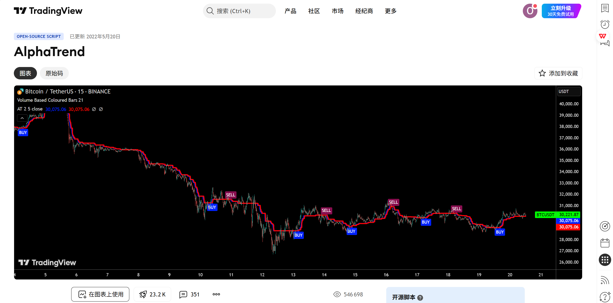
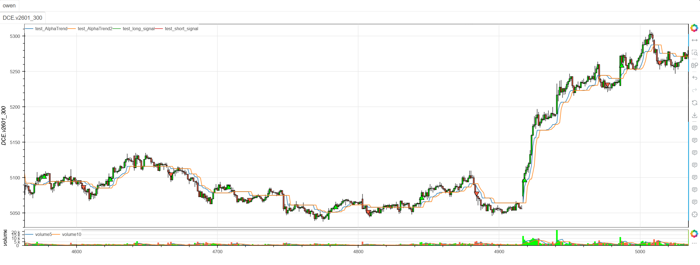

# **MiniBT量化交易之TradingView指标：AlphaTrend**

## 概述

本文将详细介绍如何将 TradingView 上的 AlphaTrend 指标转换为 MiniBT 框架可用的技术指标。这是一个创新的自适应趋势跟踪指标，结合了 ATR 波动率通道和动量振荡器（RSI/MFI），通过动态阈值和趋势确认机制提供精准的趋势识别和交易信号。

## 原策略分析

### 指标核心逻辑

1. **ATR动态通道**：基于ATR构建自适应支撑阻力轨道
2. **动量确认机制**：使用RSI或MFI确认市场动量方向
3. **趋势平滑处理**：通过递归算法确保趋势连续性
4. **双重确认信号**：结合价格突破和动量确认生成交易信号

### 指标参数

- `coeff`：ATR乘数系数 (默认: 1.0)
- `AP`：计算周期 (默认: 14)
- `novolumedata`：是否不使用成交量数据 (默认: False)



## MiniBT 转换实现

### 指标类结构

```python
class AlphaTrend(BtIndicator):
    """https://cn.tradingview.com/script/o50NYLAZ-AlphaTrend/"""
    params = dict(coeff=1., AP=14, novolumedata=False)
    overlap = True
```

### 核心方法实现

#### 1. ATR通道计算

```python
def next(self):
    coeff = self.params.coeff
    AP = self.params.AP
    novolumedata = self.params.novolumedata
    ATR = self.true_range().sma(AP)
    src = self.close

    upT = self.low - ATR * coeff
    downT = self.high + ATR * coeff
```

#### 2. 动量指标选择

```python
mfi = self.hlc3().mfi(AP).values
rsi = src.rsi(AP).values
```

#### 3. AlphaTrend递归计算

```python
AlphaTrend = self.zeros
Trend = self.zeros
size = src.size
index = self.get_first_valid_index(upT, downT, mfi, rsi)
for i in range(index+1, size):
    AlphaTrend[i] = (rsi[i] >= 50. if novolumedata else mfi[i] >= 50.) and (upT[i] < AlphaTrend[i-1] and AlphaTrend[i-1] or upT[i]) or \
        (downT[i] > AlphaTrend[i-1] and AlphaTrend[i-1] or downT[i])
```

#### 4. 趋势方向判断

```python
    Trend[i] = AlphaTrend[i] > AlphaTrend[i-2] and 1 or (AlphaTrend[i] < AlphaTrend[i-2] and -1 or Trend[i-1])
```

#### 5. 交易信号生成

```python
AlphaTrend = IndSeries(AlphaTrend)
AlphaTrend2 = AlphaTrend.shift(2)
Trend = IndSeries(Trend)
long_signal = (Trend.shift() == -1) & (Trend == 1)
short_signal = (Trend.shift() == 1) & (Trend == -1)
```

## 转换技术细节

### 1. ATR通道构建

原策略基于价格极值和ATR构建动态通道：

```pine
// ATR Channel Calculation
ATR = sma(tr, AP)
upT = low - ATR * coeff
downT = high + ATR * coeff
```

转换代码使用MiniBT的TR和SMA方法：

```python
ATR = self.true_range().sma(AP)
upT = self.low - ATR * coeff
downT = self.high + ATR * coeff
```

### 2. 动量指标选择逻辑

原策略提供RSI和MFI两种动量指标选择：

```pine
// Momentum Indicator Selection
mfi = mfi(hlc3, AP)
rsi = rsi(close, AP)
use_rsi = novolumedata
```

转换代码实现了相同的选择逻辑：

```python
mfi = self.hlc3().mfi(AP).values
rsi = src.rsi(AP).values
condition = rsi[i] >= 50. if novolumedata else mfi[i] >= 50.
```

### 3. AlphaTrend递归算法

原策略使用复杂的条件逻辑计算AlphaTrend线：

```pine
// AlphaTrend Recursive Calculation
AlphaTrend = 0.0
AlphaTrend := (use_rsi ? rsi >= 50 : mfi >= 50) ? 
             (upT < AlphaTrend[1] ? AlphaTrend[1] : upT) :
             (downT > AlphaTrend[1] ? AlphaTrend[1] : downT)
```

转换代码使用循环实现相同的递归逻辑：

```python
AlphaTrend[i] = (rsi[i] >= 50. if novolumedata else mfi[i] >= 50.) and (upT[i] < AlphaTrend[i-1] and AlphaTrend[i-1] or upT[i]) or \
    (downT[i] > AlphaTrend[i-1] and AlphaTrend[i-1] or downT[i])
```

### 4. 趋势方向判断

原策略通过比较当前值与滞后值判断趋势：

```pine
// Trend Direction
Trend = 0
Trend := AlphaTrend > AlphaTrend[2] ? 1 : 
         AlphaTrend < AlphaTrend[2] ? -1 : Trend[1]
```

转换代码实现了相同的趋势判断：

```python
Trend[i] = AlphaTrend[i] > AlphaTrend[i-2] and 1 or (AlphaTrend[i] < AlphaTrend[i-2] and -1 or Trend[i-1])
```

## 使用示例

```python
class AlphaTrend(BtIndicator):
    """https://cn.tradingview.com/script/o50NYLAZ-AlphaTrend/"""
    params = dict(coeff=1., AP=14, novolumedata=False)
    overlap = True

    def next(self):
        coeff = self.params.coeff
        AP = self.params.AP
        novolumedata = self.params.novolumedata
        ATR = self.true_range().sma(AP)
        src = self.close

        upT = self.low - ATR * coeff
        downT = self.high + ATR * coeff
        upT, downT = upT.values, downT.values
        mfi = self.hlc3().mfi(AP).values
        rsi = src.rsi(AP).values
        AlphaTrend = self.zeros
        Trend = self.zeros
        size = src.size
        index = self.get_first_valid_index(upT, downT, mfi, rsi)
        for i in range(index+1, size):
            AlphaTrend[i] = (rsi[i] >= 50. if novolumedata else mfi[i] >= 50.) and (upT[i] < AlphaTrend[i-1] and AlphaTrend[i-1] or upT[i]) or \
                (downT[i] > AlphaTrend[i-1] and AlphaTrend[i-1] or downT[i])
            Trend[i] = AlphaTrend[i] > AlphaTrend[i-2] and 1 or (AlphaTrend[i] < AlphaTrend[i-2] and -1 or Trend[i-1])
        AlphaTrend = IndSeries(AlphaTrend)
        AlphaTrend2 = AlphaTrend.shift(2)
        Trend = IndSeries(Trend)
        long_signal = (Trend.shift() == -1) & (Trend == 1)
        short_signal = (Trend.shift() == 1) & (Trend == -1)
        return AlphaTrend, AlphaTrend2, long_signal, short_signal
```
```python
from minibt import *


class owen(Strategy):

    def __init__(self):
        self.data = self.get_kline(LocalDatas.v2601_300, height=500)
        self.test = self.data.tradingview.AlphaTrend()


if __name__ == "__main__":
    Bt().run()
```


## 参数说明

1. **coeff (ATR乘数系数)**：
   - 控制ATR通道的宽度
   - 影响信号的敏感度和可靠性
   - 较小的值产生更紧密的通道，信号更敏感但可能有更多噪音

2. **AP (计算周期)**：
   - 控制ATR、RSI和MFI的计算周期
   - 影响指标对市场变化的响应速度
   - 较短的周期更敏感，较长的周期更稳定

3. **novolumedata (成交量数据选项)**：
   - 当设置为True时，使用RSI作为动量指标
   - 当设置为False时，使用MFI作为动量指标
   - MFI包含成交量信息，通常更可靠

## 算法原理详解

### 1. ATR通道构建原理

ATR通道基于价格极值和波动率：

```python
# 上轨：基于最低价减去ATR缓冲
upT = low - ATR * coeff

# 下轨：基于最高价加上ATR缓冲  
downT = high + ATR * coeff
```

### 2. 动量确认机制

根据市场动量选择通道方向：

```python
# RSI/MFI >= 50 表示看涨动量，使用上轨
# RSI/MFI < 50 表示看跌动量，使用下轨
condition = (rsi >= 50) if novolumedata else (mfi >= 50)
```

### 3. 递归连续性机制

确保AlphaTrend线的平滑连续性：

```python
# 看涨时：只有当上轨低于前值时才更新，否则保持前值
AlphaTrend[i] = condition and (upT[i] < AlphaTrend[i-1] and AlphaTrend[i-1] or upT[i])

# 看跌时：只有当上轨高于前值时才更新，否则保持前值
AlphaTrend[i] = not condition and (downT[i] > AlphaTrend[i-1] and AlphaTrend[i-1] or downT[i])
```

### 4. 趋势判断逻辑

通过滞后比较判断趋势方向：

```python
# 与2期前值比较，避免噪声影响
Trend[i] = AlphaTrend[i] > AlphaTrend[i-2] and 1 or 
           (AlphaTrend[i] < AlphaTrend[i-2] and -1 or Trend[i-1])
```

## 转换注意事项

### 1. 初始值处理

正确处理序列的初始NaN值：

```python
index = self.get_first_valid_index(upT, downT, mfi, rsi)
```

### 2. 递归计算要求

由于AlphaTrend计算具有强递归依赖，必须使用循环：

```python
for i in range(index+1, size):
    # 递归计算AlphaTrend和趋势
```

### 3. 动量指标选择

根据参数选择RSI或MFI：

```python
condition = rsi[i] >= 50. if novolumedata else mfi[i] >= 50.
```

### 4. 信号生成时机

信号在趋势转换时生成：

```python
long_signal = (Trend.shift() == -1) & (Trend == 1)  # 下降转上升
short_signal = (Trend.shift() == 1) & (Trend == -1)  # 上升转下降
```

## 策略应用场景

### 1. 趋势强度评估

基于AlphaTrend评估趋势强度：

```python
def alphatrend_strength(alphatrend, close, trend, lookback=20):
    # AlphaTrend变化率
    at_change = alphatrend.diff()
    
    # 趋势持续时间
    trend_duration = trend.groupby((trend != trend.shift()).cumsum()).cumcount() + 1
    
    # 价格与AlphaTrend的距离
    distance = abs(close - alphatrend)
    
    # 趋势强度得分（0-100）
    change_strength = (abs(at_change) / abs(at_change).rolling(lookback).quantile(0.9)) * 40
    duration_strength = (trend_duration / trend_duration.quantile(0.9)) * 30
    distance_strength = (distance / distance.quantile(0.9)) * 30
    
    strength_score = change_strength + duration_strength + distance_strength
    
    return strength_score.clip(0, 100)
```

### 2. 多时间框架确认

结合不同时间框架的AlphaTrend信号：

```python
def multi_timeframe_alphatrend(daily_at, hourly_at):
    # 日线趋势方向
    daily_trend = daily_at.trend
    
    # 小时线交易信号
    hourly_long = hourly_at.long_signal
    hourly_short = hourly_at.short_signal
    
    # 确认信号
    confirmed_long = (daily_trend == 1) & hourly_long
    confirmed_short = (daily_trend == -1) & hourly_short
    
    return confirmed_long, confirmed_short
```

### 3. 动量背离检测

识别价格与AlphaTrend的背离：

```python
def alphatrend_divergence(price, alphatrend, lookback=20):
    # 寻找价格高点对应的AlphaTrend值
    price_highs = price.rolling(lookback).max()
    at_at_highs = alphatrend[price == price_highs]
    
    # 寻找价格低点对应的AlphaTrend值
    price_lows = price.rolling(lookback).min()
    at_at_lows = alphatrend[price == price_lows]
    
    # 看跌背离：价格创新高，AlphaTrend未创新高
    bearish_divergence = (price == price_highs) & (alphatrend < at_at_highs.shift())
    
    # 看涨背离：价格创新低，AlphaTrend未创新低
    bullish_divergence = (price == price_lows) & (alphatrend > at_at_lows.shift())
    
    return bullish_divergence, bearish_divergence
```

### 4. 自适应参数调整

根据市场波动率调整参数：

```python
def adaptive_alphatrend_params(close, volume, atr, base_period=50):
    # 计算市场波动率
    volatility = atr / close
    volume_ratio = volume / volume.rolling(base_period).mean()
    
    # 自适应参数
    adaptive_coeff = np.where(volatility > 0.02, 0.8, 1.2)
    adaptive_ap = np.where(volatility > 0.02, 10, 18)
    
    # 高成交量时使用MFI，低成交量时使用RSI
    use_mfi = volume_ratio > 0.8
    
    return adaptive_coeff, adaptive_ap, use_mfi
```

## 风险管理建议

### 1. 动态止损策略

基于AlphaTrend的动态止损：

```python
def alphatrend_stop_loss(alphatrend, close, position_type, atr, multiplier=1.5):
    if position_type == 'long':
        # 多头止损：AlphaTrend下方ATR距离
        stop_level = alphatrend - multiplier * atr
        return close < stop_level
    else:
        # 空头止损：AlphaTrend上方ATR距离
        stop_level = alphatrend + multiplier * atr
        return close > stop_level
```

### 2. 仓位大小管理

根据AlphaTrend波动率调整仓位：

```python
def alphatrend_position_sizing(alphatrend, close, base_size=1, risk_per_trade=0.02):
    # 计算AlphaTrend波动率
    at_volatility = alphatrend.diff().abs().rolling(20).std()
    
    # 基于波动率的仓位调整
    volatility_adjustment = 1.0 / (at_volatility / at_volatility.quantile(0.9))
    
    # 最终仓位大小
    position_size = base_size * volatility_adjustment
    
    # 限制仓位范围
    return position_size.clip(0.1, 3.0)
```

## 性能优化建议

### 1. 参数网格优化

系统化测试AlphaTrend参数组合：

```python
def alphatrend_parameter_optimization():
    param_grid = {
        'coeff': [0.8, 1.0, 1.2, 1.5],
        'AP': [10, 12, 14, 16, 18],
        'novolumedata': [True, False]
    }
    
    best_params = None
    best_performance = -np.inf
    
    # 遍历参数组合进行回测
    for coeff in param_grid['coeff']:
        for ap in param_grid['AP']:
            for no_volume in param_grid['novolumedata']:
                performance = backtest_alphatrend(coeff, ap, no_volume)
                
                if performance > best_performance:
                    best_performance = performance
                    best_params = {'coeff': coeff, 'AP': ap, 'novolumedata': no_volume}
    
    return best_params, best_performance
```

### 2. 市场状态识别

根据市场特征选择最佳参数：

```python
def market_regime_alphatrend_params(close, volume, atr, window=50):
    # 计算市场状态指标
    returns = close.pct_change()
    volatility = atr / close
    volume_trend = volume.rolling(window).mean()
    
    # 市场状态分类
    high_vol = volatility > volatility.quantile(0.7)
    high_volume = volume > volume_trend
    trending = abs(returns.rolling(window).mean()) > returns.rolling(window).std()
    
    if high_vol and trending:
        # 高波动趋势市场：敏感参数，使用MFI
        return 0.8, 10, False
    elif high_vol and not trending:
        # 高波动震荡市场：稳定参数，使用RSI
        return 1.5, 18, True
    elif not high_vol and trending:
        # 低波动趋势市场：适中参数，使用MFI
        return 1.0, 14, False
    else:
        # 低波动震荡市场：宽松参数，使用RSI
        return 1.2, 16, True
```

## 扩展功能

### 1. AlphaTrend通道指标

基于AlphaTrend创建动态通道：

```python
def alphatrend_channel_indicator(alphatrend, close, atr, lookback=20):
    # 上轨和下轨
    upper_band = alphatrend + atr
    lower_band = alphatrend - atr
    
    # 通道宽度
    channel_width = (upper_band - lower_band) / close
    
    # 价格在通道中的位置
    channel_position = (close - lower_band) / (upper_band - lower_band)
    
    # 通道突破信号
    upper_breakout = (close > upper_band) & (close.shift() <= upper_band.shift())
    lower_breakout = (close < lower_band) & (close.shift() >= lower_band.shift())
    
    return upper_band, lower_band, channel_width, channel_position, upper_breakout, lower_breakout
```

### 2. AlphaTrend动量指标

基于AlphaTrend变化创建动量指标：

```python
def alphatrend_momentum(alphatrend, close, trend, lookback=5):
    # AlphaTrend动量（变化率）
    at_momentum = alphatrend.diff(lookback) / lookback
    
    # 价格动量
    price_momentum = close.pct_change(lookback)
    
    # 动量一致性
    momentum_alignment = (at_momentum > 0) & (price_momentum > 0) | (at_momentum < 0) & (price_momentum < 0)
    
    # 动量强度
    momentum_strength = (abs(at_momentum) + abs(price_momentum)) / 2
    
    # 动量背离
    bullish_momentum_divergence = (at_momentum > 0) & (price_momentum < 0)
    bearish_momentum_divergence = (at_momentum < 0) & (price_momentum > 0)
    
    return at_momentum, price_momentum, momentum_alignment, momentum_strength, bullish_momentum_divergence, bearish_momentum_divergence
```

### 3. 多时间框架AlphaTrend一致性

分析不同时间框架AlphaTrend的一致性：

```python
def multi_timeframe_alphatrend_alignment(daily_at, hourly_at, four_hour_at):
    # 各时间框架趋势方向
    daily_trend = daily_at.trend
    hourly_trend = hourly_at.trend
    four_hour_trend = four_hour_at.trend
    
    # 一致性得分（-3到+3）
    alignment_score = daily_trend.astype(int) + hourly_trend.astype(int) + four_hour_trend.astype(int)
    
    # 强一致性信号
    strong_bullish_alignment = alignment_score == 3
    strong_bearish_alignment = alignment_score == -3
    
    # AlphaTrend值的一致性
    at_alignment = (daily_at.alphatrend.diff(5) > 0).astype(int) + \
                   (hourly_at.alphatrend.diff(5) > 0).astype(int) + \
                   (four_hour_at.alphatrend.diff(5) > 0).astype(int)
    
    return alignment_score, strong_bullish_alignment, strong_bearish_alignment, at_alignment
```

## 总结

AlphaTrend 指标通过创新的ATR通道和动量确认机制，为交易者提供了一个强大而自适应的趋势跟踪系统。该指标结合了波动率通道的灵敏性和动量指标的确认功能，在保持对市场变化快速响应的同时提供可靠的交易信号。

转换过程中，我们完整实现了原指标的所有核心算法，包括ATR通道构建、动量指标选择、递归AlphaTrend计算和趋势方向判断。通过MiniBT框架的实现，用户可以在回测系统中充分利用这一先进的趋势识别工具。

AlphaTrend 特别适用于：
- 趋势市场的精准趋势识别
- 动量确认的趋势跟踪
- 动态止损和风险管理
- 多时间框架趋势分析

该指标的转换展示了如何将ATR通道与动量确认的创新结合从TradingView移植到MiniBT框架，为其他复合型趋势指标的实现提供了重要参考。AlphaTrend 的自适应性和可靠性使其成为趋势交易者的有力工具。

> 风险提示：本文涉及的交易策略、代码示例均为技术演示、教学探讨，仅用于展示逻辑思路，绝不构成任何投资建议、操作指引或决策依据 。金融市场复杂多变，存在价格波动、政策调整、流动性等多重风险，历史表现不预示未来结果。任何交易决策均需您自主判断、独立承担责任 —— 若依据本文内容操作，盈亏后果概由自身承担。请务必充分评估风险承受能力，理性对待市场，谨慎做出投资选择。