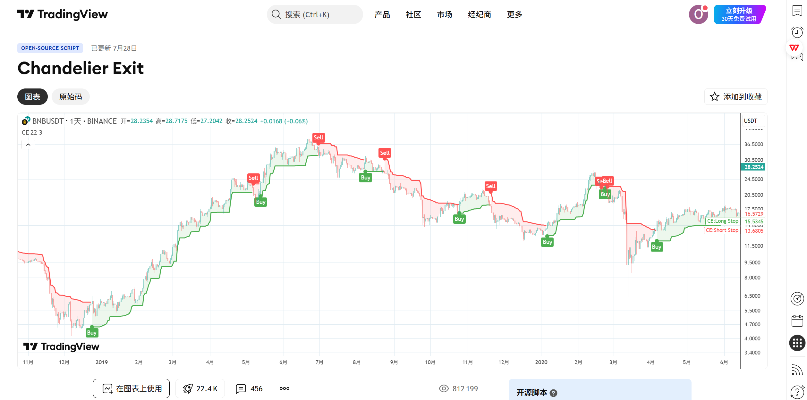
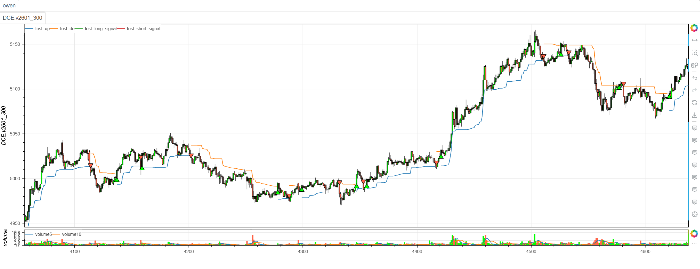

# **MiniBT量化交易之TradingView指标：Chandelier Exit**

## 概述

本文将详细介绍如何将 TradingView 上的 Chandelier Exit 指标转换为 MiniBT 框架可用的技术指标。这是一个经典的趋势跟踪和风险管理指标，由 Charles LeBeau 开发，通过 ATR（平均真实范围）动态计算止损位，帮助交易者在趋势市场中锁定利润并控制风险。

## 原策略分析

### 指标核心逻辑

1. **ATR动态止损**：基于ATR计算动态止损位置
2. **极值点跟踪**：使用最高价或收盘价的极值作为参考基准
3. **趋势方向识别**：通过价格与止损位关系判断趋势方向
4. **递归止损调整**：在趋势持续时优化止损位置

### 指标参数

- `length`：ATR和极值计算周期 (默认: 22)
- `mult`：ATR乘数 (默认: 3.0)
- `useClose`：是否使用收盘价计算极值 (默认: True)



## MiniBT 转换实现

### 指标类结构

```python
class Chandelier_Exit(BtIndicator):
    """https://cn.tradingview.com/script/AqXxNS7j-Chandelier-Exit/"""
    params = dict(length=22, mult=3., useClose=True)
    overlap = True
```

### 核心方法实现

#### 1. ATR和基础止损计算

```python
def next(self):
    length = self.params.length
    mult = self.params.mult
    useClose = self.params.useClose

    atr = mult * self.atr(length)
    if useClose:
        longStop = self.close.tqfunc.hhv(length)-atr
        shortStop = self.close.tqfunc.llv(length)+atr
    else:
        longStop = self.high.tqfunc.hhv(length)-atr
        shortStop = self.high.tqfunc.llv(length)+atr
```

#### 2. 数据准备和初始化

```python
dir = self.ones
size = self.V
close = self.close.values
longStopPrev = longStop.shift().bfill().values
longStop = longStop.bfill().values
shortStopPrev = shortStop.shift().bfill().values
shortStop = shortStop.bfill().values
up = self.full()
dn = self.full()
```

#### 3. 递归止损调整和趋势判断

```python
for i in range(1, size):
    longStopPrev = longStop[i-1]
    longStop[i] = close[i] > longStopPrev and max(
        longStop[i], longStopPrev) or longStop[i]
    shortStopPrev = shortStop[i-1]
    shortStop[i] = close[i] < shortStopPrev and min(
        shortStop[i], shortStopPrev) or shortStop[i]
    dir[i] = close[i] > shortStopPrev and 1 or (
        close[i] < longStopPrev and -1 or dir[i-1])
    if dir[i] == 1:
        up[i] = longStop[i]
    else:
        dn[i] = shortStop[i]
```

#### 4. 交易信号生成

```python
dir = IndSeries(dir)
long_signal = dir == 1
long_signal &= dir.shift() == -1
short_signal = dir == -1
short_signal &= dir.shift() == 1
```

## 转换技术细节

### 1. 基础止损计算

原策略基于价格极值和ATR计算初始止损：

```pine
// Basic Stop Calculation
atr = mult * ta.atr(length)
if useClose
    longStop = highest(close, length) - atr
    shortStop = lowest(close, length) + atr
else
    longStop = highest(high, length) - atr
    shortStop = lowest(low, length) + atr
```

转换代码使用MiniBT的hhv和llv方法：

```python
atr = mult * self.atr(length)
if useClose:
    longStop = self.close.tqfunc.hhv(length)-atr
    shortStop = self.close.tqfunc.llv(length)+atr
else:
    longStop = self.high.tqfunc.hhv(length)-atr
    shortStop = self.high.tqfunc.llv(length)+atr
```

### 2. 递归止损调整

原策略使用递归方式优化止损位置：

```pine
// Recursive Stop Adjustment
longStop := close > longStop[1] ? max(longStop, longStop[1]) : longStop
shortStop := close < shortStop[1] ? min(shortStop, shortStop[1]) : shortStop
```

转换代码使用循环实现相同的递归逻辑：

```python
for i in range(1, size):
    longStopPrev = longStop[i-1]
    longStop[i] = close[i] > longStopPrev and max(longStop[i], longStopPrev) or longStop[i]
    shortStopPrev = shortStop[i-1]
    shortStop[i] = close[i] < shortStopPrev and min(shortStop[i], shortStopPrev) or shortStop[i]
```

### 3. 趋势方向判断

原策略基于价格与止损位关系判断趋势：

```pine
// Trend Direction
dir = 1
dir := close > shortStop[1] ? 1 : close < longStop[1] ? -1 : dir[1]
```

转换代码实现了相同的趋势判断逻辑：

```python
dir[i] = close[i] > shortStopPrev and 1 or (close[i] < longStopPrev and -1 or dir[i-1])
```

### 4. 止损线显示

根据趋势方向显示相应的止损线：

```python
if dir[i] == 1:
    up[i] = longStop[i]  # 多头止损线
else:
    dn[i] = shortStop[i] # 空头止损线
```

## 使用示例

```python
from minibt import *

class Chandelier_Exit(BtIndicator):
    """https://cn.tradingview.com/script/AqXxNS7j-Chandelier-Exit/"""
    params = dict(length=22, mult=3., useClose=True)
    overlap = True

    def next(self):
        length = self.params.length
        mult = self.params.mult
        useClose = self.params.useClose

        atr = mult * self.atr(length)
        if useClose:
            longStop = self.close.tqfunc.hhv(length)-atr
            shortStop = self.close.tqfunc.llv(length)+atr
        else:
            longStop = self.high.tqfunc.hhv(length)-atr
            shortStop = self.high.tqfunc.llv(length)+atr
        dir = self.ones
        size = self.V
        close = self.close.values
        longStopPrev = longStop.shift().bfill().values
        longStop = longStop.bfill().values
        shortStopPrev = shortStop.shift().bfill().values
        shortStop = shortStop.bfill().values
        up = self.full()
        dn = self.full()
        for i in range(1, size):
            longStopPrev = longStop[i-1]
            longStop[i] = close[i] > longStopPrev and max(
                longStop[i], longStopPrev) or longStop[i]
            shortStopPrev = shortStop[i-1]
            shortStop[i] = close[i] < shortStopPrev and min(
                shortStop[i], shortStopPrev) or shortStop[i]
            dir[i] = close[i] > shortStopPrev and 1 or (
                close[i] < longStopPrev and -1 or dir[i-1])
            if dir[i] == 1:
                up[i] = longStop[i]
            else:
                dn[i] = shortStop[i]

        dir = IndSeries(dir)
        long_signal = dir == 1
        long_signal &= dir.shift() == -1
        short_signal = dir == -1
        short_signal &= dir.shift() == 1
        return up, dn, long_signal, short_signal
```
```python
from minibt import *


class owen(Strategy):

    def __init__(self):
        self.data = self.get_kline(LocalDatas.v2601_300, height=500)
        self.test = self.data.tradingview.Chandelier_Exit()


if __name__ == "__main__":
    Bt().run()
```


## 参数说明

1. **length (计算周期)**：
   - 控制ATR和极值计算的窗口大小
   - 影响止损位对历史波动的参考范围
   - 较长的周期更稳定，较短的周期更敏感

2. **mult (ATR乘数)**：
   - 控制止损位的宽松程度
   - 较大的乘数产生更宽松的止损，较小的乘数产生更紧密的止损
   - 影响风险控制和利润保护的平衡

3. **useClose (使用收盘价)**：
   - 当设置为True时，使用收盘价计算极值
   - 当设置为False时，使用最高最低价计算极值
   - 使用收盘价可以避免盘中极端价格的影响

## 算法原理详解

### 1. 吊灯止损计算原理

吊灯止损分为多头和空头止损：

```python
# 多头止损：周期内最高价（或收盘价）减去ATR缓冲
longStop = highest(price, length) - mult * ATR

# 空头止损：周期内最低价（或收盘价）加上ATR缓冲
shortStop = lowest(price, length) + mult * ATR
```

### 2. 递归优化机制

止损位根据价格行为进行递归优化：

```python
# 多头止损优化：当价格上涨时，止损位上移，但不下移
longStop[i] = close[i] > longStop[i-1] and max(longStop[i], longStop[i-1]) or longStop[i]

# 空头止损优化：当价格下跌时，止损位下移，但不上移
shortStop[i] = close[i] < shortStop[i-1] and min(shortStop[i], shortStop[i-1]) or shortStop[i]
```

### 3. 趋势转换条件

趋势转换基于价格与止损位的突破关系：

```python
# 下降转上升：价格突破空头止损
dir[i] = close[i] > shortStopPrev and 1

# 上升转下降：价格突破多头止损
dir[i] = close[i] < longStopPrev and -1
```

### 4. 止损线显示逻辑

根据趋势方向显示相应的止损线：

```python
# 上升趋势显示多头止损线（up）
# 下降趋势显示空头止损线（dn）
```

## 转换注意事项

### 1. 初始值处理

使用bfill()方法处理初始NaN值：

```python
longStopPrev = longStop.shift().bfill().values
longStop = longStop.bfill().values
```

### 2. 递归计算要求

由于止损位计算具有递归依赖，必须使用循环：

```python
for i in range(1, size):
    # 递归计算止损位和趋势
```

### 3. 信号生成时机

信号在趋势转换时生成：

```python
long_signal = (dir == 1) & (dir.shift() == -1)  # 下降转上升
short_signal = (dir == -1) & (dir.shift() == 1)  # 上升转下降
```

## 策略应用场景

### 1. 趋势跟踪策略

使用吊灯止损进行趋势识别和跟踪：

```python
def chandelier_trend_following(up, dn, close, trend, lookback=20):
    # 当前趋势状态
    current_trend = trend.iloc[-1]
    
    # 止损线与价格的距离
    if current_trend == 1:
        distance = (close - up) / close
    else:
        distance = (dn - close) / close
    
    # 趋势强度（距离的移动平均）
    trend_strength = distance.rolling(lookback).mean()
    
    # 强趋势过滤
    strong_trend = trend_strength > trend_strength.quantile(0.7)
    
    return current_trend, distance, trend_strength, strong_trend
```

### 2. 波动率自适应参数

根据市场波动率调整吊灯止损参数：

```python
def volatility_adaptive_chandelier(close, atr, base_period=50):
    # 计算市场波动率
    volatility = atr / close
    
    # 自适应参数
    adaptive_mult = np.where(volatility > 0.02, 2.5, 3.5)
    adaptive_length = np.where(volatility > 0.02, 18, 26)
    
    return adaptive_length, adaptive_mult
```

### 3. 多时间框架确认

结合不同时间框架的吊灯止损信号：

```python
def multi_timeframe_chandelier(daily_ce, hourly_ce):
    # 日线趋势方向
    daily_trend = daily_ce.trend
    
    # 小时线交易信号
    hourly_long = hourly_ce.long_signal
    hourly_short = hourly_ce.short_signal
    
    # 确认信号
    confirmed_long = (daily_trend == 1) & hourly_long
    confirmed_short = (daily_trend == -1) & hourly_short
    
    return confirmed_long, confirmed_short
```

### 4. 组合过滤策略

结合其他指标进行信号过滤：

```python
def filtered_chandelier_signals(ce_signals, rsi, volume, lookback=20):
    long_signal, short_signal = ce_signals
    
    # RSI过滤（避免超买超卖区域）
    rsi_filter = (rsi > 30) & (rsi < 70)
    
    # 成交量确认
    volume_filter = volume > volume.rolling(lookback).mean()
    
    # 综合过滤信号
    filtered_long = long_signal & rsi_filter & volume_filter
    filtered_short = short_signal & (~rsi_filter) & volume_filter
    
    return filtered_long, filtered_short
```

## 风险管理建议

### 1. 动态止损优化

基于ATR优化吊灯止损：

```python
def optimized_chandelier_stop(up, dn, trend, atr, close, position_type, multiplier=1.0):
    if position_type == 'long':
        # 多头止损：吊灯止损线下方的ATR距离
        stop_level = up - multiplier * atr
        return close < stop_level
    else:
        # 空头止损：吊灯止损线上方的ATR距离
        stop_level = dn + multiplier * atr
        return close > stop_level
```

### 2. 仓位大小管理

根据止损距离调整仓位：

```python
def chandelier_position_sizing(up, dn, close, trend, base_size=1, risk_per_trade=0.02):
    # 计算当前止损距离
    if trend == 1:
        stop_distance = (close - up) / close
    else:
        stop_distance = (dn - close) / close
    
    # 基于止损距离的仓位调整
    position_size = base_size * (risk_per_trade / stop_distance)
    
    # 限制仓位范围
    return position_size.clip(0.1, 3.0)
```

## 性能优化建议

### 1. 参数网格优化

系统化测试吊灯止损参数组合：

```python
def chandelier_parameter_optimization():
    param_grid = {
        'length': [18, 22, 26, 30],
        'mult': [2.5, 3.0, 3.5, 4.0],
        'useClose': [True, False]
    }
    
    best_params = None
    best_performance = -np.inf
    
    # 遍历参数组合进行回测
    for length in param_grid['length']:
        for mult in param_grid['mult']:
            for use_close in param_grid['useClose']:
                performance = backtest_chandelier(length, mult, use_close)
                
                if performance > best_performance:
                    best_performance = performance
                    best_params = {'length': length, 'mult': mult, 'useClose': use_close}
    
    return best_params, best_performance
```

### 2. 市场状态识别

根据市场特征选择最佳参数：

```python
def market_regime_chandelier_params(close, volume, atr, window=50):
    # 计算市场状态指标
    returns = close.pct_change()
    volatility = atr / close
    volume_trend = volume.rolling(window).mean()
    
    # 市场状态分类
    high_vol = volatility > volatility.quantile(0.7)
    high_volume = volume > volume_trend
    trending = abs(returns.rolling(window).mean()) > returns.rolling(window).std()
    
    if high_vol and trending:
        # 高波动趋势市场：敏感参数
        return 18, 2.5, False
    elif high_vol and not trending:
        # 高波动震荡市场：稳定参数
        return 26, 3.5, True
    elif not high_vol and trending:
        # 低波动趋势市场：适中参数
        return 22, 3.0, False
    else:
        # 低波动震荡市场：宽松参数
        return 30, 4.0, True
```

## 扩展功能

### 1. 吊灯止损通道指标

基于吊灯止损创建动态通道：

```python
def chandelier_channel_indicator(up, dn, close, trend, lookback=20):
    # 通道中轨
    middle = (up + dn) / 2
    
    # 通道宽度
    channel_width = (up - dn) / close
    
    # 价格在通道中的位置
    if trend == 1:
        channel_position = (close - dn) / (up - dn)
    else:
        channel_position = (up - close) / (up - dn)
    
    # 通道突破强度
    if trend == 1:
        breakout_strength = (close - up) / (up - dn)
    else:
        breakout_strength = (dn - close) / (up - dn)
    
    return middle, channel_width, channel_position, breakout_strength
```

### 2. 吊灯止损动量指标

基于吊灯止损变化创建动量指标：

```python
def chandelier_momentum(up, dn, close, trend, lookback=5):
    # 吊灯止损动量（变化率）
    up_momentum = up.diff(lookback) / lookback
    dn_momentum = dn.diff(lookback) / lookback
    
    # 价格动量
    price_momentum = close.pct_change(lookback)
    
    # 动量一致性
    momentum_alignment = (up_momentum > 0) & (price_momentum > 0) | (dn_momentum < 0) & (price_momentum < 0)
    
    # 动量强度
    momentum_strength = (abs(up_momentum) + abs(dn_momentum) + abs(price_momentum)) / 3
    
    # 动量背离
    bullish_momentum_divergence = (up_momentum > 0) & (price_momentum < 0)
    bearish_momentum_divergence = (dn_momentum < 0) & (price_momentum > 0)
    
    return up_momentum, dn_momentum, price_momentum, momentum_alignment, momentum_strength, bullish_momentum_divergence, bearish_momentum_divergence
```

## 总结

Chandelier Exit 指标通过经典的ATR动态止损算法，为交易者提供了一个强大而直观的风险管理工具。该指标结合了波动率自适应止损、递归止损优化和趋势方向判断，在保持算法简洁性的同时提供了可靠的止损和趋势信号。

转换过程中，我们完整实现了原指标的所有核心功能，包括ATR止损计算、递归止损调整、趋势方向判断和信号生成。通过MiniBT框架的实现，用户可以在回测系统中充分利用这一经典的风险管理工具。

Chandelier Exit 特别适用于：
- 趋势市场的动态止损管理
- 趋势识别和跟踪策略
- 风险管理和平仓策略
- 多时间框架趋势分析

该指标的转换展示了如何将经典的吊灯止损算法从TradingView移植到MiniBT框架，为其他风险管理指标的实现提供了重要参考。Chandelier Exit 的简洁性和有效性使其成为风险管理和趋势交易者的必备工具。

> 风险提示：本文涉及的交易策略、代码示例均为技术演示、教学探讨，仅用于展示逻辑思路，绝不构成任何投资建议、操作指引或决策依据 。金融市场复杂多变，存在价格波动、政策调整、流动性等多重风险，历史表现不预示未来结果。任何交易决策均需您自主判断、独立承担责任 —— 若依据本文内容操作，盈亏后果概由自身承担。请务必充分评估风险承受能力，理性对待市场，谨慎做出投资选择。