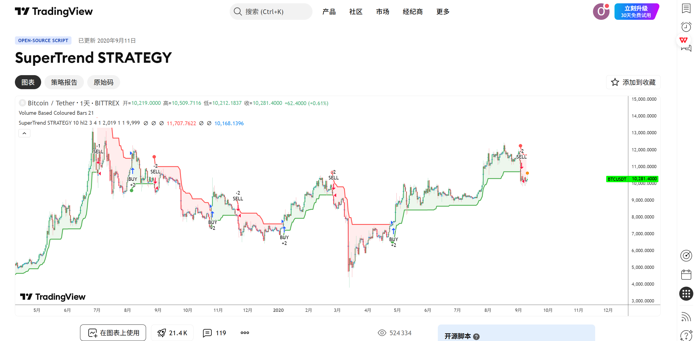
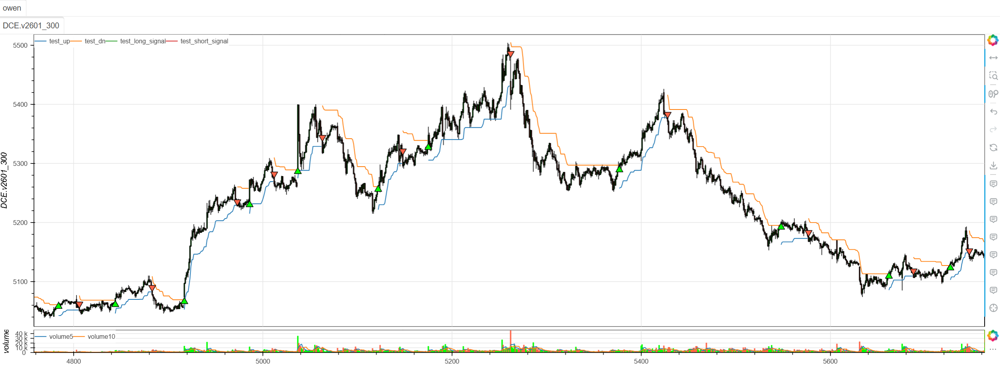

# **MiniBT量化交易之TradingView指标：SuperTrend Strategy**

## 概述

本文将详细介绍如何将 TradingView 上的 SuperTrend Strategy 指标转换为 MiniBT 框架可用的技术指标。这是一个经典的超级趋势策略实现，通过 ATR（平均真实范围）构建动态支撑阻力线，结合趋势方向判断和信号生成，为交易者提供完整的趋势跟踪解决方案。

## 原策略分析

### 指标核心逻辑

1. **动态ATR通道**：基于hl2价格和ATR构建自适应通道
2. **递归止损优化**：在趋势持续时优化止损位置
3. **趋势状态跟踪**：通过价格与止损线关系判断趋势方向
4. **转换信号生成**：在趋势转换点产生明确的交易信号

### 指标参数

- `Periods`：ATR计算周期 (默认: 22)
- `Multiplier`：ATR乘数 (默认: 3.0)
- `changeATR`：是否使用标准ATR (默认: True)



## MiniBT 转换实现

### 指标类结构

```python
class SuperTrend_STRATEGY(BtIndicator):
    """https://cn.tradingview.com/script/P5Gu6F8k/"""
    params = dict(Periods=22, Multiplier=3., changeATR=True,)
    overlap = True
```

### 核心方法实现

#### 1. ATR计算选择

```python
def next(self):
    Periods = self.params.Periods
    src = self.hl2()
    Multiplier = self.params.Multiplier
    changeATR = self.params.changeATR
    if changeATR:
        atr = self.atr(Periods)
    else:
        atr = self.true_range().sma(Periods)
```

#### 2. 基础止损线计算

```python
longStop = src-(Multiplier*atr)
shortStop = src+(Multiplier*atr)
```

#### 3. 递归止损调整

```python
dir = self.ones
size = self.V
close = self.close.values
longStop = longStop.bfill().values
shortStop = shortStop.bfill().values
up = self.full()
dn = self.full()
for i in range(1, size):
    longStopPrev = longStop[i-1]
    longStop[i] = close[i] > longStopPrev and max(
        longStop[i], longStopPrev) or longStop[i]
    shortStopPrev = shortStop[i-1]
    shortStop[i] = close[i] < shortStopPrev and min(
        shortStop[i], shortStopPrev) or shortStop[i]
```

#### 4. 趋势方向判断

```python
    dir[i] = (dir[i-1] == -1 and close[i] > shortStopPrev) and 1 or (
        (dir[i-1] == 1 and close[i] < longStopPrev) and -1 or dir[i-1])
    if dir[i] == 1:
        up[i] = longStop[i]
    else:
        dn[i] = shortStop[i]
```

#### 5. 交易信号生成

```python
dir = IndSeries(dir)
long_signal = dir == 1
long_signal &= dir.shift() == -1
short_signal = dir == -1
short_signal &= dir.shift() == 1
```

## 转换技术细节

### 1. ATR计算选择

原策略提供两种ATR计算方式：

```pine
// ATR Calculation Choice
atr = changeATR ? ta.atr(Periods) : sma(tr, Periods)
```

转换代码使用MiniBT的相应方法：

```python
if changeATR:
    atr = self.atr(Periods)  # 标准ATR
else:
    atr = self.true_range().sma(Periods)  # TR的SMA
```

### 2. 基础价格选择

使用hl2（最高最低价的平均值）作为基础价格：

```python
src = self.hl2()  # (high + low) / 2
```

### 3. 基础止损计算

基于hl2和ATR计算基础止损线：

```python
longStop = src - (Multiplier * atr)  # 多头止损线
shortStop = src + (Multiplier * atr) # 空头止损线
```

### 4. 递归止损优化

原策略使用递归方式优化止损位置：

```pine
// Recursive Stop Optimization
longStop := close > longStop[1] ? max(longStop, longStop[1]) : longStop
shortStop := close < shortStop[1] ? min(shortStop, shortStop[1]) : shortStop
```

转换代码使用循环实现相同的递归逻辑：

```python
for i in range(1, size):
    longStopPrev = longStop[i-1]
    longStop[i] = close[i] > longStopPrev and max(longStop[i], longStopPrev) or longStop[i]
    shortStopPrev = shortStop[i-1]
    shortStop[i] = close[i] < shortStopPrev and min(shortStop[i], shortStopPrev) or shortStop[i]
```

### 5. 趋势转换条件

原策略基于前一趋势状态和价格突破判断趋势转换：

```pine
// Trend Direction Change
dir = 1
dir := dir[1] == -1 and close > shortStop[1] ? 1 :
      dir[1] == 1 and close < longStop[1] ? -1 : dir[1]
```

转换代码实现了相同的条件判断：

```python
dir[i] = (dir[i-1] == -1 and close[i] > shortStopPrev) and 1 or (
    (dir[i-1] == 1 and close[i] < longStopPrev) and -1 or dir[i-1])
```

## 使用示例

```python
from minibt import *

class SuperTrend_STRATEGY(BtIndicator):
    """https://cn.tradingview.com/script/P5Gu6F8k/"""
    params = dict(Periods=22, Multiplier=3., changeATR=True,)
    overlap = True

    def next(self):
        Periods = self.params.Periods
        src = self.hl2()
        Multiplier = self.params.Multiplier
        changeATR = self.params.changeATR
        if changeATR:
            atr = self.atr(Periods)
        else:
            atr = self.true_range().sma(Periods)
        longStop = src-(Multiplier*atr)
        shortStop = src+(Multiplier*atr)
        dir = self.ones
        size = self.V
        close = self.close.values
        longStop = longStop.bfill().values
        shortStop = shortStop.bfill().values
        up = self.full()
        dn = self.full()
        for i in range(1, size):
            longStopPrev = longStop[i-1]
            longStop[i] = close[i] > longStopPrev and max(
                longStop[i], longStopPrev) or longStop[i]
            shortStopPrev = shortStop[i-1]
            shortStop[i] = close[i] < shortStopPrev and min(
                shortStop[i], shortStopPrev) or shortStop[i]
            dir[i] = (dir[i-1] == -1 and close[i] > shortStopPrev) and 1 or (
                (dir[i-1] == 1 and close[i] < longStopPrev) and -1 or dir[i-1])
            if dir[i] == 1:
                up[i] = longStop[i]
            else:
                dn[i] = shortStop[i]
        dir = IndSeries(dir)
        long_signal = dir == 1
        long_signal &= dir.shift() == -1
        short_signal = dir == -1
        short_signal &= dir.shift() == 1
        return up, dn, long_signal, short_signal
```
```python
from minibt import *


class owen(Strategy):

    def __init__(self):
        self.data = self.get_kline(LocalDatas.v2601_300, height=500)
        self.test = self.data.tradingview.SuperTrend_STRATEGY()


if __name__ == "__main__":
    Bt().run()
```


## 参数说明

1. **Periods (ATR周期)**：
   - 控制ATR计算的窗口大小
   - 影响波动率估计的准确性
   - 较短的周期更敏感，较长的周期更稳定

2. **Multiplier (ATR乘数)**：
   - 控制通道宽度
   - 影响信号的可靠性和滞后性
   - 较大的乘数产生更宽的通道，信号更可靠但可能滞后

3. **changeATR (ATR类型)**：
   - 当设置为True时，使用标准ATR计算
   - 当设置为False时，使用真实范围的SMA
   - 标准ATR更精确，TR的SMA更平滑

## 算法原理详解

### 1. 基础价格选择

使用hl2作为基础价格，平衡最高价和最低价的影响：
```python
src = (high + low) / 2
```

### 2. ATR通道构建

基于hl2和ATR构建动态通道：
```python
# 多头止损线：基础价格减去ATR缓冲
longStop = src - (Multiplier * atr)

# 空头止损线：基础价格加上ATR缓冲
shortStop = src + (Multiplier * atr)
```

### 3. 递归优化机制

确保止损线在趋势中只向有利方向移动：

```python
# 多头止损优化：价格上涨时止损上移，但不下移
longStop[i] = close[i] > longStopPrev and max(longStop[i], longStopPrev) or longStop[i]

# 空头止损优化：价格下跌时止损下移，但不上移
shortStop[i] = close[i] < shortStopPrev and min(shortStop[i], shortStopPrev) or shortStop[i]
```

### 4. 趋势转换逻辑

趋势转换需要结合前一趋势状态：

```python
# 下降转上升：前一趋势为下降且价格突破空头止损
dir[i] = (dir[i-1] == -1 and close[i] > shortStopPrev) and 1

# 上升转下降：前一趋势为上升且价格突破多头止损
dir[i] = (dir[i-1] == 1 and close[i] < longStopPrev) and -1
```

## 转换注意事项

### 1. 初始值处理

使用bfill()方法处理初始NaN值：
```python
longStop = longStop.bfill().values
shortStop = shortStop.bfill().values
```

### 2. 递归计算要求

由于止损计算具有递归依赖，必须使用循环：
```python
for i in range(1, size):
    # 递归计算止损位和趋势
```

### 3. 趋势状态初始化

初始趋势状态设为上升趋势：
```python
dir = self.ones  # 初始化为1（上升趋势）
```

### 4. 信号生成时机

信号在趋势转换时生成：
```python
long_signal = (dir == 1) & (dir.shift() == -1)  # 下降转上升
short_signal = (dir == -1) & (dir.shift() == 1)  # 上升转下降
```

## 策略应用场景

### 1. 纯趋势跟踪策略

使用SuperTrend进行简单的趋势跟踪：

```python
def pure_trend_following(up, dn, trend, close, atr, lookback=20):
    # 当前趋势状态
    current_trend = trend.iloc[-1]
    
    # 趋势强度（价格与止损线的距离）
    if current_trend == 1:
        trend_strength = (close - up) / atr
    else:
        trend_strength = (dn - close) / atr
    
    # 趋势持续时间
    trend_duration = trend.groupby((trend != trend.shift()).cumsum()).cumcount() + 1
    
    # 强趋势过滤
    strong_trend = (trend_strength > 1.0) & (trend_duration > 5)
    
    return current_trend, trend_strength, trend_duration, strong_trend
```

### 2. 多时间框架确认

结合不同时间框架的SuperTrend信号：

```python
def multi_timeframe_supertrend(daily_st, hourly_st):
    # 日线趋势方向
    daily_trend = daily_st.trend
    
    # 小时线交易信号
    hourly_long = hourly_st.long_signal
    hourly_short = hourly_st.short_signal
    
    # 确认信号
    confirmed_long = (daily_trend == 1) & hourly_long
    confirmed_short = (daily_trend == -1) & hourly_short
    
    return confirmed_long, confirmed_short
```

### 3. 波动率自适应参数

根据市场波动率调整SuperTrend参数：

```python
def adaptive_supertrend_params(close, atr, volume, base_period=50):
    # 计算市场波动率
    volatility = atr / close
    volume_ratio = volume / volume.rolling(base_period).mean()
    
    # 自适应参数
    adaptive_multiplier = np.where(volatility > 0.02, 2.5, 3.5)
    adaptive_periods = np.where(volatility > 0.02, 18, 26)
    
    # 高成交量时使用更敏感的参数
    if volume_ratio.iloc[-1] > 1.2:
        adaptive_multiplier = 2.0
        adaptive_periods = 14
    
    return adaptive_periods, adaptive_multiplier
```

### 4. 组合过滤策略

结合其他指标进行信号过滤：

```python
def filtered_supertrend_signals(st_signals, rsi, macd, volume, lookback=20):
    long_signal, short_signal = st_signals
    
    # RSI过滤（避免超买超卖区域）
    rsi_filter = (rsi > 30) & (rsi < 70)
    
    # MACD趋势确认
    macd_signal = macd > macd.ema(9)
    
    # 成交量确认
    volume_filter = volume > volume.rolling(lookback).mean()
    
    # 综合过滤信号
    filtered_long = long_signal & rsi_filter & macd_signal & volume_filter
    filtered_short = short_signal & (~rsi_filter) & (~macd_signal) & volume_filter
    
    return filtered_long, filtered_short
```

## 风险管理建议

### 1. 动态止损优化

基于ATR优化SuperTrend止损：

```python
def optimized_supertrend_stop(up, dn, trend, atr, close, position_type, multiplier=1.0):
    if position_type == 'long':
        # 多头止损：SuperTrend线下方的ATR距离
        stop_level = up - multiplier * atr
        return close < stop_level
    else:
        # 空头止损：SuperTrend线上方的ATR距离
        stop_level = dn + multiplier * atr
        return close > stop_level
```

### 2. 仓位大小管理

根据止损距离调整仓位：

```python
def supertrend_position_sizing(up, dn, close, trend, atr, base_size=1, risk_per_trade=0.02):
    # 计算当前止损距离（ATR倍数）
    if trend == 1:
        stop_distance_atr = (close - up) / atr
    else:
        stop_distance_atr = (dn - close) / atr
    
    # 基于止损距离的仓位调整
    position_size = base_size * (risk_per_trade / stop_distance_atr.clip(0.5, 3.0))
    
    # 限制仓位范围
    return position_size.clip(0.1, 3.0)
```

## 性能优化建议

### 1. 参数网格优化

系统化测试SuperTrend参数组合：

```python
def supertrend_parameter_optimization():
    param_grid = {
        'Periods': [18, 20, 22, 24, 26],
        'Multiplier': [2.5, 2.8, 3.0, 3.2, 3.5],
        'changeATR': [True, False]
    }
    
    best_params = None
    best_performance = -np.inf
    
    # 遍历参数组合进行回测
    for periods in param_grid['Periods']:
        for multiplier in param_grid['Multiplier']:
            for change_atr in param_grid['changeATR']:
                performance = backtest_supertrend(periods, multiplier, change_atr)
                
                if performance > best_performance:
                    best_performance = performance
                    best_params = {
                        'Periods': periods,
                        'Multiplier': multiplier,
                        'changeATR': change_atr
                    }
    
    return best_params, best_performance
```

### 2. 市场状态识别

根据市场特征选择最佳参数：

```python
def market_regime_supertrend_params(close, volume, atr, window=50):
    # 计算市场状态指标
    returns = close.pct_change()
    volatility = atr / close
    volume_trend = volume.rolling(window).mean()
    
    # 市场状态分类
    high_vol = volatility > volatility.quantile(0.7)
    high_volume = volume > volume_trend
    trending = abs(returns.rolling(window).mean()) > returns.rolling(window).std()
    
    if high_vol and trending:
        # 高波动趋势市场：敏感参数
        return 18, 2.5, True
    elif high_vol and not trending:
        # 高波动震荡市场：稳定参数
        return 26, 3.5, False
    elif not high_vol and trending:
        # 低波动趋势市场：适中参数
        return 22, 3.0, True
    else:
        # 低波动震荡市场：宽松参数
        return 24, 3.2, False
```

## 扩展功能

### 1. SuperTrend通道指标

基于SuperTrend创建动态通道：

```python
def supertrend_channel_indicator(up, dn, close, trend, atr, lookback=20):
    # 通道中轨
    middle = (up + dn) / 2
    
    # 通道宽度（ATR倍数）
    channel_width_atr = (up - dn) / atr
    
    # 价格在通道中的位置
    if trend == 1:
        channel_position = (close - dn) / (up - dn)
    else:
        channel_position = (up - close) / (up - dn)
    
    # 通道突破强度
    if trend == 1:
        breakout_strength = (close - up) / atr
    else:
        breakout_strength = (dn - close) / atr
    
    return middle, channel_width_atr, channel_position, breakout_strength
```

### 2. SuperTrend动量指标

基于SuperTrend变化创建动量指标：

```python
def supertrend_momentum(up, dn, trend, close, lookback=5):
    # SuperTrend动量（变化率）
    up_momentum = up.diff(lookback) / lookback
    dn_momentum = dn.diff(lookback) / lookback
    
    # 价格动量
    price_momentum = close.pct_change(lookback)
    
    # 动量一致性
    momentum_alignment = ((up_momentum > 0) & (price_momentum > 0)) | ((dn_momentum < 0) & (price_momentum < 0))
    
    # 动量强度
    momentum_strength = (abs(up_momentum) + abs(dn_momentum) + abs(price_momentum)) / 3
    
    # 动量背离
    bullish_divergence = (up_momentum > 0) & (price_momentum < 0)
    bearish_divergence = (dn_momentum < 0) & (price_momentum > 0)
    
    return up_momentum, dn_momentum, price_momentum, momentum_alignment, momentum_strength, bullish_divergence, bearish_divergence
```

### 3. 多时间框架SuperTrend一致性

分析不同时间框架SuperTrend的一致性：

```python
def multi_timeframe_supertrend_alignment(daily_st, hourly_st, four_hour_st):
    # 各时间框架趋势方向
    daily_trend = daily_st.trend
    hourly_trend = hourly_st.trend
    four_hour_trend = four_hour_st.trend
    
    # 一致性得分（-3到+3）
    alignment_score = daily_trend.astype(int) + hourly_trend.astype(int) + four_hour_trend.astype(int)
    
    # 强一致性信号
    strong_bullish_alignment = alignment_score == 3
    strong_bearish_alignment = alignment_score == -3
    
    # SuperTrend值的一致性
    st_alignment = (daily_st.up.diff(5) > 0).astype(int) + \
                   (hourly_st.up.diff(5) > 0).astype(int) + \
                   (four_hour_st.up.diff(5) > 0).astype(int)
    
    return alignment_score, strong_bullish_alignment, strong_bearish_alignment, st_alignment
```

## 总结

SuperTrend Strategy 指标通过经典的ATR动态通道算法，为交易者提供了一个强大而可靠的趋势跟踪系统。该指标结合了波动率自适应通道、递归止损优化和趋势状态跟踪，在保持算法简洁性的同时提供了清晰的交易信号。

转换过程中，我们完整实现了原指标的所有核心功能，包括ATR计算选择、基础止损计算、递归止损优化、趋势方向判断和信号生成。通过MiniBT框架的实现，用户可以在回测系统中充分利用这一经典的趋势跟踪工具。

SuperTrend Strategy 特别适用于：
- 趋势市场的精准趋势识别
- 动态止损和风险管理
- 多时间框架趋势分析
- 自动化趋势跟踪系统

该指标的转换展示了如何将经典的超级趋势算法从TradingView移植到MiniBT框架，为其他趋势跟踪指标的实现提供了重要参考。SuperTrend Strategy 的可靠性和简洁性使其成为趋势交易者的核心工具。

> 风险提示：本文涉及的交易策略、代码示例均为技术演示、教学探讨，仅用于展示逻辑思路，绝不构成任何投资建议、操作指引或决策依据 。金融市场复杂多变，存在价格波动、政策调整、流动性等多重风险，历史表现不预示未来结果。任何交易决策均需您自主判断、独立承担责任 —— 若依据本文内容操作，盈亏后果概由自身承担。请务必充分评估风险承受能力，理性对待市场，谨慎做出投资选择。