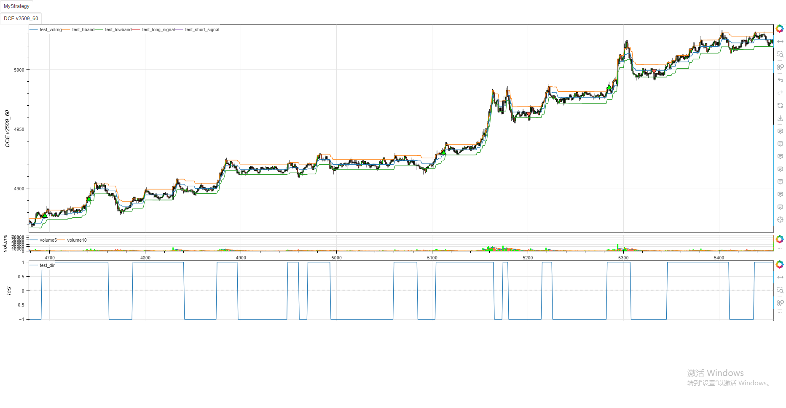

# **MiniBT量化交易之TradingView指标： Powertrend Volume Range Filter**


## 概述

本文将详细介绍如何将 TradingView 上的 Powertrend Volume Range Filter 策略转换为 MiniBT 框架可用的技术指标。这个策略由 wbburgin 开发，结合了成交量加权移动平均、ADX 指标和价格范围过滤来生成交易信号。


## 原策略分析

### 策略核心逻辑

1. **平滑范围计算**：使用指数移动平均计算价格波动范围
2. **成交量调整范围过滤**：根据成交量和价格方向动态调整过滤范围
3. **多条件信号过滤**：
   - ADX 趋势强度过滤
   - 高低点突破过滤
   - 成交量加权移动平均过滤

### 策略参数

- `l`：平滑范围周期长度 (默认: 200)
- `lengthvwma`：VWMA 长度 (默认: 200)
- `mult`：范围乘数 (默认: 3.0)
- `lengthadx`：ADX 长度 (默认: 200)
- `lengthhl`：高低点观察周期 (默认: 14)

## MiniBT 转换实现

### 指标类结构

```python
class Powertrend_Volume_Range_Filter_Strategy(BtIndicator):
    """✈  https://cn.tradingview.com/script/45FlB2qH-Powertrend-Volume-Range-Filter-Strategy-wbburgin/"""
    params = dict(l=200, lengthvwma=200, mult=3., lengthadx=200, lengthhl=14)
    overlap = dict(volrng=True, hband=True, lowband=True, dir=False)

    @staticmethod
    def smoothrng(x: IndSeries, t: int, m: float = 1.):
        """平滑平均范围"""
        wper = t*2 - 1
        avrng = (x - x.shift()).abs().ema(t)
        smoothrng = m*avrng.ema(wper)
        return smoothrng

    def _rngfilt_volumeadj(self, source1: IndSeries, tethersource: IndSeries, smoothrng: IndSeries):
        #成交量调整范围过滤
        source1 = source1.values
        size = source1.size
        rngfilt = source1.copy()
        dir = np.zeros(size)
        start = self.get_lennan(source1, tethersource, smoothrng)
        for i in range(start+1, size):
            if tethersource[i] > tethersource[i-1]:
                rngfilt[i], dir[i] = ((source1[i] - smoothrng[i]) < rngfilt[i-1]
                                      ) and (rngfilt[i-1], dir[i-1]) or (source1[i] - smoothrng[i], 1)
            else:
                rngfilt[i], dir[i] = ((source1[i] + smoothrng[i]) > rngfilt[i-1]
                                      ) and (rngfilt[i-1], dir[i-1]) or (source1[i] + smoothrng[i], -1)
        return IndSeries(rngfilt, lines=["rngfilt"]), dir

    def next(self):
        #信号生成逻辑
        smoothrng = self.smoothrng(self.close, self.params.l, self.params.mult)
        volrng, dir = self._rngfilt_volumeadj(
            self.close, self.volume, smoothrng)
        hband: IndSeries = volrng + smoothrng
        lowband: IndSeries = volrng - smoothrng

        # ADX 趋势过滤
        adx = self.adx(self.params.lengthadx).adxx
        adx_vwma = adx.vwma(self.params.lengthadx)
        adx_filter = adx > adx_vwma

        # 高低点突破过滤
        lowband_trendfollow = lowband.tqfunc.llv(self.params.lengthhl)
        highband_trendfollow = hband.tqfunc.hhv(self.params.lengthhl)
        igu_filter_positive = self.close.cross_up(highband_trendfollow.shift()).tqfunc.barlast(
        ) < self.close.cross_down(lowband_trendfollow.shift()).tqfunc.barlast()
        igu_filter_negative = ~igu_filter_positive

        # VWMA 过滤
        vwma = volrng.vwma(length=self.params.length)
        vwma_filter_positive = volrng > vwma

        # 多信号条件组合
        long_signal = dir > 0
        long_signal &= self.close.cross_up(hband)
        long_signal &= igu_filter_positive
        long_signal &= adx_filter
        long_signal &= vwma_filter_positive

        short_signal = dir < 0
        short_signal &= self.close.cross_down(lowband)
        short_signal &= igu_filter_negative
        short_signal &= adx_filter
        short_signal &= vwma_filter_positive

        return volrng, hband, lowband, dir, long_signal, short_signal
```

## 使用示例

```python
from minibt import *
from minibt.tradingview import *

class MyStrategy(Strategy):
    def __init__(self):
        self.data = self.get_kline(LocalDatas.v2509_60)
        self.data.height = 500
        self.test = Powertrend_Volume_Range_Filter_Strategy(self.data)

if __name__ == "__main__":
    Bt().run()
```

## minibt指标



## 转换注意事项

1. **数据对齐**：确保所有计算使用的数据时间对齐
2. **NaN 值处理**：在计算初期可能存在 NaN 值，需要适当处理
3. **性能优化**：循环计算部分可能影响性能，可考虑向量化优化
4. **参数验证**：确保所有参数值在合理范围内

## 策略优势

1. **多维度过滤**：结合价格、成交量和趋势强度多个维度
2. **自适应范围**：根据市场波动率自动调整过滤范围
3. **灵活配置**：可通过参数启用或禁用各种过滤条件

## 总结

通过将 TradingView 的 Powertrend Volume Range Filter 策略转换为 MiniBT 框架指标，我们能够在回测系统中充分利用这一复杂的多条件过滤策略。转换过程中需要注意保持原策略的逻辑完整性，同时确保在 MiniBT 框架下的高效运行。

这种转换不仅保留了原策略的核心思想，还使其能够与其他 MiniBT 组件无缝集成，为量化交易研究提供了更多可能性。


> ⚠️ **风险提示**：本文涉及的交易策略、代码示例均为技术演示、教学探讨，仅用于展示逻辑思路，绝不构成任何投资建议、操作指引或决策依据 。金融市场复杂多变，存在价格波动、政策调整、流动性等多重风险，历史表现不预示未来结果。任何交易决策均需您自主判断、独立承担责任 —— 若依据本文内容操作，盈亏后果概由自身承担。请务必充分评估风险承受能力，理性对待市场，谨慎做出投资选择。