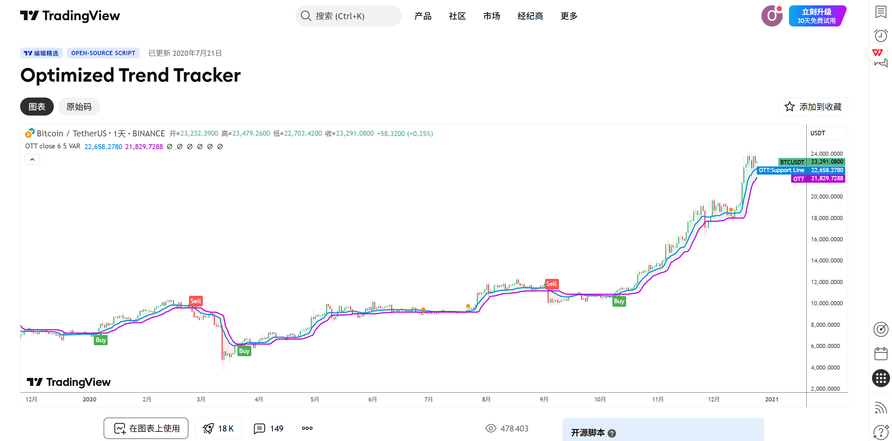
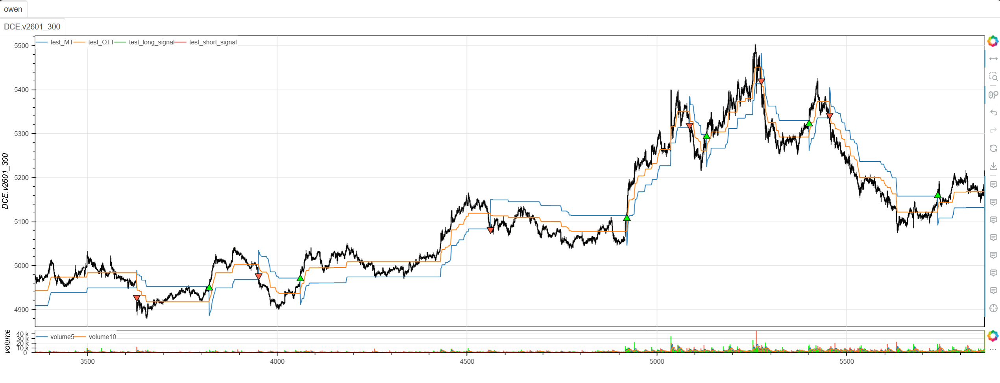

# **MiniBT量化交易之TradingView指标：Optimized Trend Tracker**

## 概述

本文将详细介绍如何将 TradingView 上的 Optimized Trend Tracker 指标转换为 MiniBT 框架可用的技术指标。这是一个创新的趋势跟踪系统，结合了波动率调整移动平均(VAR)和优化的趋势跟踪算法，通过动态阈值和百分比调整提供更精准的趋势识别和交易信号。

## 原策略分析

### 指标核心逻辑

1. **VAR波动率调整**：使用CMO动量指标自适应调整移动平均平滑度
2. **动态止损机制**：基于VAR均值和百分比计算动态止损线
3. **优化趋势线**：通过基数调整创建优化的趋势跟踪线
4. **交叉信号生成**：基于MT和OTT线的交叉产生交易信号

### 指标参数

- `length`：VAR计算长度 (默认: 2)
- `var_length`：VAR计算中CMO的周期 (默认: 9)
- `percent`：止损幅度百分比 (默认: 1.4)
- `base`：OTT计算基数 (默认: 200)



## MiniBT 转换实现

### 指标类结构

```python
class Optimized_Trend_Tracker(BtIndicator):
    """https://cn.tradingview.com/script/zVhoDQME/"""
    params = dict(length=2, var_length=9, percent=1.4, base=200)
    overlap = True
```

### 核心方法实现

#### 1. VAR波动率调整移动平均

```python
def var_Func(self, src: IndSeries, length: int, var_length):
    valpha = 2/(length+1)
    vud1 = src-src.shift()
    vud1 = vud1.apply(lambda x: x > 0. and x or 0.)
    vdd1 = vud1.apply(lambda x: x < 0. and -x or 0.)
    vUD = vud1.rolling(var_length).sum()
    vDD = vdd1.rolling(var_length).sum()
    vCMO = (vUD-vDD).ZeroDivision(vUD+vDD)
    vCMO = vCMO.values
    nanlen = len(vCMO[np.isnan(vCMO)])
    size = src.size
    value = src.values
    VAR = np.zeros(size)
    for i in range(nanlen+1, size):
        VAR[i] = valpha*abs(vCMO[i])*value[i] + \
            (1-valpha*abs(vCMO[i]))*VAR[i-1]
    return IndSeries(VAR)
```

#### 2. 基础参数和VAR计算

```python
def next(self):
    percent = self.params.percent
    base = self.params.base
    base_up = (base+percent)/base
    base_dn = (base-percent)/base
    MAvg = self.var_Func(self.close, self.params.length,
                         self.params.var_length)
```

#### 3. 动态止损计算

```python
fark = MAvg*percent*0.01
longStop = MAvg - fark
shortStop = MAvg + fark
```

#### 4. 递归趋势跟踪

```python
MAvg = MAvg.values
longStop = longStop.values
shortStop = shortStop.values
lennan = len(longStop[np.isnan(longStop)])
dir = np.ones(self.V)
MT = np.full(self.V, np.nan)
OTT = np.full(self.V, np.nan)
for i in range(lennan+1, self.V):
    longStopPrev = longStop[i-1]
    longStop[i] = MAvg[i] > longStopPrev and max(
        longStop[i], longStopPrev) or longStop[i]
    shortStopPrev = shortStop[i-1]
    shortStop[i] = MAvg[i] < shortStopPrev and min(
        shortStop[i], shortStopPrev) or shortStop[i]
    dir[i] = (dir[i-1] == -1 and MAvg[i] > shortStopPrev) and 1 or (
        (dir[i-1] == 1 and MAvg[i] < longStopPrev) and -1 or dir[i-1])
    MT[i] = dir[i] == 1 and longStop[i] or shortStop[i]
    OTT[i] = MAvg[i] > MT[i] and MT[i] * \
        base_up or MT[i]*base_dn
```

#### 5. 交易信号生成

```python
MT, OTT = IndSeries(MT), IndSeries(OTT)
long_signal = OTT.cross_up(MT)
short_signal = MT.cross_up(OTT)
```

## 转换技术细节

### 1. VAR移动平均计算原理

VAR基于CMO动量指标实现波动率自适应平滑：

```python
# 计算价格变化方向
vud1 = src.diff().apply(lambda x: x > 0 and x or 0)  # 上涨幅度
vdd1 = src.diff().apply(lambda x: x < 0 and -x or 0) # 下跌幅度

# 计算CMO指标
vUD = vud1.rolling(var_length).sum()
vDD = vdd1.rolling(var_length).sum()
vCMO = (vUD - vDD) / (vUD + vDD)  # 钱德动量摆动指标

# 自适应平滑
VAR[i] = valpha * abs(vCMO[i]) * value[i] + (1 - valpha * abs(vCMO[i])) * VAR[i-1]
```

### 2. 基础参数计算

原策略使用百分比和基数计算调整因子：

```pine
// Base Factors Calculation
base_up = (base + percent) / base
base_dn = (base - percent) / base
```

转换代码实现了相同的计算：

```python
base_up = (base + percent) / base  # 上调因子
base_dn = (base - percent) / base  # 下调因子
```

### 3. 动态止损幅度

基于VAR均值和百分比计算止损幅度：

```python
fark = MAvg * percent * 0.01  # 止损幅度
longStop = MAvg - fark        # 多头止损
shortStop = MAvg + fark       # 空头止损
```

### 4. 递归止损优化

原策略使用递归方式优化止损位置：

```pine
// Recursive Stop Optimization
longStop := MAvg > longStop[1] ? max(longStop, longStop[1]) : longStop
shortStop := MAvg < shortStop[1] ? min(shortStop, shortStop[1]) : shortStop
```

转换代码使用循环实现相同的递归逻辑：

```python
for i in range(lennan+1, self.V):
    longStopPrev = longStop[i-1]
    longStop[i] = MAvg[i] > longStopPrev and max(longStop[i], longStopPrev) or longStop[i]
    shortStopPrev = shortStop[i-1]
    shortStop[i] = MAvg[i] < shortStopPrev and min(shortStop[i], shortStopPrev) or shortStop[i]
```

### 5. 优化趋势线计算

OTT线基于MT线和基数调整：

```python
OTT[i] = MAvg[i] > MT[i] and MT[i] * base_up or MT[i] * base_dn
```

## 使用示例

```python
from minibt import *

class Optimized_Trend_Tracker(BtIndicator):
    """https://cn.tradingview.com/script/zVhoDQME/"""
    params = dict(length=2, var_length=9, percent=1.4, base=200)
    overlap = True

    def var_Func(self, src: IndSeries, length: int, var_length):
        valpha = 2/(length+1)
        vud1 = src-src.shift()
        vud1 = vud1.apply(lambda x: x > 0. and x or 0.)
        vdd1 = vud1.apply(lambda x: x < 0. and -x or 0.)
        vUD = vud1.rolling(var_length).sum()
        vDD = vdd1.rolling(var_length).sum()
        vCMO = (vUD-vDD).ZeroDivision(vUD+vDD)
        vCMO = vCMO.values
        nanlen = len(vCMO[np.isnan(vCMO)])
        size = src.size
        value = src.values
        VAR = np.zeros(size)
        for i in range(nanlen+1, size):
            VAR[i] = valpha*abs(vCMO[i])*value[i] + \
                (1-valpha*abs(vCMO[i]))*VAR[i-1]
        return IndSeries(VAR)

    def next(self):
        percent = self.params.percent
        base = self.params.base
        base_up = (base+percent)/base
        base_dn = (base-percent)/base
        MAvg = self.var_Func(self.close, self.params.length,
                             self.params.var_length)
        fark = MAvg*percent*0.01
        longStop = MAvg - fark
        shortStop = MAvg + fark
        MAvg = MAvg.values
        longStop = longStop.values
        shortStop = shortStop.values
        lennan = len(longStop[np.isnan(longStop)])
        dir = np.ones(self.V)
        MT = np.full(self.V, np.nan)
        OTT = np.full(self.V, np.nan)
        for i in range(lennan+1, self.V):
            longStopPrev = longStop[i-1]
            longStop[i] = MAvg[i] > longStopPrev and max(
                longStop[i], longStopPrev) or longStop[i]
            shortStopPrev = shortStop[i-1]
            shortStop[i] = MAvg[i] < shortStopPrev and min(
                shortStop[i], shortStopPrev) or shortStop[i]
            dir[i] = (dir[i-1] == -1 and MAvg[i] > shortStopPrev) and 1 or (
                (dir[i-1] == 1 and MAvg[i] < longStopPrev) and -1 or dir[i-1])
            MT[i] = dir[i] == 1 and longStop[i] or shortStop[i]
            OTT[i] = MAvg[i] > MT[i] and MT[i] * \
                base_up or MT[i]*base_dn
        MT, OTT = IndSeries(MT), IndSeries(OTT)
        long_signal = OTT.cross_up(MT)
        short_signal = MT.cross_up(OTT)
        return MT, OTT, long_signal, short_signal
```
```python
from minibt import *


class owen(Strategy):

    def __init__(self):
        self.data = self.get_kline(LocalDatas.v2601_300, height=500)
        self.test = self.data.tradingview.Optimized_Trend_Tracker()


if __name__ == "__main__":
    Bt().run()
```


## 参数说明

1. **length (VAR长度)**：
   - 控制VAR移动平均的平滑程度
   - 影响对价格变化的响应速度
   - 较小的值更敏感，较大的值更平滑

2. **var_length (CMO周期)**：
   - 控制CMO动量指标的计算周期
   - 影响波动率估计的准确性
   - 较短的周期对近期波动更敏感

3. **percent (止损百分比)**：
   - 控制止损幅度的大小
   - 影响通道的宽度和信号的灵敏度
   - 较大的百分比产生更宽的通道

4. **base (OTT基数)**：
   - 控制OTT线的调整幅度
   - 影响优化趋势线的位置
   - 较大的基数产生更保守的OTT线

## 算法原理详解

### 1. VAR移动平均创新

VAR通过CMO动量实现自适应平滑：

```python
# CMO计算价格动量方向
CMO = (上涨幅度总和 - 下跌幅度总和) / (上涨幅度总和 + 下跌幅度总和)

# 使用CMO绝对值调整平滑系数
平滑系数 = alpha * |CMO|
VAR = 平滑系数 * 当前价格 + (1 - 平滑系数) * 前一期VAR
```

### 2. 动态止损机制

基于VAR均值和百分比计算动态止损：

```python
# 计算止损幅度
fark = VAR均值 * 百分比 * 0.01

# 多头止损线
longStop = VAR均值 - fark

# 空头止损线  
shortStop = VAR均值 + fark
```

### 3. 趋势线优化

OTT线通过基数调整实现优化：

```python
# 当VAR均值在MT线上方时，使用上调因子
# 当VAR均值在MT线下方时，使用下调因子
OTT = (VAR均值 > MT) ? MT * base_up : MT * base_dn
```

### 4. 信号生成逻辑

基于OTT和MT的交叉产生信号：

```python
# 多头信号：OTT从下向上穿越MT
long_signal = OTT.cross_up(MT)

# 空头信号：MT从下向上穿越OTT（OTT从上向下穿越MT）
short_signal = MT.cross_up(OTT)
```

## 转换注意事项

### 1. VAR计算优化

正确处理除零错误：

```python
vCMO = (vUD-vDD).ZeroDivision(vUD+vDD)  # 安全除法
```

### 2. 初始值处理

正确处理序列的初始NaN值：

```python
lennan = len(longStop[np.isnan(longStop)])  # 获取第一个有效索引
```

### 3. 递归计算要求

由于止损计算具有递归依赖，必须使用循环：

```python
for i in range(lennan+1, self.V):
    # 递归计算止损位和趋势
```

### 4. 信号定义

注意空头信号的定义：

```python
short_signal = MT.cross_up(OTT)  # 相当于OTT下穿MT
```

## 策略应用场景

### 1. 趋势强度评估

基于OTT和MT的关系评估趋势强度：

```python
def ott_trend_strength(MT, OTT, close, lookback=20):
    # OTT与MT的距离
    ott_distance = abs(OTT - MT) / MT
    
    # 趋势方向
    trend_direction = np.where(OTT > MT, 1, -1)
    
    # 趋势强度得分（0-100）
    distance_strength = (ott_distance / ott_distance.rolling(lookback).quantile(0.9)) * 50
    consistency = (trend_direction == trend_direction.shift()).rolling(lookback).mean() * 50
    
    strength_score = distance_strength + consistency
    
    return trend_direction, strength_score.clip(0, 100)
```

### 2. 多时间框架确认

结合不同时间框架的OTT信号：

```python
def multi_timeframe_ott_confirmation(daily_ott, hourly_ott):
    # 日线趋势方向
    daily_trend = daily_ott.OTT > daily_ott.MT
    
    # 小时线交易信号
    hourly_long = hourly_ott.long_signal
    hourly_short = hourly_ott.short_signal
    
    # 确认信号
    confirmed_long = daily_trend & hourly_long
    confirmed_short = (~daily_trend) & hourly_short
    
    return confirmed_long, confirmed_short
```

### 3. 自适应参数调整

根据市场波动率调整OTT参数：

```python
def adaptive_ott_params(close, atr, volume, base_period=50):
    # 计算市场波动率
    volatility = atr / close
    volume_ratio = volume / volume.rolling(base_period).mean()
    
    # 自适应参数
    adaptive_percent = np.where(volatility > 0.02, 1.2, 1.6)
    adaptive_base = np.where(volatility > 0.02, 180, 220)
    adaptive_var_length = np.where(volatility > 0.02, 7, 11)
    
    return adaptive_percent, adaptive_base, adaptive_var_length
```

### 4. 组合过滤策略

结合其他指标进行信号过滤：

```python
def filtered_ott_signals(ott_signals, rsi, macd, volume, lookback=20):
    long_signal, short_signal = ott_signals
    
    # RSI过滤
    rsi_filter = (rsi > 30) & (rsi < 70)
    
    # MACD趋势确认
    macd_signal = macd > macd.ema(9)
    
    # 成交量确认
    volume_filter = volume > volume.rolling(lookback).mean()
    
    # 综合过滤信号
    filtered_long = long_signal & rsi_filter & macd_signal & volume_filter
    filtered_short = short_signal & (~rsi_filter) & (~macd_signal) & volume_filter
    
    return filtered_long, filtered_short
```

## 风险管理建议

### 1. 动态止损策略

基于OTT和MT的复合止损：

```python
def ott_composite_stop_loss(MT, OTT, close, position_type, atr, multiplier=1.0):
    if position_type == 'long':
        # 多头止损：MT和OTT的较低者减去ATR缓冲
        stop_level = min(MT, OTT) - multiplier * atr
        return close < stop_level
    else:
        # 空头止损：MT和OTT的较高者加上ATR缓冲
        stop_level = max(MT, OTT) + multiplier * atr
        return close > stop_level
```

### 2. 仓位大小管理

根据OTT通道宽度调整仓位：

```python
def ott_position_sizing(MT, OTT, close, base_size=1, risk_per_trade=0.02):
    # 计算OTT通道宽度
    channel_width = abs(OTT - MT) / close
    
    # 基于通道宽度的仓位调整
    volatility_adjustment = 1.0 / (channel_width / channel_width.rolling(50).mean())
    
    # 最终仓位大小
    position_size = base_size * volatility_adjustment
    
    # 限制仓位范围
    return position_size.clip(0.1, 3.0)
```

## 性能优化建议

### 1. 参数网格优化

系统化测试OTT参数组合：

```python
def ott_parameter_optimization():
    param_grid = {
        'length': [2, 3, 4],
        'var_length': [7, 9, 11],
        'percent': [1.2, 1.4, 1.6, 1.8],
        'base': [180, 200, 220, 240]
    }
    
    best_params = None
    best_performance = -np.inf
    
    # 遍历参数组合进行回测
    for length in param_grid['length']:
        for var_length in param_grid['var_length']:
            for percent in param_grid['percent']:
                for base in param_grid['base']:
                    performance = backtest_ott(length, var_length, percent, base)
                    
                    if performance > best_performance:
                        best_performance = performance
                        best_params = {
                            'length': length,
                            'var_length': var_length,
                            'percent': percent,
                            'base': base
                        }
    
    return best_params, best_performance
```

### 2. 市场状态识别

根据市场特征选择最佳参数：

```python
def market_regime_ott_params(close, volume, atr, window=50):
    # 计算市场状态指标
    returns = close.pct_change()
    volatility = atr / close
    volume_trend = volume.rolling(window).mean()
    
    # 市场状态分类
    high_vol = volatility > volatility.quantile(0.7)
    high_volume = volume > volume_trend
    trending = abs(returns.rolling(window).mean()) > returns.rolling(window).std()
    
    if high_vol and trending:
        # 高波动趋势市场：敏感参数
        return 2, 7, 1.2, 180
    elif high_vol and not trending:
        # 高波动震荡市场：稳定参数
        return 4, 11, 1.8, 240
    elif not high_vol and trending:
        # 低波动趋势市场：适中参数
        return 3, 9, 1.4, 200
    else:
        # 低波动震荡市场：宽松参数
        return 3, 9, 1.6, 220
```

## 扩展功能

### 1. OTT通道指标

基于OTT和MT创建动态通道：

```python
def ott_channel_indicator(MT, OTT, close, atr, lookback=20):
    # 上轨和下轨
    upper_band = OTT + atr
    lower_band = OTT - atr
    
    # 通道宽度
    channel_width = (upper_band - lower_band) / close
    
    # 价格在通道中的位置
    channel_position = (close - lower_band) / (upper_band - lower_band)
    
    # 通道突破信号
    upper_breakout = (close > upper_band) & (close.shift() <= upper_band.shift())
    lower_breakout = (close < lower_band) & (close.shift() >= lower_band.shift())
    
    return upper_band, lower_band, channel_width, channel_position, upper_breakout, lower_breakout
```

### 2. OTT动量指标

基于OTT变化创建动量指标：

```python
def ott_momentum(MT, OTT, close, lookback=5):
    # OTT动量（变化率）
    ott_momentum = OTT.diff(lookback) / lookback
    
    # MT动量
    mt_momentum = MT.diff(lookback) / lookback
    
    # 价格动量
    price_momentum = close.pct_change(lookback)
    
    # 动量一致性
    momentum_alignment = ((ott_momentum > 0) & (mt_momentum > 0) & (price_momentum > 0)) | \
                         ((ott_momentum < 0) & (mt_momentum < 0) & (price_momentum < 0))
    
    # 动量强度
    momentum_strength = (abs(ott_momentum) + abs(mt_momentum) + abs(price_momentum)) / 3
    
    # 动量背离
    bullish_divergence = (ott_momentum > 0) & (price_momentum < 0)
    bearish_divergence = (ott_momentum < 0) & (price_momentum > 0)
    
    return ott_momentum, mt_momentum, price_momentum, momentum_alignment, momentum_strength, bullish_divergence, bearish_divergence
```

### 3. 多时间框架OTT一致性

分析不同时间框架OTT的一致性：

```python
def multi_timeframe_ott_alignment(daily_ott, hourly_ott, four_hour_ott):
    # 各时间框架趋势方向
    daily_trend = daily_ott.OTT > daily_ott.MT
    hourly_trend = hourly_ott.OTT > hourly_ott.MT
    four_hour_trend = four_hour_ott.OTT > four_hour_ott.MT
    
    # 一致性得分（-3到+3）
    alignment_score = daily_trend.astype(int) + hourly_trend.astype(int) + four_hour_trend.astype(int)
    
    # 强一致性信号
    strong_bullish_alignment = alignment_score == 3
    strong_bearish_alignment = alignment_score == -3
    
    # OTT值的一致性
    ott_alignment = (daily_ott.OTT.diff(5) > 0).astype(int) + \
                    (hourly_ott.OTT.diff(5) > 0).astype(int) + \
                    (four_hour_ott.OTT.diff(5) > 0).astype(int)
    
    return alignment_score, strong_bullish_alignment, strong_bearish_alignment, ott_alignment
```

## 总结

Optimized Trend Tracker 指标通过创新的VAR波动率调整移动平均和OTT优化趋势线，为交易者提供了一个强大而精准的趋势跟踪系统。该指标结合了自适应平滑、动态止损和优化趋势线，在保持对市场变化敏感性的同时提供了可靠的交易信号。

转换过程中，我们完整实现了原指标的所有核心算法，包括VAR移动平均计算、动态止损优化、OTT趋势线生成和交叉信号检测。通过MiniBT框架的实现，用户可以在回测系统中充分利用这一先进的趋势跟踪工具。

Optimized Trend Tracker 特别适用于：
- 波动率自适应趋势跟踪
- 精准的趋势识别和信号生成
- 动态风险管理和止损设置
- 多时间框架趋势确认

该指标的转换展示了如何将VAR移动平均和OTT优化算法从TradingView移植到MiniBT框架，为其他高级趋势跟踪指标的实现提供了重要参考。Optimized Trend Tracker 的创新性和精准性使其成为趋势交易者的有力工具。

> 风险提示：本文涉及的交易策略、代码示例均为技术演示、教学探讨，仅用于展示逻辑思路，绝不构成任何投资建议、操作指引或决策依据 。金融市场复杂多变，存在价格波动、政策调整、流动性等多重风险，历史表现不预示未来结果。任何交易决策均需您自主判断、独立承担责任 —— 若依据本文内容操作，盈亏后果概由自身承担。请务必充分评估风险承受能力，理性对待市场，谨慎做出投资选择。