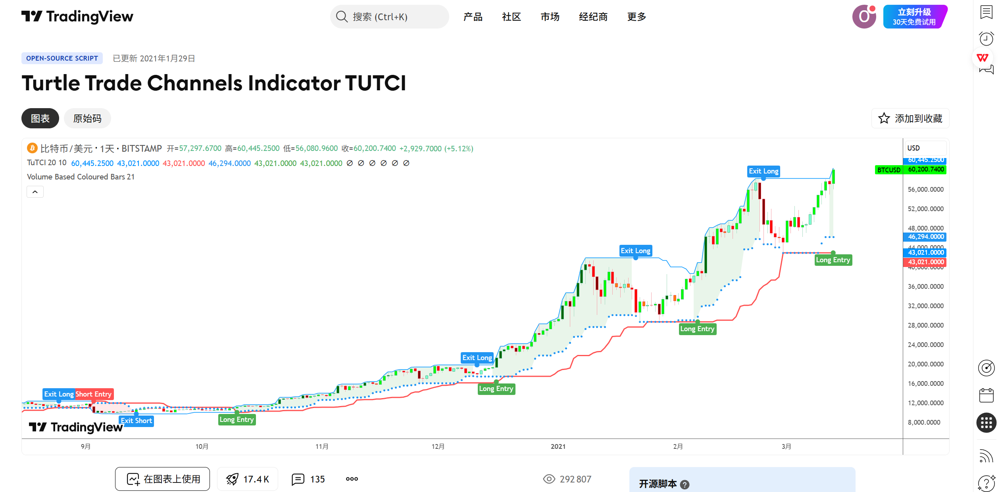
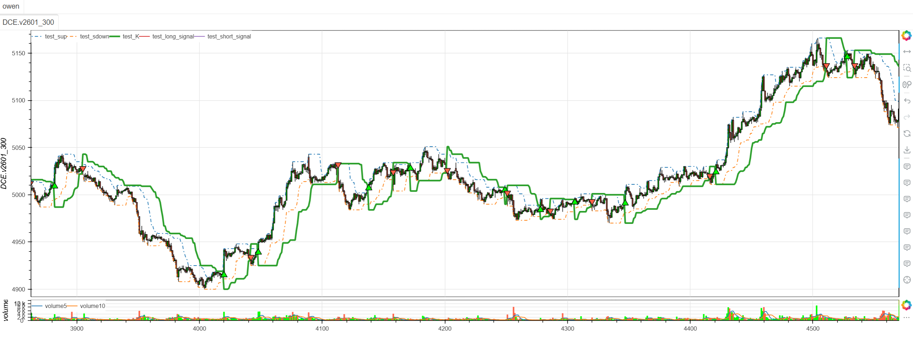

# **MiniBT量化交易之TradingView指标：Turtle Trade Channels Indicator (TUTCI)**

## 概述

本文将详细介绍如何将 TradingView 上的 Turtle Trade Channels Indicator (TUTCI) 指标转换为 MiniBT 框架可用的技术指标。这是一个基于经典海龟交易法则的通道突破系统，通过双周期通道和突破信号识别趋势方向，为交易者提供清晰的入场和出场点。

## 原策略分析

### 指标核心逻辑

1. **双周期通道系统**：使用长短两个周期构建动态支撑阻力通道
2. **突破方向判断**：基于价格与通道关系确定当前市场方向
3. **海龟交易法则**：结合经典海龟交易法的突破理念
4. **多信号输出**：提供入场、出场和通道突破多种信号

### 指标参数

- `length`：长期通道周期 (默认: 120)
- `len2`：短期通道周期 (默认: 100)



## MiniBT 转换实现

### 指标类结构

```python
class Turtle_Trade_Channels_Indicator_TUTCI(BtIndicator):
    """https://cn.tradingview.com/script/pB5nv16J/"""
    params = dict(length=120, len2=100, )
    overlap = True
    linestyle = dict(sup=LineStyle(line_dash=LineDash.dotdash),
                     sdown=LineStyle(line_dash=LineDash.dotdash),
                     K=LineStyle(line_width=3.))
```

### 核心方法实现

#### 1. 双周期通道计算

```python
def next(self):
    length = self.params.length
    len2 = self.params.len2

    up = self.high.tqfunc.hhv(length)
    down = self.low.tqfunc.llv(length)
    sup = self.high.tqfunc.hhv(len2)
    sdown = self.low.tqfunc.llv(len2)
```

#### 2. 突破方向判断

```python
cond = (self.high >= up.shift()).tqfunc.barlast() <= (self.low <= down.shift()).tqfunc.barlast()
```

#### 3. 海龟通道计算

```python
K1 = down.where(cond, up)
K2 = sdown.where(cond, sup)
kmax = K1.tqfunc.max(K2)
kmin = K1.tqfunc.min(K2)
K = kmin.where(cond, kmax)
```

#### 4. 交易信号生成

```python
long_signal = cond & (~cond.shift())
short_signal = (~cond) & cond.shift()

exitlong_signal = self.low == sdown.shift()
exitlong_signal |= sdown.shift().cross_up(self.low)
exitshort_signal = self.high == sup.shift()
exitshort_signal |= self.high.cross_up(sup.shift())
```

## 转换技术细节

### 1. 双周期通道构建

原策略使用两个不同周期的最高最低价构建通道：

```pine
// Dual Period Channels
up = highest(high, length)
down = lowest(low, length)
sup = highest(high, len2)
sdown = lowest(low, len2)
```

转换代码使用MiniBT的hhv和llv方法：

```python
up = self.high.tqfunc.hhv(length)    # 长期上轨
down = self.low.tqfunc.llv(length)   # 长期下轨
sup = self.high.tqfunc.hhv(len2)     # 短期上轨
sdown = self.low.tqfunc.llv(len2)    # 短期下轨
```

### 2. 突破方向判断逻辑

原策略通过比较突破时间确定市场方向：

```pine
// Breakout Direction
cond = (barssince(high >= up[1]) <= barssince(low <= down[1]))
```

转换代码使用tqfunc.barlast()实现相同逻辑：

```python
cond = (self.high >= up.shift()).tqfunc.barlast() <= (self.low <= down.shift()).tqfunc.barlast()
```

### 3. 海龟通道计算

原策略根据突破方向选择不同的通道组合：

```pine
// Turtle Channel Calculation
K1 = cond ? down : up
K2 = cond ? sdown : sup
kmax = max(K1, K2)
kmin = min(K1, K2)
K = cond ? kmin : kmax
```

转换代码使用where方法实现条件选择：

```python
K1 = down.where(cond, up)           # 根据条件选择长期通道
K2 = sdown.where(cond, sup)         # 根据条件选择短期通道
kmax = K1.tqfunc.max(K2)            # 两者最大值
kmin = K1.tqfunc.min(K2)            # 两者最小值
K = kmin.where(cond, kmax)          # 根据条件选择最终通道
```

### 4. 信号生成机制

原策略在突破方向变化时生成交易信号：

```pine
// Entry Signals
long_signal = cond and not cond[1]
short_signal = not cond and cond[1]

// Exit Signals
exitlong_signal = low == sdown[1] or crossover(sdown[1], low)
exitshort_signal = high == sup[1] or crossover(high, sup[1])
```

转换代码实现了相同的信号逻辑：

```python
long_signal = cond & (~cond.shift())                    # 转多信号
short_signal = (~cond) & cond.shift()                   # 转空信号

exitlong_signal = self.low == sdown.shift()             # 多单出场条件1
exitlong_signal |= sdown.shift().cross_up(self.low)     # 多单出场条件2
exitshort_signal = self.high == sup.shift()             # 空单出场条件1
exitshort_signal |= self.high.cross_up(sup.shift())     # 空单出场条件2
```

## 使用示例

```python
from minibt import *

class Turtle_Trade_Channels_Indicator_TUTCI(BtIndicator):
    """https://cn.tradingview.com/script/pB5nv16J/"""
    params = dict(length=120, len2=100, )
    overlap = True
    linestyle = dict(sup=LineStyle(line_dash=LineDash.dotdash),
                     sdown=LineStyle(line_dash=LineDash.dotdash),
                     K=LineStyle(line_width=3.))

    def next(self):
        length = self.params.length
        len2 = self.params.len2

        up = self.high.tqfunc.hhv(length)
        down = self.low.tqfunc.llv(length)
        sup = self.high.tqfunc.hhv(len2)
        sdown = self.low.tqfunc.llv(len2)
        cond = (self.high >= up.shift()).tqfunc.barlast() <= (self.low <= down.shift(
        )).tqfunc.barlast()
        K1 = down.where(cond, up)
        K2 = sdown.where(cond, sup)
        kmax = K1.tqfunc.max(K2)
        kmin = K1.tqfunc.min(K2)
        K = kmin.where(cond, kmax)
        long_signal = cond & (~cond.shift())
        short_signal = (~cond) & cond.shift()

        exitlong_signal = self.low == sdown.shift()
        exitlong_signal |= sdown.shift().cross_up(self.low)
        exitshort_signal = self.high == sup.shift()
        exitshort_signal |= self.high.cross_up(sup.shift())

        return sup, sdown, K, long_signal, short_signal

class TurtleTradingStrategy(Strategy):
    def __init__(self):
        self.data = self.get_kline(LocalDatas.v2601_300, height=500)
        self.turtle = self.data.tradingview.Turtle_Trade_Channels_Indicator_TUTCI(
            length=120,  # 长期通道周期
            len2=100     # 短期通道周期
        )


if __name__ == "__main__":
    Bt().run()
```



## 参数说明

1. **length (长期通道周期)**：
   - 控制主要趋势通道的周期长度
   - 影响对长期趋势的识别
   - 较大的周期更稳定，适合捕捉主要趋势

2. **len2 (短期通道周期)**：
   - 控制次要趋势通道的周期长度
   - 影响对短期波动的敏感性
   - 较小的周期更敏感，适合捕捉短期机会

## 算法原理详解

### 1. 突破方向判断机制

通过比较向上突破和向下突破的时间来确定市场方向：

```python
# 计算向上突破的周期数
up_break_bars = (high >= up.shift()).tqfunc.barlast()

# 计算向下突破的周期数  
down_break_bars = (low <= down.shift()).tqfunc.barlast()

# 方向判断：最近一次突破的方向
cond = up_break_bars <= down_break_bars  # True=看涨, False=看跌
```

### 2. 海龟通道构建逻辑

根据市场方向动态调整通道：

```python
# 看涨市场：使用下轨通道
if cond:  # 看涨
    K1 = down      # 长期下轨
    K2 = sdown     # 短期下轨
    K = min(K1, K2)  # 取较保守的下轨

# 看跌市场：使用上轨通道  
else:     # 看跌
    K1 = up        # 长期上轨
    K2 = sup       # 短期上轨
    K = max(K1, K2)  # 取较保守的上轨
```

### 3. 信号生成原理

基于突破方向的变化生成交易信号：

```python
# 多头信号：从看跌转为看涨
long_signal = 当前看涨 and 前一周期看跌

# 空头信号：从看涨转为看跌
short_signal = 当前看跌 and 前一周期看涨
```

### 4. 出场条件设计

结合价格与通道的关系设计出场条件：

```python
# 多单出场：价格触及短期下轨或下轨上穿价格
exitlong_signal = (low == 前一期短期下轨) or (前一期短期下轨上穿当前低价)

# 空单出场：价格触及短期上轨或价格上穿短期上轨
exitshort_signal = (high == 前一期短期上轨) or (当前高价上穿前一期短期上轨)
```

## 转换注意事项

### 1. 可视化样式设置

为不同通道线设置特定的显示样式：

```python
linestyle = dict(
    sup=LineStyle(line_dash=LineDash.dotdash),     # 短期上轨虚线
    sdown=LineStyle(line_dash=LineDash.dotdash),   # 短期下轨虚线
    K=LineStyle(line_width=3.)                     # 海龟通道加粗
)
```

### 2. barlast函数使用

使用tqfunc.barlast()计算突破周期数：

```python
cond = (self.high >= up.shift()).tqfunc.barlast() <= (self.low <= down.shift()).tqfunc.barlast()
```

### 3. 条件选择逻辑

使用where方法实现条件选择：

```python
K1 = down.where(cond, up)  # cond为True时取down，否则取up
```

### 4. 交叉信号处理

使用cross_up方法检测交叉：

```python
exitlong_signal |= sdown.shift().cross_up(self.low)  # 下轨上穿低价
```

## 策略应用场景

### 1. 纯海龟突破策略

使用TUTCI进行经典的海龟交易：

```python
def pure_turtle_trading(turtle_signals, close, volume, lookback=20):
    long_signal, short_signal = turtle_signals
    
    # 趋势强度（突破幅度）
    if long_signal.any():
        breakout_strength = (close - close.rolling(lookback).min()) / close.rolling(lookback).min()
    elif short_signal.any():
        breakout_strength = (close.rolling(lookback).max() - close) / close
    
    # 成交量确认
    volume_confirmation = volume > volume.rolling(lookback).mean()
    
    # 过滤信号
    filtered_long = long_signal & (breakout_strength > 0.01) & volume_confirmation
    filtered_short = short_signal & (breakout_strength > 0.01) & volume_confirmation
    
    return filtered_long, filtered_short
```

### 2. 多时间框架确认

结合不同时间框架的海龟信号：

```python
def multi_timeframe_turtle_confirmation(daily_turtle, hourly_turtle):
    # 日线突破方向
    daily_direction = daily_turtle.cond
    
    # 小时线交易信号
    hourly_long = hourly_turtle.long_signal
    hourly_short = hourly_turtle.short_signal
    
    # 确认信号：日线方向与小时线信号一致
    confirmed_long = daily_direction & hourly_long
    confirmed_short = (~daily_direction) & hourly_short
    
    return confirmed_long, confirmed_short
```

### 3. 自适应通道周期

根据市场波动率调整通道周期：

```python
def adaptive_turtle_params(close, atr, volume, base_period=50):
    # 计算市场波动率
    volatility = atr / close
    volume_ratio = volume / volume.rolling(base_period).mean()
    
    # 自适应参数
    adaptive_length = np.where(volatility > 0.02, 100, 140)
    adaptive_len2 = np.where(volatility > 0.02, 80, 120)
    
    # 高成交量时使用更敏感的周期
    if volume_ratio.iloc[-1] > 1.5:
        adaptive_length = 80
        adaptive_len2 = 60
    
    return adaptive_length, adaptive_len2
```

### 4. 组合风险管理

结合ATR进行动态仓位管理：

```python
def turtle_position_sizing(close, atr, base_size=1, risk_per_trade=0.02):
    # 基于ATR的仓位计算
    atr_ratio = atr / close
    position_size = base_size * (risk_per_trade / atr_ratio)
    
    # 限制仓位范围
    return position_size.clip(0.1, 3.0)
```

## 风险管理建议

### 1. 动态止损策略

基于海龟通道和ATR的复合止损：

```python
def turtle_stop_loss(K, close, position_type, atr, multiplier=2.0):
    if position_type == 'long':
        # 多头止损：海龟通道下方2倍ATR
        stop_level = K - multiplier * atr
        return close < stop_level
    else:
        # 空头止损：海龟通道上方2倍ATR
        stop_level = K + multiplier * atr
        return close > stop_level
```

### 2. 分批入场策略

模仿海龟交易法的分批建仓：

```python
def turtle_pyramiding(initial_signal, K, close, atr, max_positions=4):
    positions = []
    entry_prices = []
    
    # 首次入场
    if initial_signal:
        positions.append(1)
        entry_prices.append(close)
    
    # 加仓条件：价格向有利方向移动0.5倍ATR
    for i in range(1, max_positions):
        if len(positions) >= i:
            if positions[0] > 0:  # 多头加仓
                add_signal = close > (entry_prices[-1] + 0.5 * atr)
            else:  # 空头加仓
                add_signal = close < (entry_prices[-1] - 0.5 * atr)
            
            if add_signal:
                positions.append(1)
                entry_prices.append(close)
    
    return sum(positions)
```

## 性能优化建议

### 1. 参数网格优化

系统化测试海龟通道参数组合：

```python
def turtle_parameter_optimization():
    param_grid = {
        'length': [80, 100, 120, 140, 160],
        'len2': [60, 80, 100, 120, 140]
    }
    
    best_params = None
    best_performance = -np.inf
    
    # 遍历参数组合进行回测
    for length in param_grid['length']:
        for len2 in param_grid['len2']:
            # 确保短期周期不大于长期周期
            if len2 < length:
                performance = backtest_turtle(length, len2)
                
                if performance > best_performance:
                    best_performance = performance
                    best_params = {'length': length, 'len2': len2}
    
    return best_params, best_performance
```

### 2. 市场状态识别

根据市场特征选择最佳参数：

```python
def market_regime_turtle_params(close, volume, atr, window=50):
    # 计算市场状态指标
    returns = close.pct_change()
    volatility = atr / close
    volume_trend = volume.rolling(window).mean()
    
    # 市场状态分类
    high_vol = volatility > volatility.quantile(0.7)
    high_volume = volume > volume_trend
    trending = abs(returns.rolling(window).mean()) > returns.rolling(window).std()
    
    if high_vol and trending:
        # 高波动趋势市场：敏感参数
        return 100, 80
    elif high_vol and not trending:
        # 高波动震荡市场：稳定参数
        return 140, 120
    elif not high_vol and trending:
        # 低波动趋势市场：适中参数
        return 120, 100
    else:
        # 低波动震荡市场：宽松参数
        return 160, 140
```

## 扩展功能

### 1. 海龟通道强度指标

基于通道突破创建趋势强度指标：

```python
def turtle_channel_strength(up, down, sup, sdown, close, lookback=20):
    # 长期通道宽度
    long_channel_width = (up - down) / close
    
    # 短期通道宽度
    short_channel_width = (sup - sdown) / close
    
    # 价格在通道中的位置
    if close > up:
        position_strength = (close - up) / long_channel_width
    elif close < down:
        position_strength = (down - close) / long_channel_width
    else:
        position_strength = 0
    
    # 通道突破强度
    breakout_strength = position_strength.rolling(lookback).max()
    
    return long_channel_width, short_channel_width, position_strength, breakout_strength
```

### 2. 海龟动量指标

基于通道变化创建动量指标：

```python
def turtle_momentum(K, up, down, close, lookback=5):
    # 海龟通道动量
    K_momentum = K.diff(lookback) / lookback
    
    # 长期通道动量
    long_channel_momentum = (up.diff(lookback) - down.diff(lookback)) / lookback
    
    # 价格动量
    price_momentum = close.pct_change(lookback)
    
    # 动量一致性
    momentum_alignment = ((K_momentum > 0) & (price_momentum > 0)) | ((K_momentum < 0) & (price_momentum < 0))
    
    # 动量强度
    momentum_strength = (abs(K_momentum) + abs(long_channel_momentum) + abs(price_momentum)) / 3
    
    return K_momentum, long_channel_momentum, price_momentum, momentum_alignment, momentum_strength
```

## 总结

Turtle Trade Channels Indicator (TUTCI) 通过经典的海龟交易法则和双周期通道系统，为交易者提供了一个强大而可靠的趋势突破系统。该指标结合了长期趋势识别和短期突破确认，在保持算法经典性的同时提供了清晰的交易信号。

转换过程中，我们完整实现了原指标的所有核心功能，包括双周期通道构建、突破方向判断、海龟通道计算和交易信号生成。通过MiniBT框架的实现，用户可以在回测系统中充分利用这一经典的趋势突破工具。

TUTCI 特别适用于：
- 趋势突破市场的趋势识别
- 海龟交易法的系统化实现
- 多时间框架趋势确认
- 动态风险管理和仓位控制

该指标的转换展示了如何将经典的海龟交易算法从TradingView移植到MiniBT框架，为其他通道突破类指标的实现提供了重要参考。TUTCI 的经典性和可靠性使其成为趋势交易者的重要工具。

> 风险提示：本文涉及的交易策略、代码示例均为技术演示、教学探讨，仅用于展示逻辑思路，绝不构成任何投资建议、操作指引或决策依据 。金融市场复杂多变，存在价格波动、政策调整、流动性等多重风险，历史表现不预示未来结果。任何交易决策均需您自主判断、独立承担责任 —— 若依据本文内容操作，盈亏后果概由自身承担。请务必充分评估风险承受能力，理性对待市场，谨慎做出投资选择。