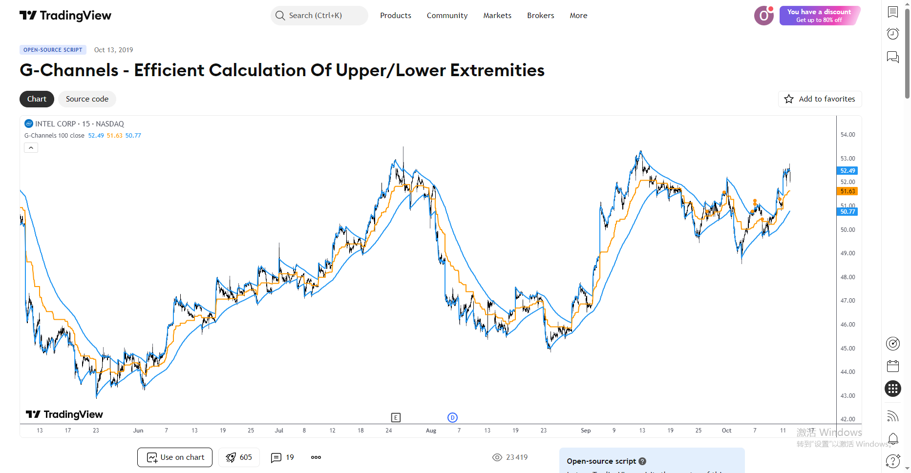
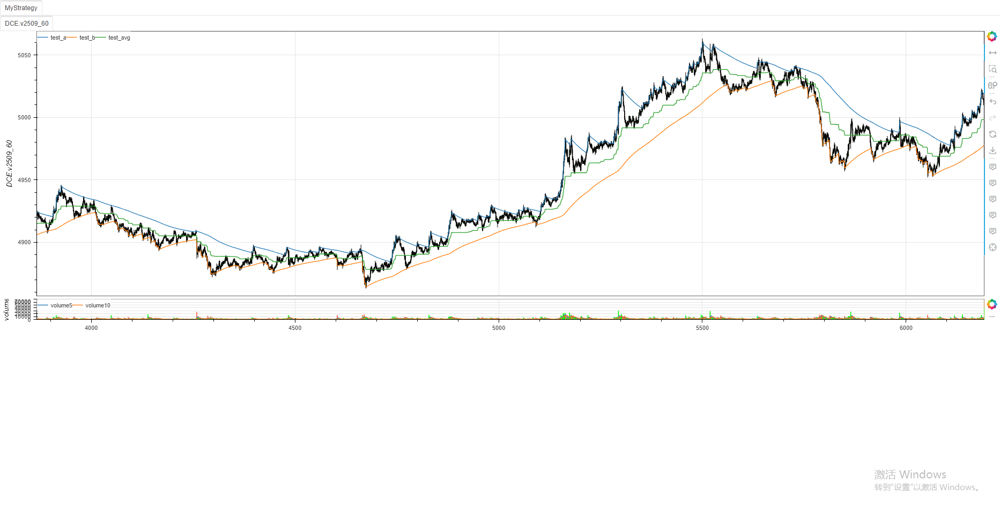

# **MiniBT量化交易之TradingView指标: G-Channels**

## 概述

本文将详细介绍如何将 TradingView 上的 G-Channels 指标转换为 MiniBT 框架可用的技术指标。G-Channels 是一种高效计算价格上下极端值的通道指标，能够动态跟踪价格的最高点和最低点，并计算其中间平均值。

## 原指标分析

### 指标核心逻辑

G-Channels 指标通过以下递归公式计算上下轨道：

1. **上轨 (a)**：`a = max(当前价格, 前值上轨) - (前值上轨 - 前值下轨)/长度`
2. **下轨 (b)**：`b = min(当前价格, 前值下轨) + (前值上轨 - 前值下轨)/长度`
3. **中轨 (avg)**：`(上轨 + 下轨)/2`

### 指标参数

- `length`：通道计算的长度参数 (默认: 100)
- `src`：计算源数据 (默认: 收盘价)



## MiniBT 转换实现

### 指标核心方法实现

```python
class G_Channels(BtIndicator):
    """✈ https://www.tradingview.com/script/fIvlS64B-G-Channels-Efficient-Calculation-Of-Upper-Lower-Extremities/"""
    params = dict(length=144., cycle=1)
    overlap = True

    def next(self):
        length = self.params.length
        cycle = max(int(self.params.cycle), 1)
        size = self.close.size
        a = np.full(size, np.nan)
        b = np.full(size, np.nan)
        close = self.close.values
        pre_a = 0.
        pre_b = 0.
        for i in range(size):
            if i and i % cycle == 0:
                a[i] = max(close[i], pre_a)-(pre_a-pre_b) / length
                b[i] = min(close[i], pre_b)+(pre_a-pre_b) / length
                pre_a = a[i]
                pre_b = b[i]
        if cycle > 1:
            a = pd.Series(a).interpolate(method="linear")
            b = pd.Series(b).interpolate(method="linear")
        avg = (a+b)/2.

        return a, b, avg
```

## 转换技术细节

### 1. 循环计算优化

原 TradingView 代码使用递归方式计算每个点的值，而 MiniBT 转换使用循环方式实现相同的逻辑：

```python
for i in range(size):
    if i and i % cycle == 0:
        a[i] = max(close[i], pre_a)-(pre_a-pre_b) / length
        b[i] = min(close[i], pre_b)+(pre_a-pre_b) / length
        pre_a = a[i]
        pre_b = b[i]
```

### 2. 周期参数处理

转换代码添加了 `cycle` 参数，允许用户控制计算频率，提高计算效率：

```python
cycle = max(int(self.params.cycle), 1)
```

### 3. 插值处理

当 `cycle > 1` 时，使用线性插值填充未计算的周期点：

```python
if cycle > 1:
    a = pd.Series(a).interpolate(method="linear")
    b = pd.Series(b).interpolate(method="linear")
```

### 4. 中轨计算

简单计算上下轨的平均值作为中轨：

```python
avg = (a+b)/2.
```

## 使用示例

```python
from minibt import *
from minibt.tradingview import *

class MyStrategy(Strategy):
    def __init__(self):
        self.data = self.get_kline(LocalDatas.v2509_60)
        self.data.height = 500
        self.test = G_Channels(self.data)

if __name__ == "__main__":
    Bt().run()
```


## 参数说明

1. **length**：通道计算的长度参数，影响通道的平滑程度
2. **cycle**：计算周期，大于1时可提高计算效率但会降低精度

## 转换注意事项

1. **初始值处理**：原代码使用 `nz()` 函数处理可能的空值，转换代码通过初始化 `pre_a` 和 `pre_b` 为0来处理初始值
2. **数据类型**：确保使用正确的数据类型，如 `np.full(size, np.nan)` 创建NaN数组
3. **性能优化**：通过 `cycle` 参数控制计算频率，在长周期数据上可显著提高性能
4. **插值方法**：使用线性插值填充未计算的周期点，保持曲线的连续性

## 策略应用

G-Channels 指标可用于多种交易策略：

1. **趋势跟踪**：价格突破上轨或下轨可能表示趋势开始
2. **均值回归**：价格接近中轨可能表示回归机会
3. **波动率测量**：通道宽度反映市场波动率

## 总结

通过将 TradingView 的 G-Channels 指标转换为 MiniBT 框架指标，我们能够在回测系统中利用这一高效的价格通道计算工具。转换过程中保持了原指标的核心逻辑，同时增加了计算周期控制功能，提高了在大数据量下的计算效率。

这种转换不仅保留了原指标的特性，还使其能够与 MiniBT 框架的其他组件无缝集成，为量化交易研究提供了更多可能性。用户可以根据需要调整参数，平衡计算精度和性能需求。

> 风险提示：本文涉及的交易策略、代码示例均为技术演示、教学探讨，仅用于展示逻辑思路，绝不构成任何投资建议、操作指引或决策依据 。金融市场复杂多变，存在价格波动、政策调整、流动性等多重风险，历史表现不预示未来结果。任何交易决策均需您自主判断、独立承担责任 —— 若依据本文内容操作，盈亏后果概由自身承担。请务必充分评估风险承受能力，理性对待市场，谨慎做出投资选择。