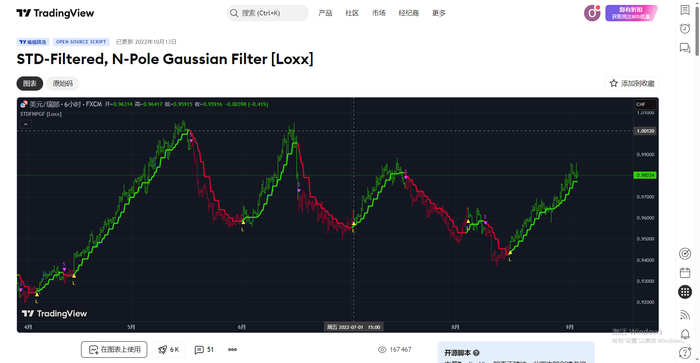
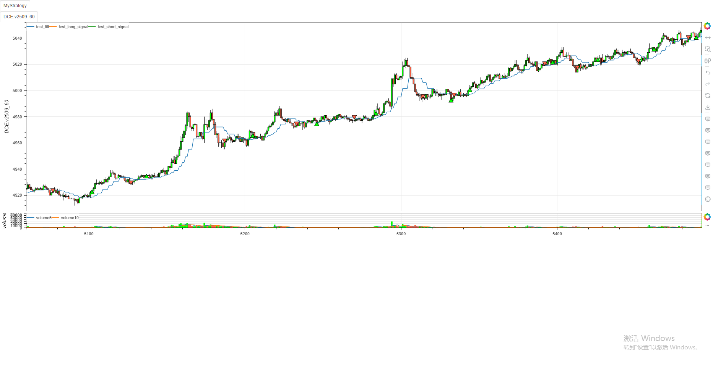

# **MiniBT量化交易之TradingView指标：STD-Filtered N-Pole Gaussian Filter**

## 概述

本文将详细介绍如何将 TradingView 上的 STD-Filtered N-Pole Gaussian Filter 指标转换为 MiniBT 框架可用的技术指标。这个由 Loxx 开发的复杂滤波器结合了 N 极高斯滤波和标准差过滤技术，能够有效平滑价格数据并生成交易信号。

## 原指标分析

### 指标核心逻辑

1. **N 极高斯滤波**：使用多项式展开计算高斯滤波，平滑价格数据
2. **标准差过滤**：基于价格波动率过滤异常值
3. **多源数据支持**：支持多种价格源，包括标准价格、Heikin-Ashi 和平滑后的 Heikin-Ashi

### 指标参数

- `period`：滤波周期 (默认: 25)
- `order`：滤波阶数 (默认: 5)
- `filterperiod`：过滤周期 (默认: 10)
- `filter`：过滤偏差乘数 (默认: 1.0)
- 多种价格源选项和滤波类型选项
- 


## MiniBT 转换实现

### 指标类结构

```python
class STD_Filtered(BtIndicator):
    """✈ https://cn.tradingview.com/script/i4xZNAoy-STD-Filtered-N-Pole-Gaussian-Filter-Loxx/"""
    params = dict(period=25, order=5, filterperiod=10, filter=1.)
    overlap = dict(out=True, filt=True)
```

### 核心方法实现

#### 1. 阶乘计算

```python
@staticmethod
def fact(n: int) -> float:
    if n < 2:
        return 1.
    return float(reduce(lambda x, y: x*y, range(1, n+1)))
```

#### 2. Alpha 值计算

```python
@staticmethod
def alpha(period, poles):
    w = 2.0 * math.pi / period
    b = (1.0 - math.cos(w)) / (math.pow(1.414, 2.0 / poles) - 1.0)
    a = - b + math.sqrt(b * b + 2.0 * b)
    return a
```

#### 3. 系数矩阵计算

```python
def makeCoeffs(self, period, order):
    coeffs = np.full((order+1, 3), 0.)
    a = self.alpha(period, order)
    for i in range(order+1):
        div = self.fact(order - i) * self.fact(i)
        out = self.fact(order) / div if div else 1.
        coeffs[i, :] = [out, math.pow(a, i), math.pow(1.0 - a, i)]
    return coeffs
```

#### 4. N 极高斯滤波计算

```python
@staticmethod
def npolegf(src: np.ndarray, order: int = 0, coeffs: np.ndarray = None):
    size = src.size
    nanlen = len(src[np.isnan(src)])
    filt = np.full(size-nanlen, np.nan)
    value = src[nanlen:]
    for j in range(size-nanlen):
        sign = 1.
        _filt = value[j]*coeffs[order, 1]
        for i in range(1, 1+order):
            if j >= i:
                _filt += sign * coeffs[i, 0] * coeffs[i, 2] * filt[j-i]
            sign *= -1.
        filt[j] = _filt
    if not nanlen:
        return filt
    return np.append(np.full(nanlen, np.nan), filt)
```

#### 5. 标准差过滤

```python
@staticmethod
def std_filter(out: IndSeries, length: int, filter: float):
    std = out.stdev(length).values
    filtdev = filter * std
    nanlen = len(std[np.isnan(std)])
    filt = np.array(out.values)
    for i in range(nanlen+1, out.size):
        if abs(filt[i]-filt[i-1]) < filtdev[i]:
            filt[i] = filt[i-1]
    return filt
```

#### 6. 主计算逻辑

```python
def next(self):
    coeffs = self.makeCoeffs(self.params.period, self.params.order)
    src = self.ha().close
    src = self.std_filter(
        src, self.params.filterperiod, self.params.filter)
    out = self.npolegf(src, order=self.params.order, coeffs=coeffs)
    filt = IndSeries(out, name="filt")
    filt = self.std_filter(
        filt, self.params.filterperiod, self.params.filter)
    _filt = pd.Series(filt)
    sig = _filt.shift()
    long_signal = _filt > sig
    long_signal &= (_filt.shift() < sig.shift()) | (
        _filt.shift() == sig.shift())
    short_signal = _filt < sig
    short_signal &= (_filt.shift() > sig.shift()) | (
        _filt.shift() == sig.shift())
    size = self.V
    contsw = np.zeros(size)
    for i in range(size):
        contsw[i] = long_signal[i] and 1 or (
            short_signal[i] and -1 or contsw[i-1])
    contsw = pd.Series(contsw)
    long_signal &= contsw.shift() == -1
    short_signal &= contsw.shift() == 1

    return filt, long_signal, short_signal
```

## 转换技术细节

### 1. 数学计算实现

原指标使用了复杂的数学计算，包括：
- 阶乘计算
- 三角函数计算
- 矩阵运算
- 递归滤波计算

转换代码使用 NumPy 和标准数学库实现了这些计算。

### 2. NaN 值处理

转换代码特别注意处理 NaN 值，确保计算正确性：

```python
nanlen = len(src[np.isnan(src)])
filt = np.full(size-nanlen, np.nan)
value = src[nanlen:]
```

### 3. 信号生成逻辑

转换代码实现了原指标复杂的信号生成逻辑，包括：
- 滤波值比较
- 状态转换检测
- 连续状态跟踪

```python
long_signal = _filt > sig
long_signal &= (_filt.shift() < sig.shift()) | (_filt.shift() == sig.shift())
```

### 4. 性能优化

对于大型数据集，转换代码使用向量化操作和循环优化提高性能：

```python
for j in range(size-nanlen):
    sign = 1.
    _filt = value[j]*coeffs[order, 1]
    for i in range(1, 1+order):
        if j >= i:
            _filt += sign * coeffs[i, 0] * coeffs[i, 2] * filt[j-i]
        sign *= -1.
    filt[j] = _filt
```

## 完整代码

```python
from minibt import *
from minibt.tradingview import *

class STD_Filtered(BtIndicator):
    """✈ https://cn.tradingview.com/script/i4xZNAoy-STD-Filtered-N-Pole-Gaussian-Filter-Loxx/"""
    params = dict(period=25, order=5, filterperiod=10, filter=1.)
    overlap = dict(out=True, filt=True)  # , dir=False)

    @staticmethod
    def fact(n: int) -> float:
        if n < 2:
            return 1.
        return float(reduce(lambda x, y: x*y, range(1, n+1)))

    @staticmethod
    def alpha(period, poles):
        w = 2.0 * math.pi / period
        b = (1.0 - math.cos(w)) / (math.pow(1.414, 2.0 / poles) - 1.0)
        a = - b + math.sqrt(b * b + 2.0 * b)
        return a

    def makeCoeffs(self, period, order):
        coeffs = np.full((order+1, 3), 0.)
        a = self.alpha(period, order)
        for i in range(order+1):
            div = self.fact(order - i) * self.fact(i)
            out = self.fact(order) / div if div else 1.
            coeffs[i, :] = [out, math.pow(a, i), math.pow(1.0 - a, i)]
        return coeffs

    @staticmethod
    def npolegf(src: np.ndarray, order: int = 0, coeffs: np.ndarray = None):
        size = src.size
        nanlen = len(src[np.isnan(src)])
        filt = np.full(size-nanlen, np.nan)
        value = src[nanlen:]
        for j in range(size-nanlen):
            sign = 1.
            _filt = value[j]*coeffs[order, 1]
            for i in range(1, 1+order):
                if j >= i:
                    _filt += sign * coeffs[i, 0] * coeffs[i, 2] * filt[j-i]
                sign *= -1.
            filt[j] = _filt
        if not nanlen:
            return filt
        return np.append(np.full(nanlen, np.nan), filt)

    @staticmethod
    def std_filter(out: IndSeries, length: int, filter: float):
        std = out.stdev(length).values
        filtdev = filter * std
        nanlen = len(std[np.isnan(std)])
        filt = np.array(out.values)
        for i in range(nanlen+1, out.size):
            if abs(filt[i]-filt[i-1]) < filtdev[i]:
                filt[i] = filt[i-1]
        return filt

    def next(self):
        coeffs = self.makeCoeffs(self.params.period, self.params.order)
        src = self.ha().close
        src = self.std_filter(
            src, self.params.filterperiod, self.params.filter)
        out = self.npolegf(src, order=self.params.order, coeffs=coeffs)
        filt = IndSeries(out, name="filt")
        filt = self.std_filter(
            filt, self.params.filterperiod, self.params.filter)
        _filt = pd.Series(filt)
        sig = _filt.shift()
        long_signal = _filt > sig
        long_signal &= (_filt.shift() < sig.shift()) | (
            _filt.shift() == sig.shift())
        short_signal = _filt < sig
        short_signal &= (_filt.shift() > sig.shift()) | (
            _filt.shift() == sig.shift())
        size = self.V
        contsw = np.zeros(size)
        for i in range(size):
            contsw[i] = long_signal[i] and 1 or (
                short_signal[i] and -1 or contsw[i-1])
        contsw = pd.Series(contsw)
        long_signal &= contsw.shift() == -1
        short_signal &= contsw.shift() == 1

        return filt, long_signal, short_signal

class MyStrategy(Strategy):
    def __init__(self):
        self.data = self.get_kline(LocalDatas.v2509_60)
        self.data.height = 500
        self.test = STD_Filtered(self.data)

if __name__ == "__main__":
    Bt().run()
```



## 参数说明

1. **period**：滤波周期，影响滤波的平滑程度
2. **order**：滤波阶数，影响滤波的复杂度
3. **filterperiod**：标准差计算周期
4. **filter**：标准差乘数，影响过滤的严格程度

## 转换注意事项

1. **精度问题**：复杂的数学计算可能导致精度差异，需要测试验证
2. **性能考虑**：高阶滤波计算可能较慢，需要考虑性能优化
3. **边界条件**：需要正确处理数据边界和初始条件
4. **NaN 处理**：确保 NaN 值不会影响计算结果的正确性

## 策略应用

STD-Filtered N-Pole Gaussian Filter 指标可用于多种交易策略：

1. **趋势识别**：滤波后的曲线可以更清晰地显示趋势方向
2. **信号生成**：基于滤波曲线的交叉生成交易信号
3. **波动率过滤**：标准差过滤可以排除异常波动的影响
4. **多时间框架分析**：可以应用于不同时间框架的趋势分析

## 总结

通过将 TradingView 的 STD-Filtered N-Pole Gaussian Filter 指标转换为 MiniBT 框架指标，我们能够在回测系统中利用这一先进的滤波技术。转换过程中保持了原指标的复杂数学计算和信号生成逻辑，同时确保了在 MiniBT 框架下的高效运行。

这种转换不仅保留了原指标的核心特性，还使其能够与 MiniBT 框架的其他组件无缝集成，为量化交易研究提供了强大的技术分析工具。用户可以根据需要调整参数，平衡滤波效果和计算性能。

该指标的转换展示了如何将复杂的数学计算和信号处理逻辑从 TradingView 移植到 MiniBT 框架，为其他类似复杂指标的转换提供了参考范例。

> 风险提示：本文涉及的交易策略、代码示例均为技术演示、教学探讨，仅用于展示逻辑思路，绝不构成任何投资建议、操作指引或决策依据 。金融市场复杂多变，存在价格波动、政策调整、流动性等多重风险，历史表现不预示未来结果。任何交易决策均需您自主判断、独立承担责任 —— 若依据本文内容操作，盈亏后果概由自身承担。请务必充分评估风险承受能力，理性对待市场，谨慎做出投资选择。