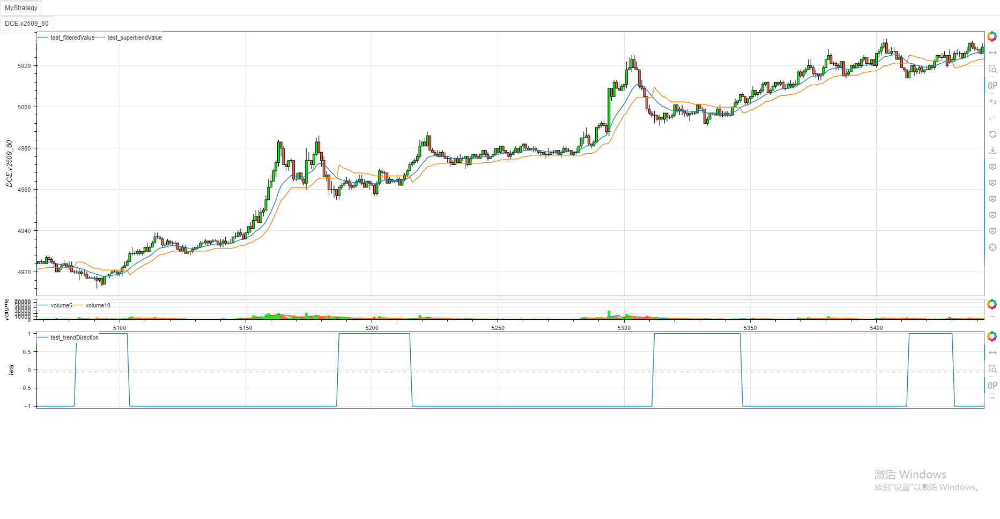

# **MiniBT量化交易之TradingView指标：Adaptive Trend Filter**

## 概述

本文将详细介绍如何将 TradingView 上的 Adaptive Trend Filter 指标（由 tradingbauhaus 开发）转换为 MiniBT 框架可用的技术指标。这个指标结合了自适应滤波和超级趋势技术，能够有效识别市场趋势方向并提供过滤信号。

> 注意：原地址出版物已经找不到了，本文基于MiniBT框架代码进行分析和介绍。

## 指标核心逻辑分析

### 1. 自适应滤波器

自适应滤波器使用基于方差的增益计算来估计价格，能够根据市场波动性自动调整滤波强度：

```python
def adaptiveFilter(self, b, alpha, beta):
    size = self.close.size
    close = self.close.values
    estimation = np.zeros(size)
    variance = 1.0
    coefficient = alpha * b

    estimation[0] = close[0]
    for i in range(1, size):
        previous = estimation[i-1]
        gain = variance / (variance + coefficient)
        estimation[i] = previous + gain * (close[i] - previous)
        variance = (1 - gain) * variance + beta / b

    return IndSeries(estimation)
```

### 2. 超级趋势计算

超级趋势基于自适应滤波器的输出，结合平均真实范围（ATR）计算上下轨道，并确定趋势方向：

```python
def supertrendFunc(self, src: IndSeries, factor: float, atrPeriod: int):
    atr = self.atr(atrPeriod)
    upperBand = src + factor * atr
    lowerBand = src - factor * atr
    size = src.size
    src = src.values
    upperBand, lowerBand = upperBand.values, lowerBand.values
    direction = np.full(size, 1.)
    superTrend = np.zeros(size)
    length = get_lennan(upperBand, lowerBand)
    for i in range(length+1, size):
        prevLowerBand = lowerBand[i-1]
        prevUpperBand = upperBand[i-1]

        lowerBand[i] = (lowerBand[i] > prevLowerBand or src[i -
                        1] < prevLowerBand) and lowerBand[i] or prevLowerBand
        upperBand[i] = (upperBand[i] < prevUpperBand or src[i -
                        1] > prevUpperBand) and upperBand[i] or prevUpperBand
        prevSuperTrend = superTrend[i-1]

        if prevSuperTrend == prevUpperBand:
            direction[i] = src[i] > upperBand[i] and -1 or 1
        else:
            direction[i] = src[i] < lowerBand[i] and 1 or -1
        superTrend[i] = direction[i] == - \
            1. and lowerBand[i] or upperBand[i]
    return superTrend, direction
```

## MiniBT 转换实现

### 指标类结构

```python
class Adaptive_Trend_Filter(BtIndicator):
    """✈ https://cn.tradingview.com/script/PhSlALob-Adaptive-Trend-Filter-tradingbauhaus/"""
    params = dict(alphaFilter=0.01, betaFilter=0.1, filterPeriod=21,
                  supertrendFactor=1, supertrendAtrPeriod=7)
    overlap = dict(filteredValue=True, supertrendValue=True,
                   trendDirection=False)
```

### 参数说明

1. **alphaFilter**：自适应滤波器的 alpha 参数，控制滤波器的响应速度
2. **betaFilter**：自适应滤波器的 beta 参数，控制方差调整的速度
3. **filterPeriod**：滤波周期，影响滤波器的平滑程度
4. **supertrendFactor**：超级趋势的乘数因子，影响通道宽度
5. **supertrendAtrPeriod**：超级趋势的 ATR 周期，影响波动率计算

### 主计算逻辑

```python
def next(self):
    # Apply Adaptive Filter and Supertrend
    filteredValue = self.adaptiveFilter(
        self.params.filterPeriod, self.params.alphaFilter, self.params.betaFilter)
    supertrendValue, trendDirection = self.supertrendFunc(
        filteredValue, self.params.supertrendFactor, self.params.supertrendAtrPeriod)

    return filteredValue, supertrendValue, trendDirection
```

## 转换技术细节

### 1. 自适应滤波算法

自适应滤波器使用基于方差的增益计算，能够根据市场条件自动调整滤波强度：

```python
gain = variance / (variance + coefficient)
estimation[i] = previous + gain * (close[i] - previous)
variance = (1 - gain) * variance + beta / b
```

这种算法结合了卡尔曼滤波的思想，能够有效处理非平稳时间序列。

### 2. 超级趋势计算

超级趋势计算结合了自适应滤波输出和 ATR 波动率测量：

```python
atr = self.atr(atrPeriod)
upperBand = src + factor * atr
lowerBand = src - factor * atr
```

趋势方向判断逻辑：

```python
if prevSuperTrend == prevUpperBand:
    direction[i] = src[i] > upperBand[i] and -1 or 1
else:
    direction[i] = src[i] < lowerBand[i] and 1 or -1
```

### 3. 数据对齐处理

转换代码特别注意数据对齐问题，确保所有计算使用正确的时间对齐数据：

```python
size = self.close.size
close = self.close.values
```

## 完整代码

```python
from minibt import *
from minibt.tradingview import *

class Adaptive_Trend_Filter(BtIndicator):
    """✈ https://cn.tradingview.com/script/PhSlALob-Adaptive-Trend-Filter-tradingbauhaus/"""
    params = dict(alphaFilter=0.01, betaFilter=0.1, filterPeriod=21,
                  supertrendFactor=1, supertrendAtrPeriod=7)
    overlap = dict(filteredValue=True, supertrendValue=True,
                   trendDirection=False)

    # Adaptive Filter Function
    def adaptiveFilter(self, b, alpha, beta):
        size = self.close.size
        close = self.close.values
        estimation = np.zeros(size)
        variance = 1.0
        coefficient = alpha * b

        estimation[0] = close[0]
        for i in range(1, size):
            previous = estimation[i-1]
            gain = variance / (variance + coefficient)
            estimation[i] = previous + gain * (close[i] - previous)
            variance = (1 - gain) * variance + beta / b

        return IndSeries(estimation)

    # Supertrend Function
    def supertrendFunc(self, src: IndSeries, factor: float, atrPeriod: int):
        atr = self.atr(atrPeriod)
        upperBand = src + factor * atr
        lowerBand = src - factor * atr
        size = src.size
        src = src.values
        upperBand, lowerBand = upperBand.values, lowerBand.values
        direction = np.full(size, 1.)
        superTrend = np.zeros(size)
        length = get_lennan(upperBand, lowerBand)
        for i in range(length+1, size):
            prevLowerBand = lowerBand[i-1]
            prevUpperBand = upperBand[i-1]

            lowerBand[i] = (lowerBand[i] > prevLowerBand or src[i -
                            1] < prevLowerBand) and lowerBand[i] or prevLowerBand
            upperBand[i] = (upperBand[i] < prevUpperBand or src[i -
                            1] > prevUpperBand) and upperBand[i] or prevUpperBand
            prevSuperTrend = superTrend[i-1]

            if prevSuperTrend == prevUpperBand:
                direction[i] = src[i] > upperBand[i] and -1 or 1
            else:
                direction[i] = src[i] < lowerBand[i] and 1 or -1
            superTrend[i] = direction[i] == - \
                1. and lowerBand[i] or upperBand[i]
        return superTrend, direction

    def next(self):
        # Apply Adaptive Filter and Supertrend
        filteredValue = self.adaptiveFilter(
            self.params.filterPeriod, self.params.alphaFilter, self.params.betaFilter)
        supertrendValue, trendDirection = self.supertrendFunc(
            filteredValue, self.params.supertrendFactor, self.params.supertrendAtrPeriod)

        return filteredValue, supertrendValue, trendDirection

class MyStrategy(Strategy):
    def __init__(self):
        self.data = self.get_kline(LocalDatas.v2509_60)
        self.data.height = 500
        self.test = Adaptive_Trend_Filter(self.data)

if __name__ == "__main__":
    Bt().run()
```


## 参数调优建议

1. **alphaFilter 和 betaFilter**：
   - 较小的值会使滤波器更平滑但响应更慢
   - 较大的值会使滤波器更敏感但可能产生更多噪音

2. **filterPeriod**：
   - 较长的周期会产生更平滑的结果
   - 较短的周期会更敏感于价格变化

3. **supertrendFactor**：
   - 较小的值会产生更窄的通道，更多信号
   - 较大的值会产生更宽的通道，更少但更可靠的信号

4. **supertrendAtrPeriod**：
   - 较短的周期对近期波动更敏感
   - 较长的周期提供更稳定的波动率估计

## 策略应用

Adaptive Trend Filter 指标可用于多种交易策略：

1. **趋势跟踪**：根据趋势方向信号进入和退出市场
2. **波动突破**：价格突破超级趋势通道时可能表示趋势开始
3. **过滤系统**：作为其他策略的过滤条件，避免在震荡市中交易
4. **多时间框架分析**：在不同时间框架上应用以获得更全面的市场视图

## 转换注意事项

1. **初始值处理**：确保正确处理序列的初始值，避免 NaN 值影响计算
2. **性能考虑**：循环计算可能影响性能，特别是在大数据集上
3. **参数验证**：确保所有参数值在合理范围内，避免计算错误
4. **边界条件**：特别注意数据边界条件，确保计算正确性

## 总结

尽管原 TradingView 指标的详细说明已不可用，但通过分析转换代码，我们能够理解 Adaptive Trend Filter 的核心逻辑和实现方式。这个指标结合了自适应滤波和超级趋势技术，能够有效识别市场趋势并提供过滤信号。

通过将这一指标转换为 MiniBT 框架，我们能够在回测系统中利用其趋势识别能力。转换过程中保持了原指标的核心算法，同时确保了在 MiniBT 框架下的高效运行。

这种转换展示了如何将复杂的自适应滤波算法从 TradingView 移植到 MiniBT 框架，为其他类似指标的转换提供了参考范例。用户可以根据自己的交易风格和市场条件调整参数，以获得最佳的性能表现。

> 风险提示：本文涉及的交易策略、代码示例均为技术演示、教学探讨，仅用于展示逻辑思路，绝不构成任何投资建议、操作指引或决策依据 。金融市场复杂多变，存在价格波动、政策调整、流动性等多重风险，历史表现不预示未来结果。任何交易决策均需您自主判断、独立承担责任 —— 若依据本文内容操作，盈亏后果概由自身承担。请务必充分评估风险承受能力，理性对待市场，谨慎做出投资选择。