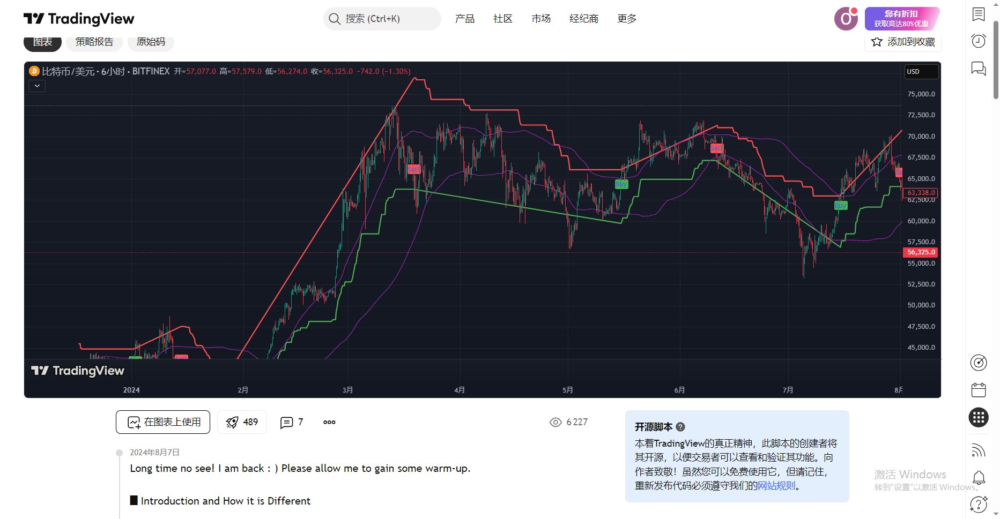
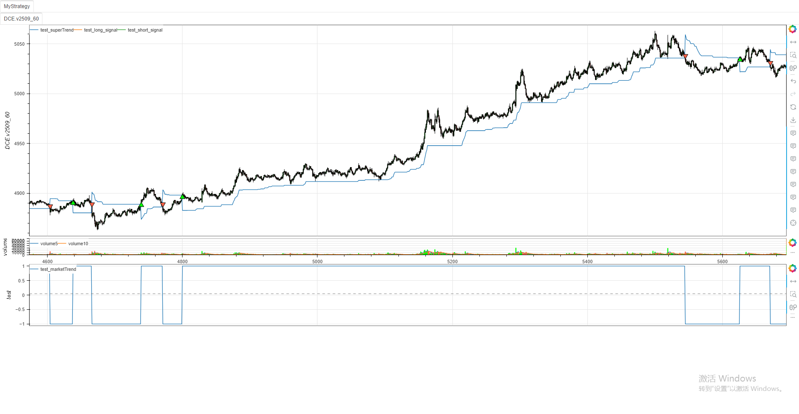

# **MiniBT量化交易之TradingView指标：Multi-Step Vegas SuperTrend**
## 概述

本文将详细介绍如何将 TradingView 上的 Multi-Step Vegas SuperTrend 策略（由 presentTrading 开发）转换为 MiniBT 框架可用的技术指标。这个策略结合了 Vegas 通道、超级趋势指标和多步止盈逻辑，是一个复杂但功能强大的交易系统。

## 原策略分析

### 策略核心逻辑

1. **Vegas 通道计算**：基于移动平均线和标准差计算通道
2. **超级趋势指标**：基于 ATR 和调整乘数计算动态支撑阻力
3. **多步止盈**：支持最多 4 个止盈级别，每个级别有不同的止盈百分比和仓位比例
4. **趋势识别**：根据价格与超级趋势的关系判断市场趋势方向

### 策略参数

- `atrPeriod`：ATR 周期 (默认: 10)
- `vegasWindow`：Vegas 通道窗口长度 (默认: 100)
- `superTrendMultiplier`：超级趋势乘数基数 (默认: 5)
- `volatilityAdjustment`：波动率调整因子 (默认: 5)
- `maType`：移动平均类型 (可选: SMA, JMA, VIDYA)



## MiniBT 转换实现

### 指标类结构

```python
class Multi_Step_Vegas_SuperTrend_strategy(BtIndicator):
    """https://cn.tradingview.com/script/SXtas3lS-Multi-Step-Vegas-SuperTrend-strategy-presentTrading/"""
    params = dict(atrPeriod=10, vegasWindow=100,
                  superTrendMultiplier=5, volatilityAdjustment=5, matype="jma")
    overlap = dict(superTrend=True, marketTrend=False)
```

### 核心方法实现

#### 1. Vegas 通道计算

```python
vegasMovingAverage: IndSeries = getattr(
    self.close, self.params.matype)(self.params.vegasWindow)
vegasChannelStdDev = self.close.stdev(self.params.vegasWindow)
vegasChannelUpper = vegasMovingAverage + vegasChannelStdDev
vegasChannelLower = vegasMovingAverage - vegasChannelStdDev
```

#### 2. 调整乘数计算

```python
channelVolatilityWidth = vegasChannelUpper - vegasChannelLower
adjustedMultiplier = self.params.superTrendMultiplier + \
    self.params.volatilityAdjustment * \
    (channelVolatilityWidth / vegasMovingAverage)
```

#### 3. 超级趋势计算

```python
averageTrueRange = self.atr(self.params.atrPeriod)
superTrendUpper_ = (
    self.hlc3() - (adjustedMultiplier * averageTrueRange)).values
superTrendLower_ = (
    self.hlc3() + (adjustedMultiplier * averageTrueRange)).values
```

#### 4. 趋势方向判断

```python
for i in range(lennan+1, size):
    marketTrend[i] = (close[i] > superTrendPrevLower) and 1 or (
        (close[i] < superTrendPrevUpper) and -1 or marketTrend[i-1])
    superTrendUpper[i] = (marketTrend[i] == 1) and max(
        superTrendUpper_[i], superTrendPrevUpper) or superTrendUpper_[i]
    superTrendLower[i] = (marketTrend[i] == -1) and min(
        superTrendLower_[i], superTrendPrevLower) or superTrendLower_[i]
    superTrendPrevUpper = superTrendUpper[i]
    superTrendPrevLower = superTrendLower[i]
    if marketTrend[i] == 1:
        superTrend[i] = superTrendUpper[i]
    else:
        superTrend[i] = superTrendLower[i]
```

#### 5. 信号生成

```python
long_signal = marketTrend == 1
long_signal &= np.append([0], marketTrend[:-1]) == -1
short_signal = marketTrend == -1
short_signal &= np.append([0], marketTrend[:-1]) == 1
```

## 转换技术细节

### 1. 移动平均类型处理

原策略支持三种移动平均类型：
- SMA：简单移动平均
- JMA：Jurik 移动平均
- VIDYA：可变指数动态平均

转换代码使用 `getattr` 动态获取移动平均函数：

```python
vegasMovingAverage: IndSeries = getattr(
    self.close, self.params.matype)(self.params.vegasWindow)
```

### 2. 超级趋势计算优化

转换代码将超级趋势计算优化为向量化操作，提高计算效率：

```python
superTrendUpper_ = (
    self.hlc3() - (adjustedMultiplier * averageTrueRange)).values
superTrendLower_ = (
    self.hlc3() + (adjustedMultiplier * averageTrueRange)).values
```

### 3. 趋势方向判断逻辑

转换代码实现了原策略的趋势方向判断逻辑：

```python
marketTrend[i] = (close[i] > superTrendPrevLower) and 1 or (
    (close[i] < superTrendPrevUpper) and -1 or marketTrend[i-1])
```

### 4. 信号检测

转换代码检测趋势变化点作为交易信号：

```python
long_signal = marketTrend == 1
long_signal &= np.append([0], marketTrend[:-1]) == -1
short_signal = marketTrend == -1
short_signal &= np.append([0], marketTrend[:-1]) == 1
```

## 完整代码

```python
from minibt import *
from minibt.tradingview import *

class Multi_Step_Vegas_SuperTrend_strategy(BtIndicator):
    """https://cn.tradingview.com/script/SXtas3lS-Multi-Step-Vegas-SuperTrend-strategy-presentTrading/"""
    params = dict(atrPeriod=10, vegasWindow=100,
                  superTrendMultiplier=5, volatilityAdjustment=5, matype="jma")
    overlap = dict(superTrend=True, marketTrend=False)

    def next(self):
        vegasMovingAverage: IndSeries = getattr(
            self.close, self.params.matype)(self.params.vegasWindow)
        # // Calculate the standard deviation for the Vegas Channel
        vegasChannelStdDev = self.close.stdev(self.params.vegasWindow)

        # // Upper and lower bands of the Vegas Channel
        vegasChannelUpper = vegasMovingAverage + vegasChannelStdDev
        vegasChannelLower = vegasMovingAverage - vegasChannelStdDev

        # // Adjust the SuperTrend multiplier based on the width of the Vegas Channel.
        channelVolatilityWidth = vegasChannelUpper - vegasChannelLower
        adjustedMultiplier = self.params.superTrendMultiplier + \
            self.params.volatilityAdjustment * \
            (channelVolatilityWidth / vegasMovingAverage)

        # // Calculate the SuperTrend indicator values.
        averageTrueRange = self.atr(self.params.atrPeriod)
        superTrendUpper_ = (
            self.hlc3() - (adjustedMultiplier * averageTrueRange)).values
        superTrendLower_ = (
            self.hlc3() + (adjustedMultiplier * averageTrueRange)).values
        size = self.close.size
        superTrendUpper = np.zeros(size)
        superTrendLower = np.zeros(size)
        marketTrend = np.zeros(size)
        lennan = get_lennan(superTrendUpper_, superTrendLower_)
        superTrendPrevUpper = superTrendUpper_[lennan]
        superTrendPrevLower = superTrendLower_[lennan]
        marketTrend[lennan] = 1
        superTrend = np.zeros(size)
        # // Update SuperTrend values and determine the current trend direction.
        close = self.close.values
        for i in range(lennan+1, size):
            marketTrend[i] = (close[i] > superTrendPrevLower) and 1 or (
                (close[i] < superTrendPrevUpper) and -1 or marketTrend[i-1])
            superTrendUpper[i] = (marketTrend[i] == 1) and max(
                superTrendUpper_[i], superTrendPrevUpper) or superTrendUpper_[i]
            superTrendLower[i] = (marketTrend[i] == -1) and min(
                superTrendLower_[i], superTrendPrevLower) or superTrendLower_[i]
            superTrendPrevUpper = superTrendUpper[i]
            superTrendPrevLower = superTrendLower[i]
            if marketTrend[i] == 1:
                superTrend[i] = superTrendUpper[i]
            else:
                superTrend[i] = superTrendLower[i]
        long_signal = marketTrend == 1
        long_signal &= np.append([0], marketTrend[:-1]) == -1
        short_signal = marketTrend == -1
        short_signal &= np.append([0], marketTrend[:-1]) == 1
        return superTrend, marketTrend, long_signal, short_signal

class MyStrategy(Strategy):
    def __init__(self):
        self.data = self.get_kline(LocalDatas.v2509_60)
        self.data.height = 500
        self.test = Multi_Step_Vegas_SuperTrend_strategy(self.data)

if __name__ == "__main__":
    Bt().run()
```



## 参数说明

1. **atrPeriod**：ATR 计算周期，影响超级趋势的灵敏度
2. **vegasWindow**：Vegas 通道窗口长度，影响通道的平滑程度
3. **superTrendMultiplier**：超级趋势乘数基数，影响通道宽度
4. **volatilityAdjustment**：波动率调整因子，影响通道宽度对波动率的敏感性
5. **matype**：移动平均类型，影响 Vegas 通道的计算方式

## 转换注意事项

### 1. 移动平均实现差异

原策略中的 JMA 和 VIDYA 计算较为复杂，转换时需要确保实现正确：

```python
# JMA 计算需要实现相位参数处理
# VIDYA 计算需要实现 CMO 和动态平滑常数
```

### 2. 多步止盈逻辑

原策略包含复杂的多步止盈逻辑，转换代码主要关注信号生成部分：

```python
# 原策略的多步止盈逻辑：
# if numberOfSteps >= 1
#     strategy.exit("Take Profit 1", from_entry="Long Position", qty_percent=takeProfitAmount1, limit=entryPrice * (1 + takeProfitPercent1 / 100))
```

### 3. 初始值处理

转换代码需要正确处理序列的初始值：

```python
lennan = get_lennan(superTrendUpper_, superTrendLower_)
superTrendPrevUpper = superTrendUpper_[lennan]
superTrendPrevLower = superTrendLower_[lennan]
marketTrend[lennan] = 1
```

### 4. 性能优化

对于大型数据集，转换代码使用向量化操作提高性能：

```python
superTrendUpper_ = (
    self.hlc3() - (adjustedMultiplier * averageTrueRange)).values
superTrendLower_ = (
    self.hlc3() + (adjustedMultiplier * averageTrueRange)).values
```

## 策略应用

Multi-Step Vegas SuperTrend 策略可用于多种交易场景：

1. **趋势跟踪**：根据超级趋势信号跟踪主要趋势
2. **波动突破**：价格突破 Vegas 通道可能表示趋势开始
3. **多时间框架分析**：在不同时间框架上应用策略以获得确认信号
4. **风险管理**：使用多步止盈管理仓位和风险

## 扩展建议

1. **添加移动平均类型**：实现 JMA 和 VIDYA 计算函数
2. **增加多步止盈**：在策略层实现多步止盈逻辑
3. **添加过滤条件**：结合其他指标作为过滤条件，提高信号质量
4. **优化参数**：使用参数优化功能找到最佳参数组合

## 总结

通过将 TradingView 的 Multi-Step Vegas SuperTrend 策略转换为 MiniBT 框架指标，我们能够在回测系统中利用这一复杂的交易系统。转换过程中保持了原策略的核心逻辑，包括 Vegas 通道计算、超级趋势指标和趋势方向判断。

这种转换不仅保留了原策略的特性，还使其能够与 MiniBT 框架的其他组件无缝集成。用户可以根据需要调整参数，平衡信号的敏感度和可靠性。

该策略的转换展示了如何将复杂的交易系统从 TradingView 移植到 MiniBT 框架，为其他类似系统的转换提供了参考范例。在实际应用中，用户可能需要根据具体市场条件调整参数和添加额外的过滤条件。

> 风险提示：本文涉及的交易策略、代码示例均为技术演示、教学探讨，仅用于展示逻辑思路，绝不构成任何投资建议、操作指引或决策依据 。金融市场复杂多变，存在价格波动、政策调整、流动性等多重风险，历史表现不预示未来结果。任何交易决策均需您自主判断、独立承担责任 —— 若依据本文内容操作，盈亏后果概由自身承担。请务必充分评估风险承受能力，理性对待市场，谨慎做出投资选择。